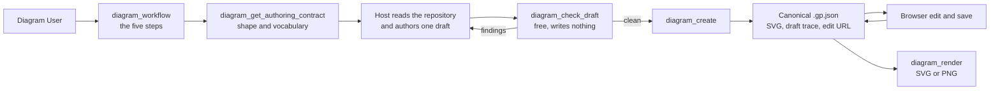

# Project Overview

## Product summary

GraphPilot is an internal, local-first AI diagramming tool for creating, reviewing, and refining editable
UML/SysML diagrams. One IDE workflow routes each request by the authority the result must claim: confirmed user
intent for a conceptual design, or reviewed local evidence for current repository behavior. Both paths converge on
the same canonical GraphPilot diagram JSON and browser editing experience.

This document describes final intended product behavior. Runtime availability and delivery progress live only on the
[current-state board](../05-delivery/01-current-state.md).

## Product goal

Turn confirmed natural-language intent or bounded repository evidence into a valid, editable diagram faster than
manual drawing, while making the result's authority, material assumptions, quality findings, provenance, and
operational warnings truthful and actionable.

## Product actors

- **Diagram User** — requests, reviews, refines, and exports diagrams, and is told what the
  host was unsure about before accepting one.
- **IDE agent / MCP host** — reads the repository, decides what the diagram means, authors
  one draft citing the lines behind every claim, and delivers the reasoning the diagram
  does not carry.
- **GraphPilot backend** — owns path safety, schemas, draft validation, evidence resolution
  and digests, materialization, PyGraphviz layout, provenance, validated persistence,
  rendering, and typed outcomes. **It runs no model**, so it adds no meaning of its own.
- **Browser editor** — loads and saves canonical diagrams through the Django API, marks
  assumed elements, and provides manual visual refinement and export.

The IDE communicates through MCP; the browser communicates through the Django API. Both entry points reuse one
shared backend core.

## End-to-end product loop



**The host does the thinking; GraphPilot does the drawing.** No model runs on GraphPilot's
side, so a diagram is deterministic given its draft:

1. read `diagram_workflow` — the five steps, and the rules the result is held to;
2. choose a type with `diagram_list_types`, then take its shape and vocabulary from
   `diagram_get_authoring_contract`;
3. read the repository and author one draft, citing the exact lines behind anything
   claimed as fact;
4. check it with `diagram_check_draft` as often as you like — it writes nothing and costs
   nothing, so a name is never spent on a draft that was going to be refused;
5. call `diagram_create`, which validates, materializes, lays out, renders and saves.

**Authority is a field on the draft, not a branch in the workflow.** `as_implemented`
claims the diagram reflects the current source and must cite it; `conceptual` claims
nothing about any repository and cites nothing. There is one path either way.

A draft that cannot be honest is refused rather than downgraded: an element the source
does not establish is marked `assumed` and carries the assumption that justifies it, and
the editor draws that mark so a reader can see it.

## The workflow

`diagram_workflow` is instructions only. It reads nothing, writes nothing, and calls no
model — it returns the five steps, the division of labour, and the honesty rules a draft
is held to. The host follows it with bounded one-shot tools.

## One path, and a field that says what the diagram claims

There is no direct branch and no context branch. A host authors one
`graphpilot.draft.v1` document and submits it inline to `diagram_create`; the draft is
never saved by the host and never referenced by path.

`authority` says what the result claims:

| | |
| --- | --- |
| `as_implemented` | The diagram reflects the current source. Every element is `grounded` and cites exact lines, or `assumed` and carries the assumption behind it. Each citation is read and digested at create time, so a claim that points at the wrong lines is refused |
| `conceptual` | A design that makes no claim about any repository. It cites nothing, and every element is `conceptual` |

The two are the same pipeline: validate the draft, resolve its citations, materialize the
notation, lay out, render, save. Nothing is downgraded silently — a draft that cannot meet
the authority it declares is refused and told why.

**The reasoning does not travel inside the diagram.** A draft's `uncertainties`,
`assumptions` and `decisions` shape it; the saved `.gp.json` carries evidence and
per-element assurance, never the prose. Delivering the reasoning to the user is the host's
job, and the draft is kept at `.graphpilot/drafts/<diagramName>.draft.json` as a trace for
whoever later has to work out why a diagram says what it says.

Detailed draft, materialization and provenance semantics belong to the
[generation package](../03-design/01-generation/README.md).

## What happens to a draft

One deterministic pipeline, whatever the draft's authority:

```text
draft validation — schema, ids, endpoints, notation, assurance pairing
→ evidence resolution — each cited region read, checked against its symbol, and digested
→ materialization — the notation rules: markers, dashing, ends, route mode, origin
→ PyGraphviz layout
→ canonical assembly and validation
→ atomic persistence
→ SVG rendering, and a legibility measurement
→ the accepted draft written beside the diagram as a trace
```

**No model is called at any point**, so the same draft always produces the same diagram.
Steps one and two report the host's mistakes; a failure at step three or later is a
GraphPilot defect and returns an operation error rather than persisting something
malformed.

Pinned PyGraphviz 2.0 is the sole layout engine. Layout failure is typed and does not
switch to another algorithm. Canonical persistence defines success: if rendering then
fails the diagram is still saved, `svgPath` comes back `null`, and `render_failed` appears
in `operationWarnings` so the host can render the saved file without authoring it again.

## Shared editing and rendering loop

### Browser editing

The user can open a generated or updated diagram from its edit URL or through the editor's file/workspace flows,
move and resize nodes, relabel and recolor elements, and connect or reconnect edges. A save validates canonical JSON
before replacing the source file. Workspace saves use backend API routes, and the editor can export SVG or PNG through
the shared rendering path.

The browser remains a canonical-diagram editor. It preserves each element's `origin` on
round-trip and **marks an assumed element on the canvas**, so a reader can see which parts
of a diagram the source establishes and which somebody inferred. It does not author
drafts, evidence, or assurance.

### Editing from the IDE

There is no MCP editing tool. A host that wants to change a saved diagram authors a new
draft under a new name, or the user edits it in the browser. `diagram_create` refuses to
overwrite an existing file, because that file may carry edits the draft knows nothing
about. `diagram_update` is designed and unbuilt — see [Deferred product scope](#deferred-product-scope).

### Rendering and export

`diagram_render` renders stored canonical coordinates without generation or re-layout. Inline mode returns SVG text;
path mode writes a sibling SVG or optional PNG. SVG is the required static artifact; PNG is derived from the same SVG
renderer.

## What is written, and what each file is for

```text
.graphpilot/diagrams/<name>.gp.json   the diagram. The only editable authority
.graphpilot/diagrams/<name>.svg       derived presentation, re-renderable at any time
.graphpilot/drafts/<name>.draft.json  what the host claimed, kept as a trace
```

The canonical diagram carries generic metadata, `authority`, the cited evidence with its
content digests, the assumptions any `assumed` element rests on, and each element's
`origin`. It carries **no prose**: not the host's uncertainties, not its decisions, not a
rationale beyond the one line materialization derives. A diagram is read by people who did
not commission it, and a citation they can check is worth more than an essay they cannot.

The draft trace exists for one purpose — when a diagram turns out to be wrong, it says what
was actually claimed. Nothing reads it back; `diagram_create` never accepts a path.

No trace file, diagnostics tree, or evaluation run is produced at runtime. The review
gallery under `backend/review_galleries/` is a development tool, built from the examples in
`backend/assets/blueprints/`, and is not part of a workspace.

## Product scope

The core product includes:

- one instructions-only workflow, `diagram_workflow`, and a per-type authoring contract
  derived from the draft schema;
- host-authored drafts materialized deterministically, with no provider call;
- inline evidence with content digests, per-element assurance, and a saved draft trace;
- a free dry run, `diagram_check_draft`, so a name is never spent on a refused draft;
- PyGraphviz layout, and a legibility warning when the result is hard to read;
- canonical GraphPilot JSON shared by MCP and browser workflows;
- browser visual refinement and validated save, with assumed elements marked on the canvas;
- deterministic canonical validation and SVG rendering through `diagram_validate` and `diagram_render`;
- optional PNG rendering/export derived from the canonical SVG path; and
- generation for `activity_diagram`, `use_case_diagram`, and `bdd_diagram`.

### Deferred product scope

**Nothing below exists.** Each names a tool or capability that has been designed or
discussed and not built; none is callable today.

- `diagram_update` — full-JSON IDE editing. Designed in [`05-edit/`](../03-design/05-edit/README.md), not implemented
- PDF export and consistent inline image presentation inside MCP clients;
- an AI agent or provenance inspection panel inside the browser editor;
- structured patch operations such as `diagram_apply_patch`;
- a local RAG/example-search extension and `diagram_search_examples`;
- swimlanes, sequence diagrams and state machines — every cold host named the first as its
  biggest loss, and both renderers already draw the `partition` primitive; and
- provenance-aware manual or grounded-edit evolution beyond preserving existing optional fields.

## Active owners

- [System design](../02-architecture/02-system-design.md)
- [MCP tools and host workflow](../02-architecture/01-mcp-tools/README.md)
- [Browser API routes](../02-architecture/05-api-routes.md)
- [Canonical diagram schema](../03-design/02-diagram-schemas/01-diagram-json-schema.md)
- [Generation design](../03-design/01-generation/README.md)
- [The draft contract](../03-design/01-generation/01-draft.md)
- [Browser editor design](../03-design/06-editor-ui.md)
- [Editing design](../03-design/05-edit/README.md) — `diagram_update`, planned and not implemented
- [Validation design](../03-design/03-validation/README.md)
- [Rendering design](../03-design/04-rendering.md)
