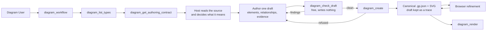

# User Scenarios

These scenarios describe the intended user experience across the unified generation workflow, conceptual and
repository-grounded generation, browser refinement, IDE updates, rendering, provenance review, and offline evaluation.
Runtime availability belongs only to the
[current-state board](../05-delivery/01-current-state.md).

## Actors

- **Diagram User** — requests a diagram, confirms material choices, reviews assumptions/findings/provenance, refines
  the result, and exports it.
- **IDE agent / MCP host** — reads `diagram_workflow` and the authoring contract, reads the
  repository, decides what the diagram means, authors one draft citing the lines behind
  every claim, and reports the reasoning the diagram does not carry.
- **GraphPilot backend** - validates a draft, resolves and digests its citations,
  materializes the notation, lays out, renders, and persists. **It runs no model**, so
  it adds no meaning the host did not author.

## Main product scenarios

| # | Scenario | Entry point | Result |
| --- | --- | --- | --- |
| US-01 | Diagram what the repository actually does | `diagram_create` with `authority: as_implemented` | A diagram whose every claim cites lines that were read |
| US-02 | Sketch a design that claims nothing about the code | `diagram_create` with `authority: conceptual` | A diagram that cites nothing and says so |
| US-03 | Refine a saved diagram by hand | Browser editor | The same canonical file, validated before replacement |
| US-04 | Produce a static artifact | `diagram_render` or the browser | SVG or PNG from stored coordinates |

## Main product loop



**One loop, whatever the diagram claims.** There is no authority branch, no saved request
file, and no readiness cycle: `authority` is a field on the draft, and the difference it
makes is what the validator demands, not which path runs.

The host may iterate on step `D` as long as it likes. Only `diagram_create` writes, and
it refuses to overwrite — so a name is spent exactly once, and never on a draft that was
going to be refused.

## US-01 A diagram of what the code actually does

**Goal:** A picture of part of this repository that a reader can check, line by line.

### Main flow

1. The Diagram User asks the IDE agent for a diagram of something in the repository.
2. The host reads `diagram_workflow`, then `diagram_list_types` — **always**, not only when
   the right type is unclear, because the identifiers do not explain themselves and reading
   one wrong has cost two complete corpus runs — then `diagram_get_authoring_contract` for
   the type it chose.
3. The host **reads the source** — not a summary of it — and decides what the diagram
   means: which elements exist, what relates to what, and where the boundary of the
   picture falls.
4. It authors one `graphpilot.draft.v1` document with `authority: "as_implemented"`. Every
   element is either `grounded`, citing a file and line range that establishes it, or
   `assumed`, naming an assumption that says why it is there anyway.
5. It calls `diagram_check_draft` with `workspaceDir`. This writes nothing and costs
   nothing, so it can be called as often as needed; **without `workspaceDir` the citations
   are not read**, and a citation is the one mistake that cannot be repaired afterwards.
6. It calls `diagram_create`. GraphPilot re-reads every cited region, checks the named
   symbol really appears in the lines given, digests each one, materializes the notation,
   lays out, renders and saves.
7. The host tells the user what it was unsure about, what it assumed, and what it decided —
   because the diagram does not carry that prose.

### Outputs

```text
.graphpilot/diagrams/<name>.gp.json   the diagram, with inline evidence and digests
.graphpilot/diagrams/<name>.svg       its picture
.graphpilot/drafts/<name>.draft.json  what the host claimed, kept as a trace
```

### What the user can check

- Every `grounded` element names the file and lines behind it, and those lines were read
  at create time — a citation pointing at the wrong place is refused, not accepted.
- Every `assumed` element carries the assumption's statement, its reason, and who accepted
  it. **The editor marks it on the canvas**, so an inference cannot pass for a fact.
- A content digest per cited region, so a reader can tell whether the source has moved
  since.

### When it does not work

A refused draft returns findings naming the rule broken, and **nothing is written** — the
diagram name is still free. A diagram that saves but cannot be rendered is still a
success: `svgPath` comes back `null` with `render_failed` in `operationWarnings`, and
`diagram_render` finishes the job without authoring anything again.

## US-02 A design that makes no claim about any repository

**Goal:** Sketch a proposed or explanatory diagram without implying it reflects the code.

### Main flow

1. The user asks for a conceptual, proposed or teaching diagram.
2. The host authors a draft with `authority: "conceptual"`, every element
   `assurance: "conceptual"`, and **no evidence at all**.
3. `diagram_create` saves it exactly as with a grounded diagram — one path, one pipeline.

A conceptual diagram that cites evidence is refused, and so is a grounded diagram that
cites none. The authority field is a promise, and both directions of breaking it are
caught.

## US-03 Browser refinement

**Goal:** Manually refine a generated or updated diagram while keeping canonical JSON as the source of truth.

### Main flow

1. The Diagram User opens `editUrl`, chooses a workspace diagram, or opens a local GraphPilot file.
2. The editor loads the current canonical diagram and adapts it into canvas state.
3. The user moves or resizes nodes, relabels or recolors elements, and connects or reconnects edges.
4. The editor converts current state back to canonical GraphPilot JSON.
5. For a workspace diagram, the editor submits the full document to the backend save route; a picker-opened file uses
   path-free backend validation before browser file-handle writing.
6. GraphPilot validates before replacement. An invalid save reports affected issues and leaves the existing file
   unchanged.
7. After a valid workspace save, the editor adopts the normalized document returned by the backend and the backend
   refreshes the sibling SVG on a best-effort basis.
8. The latest saved file is immediately available to IDE update and render flows.

Existing optional generation ownership and origin fields round-trip even when no provenance UI is shown. Trace and
debug artifacts are not editor state.

## US-04 Render and export

**Goal:** Produce a static artifact from the latest canonical diagram without changing its layout.

### Main flow

1. The user or IDE agent identifies the latest canonical diagram.
2. The IDE calls `diagram_render` with inline canonical JSON for SVG text or with `diagramPath` to save a sibling SVG
   or PNG. PNG path mode derives the raster image from the same SVG renderer.
3. The browser sends canonical JSON to the Django render endpoint for preview and SVG/PNG export.
4. The renderer uses stored positions, sizes, styles, and semantic types; it does not call an LLM or re-layout.
5. The resulting artifact reflects canonical JSON at render time.

## Cross-scenario rules

- **The host owns meaning; GraphPilot owns notation.** A host decides what exists and what
  relates to what; GraphPilot decides how that is drawn, where it sits, and whether it is
  allowed. Neither overrules the other.
- **Nothing is written until a draft is accepted in full.** A refusal leaves the workspace
  exactly as it was, including the diagram name.
- **Nothing overwrites a saved diagram.** It may carry browser edits the draft knows
  nothing about, so `diagram_create` refuses an existing name rather than merging.
- **A claim is checked, not trusted.** Every cited region is read at create time, the named
  symbol must appear in the lines given, and each region is digested.
- **An inference is marked, never hidden.** An element the source does not establish is
  `assumed`, carries the assumption behind it, and is badged on the canvas.
- **The reasoning is delivered, not stored.** Uncertainties, assumptions and decisions
  shape the draft and are reported to the user; the diagram carries evidence and assurance,
  not prose.
- **Rendering is deterministic and never re-lays-out.** The same diagram renders the same
  way every time, from stored coordinates.

## Deferred scenarios

- PDF export and consistent inline MCP image previews.
- In-editor AI generation or chat, and a provenance inspection panel beyond the assumed
  badge already on the canvas.
- **Editing a saved diagram from the IDE.** `diagram_update` is designed in
  [`05-edit/`](../03-design/05-edit/README.md) and not built; today a host authors a new draft
  under a new name, or the user edits in the browser.
- Example-assisted/RAG generation through `diagram_search_examples`.
- Structured patch editing through `diagram_apply_patch`.
- Public per-request quality selection or best-of-N generation.
- Provenance-aware evolution for manual or grounded edits beyond round-tripping existing optional fields.

## Active owners

- [Generation design](../03-design/01-generation/README.md)
- [The draft contract](../03-design/01-generation/01-draft.md)
- [Materialization](../03-design/01-generation/02-materialization.md)
- [Lifecycle, assurance, and freshness](../03-design/01-generation/03-lifecycle.md)
- [MCP tools and host workflow](../02-architecture/01-mcp-tools/README.md)
- [Editing an existing diagram](../03-design/05-edit/README.md)
- [Browser editor design](../03-design/06-editor-ui.md)
- [Editing design](../03-design/05-edit/README.md) — `diagram_update`, not implemented
- [Rendering design](../03-design/04-rendering.md)
