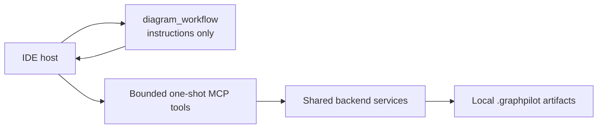

# MCP Tools

> **Design authority:** This package defines GraphPilot's intended IDE-facing MCP surface.
> Implementation status belongs only to
> [`01-current-state.md`](../../05-delivery/01-current-state.md).



There is no provider in that picture. The host authors a
[draft](../../03-design/01-generation/01-draft.md); GraphPilot materializes it.

## MCP role and boundaries

- MCP is GraphPilot's IDE-facing entry point; the browser uses the Django API.
- `diagram_workflow` is instructions-only. It inspects no source, writes no file, and
  executes nothing.
- Tools perform one bounded operation and delegate domain behaviour to shared services.
- The host reads the repository, chooses the diagram type and authority, and authors the
  draft's semantics.
- GraphPilot validates the draft, materializes it, lays it out through PyGraphviz,
  validates the canonical result, persists it, and renders.
- The backend never invents an element, changes authority, or repairs a semantic mistake.
- File-backed operations are confined to the explicit local workspace, and diagrams and
  their siblings live under `.graphpilot/diagrams/`.

Draft and materialization semantics belong to the
[generation package](../../03-design/01-generation/README.md). This package owns public MCP
names, arguments, transport, errors, and results.

## Read order and ownership

1. [`01-diagram-tools.md`](01-diagram-tools.md) — every public tool, its arguments, and its results.
2. [`04-operation-errors.md`](04-operation-errors.md) — result/error mapping and operation-code recovery.

Start with repository [`AGENTS.md`](../../../AGENTS.md) and the
[documentation index](../../README.md).

## Public surface

| Public name | Purpose |
| --- | --- |
| `health` | Connectivity/liveness check |
| `echo` | Connectivity echo |
| `diagram_workflow` | Instructions-only "call this first" discovery path |
| `diagram_list_types` | Every type with its `meaning` and a `chooseWhen` that maps a request onto it |
| `diagram_get_authoring_contract` | Return the authoring recipe for one diagram type |
| `diagram_check_draft` | Report exactly what `diagram_create` would refuse, writing nothing |
| `diagram_create` | Materialize one draft into a new canonical diagram |
| `diagram_read` | Open a saved diagram for editing, writing a draft file to edit in place |
| `diagram_update` | Write an edited draft back, keeping positions, sizes and anything else the draft cannot express |
| `diagram_validate` | Deterministically validate inline canonical diagram JSON |
| `diagram_render` | Render inline/file SVG or save a path-backed PNG |

Planned with [editing](../../03-design/05-edit/README.md), and **neither is implemented**: `diagram_get_semantic_view` and `diagram_update`.

No alias, no polymorphic generation tool, and no raw prompt-only tool is supported.

## Shared MCP outer shape

Every tool returns MCP `CallToolResult`:

```json
{
  "content": [
    { "type": "text", "text": "The requested diagram file does not exist." }
  ],
  "structuredContent": {
    "error": {
      "code": "diagram_not_found",
      "message": "The requested diagram file does not exist.",
      "retryable": true,
      "details": { "diagramPath": ".graphpilot/diagrams/missing.gp.json" }
    }
  },
  "isError": true
}
```

- `content` is a short safe text/Markdown presentation.
- `structuredContent` is the exact tool-specific machine payload. Examples in this package
  usually show only that nested payload.
- `isError: true` means the operation failed and `structuredContent.error` is the shared
  [`OperationProblem`](../03-backend.md#101-shared-operational-problem).
- Successful payloads remain tool-specific; there is no universal `data` envelope.
- Validation issues are domain results, not operation errors.

## Shared transport principles

- Public argument fields use camelCase.
- A draft travels inline; it is never persisted, so it has no path argument.
- `diagram_create` refuses to overwrite an existing diagram. Replacing one is an update;
  starting over is an explicit delete.
- No tool returns or persists raw source beyond the evidence summaries the host itself
  authored, and none returns secrets or hidden reasoning.
- Retryability never authorizes an unchanged automatic reroll.

## Related owners

| Topic | Owner |
| --- | --- |
| Draft contract and authoring guidance | [`01-draft.md`](../../03-design/01-generation/01-draft.md) |
| Draft → canonical materialization | [`02-materialization.md`](../../03-design/01-generation/02-materialization.md) |
| Create lifecycle, assurance, freshness | [`03-lifecycle.md`](../../03-design/01-generation/03-lifecycle.md) |
| Editing an existing diagram | [`05-edit/`](../../03-design/05-edit/README.md) |
| Canonical validation | [`02-diagram-validation.md`](../../03-design/03-validation/02-diagram-validation.md) |
| Shared service names and `OperationProblem` | [`03-backend.md`](../03-backend.md) |
| MCP error/result mapping | [`04-operation-errors.md`](04-operation-errors.md) |
| Browser API | [`05-api-routes.md`](../05-api-routes.md) |
