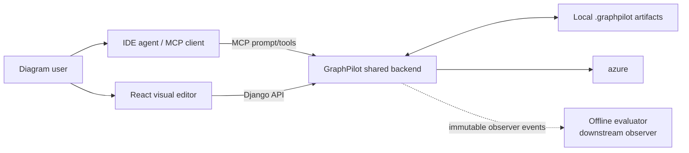
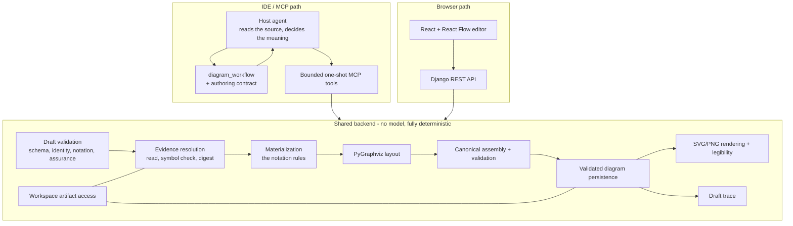

# System Design

> **Design authority:** This document defines GraphPilot's final intended system architecture. Runtime delivery status
> belongs only to [`epics/00-current-state.md`](../05-delivery/01-current-state.md).

## 1. Purpose and boundaries

GraphPilot is a local-first diagramming system with two connected user entry paths over one shared backend:

- IDE agents use MCP for routed direct/repository-grounded generation, validation, rendering, and updates;
- browser users use the React editor and Django API to load, edit, validate, save, preview, and export diagrams.

Focused owners contain contract detail:

- backend architecture: [`01-backend-architecture.md`](03-backend.md)
- frontend architecture: [`02-frontend-architecture.md`](04-frontend.md)
- MCP tools and unified host workflow: [`03-mcp-tools/`](01-mcp-tools/README.md)
- browser API: [`04-api-routes.md`](05-api-routes.md)
- canonical diagram schema: [`00-diagram-json-schema.md`](../03-design/02-diagram-schemas/01-diagram-json-schema.md)
- generation engine: [`01-generation/`](../03-design/01-generation/README.md)
- the draft contract, evidence, assurance, and provenance:
  [`01-draft.md`](../03-design/01-generation/01-draft.md) and
  [`03-lifecycle.md`](../03-design/01-generation/03-lifecycle.md)

Product scenarios and requirements begin at the [project overview](../01-product/01-overview.md).

## 2. System context



The frontend never calls MCP. The IDE never calls the frontend as a service; MCP generation results include an
`editUrl` that opens the saved canonical diagram in the browser. MCP and API are thin protocol adapters over shared
services.

Evaluation is not a product entry path or generation stage. It implements the generation-owned observer protocol from
downstream, receives only bounded immutable events/captures, and cannot alter provider calls, repairs, acceptance,
persistence, rendering, or returned outcomes.

## 3. High-level architecture



**The whole backend is a function of the draft.** Nothing in `Core` calls a model, reaches
a network, or holds state between calls, so the same draft always produces the same
diagram — which is what makes the output reviewable at all, and what a generator could
never have offered.

## 4. Public authoring boundary

`diagram_workflow` is instructions only: it reads nothing, writes nothing, and calls no
model. It returns the five steps, the division of labour, and the honesty rules a draft is
held to.

`diagram_get_authoring_contract` returns the recipe for one diagram type — envelope shape,
allowed element and relationship types, containment, end policy, every rule that can refuse
a draft, and a worked example the validator accepts. **It is derived** from the draft
schema, the type profile and the end-policy tables, so it cannot drift from what the
validator enforces.

It is also **scoped to that type**: a field or envelope section the type cannot author is
not sent. The same table drives the refusal, so the contract cannot offer something
`diagram_create` will reject.

The canonical schema is deliberately not offered to an author. It describes the saved
document — positions, styles, relationship-end objects — which the workflow forbids a host
to write. A tool that returned it was reported as a trap by every host that met it and has
been removed.

**One input crosses the boundary: an inline `graphpilot.draft.v1` document.** There is no
request file, no path argument, no second generation surface, and no authority branch —
`request.authority` is a field, and what changes is which rules the validator applies.

## 5. Local runtime model

| Runtime piece | Local address/launch |
| --- | --- |
| React frontend | `http://localhost:5173` |
| Django API | `http://localhost:8000` |
| MCP server | launched locally by the IDE MCP client |
| Workspace storage | `<workspace>/.graphpilot/` local files |
| Offline evaluation | explicit operator runner over local immutable run artifacts |

Runtime rules:

- diagram, request, context, trace, debug, and evaluation data is local-file based, not product-database based;
- Django's SQLite tables remain framework internals only;
- all workspace paths resolve beneath the explicit/derived local workspace;
- normal tests inject fake chat/embedding clients and remain offline;
- every evaluation invocation explicitly selects `dry_run` or `live`; credentials never imply execution; and
- Docker and authentication are not required for the local single-user design.

## 6. Architectural principles

- **One canonical editable diagram:** GraphPilot JSON, never raw React Flow state.
- **One generation routing authority:** one dual prompt/tool workflow selects exactly one authority branch.
- **Persisted request before generation:** direct and context generation consume canonical requests, not raw
  prompt-only arguments.
- **Separate authority contracts:** direct requirements/assumptions never become evidence; context selected claims
  never become direct requirements.
- **One authority field, enforced both ways:** a diagram claiming to reflect the source
  must cite it, and a diagram claiming nothing must cite nothing. Neither is satisfiable
  by accident, and a draft that cannot meet what it declares is refused rather than
  quietly downgraded.
- **A claim is checked, not trusted:** every cited region is re-read at create time
  and its named symbol verified, so a citation cannot name one thing and point at
  another.
- **Strict model contracts:** every role-specific LLM call uses one system message, one canonical JSON user message,
  with no model involved at any point, so the same draft always produces the same diagram.
- **No hidden semantic mutation:** normalization preserves meaning; explicit bounded repair owns changes.
- **An inference is marked, not hidden:** an element the source does not establish is
  `assumed`, carries the assumption behind it, and is badged on the canvas.
  diagnostics/ablation and never an automatic degradation path.
- **Validated-write funnel:** no entry point bypasses canonical diagram validation before authoritative persistence.
- **JSON-first success:** canonical persistence defines generated success; trace/debug/render failures are warnings.
- **One layout engine:** pinned PyGraphviz 2.0 owns generation coordinates; missing/broken native layout is typed and
  never silently falls back.
- **Thin adapters:** MCP and API map transport but do not duplicate domain rules.
- **Evaluation downstream only:** generation owns the observer seam and imports no evaluator implementation.
- **No silent migration:** unsupported old IDs, paths, and public names have no alias, dual write, or automatic rewrite.

## 7. Component responsibilities

| Component | Responsibility |
| --- | --- |
| MCP workflow renderer | Render side-effect-free unified host instructions with prompt/tool parity |
| MCP tools | Parse arguments, invoke one bounded shared operation, map domain results/problems to MCP |
| Django API | Serve canonical diagram load/list/save/validate/render operations to the browser |
| Workspace storage | Path containment, bounded reads, atomic/exclusive writes, canonical directories |
| Evidence resolution | Read each cited region inside the workspace, verify its named symbol, digest it |
| Request persistence | Validate direct/context requests and enforce path/digest/identity/finalization lifecycle |
| Draft validation | Schema, identity, references, notation, and assurance pairing, reported as findings that name the rule broken |
| Generation | Mode-specific authority projection, strict logical response, deterministic checks/repair |
| Legibility | Measure the rendered SVG for text that is clipped, buried, or overlapping, and warn the author |
| Layout | PyGraphviz positions plus GraphPilot-owned sizing/containment normalization |
| Canonical validation/persistence | Assemble, validate, and atomically write canonical diagram JSON |
| Rendering | Render saved canonical coordinates to SVG and optional PNG without re-layout |
| React editor | Adapt canonical JSON to canvas state, edit, validate/save, and export |
| Diagnostics observer | Persist optional safe numbered stages without changing generation |
| Evaluation stack | Capture downstream observations, match/judge, calculate gates, and report |

## 8. Sources of truth

### Canonical diagram path

```text
One inline draft document
  -> strict generation and acceptance
  -> canonical GraphPilot diagram
      editable topology, semantic fields, coordinates, minimal generation ownership
  -> optional trace + SVG / PNG
```

### Evidence path

A `grounded` element cites one or more `evidence` entries; each names a workspace-relative
path, a line range, and optionally a symbol. At create time GraphPilot **re-reads every
cited region**, checks that a named symbol really appears within the lines given, and
records a content digest. A citation that points at the wrong lines is refused rather than
saved — it is the one mistake that cannot be repaired afterwards, because the diagram name
is spent and nothing overwrites it.

An `assumed` element names an assumption instead, and the assumption's statement, reason
and acceptor travel inside the saved diagram so a reader without the draft can still see
what was assumed. The editor marks those elements on the canvas.

A `conceptual` diagram cites nothing and every element is `conceptual`. The validator
enforces both directions: evidence without the authority to claim it is refused, and so is
authority claimed without evidence.

## 9. Workspace storage

```text
<workspace>/
  .graphpilot/
    context/
      evidence/
        repository.gp-evidence.json
      drafts/
        <candidate>.json
    requests/
      <diagramName>.gp-request.json
    diagrams/
      <diagramName>.gp.json
      <diagramName>.gp.trace.json     # optional
      <diagramName>.svg
      <diagramName>.png               # only when explicitly rendered
    diagnostics/
      generation/<request-id>/<run-id>/
    evaluation/
      runs/<run-id>/
```

Request, diagram, trace, debug, and evaluation paths are bounded and purpose-specific. Drafts, traces, diagnostics,
and evaluation runs are non-canonical inputs. GraphPilot does not dual-write old paths, and handling of unsupported
local artifacts is explicit rather than a silent side effect.

## 10. Main flows

### 10.1 Authoring a diagram

1. The host reads `diagram_workflow`, then `diagram_list_types` — **always**, not only
   when the type is unclear: the identifiers do not explain themselves, and choosing on
   the name alone has cost two complete corpus runs,
   then `diagram_get_authoring_contract` for the type it chose.
2. It reads the repository and decides what the diagram means.
3. It authors one draft: elements, relationships, evidence, and — for its own report to the
   user — uncertainties, assumptions and decisions.
4. It calls `diagram_check_draft`, with `workspaceDir` so citations are resolved. This
   writes nothing and may be repeated freely.
5. It calls `diagram_create`. GraphPilot validates the draft, resolves and digests every
   citation, materializes the notation, lays out with PyGraphviz, assembles and validates
   the canonical document, writes it atomically, renders the SVG, measures legibility, and
   stores the draft as a trace.
6. The host reports what it was unsure about, assumed, and decided — the diagram does not
   carry that prose.

The same six steps produce a conceptual diagram; only step 5's evidence work is skipped,
because there is nothing cited to resolve.

### 10.2 Refusal and failure

A refusal returns findings naming the rule broken and **writes nothing**, including leaving
the diagram name free. Findings from draft validation are the host's mistake; a failure
after that point is a GraphPilot defect and returns an operation error rather than
persisting something malformed.

Canonical persistence defines success. If rendering then fails, the diagram stays saved,
`svgPath` comes back `null`, and `render_failed` appears in `operationWarnings`.

### 10.3 Browser editing

The editor loads canonical JSON, adapts it to canvas state, and converts back on save. The
backend validates before replacement, so an invalid save leaves the existing file
untouched. Display-only fields never survive the round trip; `origin`, evidence and
assurance always do.

### 10.4 Rendering

`diagram_render` draws stored coordinates. It never re-lays-out and never calls anything
else, so the same diagram renders the same way every time.

## 11. Observability

There is no observer event stream, no diagnostics tree, and no trace file. The pipeline is
deterministic and offline, so the two things worth knowing are already durable:

- **The accepted draft**, at `.graphpilot/drafts/<name>.draft.json`. When a diagram turns
  out to be wrong, this is what was actually claimed — which elements the host said
  existed, what it cited, what it flagged as uncertain. Nothing reads it back.
There was a `GRAPHPILOT_DRAFT_LOG` setting that appended one line per
`diagram_create` attempt. It is gone: across four corpus runs it produced a usable
measurement zero times, and what actually reported the refusals was the hosts
themselves — who can say whether the contract had warned them of a rule in advance,
which a count of lines cannot.

Quality review is a person looking at diagrams, not a metric. `manage.py review_gallery
--regen eval` rebuilds all 48 examples from their stored drafts and serves one page where
each card carries its own badges — valid, structural, legible, miscited, and whether this
run could rebuild it. It is development apparatus and lives outside any workspace.

## 12. Integration surfaces

The final MCP surface is indexed in [`03-mcp-tools/README.md`](01-mcp-tools/README.md). The browser API remains
canonical-diagram-only and is defined in [`04-api-routes.md`](05-api-routes.md); request/evidence authoring,
Draft authoring, evidence resolution, and the draft trace have no HTTP counterpart:
they belong to the MCP path, and the browser edits diagrams rather than authoring
them.

MCP and API may expose different operation sets and response envelopes, but both delegate shared domain rules to the
same backend services.
