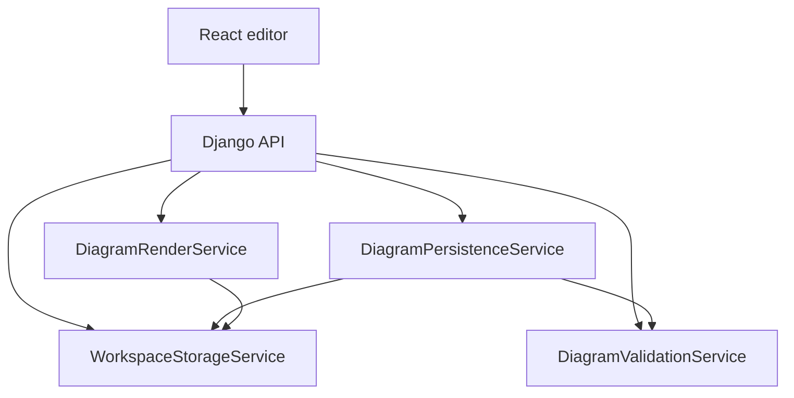
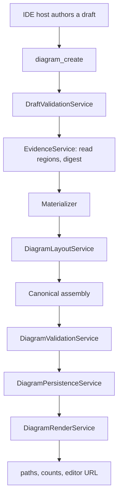

# Backend Architecture

> **Design authority:** This document defines the intended backend architecture, canonical
> shared service names, and the shared `OperationProblem` contract. Implementation status
> belongs only to [`01-current-state.md`](../05-delivery/01-current-state.md).

## 1. Purpose

The Django backend owns GraphPilot's shared application core. Thin Django API and FastMCP
entry points compose the same path, schema, draft-validation, materialization, layout,
canonical-validation, persistence, and rendering services, adapting results to HTTP or MCP.

**The backend makes no provider calls.** Diagram semantics arrive from the host as a
[draft](../03-design/01-generation/01-draft.md); the backend materializes them
deterministically.

## 2. Responsibilities

- safe local workspace resolution and bounded `.graphpilot` artifact I/O;
- canonical diagram and draft schema access;
- draft validation: structure, identity, endpoint resolution, evidence readability, and
  per-type notation legality;
- evidence region reading, content digesting, and freshness re-checking;
- deterministic materialization of a draft into a canonical diagram;
- deterministic PyGraphviz layout with typed native failures and no alternate-engine fallback;
- canonical diagram validation and validation-gated persistence;
- canvas-parity SVG/PNG rendering; and
- typed tool-specific results and shared `OperationProblem` assembly for protocol adapters.

The backend does not author user intent, invent elements or relationships, or repair
semantic mistakes. The host authors a complete draft; the backend validates, materializes,
persists, and reports typed findings without hidden mutation.

## 3. Module shape and dependency direction

```text
backend/
  api/                       # thin browser-facing Django views
  mcp_server/                # thin FastMCP tools
  operations/                # operator management commands
  services/
    shared/                  # SchemaRegistry, schema identities, canonical digesting,
                             # WorkspaceStorageService, DiagramTypeService, OperationProblem
    diagrams/
      catalog/               # diagram types, element catalog, profiles, constants
      validation/            # canonical validation and structural constraints
      layout/                # PyGraphviz layout
      persistence/           # validation-gated canonical writes
      rendering/             # SVG/PNG
    drafts/                  # draft validation, evidence reading, authoring contract
    materialization/         # draft -> logical -> canonical assembly
  graphpilot/settings.py
  assets/
    schemas/                 # diagram.json and the draft contract
    blueprints/              # per-type notation guidance and curated examples
  tests/                     # mirrors service and entry-point areas
```

Dependency direction is one-way:

```text
shared + diagrams/catalog
  -> diagrams/{validation,layout,persistence,rendering}
  -> drafts
  -> materialization
  -> protocol adapters
```

`shared` and `catalog` are leaves. `diagrams` owns canonical diagram boundaries. `drafts`
owns host-input sufficiency. `materialization` composes those layers and imports no
protocol adapter.

Service and class names below are canonical. Entry points never absorb domain policy, and
draft validation never becomes canonical diagram validation.

## 4. Entry points

| Entry point | Caller | Owns |
| --- | --- | --- |
| Django API | React frontend | HTTP parsing/statuses and browser response/error envelopes |
| FastMCP server | IDE host | MCP tool registration, argument/result/error mapping, safe Markdown summaries |
| Management commands | Explicit operator | Argument parsing and invocation of shared services |

Entry points may validate transport shape, construct and inject shared services, translate
domain outcomes into their protocol, and log sanitized failures. They may not duplicate
workspace/path rules, schema rules, draft policy, materialization semantics, layout policy,
or persistence behaviour.

## 5. Core service flows

### 5.1 Browser load, save, validate, render, and list



- Load and list resolve only canonical diagram paths through `WorkspaceStorageService`.
- Save reconciles operation-specific type and authoring fields, then delegates to validated persistence.
- Path-free validate supports picker-opened files before browser-handle writes.
- Render is defensive and uses minimal render-shape guards rather than full validation.

### 5.2 Diagram creation from a draft



No provider participates at any step. A failure in draft validation or evidence reading is
a caller error; a failure after materialization begins is a GraphPilot defect and is
reported as an operation error rather than persisted.

Semantics are owned by [`01-generation/`](../03-design/01-generation/README.md).

### 5.3 Full diagram update

Browser save and the future host update path both cross `DiagramPersistenceService`, which
validates before overwriting and leaves the existing file untouched on any blocking issue.
The host update contract is [`05-edit/`](../03-design/05-edit/README.md).

## 6. Service ownership

### 6.1 Shared infrastructure

| Service | Owns |
| --- | --- |
| `WorkspaceStorageService` | Workspace resolution, path containment, bounded reads, atomic writes |
| `SchemaRegistry` | Loading, caching, meta-validating, and `$ref`-resolving bundled schemas |
| `DiagramTypeService` | Supported types and their human-readable meanings |
| `canonical_json` | Deterministic serialization and digesting |
| `operation_problem` | The shared typed failure contract |

### 6.2 Catalog

`ELEMENT_CATALOG` and `TYPE_PROFILES` own the semantic vocabulary: which node and edge
types each diagram type permits, per-type defaults, notation family, primitives, and
sizing constants. Validation, layout, materialization, rendering, and the frontend catalog
all derive from this one source.

### 6.3 Drafts

| Service | Owns |
| --- | --- |
| `DraftValidationService` | Schema, unique IDs, endpoint resolution, evidence refs, assurance pairing, per-type notation legality |
| `EvidenceService` | Locator resolution, region reading, content digesting, freshness re-check |
| `AuthoringContractService` | Projecting the draft schema into a host-facing authoring contract |

### 6.4 Materialization

Pure functions from a validated draft to a canonical diagram: vocabulary conformance,
feature normalization, relationship-end construction, provenance encoding, and canonical
assembly. No I/O, no clock beyond the metadata timestamp, no randomness.

### 6.5 Canonical diagram services

| Service | Owns |
| --- | --- |
| `DiagramValidationService` | Pure deterministic canonical validation; the only `ValidationResult` producer |
| `DiagramPersistenceService` | The validated-write funnel for every canonical create and overwrite |
| `DiagramLayoutService` | Per-type sizing, containment, and positions over the pinned PyGraphviz engine |
| `DiagramRenderService` | SVG and PNG output at canvas parity |

## 7. PyGraphviz layout contract

Layout runs in-process against pinned PyGraphviz. There is no external `dot` path, no
engine selector, no source-build recovery, and no alternate algorithm. An unavailable or
failing engine raises a typed error; it never silently degrades to an unlaid-out diagram.

Layout consumes the logical graph and produces positions and sizes. It never sees the
draft and never changes semantics.

## 8. Storage and path safety

`WorkspaceStorageService` owns every filesystem boundary: containment beneath the
workspace, refusal of absolute or traversing paths, bounded file sizes, and atomic writes.
It holds no validation policy — `DiagramPersistenceService` is where validation gates a
write.

Managed layout:

```text
.graphpilot/
└── diagrams/
    ├── <diagramName>.gp.json
    └── <diagramName>.svg
```

## 9. Validation boundaries

Distinct checks that never substitute for one another:

| Boundary | Input | Question |
| --- | --- | --- |
| Path safety | Tool/API arguments | Is the operation and path safe? |
| Draft validation | One submitted draft | Is this authorable, resolvable, and legal notation? |
| Evidence freshness | Cited regions | Do the cited lines still say what was recorded? |
| Canonical validation | One `graphpilot.diagram.v1` | Is this safe to persist, edit, and render? |
| Render guard | Render input | Is the minimum drawing envelope safe to consume? |

Full policy: [`02-diagram-validation.md`](../03-design/03-validation/02-diagram-validation.md).

## 10. Result, problem, and consistency policy

### 10.1 Shared operational problem

Every handled failure returns one `OperationProblem`: a stable `code`, a safe `message`,
optional bounded `details`, and a `retryable` flag derived from the code rather than
supplied per call. Adapters map it to HTTP status or MCP `isError` without inventing codes.

### 10.2 Outcome classification

A domain outcome and an operation failure are different things. `diagram_create` returns
`outcome: created` on success; a refused draft is a typed `OperationProblem`. A canonical
write that succeeded while its SVG failed is still a success, carrying an ordered
`operationWarnings` entry rather than being reclassified.

### 10.3 Consistency

Deterministic checks discoverable before a write happen before that write. No failure path
authorizes a silent retry, and no partial write is left behind: canonical persistence is
atomic.

## 11. Related

- MCP contracts: [`01-mcp-tools/README.md`](01-mcp-tools/README.md)
- Draft contract, materialization, provenance: [`01-generation/`](../03-design/01-generation/README.md)
- Canonical validation and persistence: [`02-diagram-validation.md`](../03-design/03-validation/02-diagram-validation.md)
- Rendering: [`04-rendering.md`](../03-design/04-rendering.md)
- Canonical JSON: [`01-diagram-json-schema.md`](../03-design/02-diagram-schemas/01-diagram-json-schema.md)
