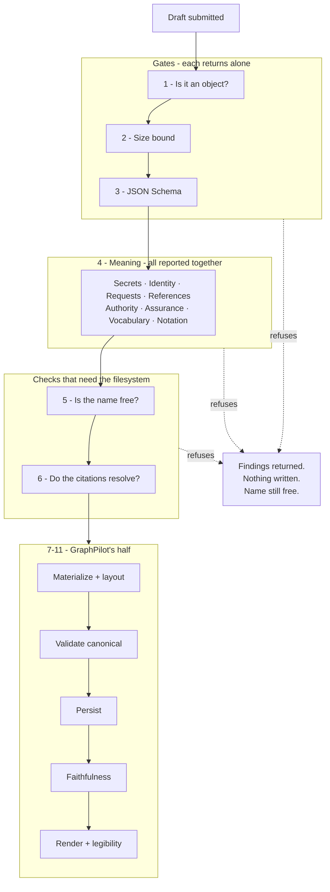
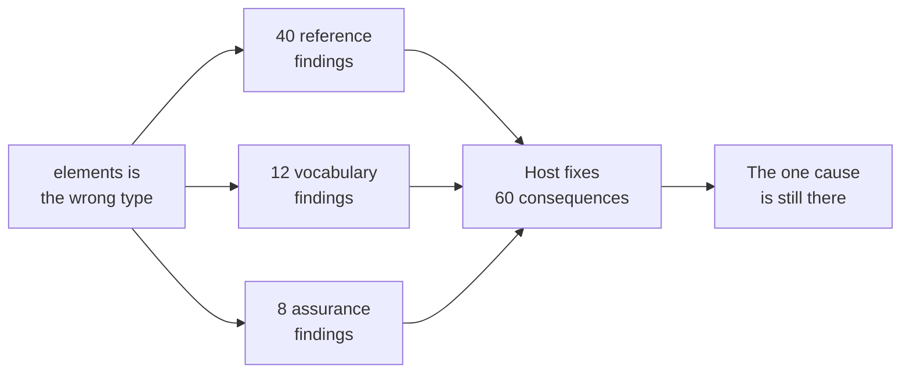
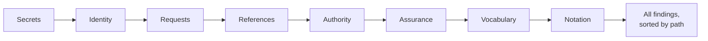
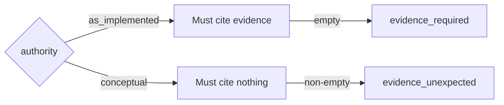
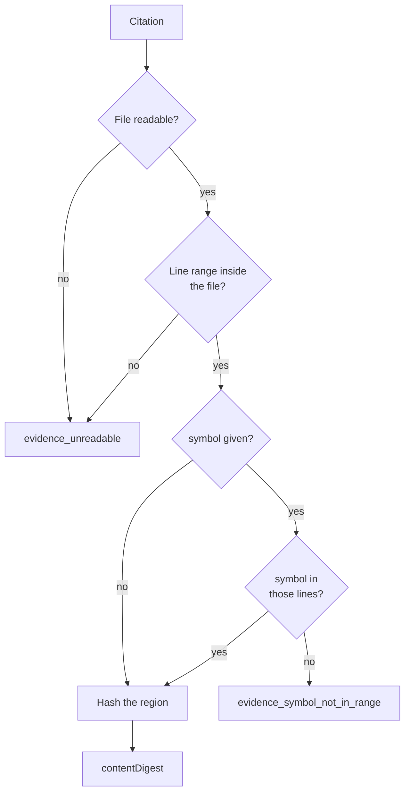
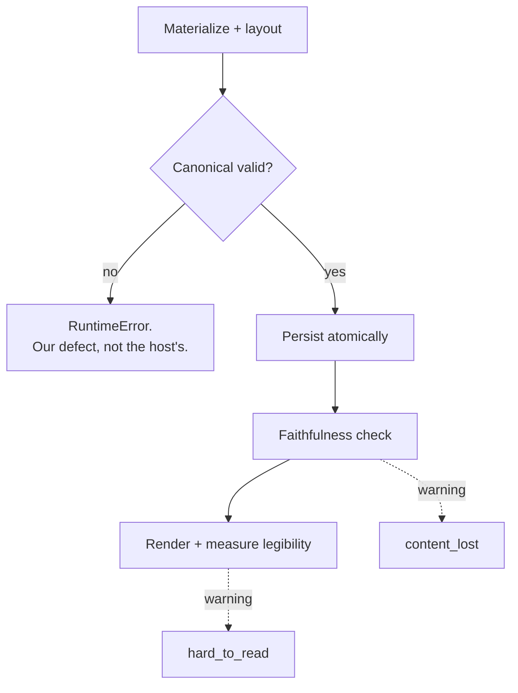

# Draft Validation

## Purpose

What GraphPilot checks in a `graphpilot.draft.v1` document, in what order, and which
finding a host gets when a rule fires.

The draft is the host's half of the contract, so **every rule here is one a host must be
able to predict**. A rule enforced and explained nowhere is the defect class `A4`, and it
is the most expensive kind: the only way to learn it is to be refused.

| | |
| --- | --- |
| The document being checked | [`../01-generation/01-draft.md`](../01-generation/01-draft.md) |
| What happens after acceptance | [`02-diagram-validation.md`](02-diagram-validation.md) |
| Codes and retryability | [`../../02-architecture/01-mcp-tools/04-operation-errors.md`](../../02-architecture/01-mcp-tools/04-operation-errors.md) |

## The shape of the whole thing

Stages 1–6 are `DraftValidationService` and `EvidenceService`. Stages 7–11 are
`DiagramCreationService`.

---

## Gate 1 — is it an object?

| | |
| --- | --- |
| **Code** | `draft_invalid` |
| **Path** | `$` |
| **Returns** | alone |

A draft that is a list, a string, or `null` cannot be indexed, so every later stage would
raise rather than report. One finding, and the document is handed back.

## Gate 2 — the size bound

| | |
| --- | --- |
| **Code** | `draft_too_large` |
| **Path** | `$` |
| **Returns** | alone |
| **Bound** | 2 MB, serialized |

The finding carries **both numbers** — the limit and what arrived — because a host told
only that it was "too large" has to guess how much to cut.

This runs before schema validation on purpose: a runaway draft would otherwise produce
thousands of schema findings while the real problem is one number.

## Gate 3 — JSON Schema

| | |
| --- | --- |
| **Codes** | `schema_required`, `schema_pattern`, `schema_maxLength`, `schema_additionalProperties`, … |
| **Path** | the exact JSON path, e.g. `$.elements[3].semanticType` |
| **Returns** | alone |

Draft 2020-12, compiled once through `SchemaRegistry`. The code is `schema_` plus the
JSON Schema keyword that failed, so the code itself names the kind of rule.

**Messages state the rule, not just the breach.** `jsonschema` says *"'…' is too long"*
and echoes the whole offending value — the one thing the author already has. A host once
binary-searched `diagram_check_draft` to discover that a label may be 256 characters. The
message now gives the bound, and the value is clipped to 60 characters.

### Why the three gates return alone

Everything after these gates indexes into fields the schema has not vouched for. Reporting
them together would bury one cause under sixty consequences.

**The cost is real and accepted.** A field that is both absent *and* would break a later
rule reports twice, one call apart. That is two rounds by design — and neither costs
anything, because a refusal writes nothing and does not consume the diagram name.

---

## Layer 4 — meaning

Eight checks, **one pass**, every finding returned together and sorted by path. A host
that rediscovers its mistakes one call at a time pays for each one.

### 4.1 Secrets

| | |
| --- | --- |
| **Code** | `possible_secret` |

Screens every prose field for labelled credentials — `api_key = sk-live-…`,
`password: "…"`. Ordinary prose *about* credentials is not flagged: *"reads the API key
from the environment"* is fine.

Structural fields are not scanned, because IDs, paths and semantic types are
pattern-bounded and cannot hold one.

**`requests` is scanned**, and was the one field the scan could not see for a while: the
walker yields a string when its *key* is in the scanned set, and a string inside an array
has no key of its own. It is a verbatim user prompt — exactly where a pasted error message
carrying a token ends up — and it reaches a committed file.

### 4.2 Identity

| | |
| --- | --- |
| **Code** | `duplicate_id` |

IDs are unique across the **whole draft**, not per list. An element and a relationship may
not share one. The finding is reported against the *later* occurrence, since the first is
usually the one the author meant to keep.

### 4.3 The request log

| | |
| --- | --- |
| **Code** | `requests_invalid` |

A create carries **exactly one** entry. More or fewer is refused.

Appending is what editing does; a create that arrives with a list has either copied one
from somewhere or invented history. Both are worth refusing while nothing has been
written. An empty list is caught earlier, by the schema's `minItems`.

### 4.4 References

| | |
| --- | --- |
| **Codes** | `unresolved_reference`, `cyclic_parent`, `orphan_evidence`, `orphan_assumption` |

Every `source`, `target`, `parentId`, `evidenceRef` and `assumptionRef` must name
something in this draft — and the reverse also holds:

- **`orphan_evidence`** — every evidence record must be cited by something. `metadata.evidence`
  in the saved diagram means *the regions this diagram was built from*, so an uncited
  record makes that false.
- **`orphan_assumption`** — every assumption must be named by some element through
  `assumptionRef`. An assumption nothing rests on is a note, and the diagram does not
  carry notes.
- **`cyclic_parent`** — containment loops of length two or more, including self-parenting.

### 4.5 Authority

| | |
| --- | --- |
| **Codes** | `evidence_required`, `evidence_unexpected` |

`as_implemented` claims the diagram reflects this repository, so it must cite it.
`conceptual` claims nothing about the repository, so citing one is a category error rather
than a bonus.

### 4.6 Assurance

| | |
| --- | --- |
| **Code** | `assurance_unsupported` |

Assurance follows authority, on **every** element and relationship:

| In an `as_implemented` diagram | In a `conceptual` diagram |
| --- | --- |
| `grounded` — needs `evidenceRefs` | `conceptual` — the only legal value |
| `assumed` — needs an `assumptionRef` | `grounded` and `assumed` are refused |

There is no repository to cite in a conceptual diagram, which is what makes the other two
meaningless there rather than merely unusual.

**`user` is refused outright, in either kind of diagram.** It means a person drew the
element in the editor, which only the editor can make true — a host authoring one states a
fact about the world it cannot know. It reaches a draft exactly one way: the projection
puts it there when reading a diagram somebody has edited, and the write carries it back
unchanged.

The refusal stops there rather than also reporting *"grounded requires evidenceRefs"*. One
cause, one finding: sending a host to add a citation to something it should not have
authored at all would be advice pointing the wrong way.

### 4.7 Vocabulary

| | |
| --- | --- |
| **Codes** | `semantic_type_unsupported`, `containment_unsupported`, `stereotype_unsupported` |

Each diagram type permits a bounded set of element and relationship types. The refusal
**names the permitted set** rather than only rejecting — a host that has to guess the
vocabulary will guess again next call.

`containment_unsupported` fires when a `parentId` names an element that cannot contain
anything. Only a few types can: a use-case `subject`, an activity `partition`.

### 4.8 Notation

| | |
| --- | --- |
| **Codes** | `notation_invalid`, `guard_required` |

What the notation itself forbids, regardless of vocabulary:

- an end on a relationship that has no ends (`generalization`, `include`, `extend`);
- a self-referential `composition`, `generalization`, `include`, `extend` or `commentLink`
  — `association` and `dependency` may self-loop, because an employee who manages an
  employee is legitimate modelling;
- a guard on something that is not a control flow;
- a `commentLink` whose source is not a note;
- compartments on an element that is not a block;
- **`guard_required`** — every branch out of a decision node needs a guard, or the diagram
  cannot say which way it goes.

---

## Layer 5 — is the name free?

| | |
| --- | --- |
| **Code** | `diagram_exists` |

A saved diagram is **never overwritten**, because it may carry edits made in the browser
that this draft knows nothing about. The answer is another name.

Nothing on the MCP surface removes a diagram — see
[`../../05-delivery/04-decisions.md`](../../05-delivery/04-decisions.md) for why a delete
tool existed for a day and was removed.

This refusal is **recorded in the attempt log** like any other. It raises before the write,
so an earlier version skipped it and run 4 counted 12 attempts against 13 made — short, in
the flattering direction.

## Layer 6 — do the citations resolve?

| | |
| --- | --- |
| **Codes** | `evidence_unreadable`, `evidence_symbol_not_in_range` |

The only stage that touches the repository. For each citation it opens the file, slices the
exact lines, checks the named `symbol` appears in them, and hashes the region into
`contentDigest`.

**`contentDigest` is backend-derived.** A draft that authors one is refused: a digest the
host supplies proves nothing.

**What no check can catch:** a citation that resolves cleanly but points at the *wrong*
code. The lines exist, the symbol is there, the hash is real — and the summary describes
something else. That is why the workflow says *read the lines you cite*.

---

## Stages 7–11 — GraphPilot's half

If canonical validation fails here, the **materializer** built something invalid. That is
our defect and it raises rather than producing a finding, because the draft was already
accepted and the host has nothing left to fix. Blaming an author for a bug they cannot fix
is worse than crashing.

The same logic makes the last two **warnings on a diagram that already saved**:

| Warning | Means | Why it is not a refusal |
| --- | --- | --- |
| `content_lost` | Materialization dropped something the draft declared | Ours. The diagram is saved and mostly right |
| `hard_to_read` | Our layout drew two strings on top of each other | Ours. Measured from the picture, after the write |

**Neither is the host's to fix.** GraphPilot places every node and every end label, so a
collision is a limit of its layout, not a mistake in the draft. A host that restructures
its model to clear one is damaging the thing it owns to patch the thing we own — corpus
run 5 records what that cost when it happened.

---

## The free dry run

`diagram_check_draft` runs stages **1–4**, and **6** as well when given `workspaceDir`. It
writes nothing, so call it as often as you like, and it reports **what it checked** rather
than only what failed.

Two things it structurally cannot tell you, and it says so in `notChecked`:

| Cannot check | Because |
| --- | --- |
| Whether the name is free when you write | Another write may land in between |
| Whether the drawn picture is legible | That needs a picture |

## Invariants

| | |
| --- | --- |
| **Nothing is written until every refusal has been passed** | A refused draft leaves the workspace as it found it and does not consume the diagram name |
| **No provider, no model, no network** | The same draft always produces the same findings |
| **A finding names a JSON path** | `$.relationships[18].source`, never "a relationship" |
| **Codes are stable** | Add, never rename. They are a public contract, registered in `operation_problem.py` and explained in the authoring contract |
| **Every refusal is recorded** | One line per attempt in `attempts.jsonl`, holding codes and counts — never the draft itself |
