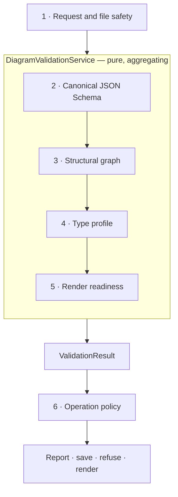
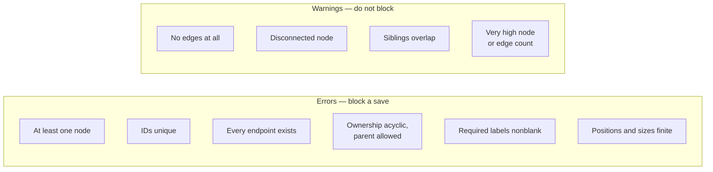
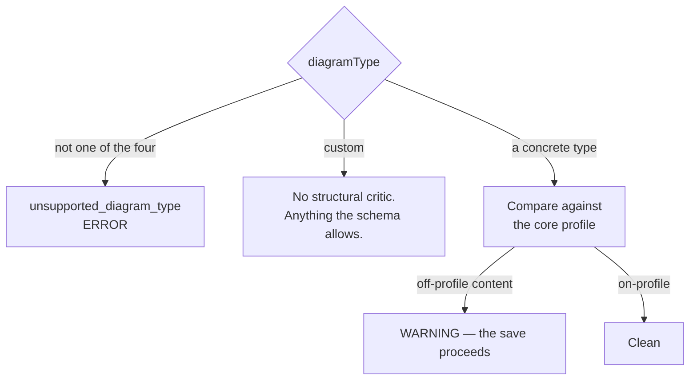
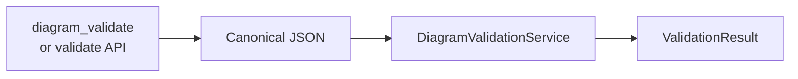
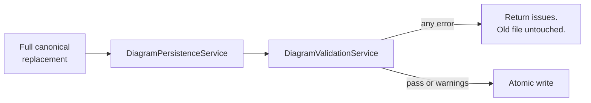
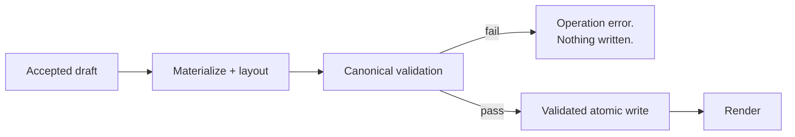
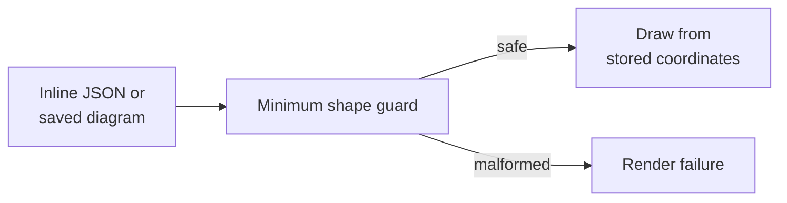

# Diagram Validation

> **Design authority:** this document owns canonical-diagram validation policy — the
> layers, their severities, and what each caller does with the result.

## Purpose

One deterministic question:

> Is this `graphpilot.diagram.v1` document safe and internally valid to persist, edit, and
> render?

`DiagramValidationService` is **pure**: the same canonical JSON returns the same ordered
`ValidationResult`. It makes no network call, reads no workspace file, repairs nothing, and
writes nothing. MCP and the Django API share the one service.
`DiagramPersistenceService` is the validated-write funnel that enforces the result before
any create or overwrite.

## How this differs from draft validation

The two never see the same object, and neither substitutes for the other.

| | [Draft validation](01-draft-validation.md) | **Diagram validation** |
| --- | --- | --- |
| Reads | the input a **host submitted** | the document **GraphPilot assembled** |
| Asks | did the host get it right? | did GraphPilot get it right? |
| On failure | a refusal the host can act on | our defect — it raises |
| Author | an agent | the materializer, or a person in the editor |

They meet exactly once, at stage 8 of the create path, where this validator checks a
diagram the materializer has just built.

**Neither proves the diagram is true.** Validation checks that a diagram is well-formed,
not that it describes the repository correctly. That is what
[evidence and assurance](../01-generation/03-lifecycle.md) record, and what a reader in
the editor judges.

## The six layers



Only Layers 2–5 run inside the service. Layer 1 precedes it; Layer 6 is the caller's
decision.

**Layers 2–5 aggregate rather than stop at the first problem**, so one result surfaces as
many independent issues as it safely can. The highest severity sets `level`; any `error`
makes the result `valid: false` / `level: fail`.

| # | Layer | Runs in | Blocks an ordinary save? |
| --- | --- | --- | --- |
| 1 | Request and file safety | entry point + storage | yes, as an `OperationProblem` |
| 2 | Canonical JSON Schema | the service | **yes** |
| 3 | Structural graph | the service | errors yes, warnings no |
| 4 | Type profile | the service | only an unsupported type |
| 5 | Render readiness | the service | only an invalid `style` |
| 6 | Operation policy | the caller | caller-defined |

---

## Layer 1 — request and file safety

| | |
| --- | --- |
| **Runs in** | the entry point and `WorkspaceStorageService` |
| **Reports as** | `OperationProblem`, never a `ValidationIssue` |

Every path resolves through `WorkspaceStorageService` and stays inside the caller's
workspace. Traversal, absolute escape, unsafe symlink or junction resolution, and
disallowed overwrite are all rejected **before** anything is read or written.

This layer is not part of the validator because it answers a different question — *is this
operation allowed?* rather than *is this document valid?* — and a caller that conflated the
two would report a path attack as a diagram defect.

## Layer 2 — canonical JSON Schema

| | |
| --- | --- |
| **Codes** | `schema_*` (dynamic), `invalid_root_type`, `non_finite_number`, `invalid_multiplicity` |
| **Severity** | error |

Draft 2020-12, compiled through `SchemaRegistry`, enforcing the exact
`graphpilot.diagram.v1` shape. The [schema](../02-diagram-schemas/01-diagram-json-schema.md)
owns the fields; this layer only compiles and reports them at canonical JSON paths.

Among the schema-owned rules:

- required top-level identity, metadata, viewport, node and edge fields, with **no unknown
  top-level fields**;
- exact renderer families and structured `data` / `style` / route / feature / end shapes;
- element origins and their mode-dependent cross-field rules;
- enums, text and array bounds, multiplicity types; and
- **finite numbers everywhere** — Python `NaN` and `Infinity` are rejected before
  persistence, since they serialize to JSON no parser will accept.

A finite multiplicity `upper` below its `lower` reports `invalid_multiplicity`.

The canonical schema is the source of truth. The frontend's hand-written type parity check
is a **consumer guard**, not a second contract.

## Layer 3 — structural graph

| | |
| --- | --- |
| **Errors** | `no_nodes`, `duplicate_node_id`, `missing_node_parent`, `cyclic_node_parent`, `empty_node_label`, `invalid_position`, `invalid_size`, `duplicate_edge_id`, `missing_edge_source`, `missing_edge_target` |
| **Warnings** | `no_edges`, `disconnected_node`, `overlapping_position`, `high_node_count`, `high_edge_count` |

What JSON Schema cannot express: relationships *between* values.



Two details worth knowing:

- **A valid ownership link counts as connectivity.** A node inside a partition is not
  disconnected just because no edge touches it.
- **Overlap is compared among siblings only**, using parent-relative coordinates, so
  children of different owners never falsely collide.

## Layer 4 — type profile

| | |
| --- | --- |
| **Error** | `unsupported_diagram_type` |
| **Warnings** | `blueprint_key_mismatch`, `unexpected_node_type`, `unexpected_node_semantic_type`, `unexpected_edge_semantic_type`, `structural_constraint` |

Supported types are `activity_diagram`, `use_case_diagram`, `bdd_diagram`, and
save-or-validate-only `custom`.

**Almost everything here is advisory, and that is the point.** A person editing in the
browser may deliberately diverge from a type's core profile — the diagram flips to `custom`
and stays valid. Only an unsupported `diagramType` is an error.



Retained compatibility catalog entries load and render but are not core palette choices.
Additional applied stereotypes are open domain data and do not create a new semantic
identity.

## Layer 5 — render readiness

| | |
| --- | --- |
| **Error** | `invalid_style` |
| **Warnings** | `long_label`, `label_truncated` |

Schema and structure already validated positions, sizes, endpoints and object shapes, so
this layer adds only what is left: whether the text will survive being drawn.

| Check | Severity | Why |
| --- | --- | --- |
| `style` is not an object | error | A defensive duplicate, in case schema checking was bypassed |
| Label beyond the length threshold | warning | Long, but it may still fit a large node |
| Text cannot fit its stored box at the minimum font size | warning | It will be wrapped, shrunk, then ellipsized |

Text-fit reuses the renderer's own deterministic constants, so the warning and the picture
agree.

**These stay warnings deliberately.** An in-progress diagram with one overlong label is
still worth saving, and blocking it would make the editor unusable while someone is
typing.

**What this layer cannot see:** whether two labels land on top of each other once drawn.
That is `hard_to_read`, measured from the rendered SVG by the create path — not here, and
not by any check that runs before a picture exists.

## Layer 6 — operation policy

Layers 2–5 report. The caller decides.

| Operation | Runs Layers 2–5 | Blocks on | Effect of failure |
| --- | :---: | --- | --- |
| `diagram_validate` / validate API | yes | nothing | Returns the result; no write |
| Browser save | yes | any error | The existing file is unchanged; warnings save |
| `diagram_create` | yes, after the draft is accepted | any error | Nothing is written, including the name. **A failure here is a GraphPilot defect**, not the host's, and is reported as an operation error |
| `diagram_render` / render API | no | the renderer's minimum guard | No image is written; the source is untouched |

`DiagramPersistenceService` runs a final validation **at the write boundary** even when the
caller already validated. That is deliberate belt-and-braces: it stops a later refactor, or
a new caller, from quietly bypassing the gate.

---

## Operation flows

### Standalone validation



Path-free when given inline JSON. Reads and writes no diagram, and reports every issue it
collected.

### Save



This is the browser save path. The full-document `diagram_update` workflow is **not implemented**; when it lands it uses this same funnel.

### Create



Canonical validation is reached only after the draft has been accepted in full. A failure
here means the materializer produced an invalid document — see
[draft validation, stages 7–11](01-draft-validation.md).

### Render



Rendering does **not** implicitly run Layers 2–5. It trusts stored geometry after a narrow
defensive guard. A caller wanting diagnostics invokes validation explicitly; a save or
create path has already crossed the full gate before the document is drawn.

---

## The result contract

```json
{
  "valid": true,
  "level": "pass",
  "summary": "Diagram passed validation.",
  "issues": [],
  "stats": { "nodeCount": 5, "edgeCount": 4 }
}
```

One issue:

```json
{
  "severity": "error",
  "layer": "structure",
  "code": "missing_edge_target",
  "message": "Edge edge_2 targets missing node node_database.",
  "path": "$.edges[1].target",
  "details": { "edgeId": "edge_2", "target": "node_database" }
}
```

| Field | Values |
| --- | --- |
| `severity` | `error` · `warning` · `info` |
| `level` | `pass` · `pass_with_warnings` · `fail` |
| `layer` | `schema` · `structure` · `blueprint` · `render_readiness` |

`ValidationLayer` lists **only the four layers that emit issues**. Layers 1 and 6 report
handled operational failures through `OperationProblem` rather than inventing
pseudo-validation issues.

Codes come from the `ValidationCode` registry and are **additive and stable** — add, never
rename. `schema_*` is the documented dynamic family.

## Principles

| | |
| --- | --- |
| **Deterministic** | The same value produces the same issues, order, level and statistics. No clock, no randomness, no network, no workspace state |
| **Canonical** | Validates GraphPilot JSON — not React Flow runtime state, and not a draft |
| **Shared** | MCP and REST use the one service and the one code registry |
| **Non-mutating** | Reports only. Never coerces, repairs, relabels, or changes `diagramType` |
| **Strict on validity** | Schema, graph integrity, finite numbers, ownership, required labels and render-breaking shape errors block a validated write |
| **Advisory on guidance** | Off-profile vocabulary, structural guidance, disconnected content and render quality stay warnings for an ordinary save |
| **Validated persistence** | Every create and overwrite crosses `DiagramPersistenceService`; low-level storage never silently bypasses the gate |
| **Separate render defense** | Rendering trusts stored geometry after a minimum guard, and does not run the validator implicitly |

## Invariants

- Invalid canonical JSON is never persisted through the validated-write funnel.
- A failed overwrite leaves the existing file **byte-for-byte unchanged**.
- Warnings never block an ordinary manual save.
- **Validation never repairs.** Nothing in this path rewrites a document to make it pass.

## Related

| | |
| --- | --- |
| The canonical field contract | [`../02-diagram-schemas/01-diagram-json-schema.md`](../02-diagram-schemas/01-diagram-json-schema.md) |
| Per-type notation | [`../02-diagram-schemas/README.md`](../02-diagram-schemas/README.md) |
| What the materializer builds | [`../01-generation/02-materialization.md`](../01-generation/02-materialization.md) |
| Rendering guards | [`../04-rendering.md`](../04-rendering.md) |
| Error codes and retryability | [`../../02-architecture/01-mcp-tools/04-operation-errors.md`](../../02-architecture/01-mcp-tools/04-operation-errors.md) |
