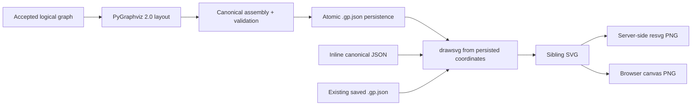

# Rendering Design

> **Design authority:** This document owns coordinate-driven `drawsvg` rendering and SVG/PNG behavior after layout.
> It does not own generation layout, canonical fields, public MCP transport, or validation policy. Runtime delivery status
> belongs only to [`epics/00-current-state.md`](../05-delivery/01-current-state.md).

## Purpose

Rendering turns canonical GraphPilot JSON into a deterministic static SVG and derives PNG from that same SVG. It draws
the positions, sizes, routes, styles, and notation already stored in the diagram; it never rearranges the graph or adds
semantic content.

```text
canonical graph with coordinates
  -> DiagramRenderService
  -> drawsvg scene
  -> SVG
  -> optional PNG rasterization
```

The renderer is a pure semantic drawing function for inline output: the same canonical value produces the same SVG
bytes without an LLM or network. Path-mode adapters separately own safe reads and atomic image writes.

## Responsibility split

| Concern | Owner |
| --- | --- |
| Logical graph generation, review, node sizing, and generated positions | [Generation Design](01-generation/README.md); pinned PyGraphviz 2.0 is its sole layout engine |
| Persisted positions, dimensions, parent-relative coordinates, routes, styles, and semantic fields | [Canonical schema](02-diagram-schemas/01-diagram-json-schema.md) |
| Whether canonical JSON is valid/savable and where renderer guards begin | [Validation Design](03-validation/02-diagram-validation.md) |
| Shape, marker, route, text, bounds, layer, SVG, and PNG drawing behavior | **This document** |
| Exact MCP/API arguments and response envelopes | [MCP](../02-architecture/01-mcp-tools/README.md) and [API](../02-architecture/05-api-routes.md) owners |

PyGraphviz and `drawsvg` have disjoint jobs. PyGraphviz computes generated node coordinates before canonical assembly;
`drawsvg` consumes canonical coordinates afterward. Rendering does not import, invoke, retry, or fall back to any layout
engine. Edited and imported diagrams use their saved coordinates in exactly the same rendering path.

## Position in generation and export



Generation persists valid canonical JSON before asking for an SVG. A persistence failure makes no render call. Once the
canonical commit succeeds, rendering is a derived operation: a render failure leaves the `.gp.json` intact, returns a
`render_failed` operational warning with a null SVG path, and can be retried through `diagram_render` without invoking
generation. Exact generated/blocked/error ordering lives in [Generation Design](01-generation/README.md).

`diagram_create` uses this renderer only after their shared
pipeline has saved the diagram. `diagram_render` remains an image utility over inline or already-saved diagram JSON; it
never creates or overwrites a canonical `.gp.json`.

## Coordinate model

Rendering trusts canonical geometry:

- top-level `node.position` is a top-left coordinate in diagram units;
- a child position is relative to its `parentId` owner;
- `width` and `height` are persisted design dimensions;
- viewport pan/zoom does not change exported diagram geometry;
- edge endpoints refer to canonical node IDs;
- explicit route anchors, waypoints, and label offsets are presentation overrides; and
- calculated automatic connector geometry is never written back to canonical JSON.

Before drawing, the renderer deterministically resolves each node's absolute box by walking its parent chain. It rejects
or safely terminates malformed ownership through its minimum guard rather than recursing indefinitely. It does not
resize a container or child: generated containment sizing belongs to layout, and edited sizing belongs to the saved
canonical document.

The scene bounds are the union of drawn node shapes, connector paths, markers, edge labels, authored label offsets, and
required padding. Negative authored coordinates are translated into a non-negative SVG view box without changing
relative geometry. The renderer never uses the editor viewport as an export crop.

## Drawing order

The stable layer order is:

1. container/background shapes;
2. ordinary node shapes and their compartments;
3. connector paths;
4. endpoint markers and relationship-end labels;
5. node labels, feature text, edge labels, and notes; and
6. any notation detail that must sit above the preceding shape (for example the note fold crease).

Containers appear behind their children. Parent-relative child coordinates are converted to absolute drawing
coordinates only for SVG construction; canonical JSON remains unchanged. Relationships use the final absolute endpoint
boxes and canonical route data.

## Nodes and notation

`node.type` chooses the shared renderer family and `node.data.semanticType` chooses the notation primitive. Structured
fields such as BDD `stereotype`, features, and use-case extension points supply visible details. The element catalog may
retain load/render compatibility entries, while the three core profiles remain smaller.

| Diagram type | Core shape language |
| --- | --- |
| Activity | Initial disc, rounded opaque Action, decision/merge diamonds, horizontal fork/join bars, activity-final bull's-eye, note |
| Use case | Actor stick figure, use-case ellipse with optional extension-points compartment, System Boundary container, note |
| BDD | Block classifier box with one primary `«stereotype»` heading, derived feature compartments, note |

BDD classifier compartments are derived from canonical `data.features`; `data.compartments` is never required. Blank or
missing primary Block stereotype renders as `«block»`; `appliedStereotypes` are separate additional applications rather
than competing headings.

Notes use the same folded top-right dog-ear on canvas and SVG. Both the clipped outer diagonal and inner fold crease
remain visible at supported border widths.

Edges use canonical per-edge straight or manual-first orthogonal routing. Canvas and SVG share one primitive attachment profile: boxes project to their boundary; diamond diagonal bands overlap exact cardinal targets; Initial/Final controls project to their rendered outer circles; use cases project to their complete ellipse; and Actors project to a tight visible-figure envelope that excludes the label. Straight markers follow the true segment vector; orthogonal markers preserve terminal approach. Control flow uses an arrow; include/extend/dependency are dashed open arrows; generalization/realization use hollow triangles; BDD `composition` points part-to-whole and draws a filled diamond at the target; association may carry navigability; and comment links are dashed without a marker. Roles, multiplicities, guards, and keywords render from structured data, while marker color follows the authored stroke. The editor mirrors the same routing and notation.

Exact semantic vocabulary, shape meaning, marker direction, and per-type structure are maintained in
[`diagram-schemas/`](02-diagram-schemas/README.md). Changes to notation keep the canvas and SVG implementation in parity.

## Connectors, routes, and markers

Static and canvas draw order is containers → edge strokes → ordinary nodes → edge labels/selected route controls. A selected container remains in the container tier rather than rising above content; ordinary selected nodes use the highest node tier. Boundary-owned ports/pins are resolved against their owner's absolute box and drawn afterward on its edge.

The renderer computes deterministic paths from canonical endpoints and route overrides:

1. Resolve the source/target absolute boxes and primitive-aware boundaries.
2. Read `route.mode`, treating absence as `orthogonal`.
3. Apply authored `sourceAnchor`/`targetAnchor` first; otherwise choose stable mode-appropriate boundary positions.
4. In `straight` mode, draw exactly one boundary-to-boundary segment and derive marker vectors from that segment.
5. In `orthogonal` mode, join authored waypoints in order and simplify only redundant collinear segments; without waypoints, use the shortest stable path between compatible anchors, with one segment when aligned.
6. Place the central label at path-length midpoint plus canonical `labelOffset`.

Automatic routing ignores unrelated nodes. There are no generated obstacle corridors, shared trunks, lane offsets, or blocked-route state. Explicit anchors remain authoritative; waypoints are orthogonal-only. Curved primitives (initial/final controls, use cases, and the Actor's owned envelope), diamonds, bars, and boxes project endpoints to their visible boundaries rather than the raw bounding-box center.

Marker and line behavior is derived from edge semantic identity and structured ends:

- activity `controlFlow` uses its directed arrow and may display guard/weight;
- use-case `include`, `extend`, and BDD `dependency` use dashed open arrows with their notation keyword;
- `generalization` uses a hollow triangle at the parent/general endpoint;
- BDD `composition` is part source to whole target and draws the filled diamond at the target;
- association navigability and relationship-end role/multiplicity come from structured end data; and
- `commentLink` is dashed and markerless.

Marker color follows the authored edge stroke. Rendering never persists marker definitions, automatic handles, or its
calculated polyline.

## Text fitting

The renderer does not depend on browser font metrics. It uses fixed versioned constants for character-width estimate,
line height, padding, and minimum font size:

1. estimate available inner area for the actual primitive;
2. word-wrap deterministically;
3. shrink toward the minimum font size if needed; and
4. ellipsize only as the final fallback.

Diamonds and ellipses expose less usable text width than their bounding boxes and therefore use tighter inner areas.
Text fitting never changes stored node dimensions or layout. Canonical validation may warn that a label will truncate;
rendering still produces the deterministic best-effort image when its minimum guard passes.

## Styles and defaults

Canonical node and edge style fields override the shared light-export defaults. The renderer supports the schema-owned
background, text, border/stroke, width, and line-style values and applies the same semantic defaults as the editor.
Dark-mode UI state is not canonical and does not alter export. Unsupported/malformed style shape is a canonical
validation error; the renderer's own guard also rejects values it cannot safely draw.

## Minimum render guard

Rendering is not an implicit validation call. It performs only the checks required to consume input safely, including:

- root value is an object;
- `nodes` and `edges` are arrays;
- each drawn item has the minimum object/identity/data shape;
- numeric geometry used for drawing is finite or follows the documented defensive default;
- parent resolution terminates; and
- endpoint/route/style values cannot make `drawsvg` emit malformed output.

Callers that need a complete issue inventory invoke `diagram_validate`. All canonical write paths already run the full
validator; the narrow guard exists for inline rendering and defense in depth. The renderer does not repair IDs,
semantic types, topology, origins, or canonical content.

## SVG construction with `drawsvg`

`DiagramRenderService` builds the complete scene with `drawsvg` primitives and emits one standalone SVG. It owns:

- deterministic element/definition ordering;
- XML-safe text and attribute escaping;
- unique, stable marker/clip-path IDs scoped to the image;
- finite view-box and width/height calculation;
- no external fonts, scripts, stylesheets, images, or network resources; and
- canonical UTF-8 SVG serialization.

SVG is the primary rendered artifact. The renderer does not shell out for layout or drawing. PyGraphviz native state,
model/provider data, context claims, origins, and generation trace/debug content never enter the SVG. Origins are
nonvisual canonical data.

## Export and formats

Both browser and agent export use the same SVG renderer rather than parallel drawing implementations:

- **Editor preview/export:** the browser sends the canonical JSON it would save to `POST /api/diagrams/render` and
  receives SVG. SVG download uses those bytes directly; PNG export rasterizes the returned SVG on a browser canvas.
- **MCP inline render:** `diagram_render` accepts inline canonical JSON and returns SVG without filesystem access.
- **MCP path render:** `diagram_render` safely reads an existing `.gp.json`; `format="svg"` atomically writes the sibling
  `.svg`, and `format="png"` derives and atomically writes the sibling `.png`.
- **Server-side PNG:** `resvg` rasterizes the exact SVG at full resolution. PNG never has a separate semantic/shape
  renderer.

PDF and interactive/dark-mode SVG are outside this design. An MCP image-content preview is also not required; exact
public text/content blocks and edit URLs remain in the MCP contract owner rather than this rendering spec.

## Failure and file behavior

- Inline rendering returns either complete SVG or a render failure; it writes nothing.
- Path-mode image output uses a sibling temporary file and atomic replace. A failed render/raster/write never leaves a
  partial target image.
- `diagram_render` failure never changes the source `.gp.json`.
- Generation renders only after canonical persistence. If rendering fails, the canonical diagram remains the successful
  source of truth and the generated result carries `render_failed`; no generation reroll occurs.
- Retrying an image operation reads the saved canonical coordinates and produces the same result for the same renderer
  version/input.
- Trace/debug write failures and provider/layout failures are not rendering failures and remain owned by the generation
  pipeline.

## Invariants

- `drawsvg` is the one SVG drawing implementation for API, MCP, generated artifacts, and editor export.
- Rendering is coordinate-driven and never performs layout.
- PyGraphviz 2.0 layout completes before generated canonical assembly; rendering consumes only canonical coordinates.
- Saved geometry and authored routes are authoritative; calculated paths are derived and non-canonical.
- Canvas and SVG keep notation, structured labels, markers, stereotypes, composition direction, and note shape in parity.
- SVG is primary; every PNG derives from that SVG.
- Rendering adds no semantic content, provenance, model metadata, or trace/debug data.
- Canonical save precedes generation render, and post-save render failure never destroys a valid diagram.
