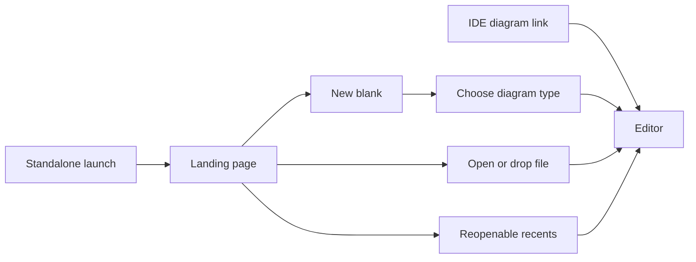
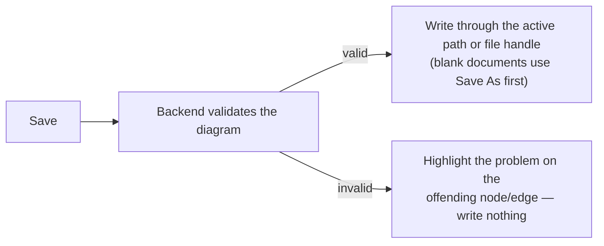

# Editor UI Design

## Purpose

The editor is the browser surface where a person opens a GraphPilot diagram, refines it by hand, and saves it back. This document describes how that surface should **look and feel** and owns editor design intent. Implementation history lives in Epic 2's `04-editor-ui-ux` slice outcomes; live delivery status lives only in `../03-development-and-delivery/epics/00-current-state.md`.

**Scope stance:** prefer predictable direct manipulation over clever automation. Remove controls or automatic behavior that obscures user intent; deliberate exclusions are listed under *Out of scope and future*.

## Scope

**In:** a polished, draw.io-like surface for starting or refining Activity, Use Case, BDD, and Custom diagrams through bounded core palettes — blank creation, opening, editing, styling, and saving, plus minimap, undo/redo, palette, inspector, theming, and export. Retained specialist elements may load/render but are not new-authoring choices.

**Out:** freeform drawing (arbitrary shapes/images/free text), new diagram types or shapes, project/workspace browsing, automatic obstacle avoidance or whole-diagram layout, heavyweight general graph routing, multi-user collaboration, and an in-editor AI chat. See *Out of scope and future*.

## The workspace at a glance

```text
┌───────────────────────────────────────────────────────────────────────┐
│ Top bar:  name · [type] · [i]                     Open file · Save · ⋯ │
├──────────┬───────────────────────────────────────────────┬────────────┤
│ Shapes   │                                                │ Inspector  │
│ palette  │                 Canvas                         │ (selected  │
│ (drag    │           (the diagram you edit)               │  element's │
│  onto    │                                                │  details)  │
│ canvas)  │      minimap ◱           zoom controls ⊕⊖       │            │
├──────────┴───────────────────────────────────────────────┴────────────┤
│ Status bar:  3 nodes · 2 edges            100%            Saved         │
└───────────────────────────────────────────────────────────────────────┘
```

- **Top bar** — the diagram's name, its type, one quiet information button for available file/write/revision detail, and the main actions (Open file, Save, theme toggle, export). Entry transport is never persistent chrome.
- **Shapes palette** (left) — one unified shape/relationship search with Current diagram (default) or All authorable scope and Diagram (default) or Notation organization. One connector tray keeps the scoped relationships and Straight/Orthogonal choice together; Diagram groups (Shared, Activity, Use Case, BDD, Custom-only) or Notation groups (Common, UML, SysML) organize shapes. Compatibility-only identities never appear.
- **Canvas** (center) — the diagram itself, with a minimap and zoom controls.
- **Inspector** (right) — the properties of whatever node or edge is selected.
- **Status bar** (bottom) — node/edge counts, the current zoom, and the save state.

The side panels collapse and resize, and the layout remembers your preference.

## Design principles

- **Recognizable, not novel** — borrow the layout people already know from draw.io / Lucidchart.
- **Bounded** — refine the three diagram types; don't drift into a general drawing tool.
- **The diagram JSON is the truth** — everything you do round-trips faithfully back to the saved file.
- **Legible** — consistent type, spacing, and color; the selected element and the save state are always obvious.
- **Forgiving** — undo/redo, a confirm before overwriting, and a warning before you lose unsaved work.
- **Quiet by default** — advanced controls stay tucked away until you need them.

## Opening or starting a diagram

Standalone and IDE entry converge on the same document editor without exposing transport history:



- **Standalone landing.** No `diagramPath` shows one primary **New diagram…** action, Open file, drag-to-open, reopenable Recents, and Clear recents. New diagram opens a searchable, scrollable modal whose deterministic type list shows label, description, notation, and canonical ID; search covers those fields plus keywords. It does not reuse palette grouping controls. There is no project/workspace list.
- **Blank document.** Activity, Use Case, BDD, and advanced Custom start as valid client-side canonical JSON without generation. The document is unsaved and its first Save uses Save As.
- **IDE link.** A valid `diagramPath` bypasses the landing page and opens directly. A failed link remains an explicit recoverable error rather than silently choosing another document.
- **Local file.** A writable picker handle owns Save after backend validation; a read-only drop requires Save As. Browser handles are session-only.
- **Recents.** Persistent history contains only backend paths GraphPilot can reopen. Picker/drop files may remain available in-session but are not promised after restart; Clear recents deletes history, never files.

The header does not label workspace, MCP, URL, picker, or drop origins. One information button shows only available filename/path, writable/read-only/unsaved state, revision/conflict state, and copy path. Internal source ownership still drives correct Save targeting, focus refresh, and stale-overwrite protection.

## Editing on the canvas

Day-to-day editing should feel quick and forgiving:

- **Add** shapes by dragging them from the palette; **connect** them by dragging from one to another (any side to any side).
- **Rename** by double-clicking a node and typing in place; **restyle** (color, border, size) from the inspector.
- **Move** freely, with alignment guides that snap a shape to line up with its neighbours (a 16-pixel grid shows behind the canvas as a visual reference, but node positions are no longer snapped to it).
- **Undo / redo** every change; **duplicate**, **copy/paste**, and **multi-select** to act on several elements at once.
- **Keyboard shortcuts** for the common actions, with a help panel that lists them.
- **Layer predictably** — System Boundaries and other containers stay behind edge strokes and ordinary nodes even when selected; ordinary selected nodes rise above other content. Exposed container border/interior remains selectable, and layering alone never changes containment.

### Relationships and labels

Relationships use a persisted per-edge **Straight** or **Orthogonal** route mode. Missing mode remains orthogonal for compatibility; the next-edge tool starts straight for Use Case and orthogonal for Activity, BDD, and Custom. Straight mode draws one primitive-boundary segment. Orthogonal mode remains predictable and manual-first: compatible aligned anchors use one direct segment, while non-aligned endpoints use the smallest stable route that preserves their boundary approach. Node boundaries remain reusable, every completed gesture creates an independent edge, and typed cardinality violations remain validation concerns. There are no automatic obstacle corridors, shared trunks, lane offsets, collision warnings, or separate add-detour button.

Hovering a zoom-stable visible-boundary hit area—including overlapping sloped bands and exact top/right/bottom/left targets on a diamond, the rendered outer circles of Initial/Final controls, the complete use-case ellipse, and a tight Actor figure envelope that excludes its label—reveals a temporary connection point. Curved profiles use an outward-biased 12-screen-pixel halo with a narrow inward tolerance, while the indicator, drag preview, and persisted normalized anchor project to the exact visual boundary at every zoom. During a relationship gesture, the 20-screen-pixel target radius visibly outlines only the current valid target and active boundary band. A projected pointer within 8 screen pixels of a visual cardinal center softly snaps there; moving outside immediately restores exact custom placement. Node interiors remain available for move/select. Every selected relationship exposes movable perimeter endpoints and a separately draggable label. Orthogonal relationships additionally expose draggable segment squares, safe delete-corner diamonds, and Straighten route; straight relationships have no waypoints or segment/corner controls. Switching to Straight clears orthogonal waypoints in the same undoable edit while retaining anchors and label offset. Manual geometry and route mode survive save/reload/export, and canvas/SVG project anchors against the same visible primitive. Connector strokes stay behind nodes while labels and selected editing controls stay above them.

One palette connector tray derives relationship tools from the active diagram's bounded catalog: Activity exposes Control Flow/Comment Link; Use Case exposes Association/Generalization/Include/Extend/Comment Link; BDD exposes Association/Composition/Generalization/Dependency/Comment Link; and Custom exposes every authorable catalog relationship. With an edge selected, relationship and route-mode clicks update that edge through the same safe inspector paths and also set the next-edge tools; without an edge selection they affect only the next edge. Composition is a first-class part-to-whole edge with the filled diamond at the target. **Swap ends** reverses endpoints and corresponding end/route data together. Connecting any Note automatically chooses Comment Link regardless of the selected tool. Note nodes show both the clipped top-right outer diagonal and the inner dog-ear crease.

### Properties panel

The inspector uses fixed **Content**, **Appearance**, and **Advanced** tabs. Content owns common semantic edits, editable edge **Relationship type**, the BDD Block's primary stereotype, and compact expandable rows for structured BDD data; edge semantic-type validation opens/marks Content while node identity remains in Advanced. Appearance owns style, size/content-fit, Straight/Orthogonal mode, anchors, mode-appropriate route controls, label placement, and Swap ends; Advanced owns additional applied stereotypes, qualifiers, metadata, and copyable raw IDs. Removed specialist identities do not remain selectable through Advanced or All authorable. Empty groups are omitted behind one Add content control, only one compact structured row expands at a time, populated/error tabs carry status dots, validation opens the responsible tab, and multi-selection begins on Appearance.

### Compact BDD definitions

BDD has one Block palette item plus Note. A Block's optional primary stereotype controls its visible `«heading»`; blank means `«block»`, suggested values include `valueType`, `constraint`, `interfaceBlock`, and `enumeration`, and custom text is allowed. Additional applied stereotypes remain separate. A Block with no visible feature rows renders as one compact stereotype/name section without an empty lower compartment or divider. Adding the first feature restores the derived compartment layout; removing the last feature returns content-fit nodes to the compact form. Canvas and SVG keep the same heading, compartments, and compact sizing.

## Saving and validation

Saving always checks the diagram before it touches a file, so a broken diagram can never overwrite a good one.



- **Validation is shown where the problem is** — the offending node or edge is highlighted on the canvas and flagged in the inspector, not buried in a generic error list.
- **Save feedback** appears as a brief toast (saved / failed).
- **Autosave** is available but **off by default**; it reuses the same validate-first save and pauses after a failure until the next edit.
- **Don't lose work** — if there are unsaved changes, the editor warns before a refresh or close, and confirms before opening a different diagram over your edits.

## Look and feel

- A single, themed design system gives the chrome consistent color, spacing, and typography.
- **Light or dark follows your operating system** by default; a top-bar toggle overrides it and remembers your choice. A diagram's **authored** colors are preserved exactly in either theme; only the app chrome and the *default* look of un-styled nodes — plus the *default* (un-authored) **edge** stroke + arrowhead — adapt to dark mode.
- **Each shape is drawn to mean something**, matching the diagram type:

| Type | Shape language |
| --- | --- |
| Activity | start/end = rounded "pill", action = rounded box, decision/merge = diamond, note = sticky note |
| Use case | actor = stick figure, use case = ellipse, system boundary = container box (contents nest inside) |
| BDD | every block = a titled compartment box («stereotype» + name) |

The note's folded corner, the alignment guides, and the empty/loading/error screens are all part of this polish — they should look intentional, not like fallbacks.

## Accessibility

Controls are keyboard-operable with a visible focus outline; dialogs trap focus and close on Escape. Color is never the only signal — the dirty state, validation, and selection each pair color with an icon or outline.

## Out of scope and future

These are intentionally not part of the editor today, but the design leaves room for them later:

- Freeform drawing, new diagram types, or new shapes beyond the current set.
- Whole-diagram auto-layout, automatic obstacle avoidance, shared routing trunks, curved/freehand routes, and heavyweight/general graph routing. The editor keeps minimal automatic orthogonal paths plus user-authored overrides.
- Real-time multi-user collaboration.
- An in-editor AI generate/chat flow.
- Project/workspace browsing in the standalone UI.
- A true native "open by path" dialog (needs a desktop app shell), and remembering a picked file across page refreshes.
- PDF export and an MCP inline image presentation that behaves consistently across clients. Server-side PNG file output for agents and editor SVG/PNG export are already delivered from the shared SVG renderer.

## Related Docs

- `../01-architecture/02-frontend-architecture.md` — how the editor is built and how it talks to the backend
- `01-diagram-json-mapping-design.md` — how the canvas maps to the saved diagram JSON
- `03-rendering-design.md` — the server-side renderer the editor's export now uses
- `decision-decisions.md` — the recorded design decisions (draw.io-bounded scope, follow-system theming)
- `../03-development-and-delivery/epics/02-react-editor-and-export/04-editor-ui-ux/` — original UI/UX implementation outcomes
- `../03-development-and-delivery/epics/02-react-editor-and-export/05-frontend-refinement/` — source synchronization, route-contract, BDD fidelity, and inspector history
- `../03-development-and-delivery/epics/02-react-editor-and-export/06-editor-simplification/` — minimal routing, boundary connections, and landing/source delivery

## Archived Feature-Request Snapshot

The table below is retained only as point-in-time implementation history. Its statuses, verification counts, and branch references are not live tracking; current delivery status belongs to `../03-development-and-delivery/epics/00-current-state.md`, current deferred work belongs to `../03-development-and-delivery/02-backlog.md`, and detailed outcomes belong to the referenced Epic 2 slices.

| # | Status | Priority | Item | Notes / target slice |
| --- | --- | --- | --- | --- |
| 1 | ✅ done (pending visual confirmation) | P1 | **Dark mode doesn't look clean on the canvas** — node shapes, some text, and diagram content aren't inverted/contrasted correctly in dark mode. | Implemented the documented **draw.io-style** direction (`nodeStyle.ts` `resolveStyle` + an `EditorColorModeContext`): in dark mode the **DEFAULT** node look gets a **transparent interior** with a **light outline + light text**, so the old white shapes no longer glare and the use-case actor/label read clearly; **authored colors are preserved** in either theme. A first token-based attempt (Slice 10) was reverted as not legible — this is the different transparent-interior approach. Worth a quick visual check on a real dark canvas. |
| 2 | done | P3 | **The landing/home screen could be neater** — tighten the layout and visual hierarchy of the Open-file + recents landing. | Slice 14: polishes the empty/landing state introduced in the open-UX slice (08). |
| 3 | done | P2 | **Existing edges can't be edited** — to change a connection you have to delete it and draw a new one. | Slice 12: allow reconnect/relabel/restyle of an existing edge in place (paired with #14). |
| 4 | done | P1 | **Property controls aren't user-friendly** — e.g. the dashed-line field asks for a raw array (`strokeDasharray`) instead of a simple choice. | Slice 11: friendlier controls (a Solid/Dashed/Dotted dropdown, etc.) within the supported style subset (no schema change). |
| 5 | done | P2 | **Nodes dropped inside a container box get trapped** — they can't be dragged back out. | Slice 13: `extent: 'parent'` pins children to the system-boundary box; allow moving a node out of its container. |
| 6 | ✅ done | P3 | **No on-canvas resizing** — nodes can only be resized via the inspector's width/height fields. | Slice 10 (done): selected nodes show 9-pixel React Flow `NodeResizer` grabbers (`customNodes.tsx` + a `ResizeContext`); the live size is written into the node `style` the reverse adapter persists (not React Flow's measured `width`/`height`), so the save round-trip stays byte-stable. Min 40x30; one undo snapshot per resize. |
| 7 | ✅ done | P3 | **The shape palette is underwhelming** — it lists shapes as text with no visual preview. | Slice 14 (done): each shape shows a monochrome SVG preview glyph, shapes are grouped into collapsible categories (Activity / Use case / Block / Annotation), and a search box filters by label/type (`NodePalette.tsx` + `groupedPaletteItems` in `palette.ts`). The drag payload is unchanged. |
| 8 | ✅ done | P1 | **The note shape's top-right corner is still bugged** — the folded corner renders as a cut-off, not a fold. | Slice 10 (done): the note draws a real folded corner — the cut top-right plus an SVG flap triangle (shaded underside + crease in the border color) in `customNodes.tsx`. |
| 9 | ✅ done | P4 | **Alignment / distance guides while dragging** — only grid snapping ships today. | Slice 15d (done): dragging a node shows blue alignment guide lines and snaps to the nearest node edge/center (`getHelperLines` in `alignmentGuides.ts` + a `HelperLines` canvas overlay; `onNodesChange` interceptor), on top of the existing grid snapping. |
| 10 | ✅ done | P4 | **True in-shape inline label editing** — double-click currently opens the inspector to rename. | Slice 15a (done): double-click a node opens an in-shape `<input>` on the custom shape (`EditableLabel` in `customNodes.tsx` + a `NodeLabelEditContext`); commits on Enter/blur (only if changed), cancels on Escape, via the same `updateNode` path so undo/save are consistent. The inspector Label field still works. |
| 11 | ✅ done | P4 | **Inline per-element validation markers** — errors show as a toast + per-issue banner list. | Slice 15c (done): a toolbar **Validate** action runs the path-free `POST /api/diagrams/validate`; each issue's `$`-rooted path is mapped to its node/edge id (`validation.ts`), which outlines the element on the canvas (`gp-invalid` class) and flags it in the inspector (`IssueFlag`). Markers clear on the next edit. |
| 12 | ✅ done | P4 | **Bulk style across a multi-selection** — style presets apply to one element at a time. | Slice 15b (done): selecting 2+ nodes switches the inspector to a bulk-style panel (presets + colour/border controls) that applies the change to every selected node as one undo step (`bulkStyleNodes` + the shared `applyNodePatch` in `nodePatch.ts`). |
| 13 | ✅ done | P2 | **PNG export blacks out edge labels** — edges that carry a label render as a black block in the exported PNG. | Slice 09 (done): the editor's `Export` menu now renders **server-side** (`POST /api/diagrams/render` -> SVG) and downloads SVG or a client-rasterized PNG; the `html-to-image` DOM-screenshot path was removed, so edge labels render correctly. The MCP `diagram_render` tool gained the same inline-JSON mode. |
| 14 | done | P2 | **Edges take poor paths on the canvas (React Flow only)** — e.g. in the library use-case diagram the *Return Book* → *Pay Fine* relationship attaches left-of-source to right-of-target instead of routing through the middle. | Slice 12: the saved JSON is correct (the Epic 3 `diagram_render` SVG draws it perfectly), so this is a React Flow handle/anchor-selection issue, not a data issue — revisit floating-edge / handle-position logic on the custom nodes. Pairs with the edge work (#3). |
| 15 | done | P3 | **The "Saved." banner never clears** — after a successful save it stays up indefinitely instead of auto-dismissing. | Slice 14: `SaveBanner` renders while `saveState.status === 'saved'`, only reset to `idle` on the next edit (`EditorPage.tsx`) — auto-clear the `saved` state after a short delay (or keep the banner for errors only). Quick fix. |
| 16 | ✅ done | P1 | **Opening a second file doesn't reload the canvas** — after the first diagram, opening another file (or re-opening one) leaves the previous diagram on screen instead of loading the new one. | Root cause: `DiagramCanvas` was keyed on `diagramPath`, which collides for same-named picker files (`(local) <basename>`, no folder) and re-opens, and `useNodesState`/`useEdgesState` seed from props **only on mount**. **Fixed on `epic-6-refinements`:** key the canvas on a per-open `loadId` (bumped via `loadSeqRef` in `openDiagram`/`openLocalFile`) instead of the path, so every successful open remounts with fresh state. Verified via lint + build + 90 unit tests; manual browser check pending. |
| 17 | ✅ done | P3 | **Undo/Redo (toolbar) isn't responsive when squished to ~half width** — the floating toolbar's buttons overflow/clip on a narrow canvas. | Fixed: `Toolbar.tsx` now `flex-wrap`s within `max-w-full` so it wraps to extra rows inside the pane instead of overflowing. |
| 18 | ✅ done | P3 | **Default edge arrowhead is a bit too big** — the arrow tip is oversized. | Fixed: `edgeMarkerEnd` gives the flow/include markers explicit modest dimensions (16/18px) + a dark colour instead of React Flow's oversized light-grey default. |
| 19 | ✅ done | P3 | **Buttons lack "pop" on hover/click** — not enough visual feedback. | Fixed: `ui/Button.tsx` uses a theme-aware foreground tint on hover that darkens on press (and accent/danger darken on press); the old near-invisible `surface-2` hover is gone. |
| 20 | ✅ done | P2 | **The diagram name can't be edited** — the top-bar name is read-only. | Fixed: the top-bar name is an in-place input (`TopBar onNameChange`); a `buildCanonical()` applies the edited name over the adapter's original (used by save/Save As/export/validate, falling back to the original if cleared). Editing marks the diagram dirty. No schema change. |
| 21 | 🔧 to do (decision) | P3 | **Node label bold isn't user-controllable** — e.g. activity start/end render bold but other nodes can't be bolded. | **Deferred (by design / needs a decision).** Bold is shape-driven in `customNodes.tsx` (start/end pills + BDD header + system-boundary use `fontWeight: 600`), and `fontWeight` isn't in the supported style subset — making it user-controllable means adding a style property (subset/schema change). Awaiting a decision before touching the schema. |
| 22 | ✅ done | P2 | **MCP `?diagramPath=` URL persists after opening a local file** — refresh re-opens the previous MCP diagram. | Fixed: `openLocalFile` clears the `?diagramPath=` query (`history.replaceState`) on a successful local open, so a reload no longer re-resolves the old MCP path. |
| 23 | ✅ done | P3 | **Long absolute paths overflow the landing card** — a big recent-file path stretches outside the box. | Fixed: recents already truncate (post-merge); the landing error message now also `break-words` so a long path can't overflow the card. |
| 24 | ✅ done (verify) | **P1** | **Dragging a relationship spawns a duplicate/ghost edge elsewhere.** | Fixed: added the React-Flow `onReconnectStart`/`onReconnectEnd` + `edgeReconnectSuccessful` guard (drop the edge if a reconnect is released off a handle, instead of leaving a stale/duplicate one) and suppress `onConnect` while a reconnect is in progress so it can't spawn a second edge. Worth a live confirm. |
| 25 | ✅ done | P3 | **Default edge should be thicker + darker.** | Fixed: `FloatingEdge` renders a darker 2px stroke (matching the server `EDGE_DEFAULTS`) when an edge has no explicit style; an edge's own stroke/width still wins. Render-only, byte-stable. |
| 26 | ✅ verified (no change) | P2 | **Autosave can fire after a save completes / when not dirty** — suspected race. | Re-examined: not a bug. The autosave effect's cleanup re-runs on every `dirty`/`saveState` change (clearing the pending timer), and `performSave` only clears `dirty` when no edits happened during the save (the `editGenRef` guard), so a stale/duplicate autosave can't fire. Left as-is. |
| 27 | ✅ done | P3 | **Opening a local file that fails (e.g. bad JSON) shows no toast.** | Fixed: `openLocalFile` now shows an error toast and keeps a loaded diagram on screen (only falls back to the error state when nothing is loaded). |
| 28 | ✅ done | P3 | **Save to a picker file can fail silently if the handle's permission was lost.** | Fixed: `writeHandle` (`fileSystem.ts`) guards `createWritable()` and surfaces a clear "use Save As to re-pick the file" error. |
| 29 | ✅ done | P4 | **Recents can keep empty/whitespace entries from old data.** | Fixed: `getRecents` filters to `p.trim().length > 0`. |
| 30 | ✅ done | P4 | **In-shape label edit may commit on blur right after Escape/cancel.** | Fixed: `LabelInput` uses a one-shot ref guard so Escape-then-blur can't commit a discarded value (and Enter+blur can't double-commit). |
| 31 | ✅ done | P1 | **Edges don't attach at the right point on the node** — connections land "in the middle" or off the node side in some diagrams. | Fixed: the canvas `FloatingEdge` was rewritten to mirror the server renderer, falling back to the node's declared size when not yet measured (previously the measured-size intersection could collapse to the node corner/centre). Both sides have since moved to **anchors**: `edgeRouting.ts` `routeEdgeByMode` → `routeOrthogonalEdge` / `routeStraightEdge`, mirroring `_route_anchor` in `diagram_render_service.py`. The original mid-of-facing-side function this row used to name was superseded and has been deleted, along with the server's `_route`. Render-only; round-trip unchanged. |
| 32 | ✅ done | P1 | **Activity-diagram flow arrows point the wrong way.** | Fixed by the `FloatingEdge` rewrite (#31): the route's final segment points straight at the target, so the `markerEnd` orients into the target (downstream). Now merged to `master`, so it renders in the main repo; the arrow is also configurable via #33. **Follow-up (drag-creation, pending live re-verify):** drawing a *new* edge from a node's **bottom** (flows) / **right** (other) grabber created the edge **reversed** — that side's overlapping **target** handle painted on top, and `ConnectionMode.Loose` keeps a grabbed target handle as the target, so the arrow pointed back into the node you dragged from. Fixed in `customNodes.tsx` by ordering each side's **source** handle last (on top) so a grab starts an outgoing connection; the primary first-source/first-target anchoring is preserved. Handles only — no schema/round-trip change. |
| 33 | ✅ done | P2 | **Arrow-direction control in the edge properties** — choose where an edge's arrow points. | Fixed: an **Arrow** dropdown in the edge inspector (To target / To source / Both ends / None) persisted on `edge.data.arrow` (schema allows additional edge.data props — no schema change) and re-derives `markerStart`/`markerEnd` live (`edgeMarkers` in the adapter; reverse adapter preserves it byte-stably). |
| 34 | ✅ done (pending visual confirmation) | P2 | **Edges stay dark in dark mode** — the default edge stroke + arrowhead are a hardcoded dark `#333333`, so relationships are hard to see on the dark canvas. | Done via the theme CSS-variable route. The generator bakes the server `EDGE_DEFAULTS` stroke (`#333333`) into **every** edge's `style`, so `FloatingEdge.tsx` treats that exact value (and a missing stroke) as the "default" and renders it with `var(--line-strong)` for display, while a genuinely **custom** stroke is preserved as authored. The `flow`/`include`/`extend` arrowhead colour (`edgeMarkerEnd` in `reactFlow.ts`), the custom `gp-generalization`/`gp-composition` SVG markers, and `EDGE_COLOR` (the default marker fill, `EditorPage.tsx`) use the same `var(--line-strong)` — `#333333` in light (unchanged, still matches the server render) and a lighter slate (`#cbd5e1`) in dark. The SVG markers set fill/stroke via `style` (not the `fill=`/`stroke=` attributes) so the var resolves; the generalization triangle fills with `var(--surface)` to stay hollow. The stroke is themed only on the **local** display style (the edge's React Flow state is untouched), so the save round-trip keeps the original `#333333` and stays byte-stable (verified by the round-trip tests). |
| 35 | ✅ done | P3 | **Edge grabbers overlap the arrowheads** — the per-side connection handles (10×10 dots, `zIndex 5`) paint on top of edges, so at a node's side-midpoint (where an edge attaches and the arrowhead lands) the dot covers the arrowhead. | Fixed in `index.css`: connection handles are transparent at rest and fade to 72% opacity while their node is hovered or selected, preserving the full hit area and `connectionRadius` while leaving idle arrowheads unobscured. The existing edge-creation E2E test now verifies hidden-at-rest, hover reveal, and successful connection. No schema/round-trip impact. |
| 36 | ✅ done | P2 | **SVG render: long labels overflow small nodes** — some nodes' text spilled outside the shape in the server render/export. | Diagnosed: the renderer drew every label as a **single, fixed-12px, centred** line with no wrap / shrink / measurement, while node boxes use stored size or fixed per-type defaults (`DEFAULT_NODE_SIZES`); un-sized canvas nodes auto-grow to fit text but store no width/height, so the SVG fell back to a smaller default box → overflow in the export only. **Fixed (pending live verify):** added `_fit_text()` / `_wrap_text()` / `_text_area()` in `diagram_render_service.py` — labels **word-wrap**, then **shrink** toward `MIN_FONT_SIZE` (8), then **ellipsis** as a last resort, using a deterministic char-width estimate (`CHAR_WIDTH_RATIO`, no new dep). `_label` now renders one centred `Text` per line; per-shape inner-width factors (diamond 0.6, ellipse 0.72, actor full, note minus fold). Geometry/layout untouched. Residual: an un-sized node still grows on the canvas but the SVG fits a default box, so they won't look identical (no overflow either way) — full parity = persist node size (separate follow-up). |
| 37 | ✅ done | P3 | **Preview JSON** (debug) — see the canonical JSON the editor would save, with a git-style diff of changes. | Done (pending live verify): the floating toolbar's single "Preview render" button is now a **Preview ▾** dropdown (`PreviewMenu.tsx`, mirrors `ExportMenu`) offering **Render (SVG)** (unchanged) and **JSON**. The JSON modal shows `buildCanonical()` (the same JSON a save sends) with a unified **line diff vs. the diagram as opened** — added/removed rows tinted via the theme-aware `success-bg`/`danger-bg` tokens — plus **Copy** and a **raw/diff** toggle. Diff is a self-contained LCS util (`jsonDiff.ts`, no new dep); baseline is round-tripped through the same adapters so only real edits show. Frontend-only; no schema/round-trip/backend change. |
| 38 | ✅ done | P2 | **SVG edge labels: the connector runs through the text** — on canvas the label sits in a solid box, but the SVG drew bare text over the line. | Fixed (pending live verify): `_draw_edge` in `diagram_render_service.py` now draws a white rounded box (light `#e0e0e0` border) sized from the char-width estimate behind the label before the text (mirrors the canvas). Render-only; +2 tests. |
| 39 | ✅ done | P3 | **Shrunk-window layout polish** — the floating toolbar went double-rowed when narrow, the top bar wrapped (and visibly jumped when the "unsaved" chip appeared on first edit), and the "From MCP" chip didn't stay centred. | Fixed (pending live verify): both bars use **progressive overflow** — as width shrinks, lower-priority actions fold into a **`⋯`** menu (`ToolbarMore.tsx`) one step at a time rather than wrapping. **Floating toolbar** (React Flow pane width via `useStore`): `Undo/Redo` + `Preview▾` always inline; `Help` collapses < 560px, then `Validate` < 500, `Duplicate` < 430, `Delete` < 360 — so it stays one row down to ~190px. The duplicate **zoom/fit buttons were removed** (React Flow's bottom-left `Controls` already provide them). **Top bar** (window width via `useWindowWidth`): primary `Save` always inline; theme+autosave collapse < 1000px, Browse+Open file… < 840, Export+Save As < 700. The header is now **non-wrapping** (identity left / `shrink-0` actions right, name truncates), so flipping the unsaved indicator can no longer bump the actions to a second row. `Badge` is `whitespace-nowrap shrink-0`. All thresholds are tunable; CSS/markup only. |
| 40 | ✅ done | P3 | **Preview JSON viewer — more comprehensive** — scrollbar change-markers + richer viewing. | Done (pending live verify): new `JsonDiffView.tsx` adds **line numbers** (old/new gutters), **collapsible** long unchanged runs, **prev/next change** navigation, and a clickable **scrollbar overview** (a coloured tick per change). Pure helpers `diffHunks` / `numberRows` in `jsonDiff.ts` (+ tests). Inline validation was **not** added (out of scope by request). Frontend-only. |
| 41 | ✅ done | P2 | **Moved nodes can't return to their original spot** — dragging a node then back left it off by ~a grid block. | Fixed (pending live verify): the canvas forced `snapGrid={[16,16]}`, but generated layouts use their own spacing (e.g. `285,110`, `95,220` — not 16-multiples), so a moved node could never snap back to its original off-grid position. Removed the 16px grid-snap (`EditorPage.tsx`); free movement + the existing alignment guides (snap to neighbours) + undo handle positioning. No schema/round-trip change. |
| 42 | ✅ done | P2 | **Drop a `.gp.json` to open it** — so you don't have to keep using the Open file… picker. | Done (pending live verify): `openDroppedDiagram()` (`fileSystem.ts`) prefers a writable `FileSystemFileHandle` (Chromium, so in-place Save works), else reads the dropped `File` read-only (Save As to persist). The **landing page** (`Home`) shows a dashed drop zone and accepts a drop anywhere on it; the **editor canvas** accepts a file drop too (branched in the existing `onDrop` via `dataTransfer.types`, distinct from palette-shape drops) and guards unsaved edits with the usual confirm. While a file is dragged over the canvas a **"Drop to open this diagram" overlay** appears (driven off `onDragOver` + a short hide-timer to avoid dragenter/dragleave flicker; `pointer-events-none` so the drop still reaches `onDrop`). Invalid files surface a toast. Frontend-only. |

The closing status/build-order notes from this snapshot are superseded; use the live status board and backlog linked above.
