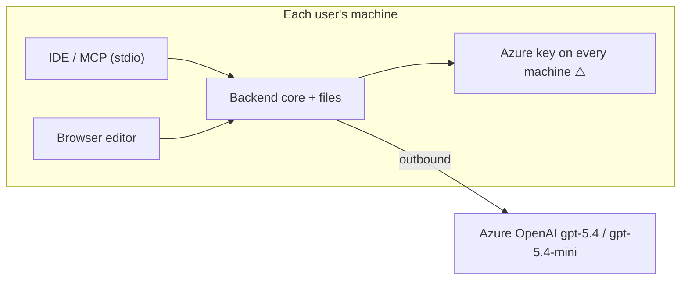
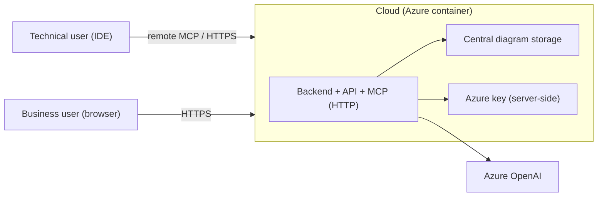
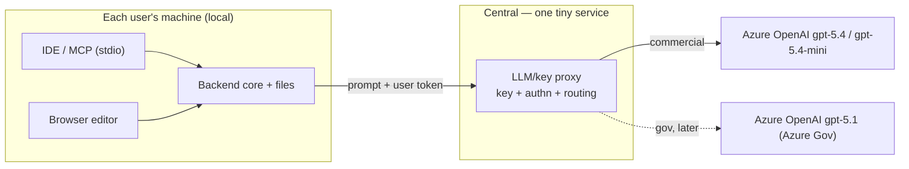
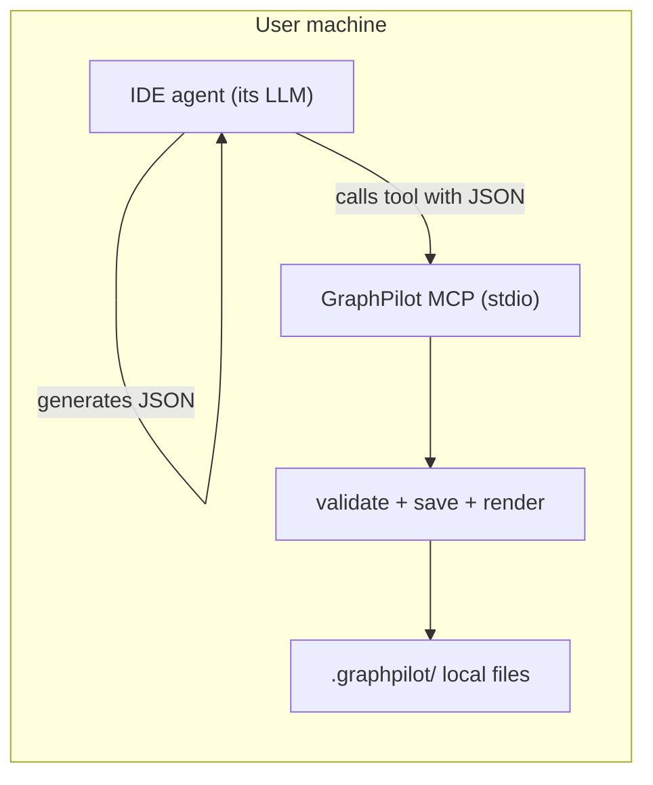

# Deployment and Distribution Options

Reference / decision-support doc for **how GraphPilot might be hosted and distributed**.

> **Everything below about reaching a model is contingent, not current.** GraphPilot calls
> no model: the IDE agent reasons and authors a draft, and the backend materializes it
> deterministically. Every proxy, deployment, region and key-handling option here describes
> what *would* be needed **if** a provider were ever introduced. None of it is provisioned,
> configured, or callable, and no diagram in this document reflects the running system.
>
> That distinction is the point of the document rather than a caveat on it: not calling a
> model is what makes GraphPilot deployable at all — no per-call cost, no rate limit, no
> data leaving the machine, no outage, and no question about which region inference runs in.

Nothing among the hosting options is decided. Live status remains in the
[current-state board](../05-delivery/01-current-state.md).

This is distinct from:
- [`02-system-design.md`](../02-architecture/02-system-design.md) — the local-first system architecture as it is; this doc explores hypothetical hosting deviations.
- [`02-backlog.md`](../05-delivery/02-backlog.md) — the "Local internal distribution" theme is tracked there; this doc is the detailed breakdown behind it.
- [`04-decisions.md`](../05-delivery/04-decisions.md) — once a direction is chosen, record the decision there.

## Context and constraints

These shape every option below:

- **Current architecture is local-first, database-free, and unauthenticated.** The diagram file
  (`.graphpilot/diagrams/<name>.gp.json`) on the user's machine is the source of truth; two thin entry points (MCP for
  the IDE, Django API for the browser editor) share one backend core, and SVG is derived beside the JSON. There is
  **no app database** (the bundled SQLite holds only Django's own internals — sessions/admin — never diagram data) and
  **no authentication** today. Stack: Django 6 + DRF backend, React 19 + Vite 8 frontend.
- **GraphPilot calls no model, so there is nothing to deploy a provider for.** The IDE
  agent does the reasoning and authors a draft; the backend materializes it
  deterministically. There is no endpoint, no key, no deployment, and `openai` is not a
  dependency — which removes most of what usually makes a deployment decision hard: no
  per-call cost, no rate limit, no data leaving the machine, no provider outage, and no
  region or compliance question about where inference happens.

  This section previously described an Azure-backed runtime with one chat deployment, an
  evaluation embedding deployment, and a live/dry-run evaluation gate. **None of it
  exists.** The only inference in the picture is the host's own, which the user is already
  paying for and already trusts with the repository.
- **Keys are assumed org-level (shared)**, so a shared key must **not** be shipped to every machine.
- **GovCloud is a later phase.** Commercial first; GovCloud = **Azure Government**, a separate cloud (`.azure.us`) with its own resource/key/tenant.
- **Two audiences:** technical users (IDE + MCP, diagrams next to code) and non-technical business users (browser editor, no IDE).
- **What exists today vs. not:** the MCP server (FastMCP) and the Django API + React app run **locally, per machine** — the MCP server is a local **stdio** subprocess, not a hosted service. **No hosted, containerized, or proxy deployment exists yet**; every cloud/central option below is prospective, not in flight.
- **Layout packaging is PyGraphviz-only.** The runtime pins `pygraphviz==2.0` and supports Windows x64, macOS x64/ARM64,
  and Linux x64/AArch64 wheels; Windows ARM64 V1 uses the packaged x64 runtime under emulation. A distribution must not
  add an external executable path, alternate algorithm, source-build recovery, or runtime layout selector.

### The two hard truths everything hinges on

1. **A hosted server cannot reach a user's local machine.** Connections only go **local → cloud (outbound)**. A cloud/on-prem server cannot call `localhost:8000` or write local `.graphpilot/` files on a user's laptop. Whatever needs local file access must either run locally or be driven by the local side initiating the call.
2. **The MCP server and the Django API are two doors into the same backend.** Hosting "the MCP server in the cloud" effectively means hosting the backend in the cloud — which then pulls storage and the browser API toward the cloud too, unless deliberately kept split.

### The dimensions each option is really choosing

| Dimension | Choices |
|---|---|
| Where the **app/backend** runs | local per machine vs central (cloud/on-prem) |
| Where the **LLM call** originates | GraphPilot (key needed) vs the **IDE agent** (no GraphPilot key) |
| Where the **org key** lives | every machine (unsafe) vs central service vs not needed |
| Where **diagrams** are stored | local `.graphpilot/` files vs central storage |
| How the **IDE connects to MCP** | stdio (local subprocess) vs Streamable HTTP (remote URL) |

The four options below are coherent combinations of these. Note they can be **mixed** (e.g. agent-routed LLM on top of an all-local deployment).

> **Option D + Option A is what shipped.** These four options were written while GraphPilot
> held an Azure key, and the "where does the LLM call originate" row above is the dimension
> the product resolved: the host authors the draft, GraphPilot materializes it, and there is
> no key anywhere. **A, B and C are kept because their *other* dimensions — where the app
> runs, where diagrams are stored, how the IDE connects — are still genuinely open**, and
> because the browser-only user still has no answer. Read their key and proxy paragraphs as
> the record of a decision already taken, not as live choices.

---

## Option A — All local

Everything (Django backend, React frontend, MCP server) runs on each user's machine. **This is the shipped app topology**; the key and provider arrow below are the abandoned part, kept so the option reads as it was assessed.

- **Backend/app:** local. **Diagrams:** local files (current model, unchanged).
- **MCP transport:** stdio (per machine).
- **LLM/key:** GraphPilot calls Azure directly — needs the key on each machine.
- **Pros:** no infra to operate; data stays local; matches today's design and the existing local MCP model.
- **Cons:** **shared org key on every machine** (leak risk, no per-user revocation or attribution); updates must reach every machine; GovCloud routing configured per-machine (fragile).
- **Viable only if** keys are per-user, or if combined with Option D so GraphPilot doesn't hold a key at all.
- **Effort:** low (packaging/launcher) — but the key problem is disqualifying with shared keys on its own.

## Option B — All cloud (central deployment)

The backend + frontend (and likely the MCP server as a containerized Streamable HTTP server) are deployed centrally; users connect to a URL. Diagrams move to central storage. Key lives server-side.

- **Backend/app:** central. **Diagrams:** central storage (not local files).
- **MCP transport:** Streamable HTTP; IDEs that support **remote MCP servers** can point at one URL.
- **LLM/key:** clean — one server-side secret, rotatable, per-user attribution (can use **managed identity** instead of a stored key).
- **Pros:** zero install for everyone (esp. business users); one update point; secure centralized key; one place to enforce policy/quota.
- **Cons:**
  - **Breaks the local file + "diagrams next to code" model.** A cloud server cannot write to a user's local workspace (hard truth #1), so the IDE/file flow must change (central storage, or return content for the client to write).
  - You **operate a real service**, and a **second full deployment** for GovCloud.
  - Diagram data leaves the machine (compliance surface).
  - Depends on each IDE supporting remote MCP + auth (OAuth/Entra).
- **Effort:** high (hosting, auth, storage rethink) ×2 for gov.

## Option C — Local app + thin central LLM/key proxy

Keep the whole app **local** (files + MCP unchanged). Deploy **only a small, stateless proxy** that holds Azure
credentials, authenticates the user, enforces the configured deployment mapping, and forwards approved strict chat and
explicit evaluation-embedding operations. The local app sends a **user token, never the Azure key**. Normal local tests
and evaluator dry runs do not contact the proxy.

- **Backend/app:** local. **Diagrams:** local files (current model, unchanged).
- **MCP transport:** stdio. **What you deploy:** one stateless proxy (per env).
- **LLM/key:** centralized in the proxy — same security as Option B without moving the app or storage. Can use a stored key now, **managed identity** later.
- **Pros:** keeps everything good about local (files + MCP + data on machine) while fixing the only real blocker (the shared key); minimal infra (a single endpoint); clean GovCloud story (a second tiny proxy routing to `gpt-5.1`).
- **Cons:** you operate **one small service per environment**; need a user→proxy auth mechanism (per-user token or Entra ID/SSO).
- **Growth:** because entry points are thin over shared services, a hosted browser-only mode (an Option-B-style add-on) can be added later for users who can't install anything — without abandoning the local model.
- **Effort:** medium; far less than Option B; no storage rethink.

### What exactly gets deployed in Option C

- One stateless HTTP service with a small bounded surface for strict chat and, when evaluation is authorized, embeddings.
- Holds Azure credentials (secret store or **managed identity** preferred).
- Validates a **user token** (or Entra ID/SSO), operation allowlist, payload bounds, and evaluation authorization.
- Maps all chat roles to one configured chat deployment and evaluation alignment to one explicit embedding deployment;
  callers do not select arbitrary deployments per role.
- Hosting: Azure Function / Container App / App Service; internal-only network.
- **Not deployed:** Django backend, React frontend, MCP server, diagram storage — all stay local.
- GovCloud: a **second identical proxy** inside Azure Government routing to `gpt-5.1`.

## Option D — Route the LLM through the IDE agent

**This is the shipped architecture.** GraphPilot calls no LLM. The **IDE agent produces the diagram draft**, and GraphPilot's tools provide structure (schema, type vocabulary, validation) and persistence (create / read / update / render). `diagram_update` (FR-9, Epic 4) is built, so the read-edit-write loop this option described is the one the product runs.

Two mechanisms:
- **D1 — Agent-orchestrated: shipped.** The agent authors a `graphpilot.draft.v1` document in
  its normal loop and calls `diagram_create` or `diagram_update`, which validate, materialize,
  persist and render. Ordinary MCP calls, so it is client-portable.
- **D2 — MCP sampling:** GraphPilot requests the client to run a completion via MCP
  `sampling/createMessage`. Spec-supported, **client support is still spotty**, and GraphPilot
  does not implement it — D1 removed the need.

- **Backend/app:** local. **Diagrams:** local files. **MCP transport:** stdio.
- **LLM/key:** **none in GraphPilot** for the IDE flow — it uses the agent's existing model (the user's Azure Foundry/Copilot/etc.).
- **Pros:** removes the key/proxy/cloud-LLM problem entirely for IDE users; keeps files local and MCP local; nothing extra to deploy.
- **Cons / caveats:**
  - **Quality depends on the agent's LLM.** Output quality and schema adherence vary with whatever model the user's IDE is running; GraphPilot only controls structure via schema + validation, not the model.
  - **Only covers IDE/agent users.** Browser-only / non-technical users have no agent and no model, so they still need a GraphPilot-side LLM path (Option C or B).
  - D2 (sampling) depends on client support.
- **Effort:** none remaining — delivered.

---

## Comparison

| | A: All local | B: All cloud | C: Local + proxy | D: Agent-routed |
|---|---|---|---|---|
| Install for users | per machine | none (URL) | per machine | per machine |
| Keeps local files + MCP | ✅ | ❌ | ✅ | ✅ |
| Org key handled safely | ❌ | ✅ | ✅ | ✅ (no key) |
| Data stays local | ✅ | ❌ | ✅ | ✅ |
| Non-technical / no-IDE fit | weak | ✅ best | good | ❌ (IDE only) |
| Infra you operate | none | full app ×2 | tiny proxy ×2 | none |
| GovCloud story | per-machine (fragile) | 2 full deploys | 2 tiny proxies | n/a (uses agent) |
| LLM quality control | GraphPilot | GraphPilot | GraphPilot | depends on agent |
| Effort | low* | high | medium | low–medium |

\* Option A's low effort is misleading: shared-key-on-every-machine is a disqualifying security problem unless combined with Option D.

## How the options combine

- **D + A** is a strong pair for **IDE users**: fully local, no key anywhere, no infra — GraphPilot supplies structure, the agent supplies intelligence.
- **C** then covers **browser-only users** who have no agent, by giving GraphPilot its own (centralized, safe) Azure path.
- **B** is the fallback only if zero-install browser access becomes a hard requirement and central storage is acceptable.

## Release gates common to every option

Both suites green (`manage.py test`, `npm run verify`) and the review gallery looked at —
see [`04-reviewing-diagrams.md`](04-reviewing-diagrams.md).

*(This section described a generation-certification regime: a matcher, an LLM judge, a
report analyst, per-cell thresholds, and a sealed 48-case set run three times in reviewed
mode. All of it measured a model GraphPilot no longer calls, and all of it went with the
provider pipeline.)*

## Suggested direction (for discussion, not decided)

1. **IDE / technical users → Option D (agent-orchestrated, D1)** on a **local stdio MCP server (Option A app)**: no key, no proxy, files stay local. Validate that the agents in use produce good-enough JSON (the D quality caveat).
2. **Browser / non-technical users → Option C**: a thin central Azure proxy holds the key for the in-UI generate flow. Commercial first.
3. **GovCloud → later phase**: a second proxy in Azure Government routing to `gpt-5.1`.
4. **Option B** stays a deliberate fallback if a fully hosted, zero-install experience is later required.

## Open questions to resolve before choosing

1. **Agent quality:** are the IDE agents in use good enough to generate schema-valid diagrams reliably (Option D)? Needs evaluation.
2. **Auth to the proxy:** per-user token vs Entra ID / SSO vs Azure managed identity? Does the org grant users RBAC on the Azure OpenAI resource?
3. **What data may transit to the LLM** (prompt only vs diagram contents), especially for GovCloud — a compliance call.
4. **Browser-only requirement:** is zero-install browser access a must (pushing toward B), or is "install the local app" acceptable for business users?
5. **Diagram storage if anything goes cloud:** central storage vs return-to-client writes — only relevant if Option B is pursued.

## References

- `docs/02-architecture/02-system-design.md` — final intended system architecture
- `docs/02-architecture/01-mcp-tools/` — MCP tool and host-workflow contracts, including `diagram_update`
- `docs/01-product/03-requirements.md` — FR-9 (client LLM builds updated JSON), FR-10 (patch ops deferred)
- `docs/04-development/01-environment.md` — current local setup and the layout boundary
- [`04-reviewing-diagrams.md`](04-reviewing-diagrams.md) — how diagram quality is judged now that no model is called
- `02-backlog.md` — "Local internal distribution" theme
