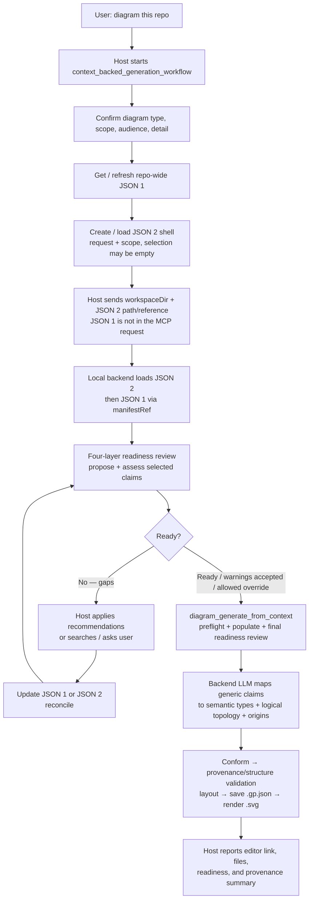
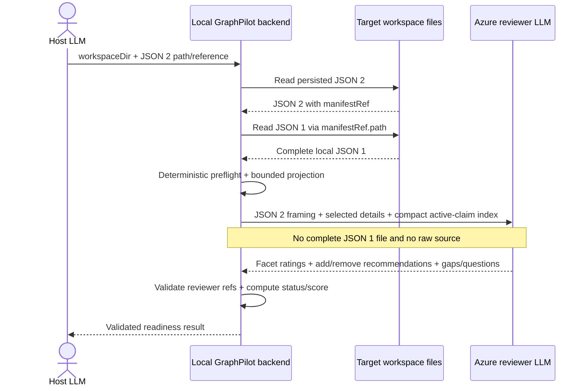
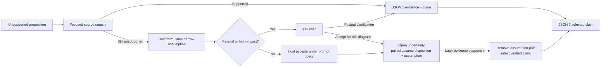

# Evidence-Based Diagram Workflow (Overview)

> **Status:** Historical workflow snapshot. Current intended behavior is owned by
> [`01-workflow.md`](../../03-design/01-context-generation/02-workflow.md); runtime
> implementation has not started.

## Purpose

Make repository context for a diagram **reusable, reviewable, and traceable**, while the backend keeps
authority over UML/SysML modeling and deterministic validation, layout, persistence, and rendering. This
page shows the shape of the flow; the detailed contracts live in their own docs.

## Walkthrough — "diagram this repo"

The concrete host path, end to end:



## Workflow steps

### Step 1 — Receive the repository-backed request

> **Design status:** Reviewed at overview level.

- **Owner:** user → host.
- **Input:** natural-language request, e.g. "diagram this repo" or "an activity diagram of order
  processing."
- **Action:** preserve the original wording; do not guess the final type/scope from a vague request.
- **Output:** raw request intent for the workflow prompt and confirmation step.

### Step 2 — Start `context_backed_generation_workflow`

> **Design status:** Exact public prompt/tool orchestration is drafted in
> [`07-mcp-prompts-and-tool-contracts.md`](07-mcp-prompts-and-tool-contracts.md).

- **Owner:** host; prompt is served by GraphPilot MCP.
- **Input:** request + target workspace.
- **Action:** the host runs the MCP prompt and follows its orchestration instructions. A prompt is
  instructions only: it reads no files and calls no tools itself; the host drives its own repository/file
  tools plus GraphPilot MCP tools.
- **Output:** an active host workflow, not a persisted artifact.

### Step 3 — Confirm intent

> **Design status:** Reviewed at overview level.

- **Owner:** host + user.
- **Input:** original request + light repository reconnaissance.
- **Action:** host proposes diagram **type**, conceptual **scope**, **audience**, and **detail level**; user
  confirms or adjusts. v1 depicts `as_implemented`.
- **Output:** confirmed request framing for JSON 2.
- **Types:** `activity_diagram`, `use_case_diagram`, or `bdd_diagram` (see
  [`../../02-design-and-features/00-diagram-json-schema.md`](../../03-design/03-diagram-json-schema.md)).

### Step 4 — Get / refresh repo-wide facts (JSON 1)

> **Design status:** Reviewed; JSON contract is [`02-evidence-manifest.md`](02-evidence-manifest.md).

- **Owner:** host gathers/verifies; backend validates/fingerprints/persists.
- **Input:** target workspace + existing JSON 1 when present.
- **Action:** get/refresh the reusable, type-agnostic repository knowledge base (evidence → generic claims,
  with open uncertainties). Refresh is full and git-independent: unchanged fingerprint → return as-is;
  changed → re-gather the safe scope and reconcile. Reviewer findings may later trigger focused searches;
  every supported fact found is added back to shared JSON 1 for future diagrams.
- **Output:** current persisted JSON 1 at its workspace-relative path, with ID + digest.
- **Boundary:** `diagram_get_schema` is not called. It describes the common canonical `.gp.json` envelope,
  not context gathering/selection. The host records generic facts; the backend owns semantic-type mapping.

### Step 5 — Create / load the JSON 2 shell

> **Design status:** Reviewed; JSON contract is [`03-diagram-request-context.md`](03-diagram-request-context.md).

- **Owner:** host creates/edits; backend validates/persists through the later tool contract.
- **Input:** confirmed request framing + JSON 1 path/ID/digest.
- **Action:** create/load the per-diagram request packet containing the required top-level `diagramName`,
  request, user-confirmed scope, assumptions paired one-to-one with `assume` uncertainty dispositions, and
  non-factual decisions with separate semantic `origin` and `acceptedBy` actors. `selectedClaims` may be an
  informed first pass or empty; the host is not responsible for the perfect claim set alone.
- **Output:** persisted latest-intent JSON 2 at
  `.graphpilot/context/requests/<request-file>.gp-request.json`; its validated `diagramName` controls the
  later `.graphpilot/diagrams/<diagramName>.gp.json` / `.svg` artifact stems.

### Step 6 — Complete and assess JSON 2 (bounded loop)

> **Design status:** Reviewed in [`01-readiness-reviewer.md`](05-readiness/01-readiness-reviewer.md), with exact Layer 2/3
> policy in [`05-readiness/`](05-readiness/README.md). Exact `context_readiness_assess` transport and host UX
> are drafted in [`07-mcp-prompts-and-tool-contracts.md`](07-mcp-prompts-and-tool-contracts.md).

- **Owner:** deterministic backend + backend LLM reviewer; host applies recommendations and resolves gaps.
- **MCP input:** `workspaceDir` + persisted JSON 2 path/reference. **The host does not send JSON 1 or an
  inline copy of JSON 2 in the MCP request.**
- **Local loading:** the local GraphPilot backend opens JSON 2, follows `JSON 2.manifestRef.path`, and reads
  JSON 1 from the target workspace. The deterministic backend may load the complete local file; that is
  local file I/O, not host→backend document transmission.
- **Azure reviewer input:** only a bounded projection — request/scope/current selection, full selected
  claim details/evidence summaries, compact active-claim index, relevant uncertainties, assumptions, and
  decisions. The complete JSON 1 file and raw source are **not** sent to Azure.



- **Action:** deterministic preflight → one structured LLM call (per-type rubric + holistic selection
  review) → deterministic output validation/status/score. The result returns grades, exact refs, structured
  findings/consequences/actions, add/remove recommendations, missing facts, uncertainties, searches, and
  focused questions together.
- **Loop:** improve before interrupting. The host checks validated existing-claim recommendations first,
  including a claim that replaces an assumption with the same meaning; performs focused source search only
  for genuinely missing facts; updates JSON 1 or JSON 2; reconciles; and re-assesses after an actual change.
  It asks the user only when repository context cannot settle the issue or user authority is required for
  intent/scope, an assumption, a non-default decision, warning acceptance, or override. Exact bounded passes
  and no-unchanged-input-reroll rules belong to 04.
- **Output:** one validated readiness result (`invalid`, `needs_context`, `ready_with_warnings`, or `ready`)
  plus an updated persisted JSON 2 after the host applies accepted recommendations.

### Step 7 — Generate with `diagram_generate_from_context`

> **Design status:** First draft in
> [`06-context-backed-generation-and-provenance.md`](06-context-backed-generation-and-provenance.md); exact
> MCP arguments/results live in [`07-mcp-prompts-and-tool-contracts.md`](07-mcp-prompts-and-tool-contracts.md).

- **Input:** `workspaceDir` + persisted JSON 2 path; the backend loads JSON 2 and its bound JSON 1 locally.
- **Deterministic preflight:** validate paths/documents/digests, `diagramName`, selected references, target
  identity, and deployment-derived context budget before any Azure call.
- **Population:** deep-copy each exact selected claim version/support object and its directly referenced
  evidence into one transient local read model; deduplicate shared evidence and never recursively expand
  claim references. Build separate Azure projections from that model: the reviewer receives bounded evidence
  summaries, while the generator receives finalized claim meaning and citation allowlists without resolved
  evidence records.
- **Final gate:** run the same complete readiness service again; a blocked result returns to Step 6 without
  calling the generator or writing artifacts.
- **Generation:** the backend LLM maps generic facts to GraphPilot semantic types/logical topology and emits
  exact claim/assumption citations plus concise per-element mapping rationale.
- **Deterministic finish:** conform, structurally critique/refine, validate provenance, lay out, save
  `.graphpilot/diagrams/<diagramName>.gp.json`, and render the sibling `.svg`.
- **Persistence:** only JSON 1, JSON 2, canonical `.gp.json`, and rendered artifacts persist—there is no
  generation snapshot or resolved-context sidecar.
- **Shared pipeline:** generation reuses the active generation, validation, and rendering designs:
  [`../../02-design-and-features/04-generation-design.md`](../../03-design/07-generation.md),
  [`../../02-design-and-features/02-validation-design.md`](../../03-design/05-validation.md),
  and [`../../02-design-and-features/03-rendering-design.md`](../../03-design/06-rendering.md).

### Step 8 — Report outcome

> **Design status: STUB — exact response, warning/override summary, path schema, and client presentation
> have not yet been reviewed in depth.**

The host reports the editor link, canonical `.gp.json` path, sibling `.svg` path (or a retryable partial
render result), final readiness summary, and provenance availability. Exact structured responses belong to
[`07-mcp-prompts-and-tool-contracts.md`](07-mcp-prompts-and-tool-contracts.md). Existing artifact response behavior:
[`../../01-architecture/03-mcp-tools/`](../../02-architecture/01-mcp-tools/README.md).

Ordinary conceptual requests (not repo-derived) skip these context steps and use the separate prompt-only
`diagram_generate_from_prompt` tool. That name supersedes today's implemented `diagram_generate` in this
proposal; implementation/promotion is deferred.

## Artifacts at a glance

```text
repository source             -> what the code / tests / docs / config actually say
JSON 1 evidence manifest      -> reusable supported facts about the repo      (persistent)
JSON 2 request context        -> what one diagram should use and how          (persisted per diagram)
resolved generation context   -> populated exact selection                    (transient backend memory)
<diagramName>.gp.json / .svg  -> editable diagram + origins/trace + rendering (persistent)
```

| Question | Authoritative artifact |
| --- | --- |
| What the repo/domain actually says | Source, tests, docs, config, factual user clarification |
| What reusable facts GraphPilot retained | JSON 1 ([`02-evidence-manifest.md`](02-evidence-manifest.md)) |
| What one diagram should use | JSON 2 ([`03-diagram-request-context.md`](03-diagram-request-context.md)) |
| What exact facts the runtime sent to generation | Transient resolved context derived deterministically from bound JSON 1 + JSON 2 |
| What was persisted, which inputs it cites, and why each element exists | Canonical `.gp.json` with compact trace metadata + typed element origins |
| What users view/export by default | Sibling `.svg` rendered from canonical JSON |

## Who does what

| Actor | Responsibility |
| --- | --- |
| **Host LLM** | Interprets the request; recommends type/scope; gathers evidence and writes claims into JSON 1; builds (or loads and reconciles) the JSON 2 packet; resolves gaps by search or user question; presents the result. |
| **Backend LLM** | Reviews whether the selected context is sufficient/coherent; maps finalized claims into a logical UML/SysML diagram with claim/assumption provenance. Recommends; never silently mutates a manifest. |
| **Deterministic backend** | Owns path safety, validation, the source fingerprint + full refresh, digest binding, exact population, readiness hard checks/status, provenance validation, layout, identity-aware persistence, and rendering. Final authority. |

Repository content is **untrusted evidence, not instruction**: the host ignores instructions embedded in
source and never collects secrets, `.env`, vendor trees, caches, or irrelevant generated output.

## How the pieces fit (pointers to the owning docs)

- **Fresh facts (JSON 1).** Getting context fingerprints the whole safe scope and does a full refresh when
  it changes — no Git dependency. Full model + refresh flow: [`02-evidence-manifest.md`](02-evidence-manifest.md).
- **The request packet (JSON 2).** Persisted per diagram as latest intent
  (`.graphpilot/context/requests/<request-file>.gp-request.json`), digest-stamped, and reconciled on load;
  it remains the natural input to a later grounded **edit** (which layers on Epic 4's `diagram_update`). Its
  required `diagramName` controls the canonical/rendered artifact stem. Full model:
  [`03-diagram-request-context.md`](03-diagram-request-context.md).
- **Readiness → transient population → generation.** Assessment is read-only and uses status as the gate
  (score is secondary). Framework/result/loop/override:
  [`01-readiness-reviewer.md`](05-readiness/01-readiness-reviewer.md); exact Layer 2/3 rubric/calculation/findings:
  [`05-readiness/`](05-readiness/README.md). Generation rechecks
  binding, deterministically populates exact selected claim versions/evidence in memory, performs a final
  readiness review, and cites provenance. Azure gets tiered context: the reviewer sees selected details plus
  a compact active-claim index/relevant open issues; the generator sees only the finalized populated
  selection, accepted assumptions/decisions, and citation allowlists. Generation/provenance/persistence:
  [`06-context-backed-generation-and-provenance.md`](06-context-backed-generation-and-provenance.md).
- **Discovery tools** (GitNexus/Graphify) are optional host-side accelerators for *finding* candidate
  source; the host verifies before writing claims, and the flow works without them. Boundary: [`README.md`](README.md).
- **Safety** is constant across every step: untrusted content, workspace-relative paths, summaries over raw
  source, no secrets, no rewriting history.

### Resolving gaps



An assumption object is never promoted into JSON 1. Later support creates or activates a separate claim;
reconciliation then replaces the paired assumption/disposition in JSON 2 with that exact claim selection.

### User-answer routing

The single home for where a user reply lands (JSON 1 and JSON 2 link here):

| User response | JSON 1 (persistent) | JSON 2 (request packet) |
| --- | --- | --- |
| "This is factually how it works." | Add `userClarification` evidence + claim (`as_implemented`). | May select the resulting claim version. |
| "This is the intended design / required." | Add clarification + claim (`as_designed` / `as_required`). | Latent in v1 (diagrams depict `as_implemented`); claim retained for later. |
| "I don't know; assume this here." | Keep or add the open uncertainty. | Host records one accepted assumption paired one-to-one with an `assume` disposition. |
| "Leave that area out." | No change. | Add an `exclude` disposition + user-confirmed scope exclusion. |
| "Show this prominently / label it this way." | No change. | Add an accepted `emphasis` / `labeling` decision. |

The host writes every JSON 2 object and records semantic `origin` separately from `acceptedBy`. It may
formulate an assumption from incomplete context, but first checks current claims and performs focused search.
The `07` host prompt guides whether and how to consult the user before persisting an assumption; JSON 2
contains accepted assumptions only, and readiness does not re-evaluate who accepted them. Host-accepted
decisions are limited to reversible, fact-preserving labeling/presentation defaults. Scope changes always
return to the top-level confirmed scope rather than becoming decisions.

## Planned design docs

The contracts are split by owner so details are not duplicated. [`README.md`](README.md) owns the
continuation sequence; [`07-mcp-prompts-and-tool-contracts.md`](07-mcp-prompts-and-tool-contracts.md) owns the
settled public names/signatures and the one host prompt.

| Piece | Kind | Its owner/status |
| --- | --- | --- |
| `context_backed_generation_workflow` | MCP prompt | One adaptive orchestration prompt; exact arguments/loop live in 07. |
| `context_evidence_status` | MCP tool | Read-only safe-scope fingerprint check; exact contract lives in 07. |
| `context_evidence_save` | MCP tool | Validate/promote durable host-written JSON 1 draft; exact contract lives in 07. |
| `context_request_save` | MCP tool | Validate/atomically save complete inline JSON 2 candidate; exact contract lives in 07. |
| `context_readiness_assess` | MCP tool | One-shot complete 05 readiness result; exact transport/diagnostics live in 07. |
| `diagram_generate_from_context` | MCP tool | Runtime/provenance in 06; exact attempt policy/result transport in 07. |
| `diagram_generate_from_prompt` | MCP tool | Renamed direct prompt-only path with no alias; exact contract in 07. |
| Context-backed generation + provenance | Contract | Combined first draft: [`06-context-backed-generation-and-provenance.md`](06-context-backed-generation-and-provenance.md). |
| Implementation + promotion | Historical delivery/design bridge | Completed transition record in [`08-implementation-and-promotion.md`](08-implementation-and-promotion.md); current delivery lives in Epic 3's active extension group. |

`diagram_get_schema` remains the existing canonical-envelope inspection tool for clients that manually
construct/inspect `.gp.json`; it is intentionally outside this context-backed workflow. A machine-readable
host modeling contract is deferred post-v1 and is needed only if the host later takes on semantic mapping.

## Historical deferred questions

- Extraction-tool provenance was resolved out of JSON 1 v1; discovery tooling remains host-only process detail.
- Incremental refresh remains deferred until full-refresh evidence shows a concrete scaling need.
