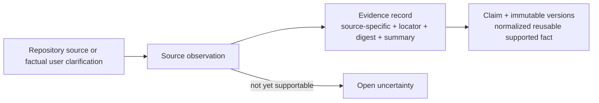

# JSON 1 — Evidence Manifest

> **Status:** Historical JSON 1 design baseline. Current intended behavior is owned by
> [`02-evidence-manifest.md`](../../03-design/01-context-generation/03-evidence-manifest.md).
> Runtime JSON Schema/validation is not implemented; exact per-claim payloads and bounds are assigned to Epic 3
> group-local slice `03`.

> **Scope of this doc.** This is the JSON 1 **structure** reference: sections, fields, enums, and
> validation rules. The end-to-end workflow, artifact lifecycle, full-refresh flow, uncertainty
> resolution, and user-answer routing live in the overall flow doc,
> [`01-workflows-and-prompts.md`](01-workflows-and-prompts.md).

## Purpose

The evidence manifest is the reusable, versioned, **repo-wide and diagram-type-independent** knowledge
base: what supported facts we know, where they came from, which version is current, and what remains
unresolved. It does **not** describe one requested diagram — that is JSON 2
([`03-diagram-request-context.md`](03-diagram-request-context.md)). The host records rich generic facts;
the backend LLM later maps the finalized JSON 2 selection to GraphPilot semantic types.

Suggested path:

```text
<workspace>/.graphpilot/context/evidence/repository.gp-evidence.json
```

Mental model:



- **Evidence** is source-specific: a code call, test assertion, document statement, configuration
  binding, or factual user clarification.
- **Claim** is the normalized reusable fact supported by one or more evidence records, directly or by
  inference.
- **Assumption** is not a claim; a diagram-only "assume this" goes in JSON 2.

The manifest is git-independent: it is fingerprinted over the whole safe scope and fully refreshed when
that fingerprint changes (see the refresh flow in [`01-workflows-and-prompts.md`](01-workflows-and-prompts.md)).
Discovery tools (e.g. Graphify) are optional host-side accelerators; JSON 1 never stores a discovery
graph, graph-native IDs/scores, or a requirement that any such tool be installed.

## Simple complete example

This compact example shows how all evidence-manifest sections fit together. Later sections explain each
field, category, enum, and update rule in detail.

```json
{
  "schemaVersion": "graphpilot.evidence.v1",
  "kind": "evidenceManifest",
  "id": "evidence-order-service",
  "source": {
    "kind": "repository",
    "displayName": "Order Service",
    "root": ".",
    "snapshot": {
      "digest": "sha256:example-source-digest",
      "fileCount": 84,
      "capturedAt": "2026-07-13T14:20:00Z"
    }
  },
  "scope": {
    "baseline": "boundedArchitecture",
    "includedPaths": ["."],
    "excludedPaths": [".git/**", ".graphpilot/**", "**/.env*", "**/node_modules/**", "**/dist/**"],
    "includedConcerns": [
      "systemPurpose",
      "systemBoundaries",
      "publicEntryPoints",
      "topLevelComponents",
      "externalSystems",
      "publicCapabilities",
      "importantInterfaces",
      "majorWorkflows",
      "importantConstraints"
    ],
    "stoppingReason": "The bounded architecture baseline is covered."
  },
  "evidence": [
    {
      "id": "evidence-order-validation-abc123",
      "kind": "code",
      "locator": {
        "path": "src/orders/order_handler.py",
        "symbol": "OrderHandler.submit",
        "lineRange": {
          "start": 42,
          "end": 61
        }
      },
      "contentDigest": "sha256:example-evidence-digest",
      "summary": "OrderHandler.submit validates an order before saving it.",
      "capturedInSourceDigest": "sha256:example-source-digest",
      "status": "current",
      "capturedAt": "2026-07-13T14:24:00Z"
    }
  ],
  "claims": [
    {
      "id": "claim-validate-before-save",
      "kind": "behaviorStep",
      "currentVersion": 1,
      "status": "active",
      "versions": [
        {
          "version": 1,
          "statement": "The system validates a submitted order before saving it.",
          "appliesToViewpoints": ["as_implemented"],
          "payload": {
            "actor": "OrderHandler",
            "action": "validate submitted order",
            "precedes": "save order"
          },
          "support": {
            "basis": "repositoryEvidence",
            "derivation": "direct",
            "evidenceRefs": ["evidence-order-validation-abc123"]
          },
          "createdAt": "2026-07-13T14:27:00Z"
        }
      ]
    }
  ],
  "uncertainties": [
    {
      "id": "uncertainty-validation-failure",
      "kind": "missing_information",
      "statement": "The repository evidence does not establish what happens after validation fails.",
      "relatedEvidenceRefs": ["evidence-order-validation-abc123"],
      "relatedClaimRefs": [
        {
          "id": "claim-validate-before-save",
          "version": 1
        }
      ],
      "suggestedSearches": [
        "invalid-order tests",
        "OrderHandler validation error handling"
      ],
      "createdAt": "2026-07-13T14:28:00Z"
    }
  ],
  "revision": 1,
  "digest": "sha256:example-manifest-digest",
  "createdAt": "2026-07-13T14:20:00Z",
  "updatedAt": "2026-07-13T14:28:00Z"
}
```

## Complete section map

```json
{
  "schemaVersion": "graphpilot.evidence.v1",
  "kind": "evidenceManifest",
  "id": "evidence-current-repository",
  "source": {},
  "scope": {},
  "evidence": [],
  "claims": [],
  "uncertainties": [],
  "revision": 1,
  "digest": "sha256:...",
  "createdAt": "2026-07-13T14:20:00Z",
  "updatedAt": "2026-07-13T14:20:00Z"
}
```

| Section | Plain-language question it answers |
| --- | --- |
| document envelope | What kind of file is this, and which contract validates it? |
| `source` | Which repository state did the host inspect? |
| `scope` | What did the host inspect, exclude, and stop at? |
| `evidence` | What did specific sources directly show or state? |
| `claims` | What reusable facts are supported by that evidence? |
| `uncertainties` | What important facts could not yet be established? |
| revision metadata | Which exact manifest update is this? |

## 1. Document envelope

```json
{
  "schemaVersion": "graphpilot.evidence.v1",
  "kind": "evidenceManifest",
  "id": "evidence-current-repository"
}
```

| Field | Required | What it is | Why it is saved |
| --- | --- | --- | --- |
| `schemaVersion` | Yes | Constant identifying this manifest format. | Selects validation and supports future migration. |
| `kind` | Yes | Constant identifying this as an evidence manifest. | Lets generic context tools distinguish manifests from requests, transient resolved context, and diagrams. |
| `id` | Yes | Stable manifest identity independent of its path. | Detects moved/replaced files and gives requests/canonical trace metadata a durable reference. |

### Envelope constants

| Field/value | Meaning |
| --- | --- |
| `schemaVersion: graphpilot.evidence.v1` | First GraphPilot evidence-manifest contract. |
| `kind: evidenceManifest` | This JSON is reusable evidence context, not a diagram request, transient resolved request, or canonical diagram. |

## 2. `source` section

### What it is

The source section identifies the complete safe repository scope that the current manifest describes.
It does not depend on Git, a branch, or a clean working tree.

```json
{
  "source": {
    "kind": "repository",
    "displayName": "Example System",
    "root": ".",
    "snapshot": {
      "digest": "sha256:example-source-digest",
      "fileCount": 84,
      "capturedAt": "2026-07-13T14:20:00Z"
    }
  }
}
```

### Source fields

| Field | Required | What it is | Why it is saved |
| --- | --- | --- | --- |
| `source.kind` | Yes | Category of source being described. | Allows future source types while starting with repositories. |
| `source.displayName` | Yes | Human-readable repository/system name. | Makes context packets understandable without resolving the path. |
| `source.root` | Yes | Workspace-relative source root. | Keeps manifests portable and path-safe. |
| `source.snapshot` | Yes | Fingerprint of every eligible file in the effective safe scope. | Detects additions, edits, removals, and renames without relying on version control. |
| `source.snapshot.digest` | Yes | SHA-256 over the canonical sorted list of relative paths and per-file content digests. | Provides one deterministic source-change token. |
| `source.snapshot.fileCount` | Yes | Number of eligible files included in the fingerprint. | Supplies an audit and troubleshooting hint. |
| `source.snapshot.capturedAt` | Yes | UTC time this source digest was accepted after a successful full refresh. | Correlates the manifest with the inspected workspace state. |

### Source enum

#### `source.kind`

| Value | Easy description |
| --- | --- |
| `repository` | The source is the user's current workspace repository. This is the only initial source kind. |

`source.root` is always workspace-relative. The backend or host enumerates `scope.includedPaths`, applies
mandatory and configured exclusions before reading files, hashes each eligible file, sorts by relative
path, and hashes that canonical path/content-digest list. Including paths means additions, removals, and
renames change the digest as well as content edits.

`.git/`, `.graphpilot/`, secrets, credentials, vendor trees, caches, and irrelevant generated output are
always outside the effective source scope. In particular, `.graphpilot/` must be excluded so writing a
manifest, JSON 2 request packet, transient resolved context, diagram, or SVG cannot change the repository fingerprint.
Git metadata may be returned as optional host diagnostics, but it is not part of this contract and never
determines whether JSON 1 is current.

## 3. `scope` section

### What it is

The scope section records the boundary of repository gathering. It explains what the host considered,
what it deliberately ignored, and why it stopped.

```json
{
  "scope": {
    "baseline": "boundedArchitecture",
    "includedPaths": [
      "."
    ],
    "excludedPaths": [
      ".git/**",
      ".graphpilot/**",
      "**/.env*",
      "**/node_modules/**",
      "**/dist/**",
      "**/coverage/**",
      "**/vendor/**"
    ],
    "includedConcerns": [
      "systemPurpose",
      "systemBoundaries",
      "publicEntryPoints",
      "topLevelComponents",
      "externalSystems",
      "publicCapabilities",
      "importantInterfaces",
      "majorWorkflows",
      "importantConstraints"
    ],
    "stoppingReason": "The bounded architecture baseline is covered; private helpers were excluded."
  }
}
```

### Scope fields

| Field | Required | What it is | Why it is saved |
| --- | --- | --- | --- |
| `scope.baseline` | Yes | Gathering strategy used for the reusable baseline. | Prevents "gather the repository" from becoming an unbounded crawl. |
| `scope.includedPaths` | Yes | Workspace-relative roots included in source fingerprinting and bounded gathering. | Makes the full refresh boundary explicit. |
| `scope.excludedPaths` | Yes | Effective path patterns excluded before fingerprinting or gathering. | Makes mandatory safety/privacy/noise exclusions visible. |
| `scope.includedConcerns` | Yes | Architecture questions the host attempted to answer. | Makes baseline coverage explicit and machine-checkable. |
| `scope.stoppingReason` | Yes | Human-readable explanation of why gathering stopped. | Distinguishes a completed bounded baseline from an abandoned scan. |

### Baseline enum

#### `scope.baseline`

| Value | Easy description |
| --- | --- |
| `boundedArchitecture` | Gather enough reusable context to understand the system's purpose, boundaries, major parts, public capabilities, external dependencies, and important flows—without cataloguing every file, class, or helper. |

### Baseline-concern enum

#### `scope.includedConcerns[]`

| Value | Easy question the host must answer |
| --- | --- |
| `systemPurpose` | What problem does this system solve? |
| `systemBoundaries` | What is inside the system, and what is external? |
| `publicEntryPoints` | How do users or other systems enter/call it? |
| `topLevelComponents` | Which major services/modules/components carry the architecture? |
| `externalSystems` | Which outside services, actors, stores, or devices does it depend on? |
| `publicCapabilities` | What useful outcomes can the system provide? |
| `importantInterfaces` | Which APIs, messages, schemas, or contracts connect important parts? |
| `majorWorkflows` | Which important end-to-end behaviors cross the system? |
| `importantConstraints` | Which rules or limits materially shape the system? |

These concern IDs describe the reusable, type-agnostic baseline. Diagram-specific request scope and claim
selection belong in JSON 2; per-type coverage judgments/results belong to the readiness reviewer
([`01-readiness-reviewer.md`](05-readiness/01-readiness-reviewer.md)).

> **Refresh invariant.** A changed safe-scope source digest requires a successful full bounded refresh
> before JSON 1 is returned as current; an unchanged digest returns the manifest as-is. The step-by-step
> refresh flow lives in [`01-workflows-and-prompts.md`](01-workflows-and-prompts.md).

## 4. `evidence` section

### What it is

Evidence records preserve source-specific observations. They answer "what did this particular source
show or state?" They do not contain the final architectural conclusion.

```json
{
  "evidence": [
    {
      "id": "evidence-service-a-call-abc123",
      "kind": "code",
      "locator": {
        "path": "src/service_a.py",
        "symbol": "ServiceA.process",
        "lineRange": {
          "start": 20,
          "end": 35
        }
      },
      "contentDigest": "sha256:...",
      "summary": "ServiceA.process invokes client_b.execute().",
      "capturedInSourceDigest": "sha256:example-source-digest",
      "status": "current",
      "capturedAt": "2026-07-13T14:25:00Z"
    }
  ]
}
```

Evidence has two record shapes:

1. repository evidence (`code`, `test`, `documentation`, `configuration`);
2. factual `userClarification` evidence.

### 4.1 Repository evidence record

```json
{
  "id": "evidence-service-a-call-abc123",
  "kind": "code",
  "locator": {
    "path": "src/service_a.py",
    "symbol": "ServiceA.process",
    "lineRange": {
      "start": 20,
      "end": 35
    }
  },
  "contentDigest": "sha256:...",
  "summary": "ServiceA.process invokes client_b.execute().",
  "capturedInSourceDigest": "sha256:example-source-digest",
  "status": "current",
  "capturedAt": "2026-07-13T14:25:00Z"
}
```

| Field | Required | What it is | Why it is saved |
| --- | --- | --- | --- |
| `id` | Yes | Stable evidence-record identity. | Gives claim versions an exact support reference. |
| `kind` | Yes | Type of repository source. | Communicates what sort of authority/observation this is. |
| `locator` | Yes | Workspace-relative navigation details. | Lets host/user return to the actual source. |
| `locator.path` | Yes | Workspace-relative source path. | Provides a safe portable source location. |
| `locator.symbol` | No | Function/class/config section or other logical anchor. | More stable and meaningful than line numbers alone. |
| `locator.lineRange` | No | Start/end lines at capture time. | Convenient human navigation hint. |
| `locator.lineRange.start` | With line range | First 1-based source line. | Defines the captured range. |
| `locator.lineRange.end` | With line range | Last inclusive source line. | Defines the captured range. |
| `contentDigest` | Yes | SHA-256 of the bounded cited source content. | Detects whether that evidence changed. |
| `summary` | Yes | Concise source-specific observation. | Supplies the actual fact when Azure cannot open the local source. |
| `capturedInSourceDigest` | Yes | Whole-scope source digest current when this observation was first captured. | Correlates immutable evidence with its original repository state without requiring version control. |
| `status` | Yes | Current source-availability state. | Prevents outdated/missing support from silently backing new claims. |
| `capturedAt` | Yes | UTC capture timestamp. | Supports audit and refresh planning. |

### 4.2 User clarification evidence record

```json
{
  "id": "evidence-user-clarification-operation-owner",
  "kind": "userClarification",
  "question": "Which System B component owns the operation called by System A?",
  "statement": "FulfillmentService owns it.",
  "assertedAs": "as_implemented",
  "clarifiedBy": "user",
  "status": "current",
  "recordedAt": "2026-07-13T16:30:00Z"
}
```

| Field | Required | What it is | Why it is saved |
| --- | --- | --- | --- |
| `id` | Yes | Stable clarification-evidence identity. | Lets claims cite the exact user clarification. |
| `kind` | Yes | Constant `userClarification`. | Keeps user authority distinct from repository sources. |
| `question` | Yes | Exact focused question the user answered. | Preserves the context needed to interpret the answer. |
| `statement` | Yes | Factual answer supplied by the user. | Preserves the original supporting assertion. |
| `assertedAs` | Yes | Lifecycle viewpoint the user says the fact belongs to. | Prevents design/requirement facts being mistaken for implementation facts. |
| `clarifiedBy` | Yes | Initial constant `user`. | Records who supplied the clarification. |
| `status` | Yes | Current clarification lifecycle state. | Prevents corrected or withdrawn assertions from silently supporting active claims. |
| `supersedesEvidenceRef` | On a correction | Prior clarification evidence replaced by this one. | Preserves an immutable correction chain. |
| `recordedAt` | Yes | UTC clarification timestamp. | Supports audit and ordering. |

A correction creates a new immutable `userClarification` record with `supersedesEvidenceRef`; the old
record becomes `corrected`. A withdrawal changes only the old record's lifecycle status to `withdrawn`.
Every dependent claim is re-evaluated. Clarification content itself is never rewritten.

A user who says "I do not know; assume this for this diagram" has **not** supplied factual
clarification. That instruction keeps or creates an open uncertainty here and becomes a paired
`assume` disposition + accepted assumption in JSON 2; it does not create evidence.

### Evidence-kind enum

#### `evidence[].kind`

| Value | Easy category question | Example |
| --- | --- | --- |
| `code` | What does the implementation directly contain, call, or compute? | A handler invokes a repository method. |
| `test` | What behavior does an automated test demonstrate or require? | Invalid orders are rejected before persistence. |
| `documentation` | What does a repository document say about purpose, design, requirement, or behavior? | An architecture doc names a service boundary. |
| `configuration` | How are components, routes, dependencies, or runtime behavior wired? | `client_b` points to System B's endpoint. |
| `userClarification` | What factual point did an authoritative user explicitly clarify? | The user confirms which service owns an operation. |

### Evidence-status enum

#### Repository evidence `status`

| Value | Easy description | Usable for a new active claim? |
| --- | --- | --- |
| `current` | The referenced source still exists and matches its stored digest after the latest successful full refresh. | Yes. |
| `outdated` | The source still exists but its cited content changed. | No; retain only for history. |
| `missing` | The referenced path/symbol no longer exists. | No; retain only for history. |

Evidence source content is immutable after creation; only its lifecycle `status` may change. A refreshed
source produces a new evidence record rather than rewriting the old observation. A current manifest may
contain historical `outdated`/`missing` evidence, but active claims cannot use it.

#### User-clarification evidence `status`

| Value | Easy description | Usable for a new active claim? |
| --- | --- | --- |
| `current` | The clarification remains the user's current factual assertion. | Yes. |
| `corrected` | A newer clarification supersedes this assertion. | No; retain only for history. |
| `withdrawn` | The user explicitly withdrew the assertion without a replacement. | No; retain only for history. |

### User-clarification viewpoint enum

#### User clarification `assertedAs`

| Value | Easy description |
| --- | --- |
| `as_implemented` | The user says this is true of how the system currently works. |
| `as_designed` | The user says this is true of the intended architecture/design. |
| `as_required` | The user says this is required behavior or structure. |
| `domain_fact` | The user clarifies a domain fact not tied to implementation/design/requirements. |

## 5. `claims` section

### What it is

Claims are normalized, reusable facts supported by evidence. They answer "what can GraphPilot safely
say about the system?"

```json
{
  "claims": [
    {
      "id": "claim-system-a-interacts-system-b",
      "kind": "relationship",
      "currentVersion": 1,
      "status": "active",
      "versions": []
    }
  ]
}
```

### Claim container fields

| Field | Required | What it is | Why it is saved |
| --- | --- | --- | --- |
| `id` | Yes | Stable identity of one evolving fact. | Lets requests/diagrams cite exact versions of the same fact over time. |
| `kind` | Yes | Plain repository/domain fact category. | Guides payload validation, selection, and reviewer understanding. |
| `currentVersion` | Yes | Number of the latest usable/historical version pointer. | Identifies which immutable version currently represents the claim. |
| `status` | Yes | Current claim lifecycle state. | Controls whether normal requests may select it. |
| `versions` | Yes | Immutable history of the claim's meaning/support. | Keeps old diagram provenance valid after facts change. |

### Claim-kind enum

#### `claims[].kind`

| Value | Easy category question | Example |
| --- | --- | --- |
| `boundary` | What is inside or outside the system/subsystem being described? | The public API is the boundary for order submission. |
| `entity` | What architecturally meaningful thing exists? | `OrderHandler` is an orchestration service. |
| `capability` | What useful outcome can the system provide? | Customers can submit orders. |
| `actorGoal` | Who wants what result from the system? | A customer wants to submit a valid order. |
| `relationship` | How are two important things connected? | `OrderHandler` delegates persistence to `OrderRepository`. |
| `behaviorStep` | What happens in a workflow, decision, or outcome? | The system validates an order before saving it. |
| `property` | What typed data, feature, or owned characteristic does something have? | A vehicle has one engine part. |
| `constraint` | What rule, invariant, or limit must hold? | Orders above the threshold require manager approval. |

These are evidence-manifest categories, not GraphPilot/UML/SysML `semanticType`s.

### Plain-language payload guide

`payload` preserves structured meaning in a claim-kind-specific shape. Exact machine schemas remain an
implementation prerequisite, but each kind is intended to carry:

| Claim kind | Payload should identify |
| --- | --- |
| `boundary` | Boundary name plus what is included/external. |
| `entity` | Stable name, broad repository/domain role, and short purpose. |
| `capability` | Responsible subject/entity and the useful outcome. |
| `actorGoal` | Actor/entity and the result it seeks. |
| `relationship` | Source claim reference, relationship phrase/category, and target claim reference. |
| `behaviorStep` | Responsible actor/entity, action/outcome, and applicable ordering/branch facts. |
| `property` | Owner claim reference, property name/type, and applicable multiplicity/value facts. |
| `constraint` | Subject claim reference and the rule/expression that must hold. |

The payload does not assign final GraphPilot node/edge types. The backend modeling stage owns that
mapping.

### Claim-status enum

#### `claims[].status`

| Value | Easy description | Available to normal request selection? |
| --- | --- | --- |
| `active` | The current claim version is supported entirely by current evidence after the latest successful refresh. | Yes. |
| `unverified` | The full refresh could not re-establish the fact from current evidence. | No. |
| `disputed` | Current sources within the same viewpoint make incompatible assertions about the fact. | No, until viewpoint/user resolution. |
| `retired` | The fact is confirmed no longer to apply but is retained for historical diagrams. | No. |

## 6. Claim-version section

### What it is

One stable claim owns immutable versions. Each version records exactly what the claim meant, where it
applied, and how it was supported at that point in time.

```json
{
  "version": 1,
  "statement": "System A interacts with System B during processing.",
  "appliesToViewpoints": [
    "as_implemented"
  ],
  "payload": {
    "sourceClaimRef": {
      "id": "claim-system-a",
      "version": 1
    },
    "relationship": "interactsWith",
    "targetClaimRef": {
      "id": "claim-system-b",
      "version": 1
    }
  },
  "support": {
    "basis": "repositoryEvidence",
    "derivation": "inferred",
    "evidenceRefs": [
      "evidence-service-a-call-abc123",
      "evidence-client-b-binding-abc123"
    ],
    "rationale": "ServiceA calls client_b, and configuration binds client_b to System B."
  },
  "createdAt": "2026-07-13T14:30:00Z"
}
```

### Claim-version fields

| Field | Required | What it is | Why it is saved |
| --- | --- | --- | --- |
| `version` | Yes | Positive integer unique within the claim. | Makes every cited fact version exact and immutable. |
| `statement` | Yes | Human-readable normalized fact. | Lets people/models understand the claim without decoding payload. |
| `appliesToViewpoints` | Yes | Lifecycle truth contexts in which this claim applies. | Prevents implementation, design, and requirement facts being silently blended. |
| `payload` | Yes | Claim-kind-specific structured meaning. | Supports deterministic references and more reliable modeling. |
| `support` | Yes | Grouped provenance/derivation information. | Explains why this claim is supportable. |
| `supersedesVersion` | On later versions | Prior version replaced by this version. | Makes history navigation explicit. |
| `changeReason` | On later versions | Why a new version was created. | Explains factual/support evolution. |
| `createdAt` | Yes | UTC creation timestamp. | Supports audit and ordering. |

### Viewpoint-applicability enum

#### Claim version `appliesToViewpoints[]`

| Value | Easy description |
| --- | --- |
| `as_implemented` | The claim describes current implementation/runtime behavior. |
| `as_designed` | The claim describes intended architecture/design. |
| `as_required` | The claim describes a requirement/specification. |
| `domain_fact` | The claim is a general domain fact not tied to one lifecycle viewpoint. |

The manifest does not choose one global viewpoint. Claim applicability is reusable **latent metadata**:
v1 context-backed diagrams implicitly select `as_implemented` claims because JSON 2 has no viewpoint
field; `as_designed`/`as_required` claims remain available for future request versions. Simultaneously
valid alternatives across implemented/designed/required viewpoints are separate claims, not historical
versions or disputes. Incompatible current assertions within the **same** viewpoint mark the affected
claim `disputed` and create a `contradictory` uncertainty.

## 7. Claim `support` section

### What it is

The support object groups where the claim came from, whether it was direct or inferred, the exact
evidence references, and—when inferred—the reasoning that connects them.

```json
{
  "support": {
    "basis": "repositoryEvidence",
    "derivation": "inferred",
    "evidenceRefs": [
      "evidence-service-a-call-abc123",
      "evidence-client-b-binding-abc123"
    ],
    "rationale": "ServiceA calls client_b, and configuration binds client_b to System B."
  }
}
```

### Support fields

| Field | Required | What it is | Why it is saved |
| --- | --- | --- | --- |
| `basis` | Yes | Broad source combination supporting the claim. | Distinguishes repository support, user clarification, and mixed support. |
| `derivation` | Yes | Whether the claim directly restates or infers from evidence. | Makes abstraction/inference explicit. |
| `evidenceRefs` | Yes | IDs of exact supporting evidence records. | Creates the auditable claim-to-source chain. |
| `rationale` | For inferred claims | Explanation connecting evidence to the inferred fact. | Lets reviewer/user assess whether the inference is justified. |

### Support-basis enum

#### `support.basis`

| Value | Easy description | Required evidence composition |
| --- | --- | --- |
| `repositoryEvidence` | The claim relies only on code, tests, repository documents, and/or configuration. | One or more non-user evidence records. |
| `userClarification` | The claim relies on a factual user clarification. | One or more `userClarification` evidence records and no repository records. |
| `mixed` | Repository evidence and factual user clarification jointly support the claim. | At least one repository and one user-clarification record. |

### Derivation enum

#### `support.derivation`

| Value | Easy description | Rationale rule |
| --- | --- | --- |
| `direct` | The claim closely restates what its evidence explicitly says. | Optional. |
| `inferred` | The host combined, interpreted, or abstracted evidence into a higher-level fact. | Required and explicit. |

Examples:

```json
{
  "support": {
    "basis": "userClarification",
    "derivation": "direct",
    "evidenceRefs": [
      "evidence-user-clarification-operation-owner"
    ]
  }
}
```

```json
{
  "support": {
    "basis": "mixed",
    "derivation": "inferred",
    "evidenceRefs": [
      "evidence-client-b-endpoint",
      "evidence-user-clarification-operation-owner"
    ],
    "rationale": "The endpoint maps to FulfillmentService, and the user confirms its ownership."
  }
}
```

## 8. Historical claim versions

```json
{
  "id": "claim-order-validation",
  "kind": "behaviorStep",
  "currentVersion": 2,
  "status": "active",
  "versions": [
    {
      "version": 1,
      "statement": "The system validates orders.",
      "appliesToViewpoints": ["as_implemented"],
      "payload": {},
      "support": {},
      "createdAt": "2026-07-13T14:30:00Z"
    },
    {
      "version": 2,
      "statement": "The system validates submitted orders before persistence.",
      "appliesToViewpoints": ["as_implemented"],
      "payload": {},
      "support": {},
      "supersedesVersion": 1,
      "changeReason": "Tests established ordering before persistence.",
      "createdAt": "2026-07-13T15:30:00Z"
    }
  ]
}
```

Rules:

- existing version content cannot be edited;
- the same fact changing meaning/payload/support appends a version;
- `currentVersion` advances to the new version;
- a different fact gets a different claim ID;
- viewpoint alternatives that are simultaneously valid are separate claims;
- historical versions remain local unless selected by a request;
- old diagrams keep citing the exact version they originally used.

## 9. `uncertainties` section

### What it is

Uncertainties are important propositions/questions that cannot yet become supported claims. Only
currently open uncertainties live in this array.

```json
{
  "uncertainties": [
    {
      "id": "uncertainty-system-b-owner",
      "kind": "ambiguous",
      "statement": "The receiving component inside System B has not been established.",
      "relatedEvidenceRefs": [
        "evidence-service-a-call-abc123"
      ],
      "relatedClaimRefs": [
        {
          "id": "claim-system-a-interacts-system-b",
          "version": 1
        }
      ],
      "suggestedSearches": [
        "System B API routes",
        "client_b endpoint configuration",
        "integration tests for client_b.execute"
      ],
      "createdAt": "2026-07-13T14:32:00Z"
    }
  ]
}
```

### Uncertainty fields

| Field | Required | What it is | Why it is saved |
| --- | --- | --- | --- |
| `id` | Yes | Stable open-uncertainty identity. | Lets gathering/assessment refer to the same unresolved question. |
| `kind` | Yes | Category explaining why it is unresolved. | Guides the next resolution action. |
| `statement` | Yes | Clear description of what is unknown/conflicted. | Makes the gap understandable without source inspection. |
| `relatedEvidenceRefs` | Yes; may be empty | Evidence relevant to the uncertainty. | Shows what was already found. |
| `relatedClaimRefs` | Yes; may be empty | Existing claim versions affected by the gap. | Connects uncertainty to reusable knowledge. |
| `suggestedSearches` | Yes | Focused files/symbols/questions to investigate next. | Prevents repeated broad rescanning. |
| `createdAt` | Yes | UTC creation timestamp. | Supports audit and ordering. |

### Uncertainty-kind enum

#### `uncertainties[].kind`

| Value | Easy description | Example |
| --- | --- | --- |
| `missing_information` | A needed fact has not been found at all. | No source establishes the failure outcome. |
| `ambiguous` | Existing evidence permits multiple interpretations. | It is unclear which service owns an operation. |
| `contradictory` | Two relevant sources make incompatible assertions. | Code and current design documentation disagree. |
| `changed_source` | Relevant source changed or disappeared and the full refresh could not re-establish the fact. | The cited handler was rewritten and no current source establishes the prior behavior. |
| `unsupported_inference` | A plausible conclusion exists, but support is too weak to create a claim. | Retry capability exists, but this workflow may not enable it. |

JSON 1 does not attach percentages, readiness facets, severity, resolution objects, or resolved history
to uncertainties. How an uncertainty is resolved (search → evidence, ask → clarification, or diagram-only
assumption in JSON 2) is the resolution flow in [`01-workflows-and-prompts.md`](01-workflows-and-prompts.md).
When current evidence or factual clarification supports the proposition, the host creates/updates the
separate claim and drops the open uncertainty. Any bound JSON 2 packet then reconciles by selecting that
claim and removing its paired assumption/disposition; the assumption object itself never becomes evidence
or a claim.

## 10. Revision metadata section

```json
{
  "revision": 4,
  "digest": "sha256:...",
  "createdAt": "2026-07-13T14:20:00Z",
  "updatedAt": "2026-07-13T16:31:00Z"
}
```

| Field | Required | What it is | Why it is saved |
| --- | --- | --- | --- |
| `revision` | Yes | Positive integer incremented after every successful atomic refresh/update. | Orders updates and detects concurrent-write conflicts. |
| `digest` | Yes | SHA-256 of canonical JSON with the top-level `digest` omitted. | Pins the exact manifest content and detects mismatch/corruption. |
| `createdAt` | Yes | UTC document-creation timestamp. | Audit only. |
| `updatedAt` | Yes | UTC timestamp of the latest successful update. | Audit/refresh planning only. |

The backend manages revision, digest, and update time. The host cannot submit arbitrary replacement
values for them.

### Four different version concepts

| Concept | Example | What it versions |
| --- | --- | --- |
| source snapshot digest | `sha256:...` | The exact eligible repository path/content state. |
| manifest revision | `4` | The sequence of atomic manifest updates. |
| claim version | `claim-order-validation@2` | One fact's immutable meaning/support history. |
| manifest digest | `sha256:...` | The exact bytes/normalized content of one manifest revision. |

## 11. User-answer routing

How a user reply lands in JSON 1 (factual clarification) versus the JSON 2 request packet (assumptions,
scope, presentation) is the single routing table in
[`01-workflows-and-prompts.md`](01-workflows-and-prompts.md). In short: only a factual clarification adds
`userClarification` evidence + a claim here; "assume this for the diagram" never becomes evidence.

## 12. Validation and update invariants

The eventual backend schema/service must enforce:

1. all IDs are unique;
2. all paths are workspace-relative and path-safe;
3. mandatory safe-scope exclusions cannot be overridden;
4. the source snapshot digest covers the canonical sorted eligible path/content-digest list;
5. `.graphpilot/` is excluded so context and diagram artifacts cannot invalidate the source snapshot;
6. a changed scope or source digest requires a successful full refresh before JSON 1 is returned as current;
7. a failed refresh writes nothing and returns an error rather than an outdated manifest as current;
8. existing evidence source content and claim versions are immutable;
9. only evidence lifecycle status and claim container status/current-version pointers may change in place;
10. `currentVersion` identifies an existing version;
11. an active claim's current version cites only `current` evidence;
12. `repositoryEvidence` cites only current repository evidence kinds;
13. `userClarification` cites only current user-clarification evidence whose `assertedAs` is compatible with the claim viewpoint;
14. `mixed` cites at least one current repository and one current user-clarification record;
15. inferred claims have a non-empty rationale;
16. claim-to-claim references identify existing versions;
17. uncertainty references are valid;
18. incompatible assertions across different viewpoints remain separate claims; same-viewpoint conflicts are disputed;
19. assumptions never appear in the manifest;
20. diagram-specific type/scope/facets and GraphPilot semantic types never appear;
21. historical evidence and claim versions cannot be rewritten or deleted;
22. no-op source checks do not change revision, digest, or timestamps;
23. revision/digest values are backend-managed;
24. discovery-tool indexes, graph IDs, scores, and raw output never appear in the manifest;
25. `.env`, secrets, credentials, vendor trees, caches, and irrelevant generated output are never collected.

## 13. Deliberately not stored in JSON 1

- requested diagram type;
- request audience or a request-level selected viewpoint (claim-level applicability remains reusable latent metadata);
- diagram-specific included/excluded scope;
- selected claims for one diagram;
- accepted assumptions;
- modeling/presentation choices;
- readiness scores or assessment gaps;
- GraphPilot semantic types;
- generated nodes, edges, layout, or rendering data.

## 14. Remaining implementation details

The conceptual sections, categories, and enums above are the working baseline for downstream contract
design. Before implementation, the design still needs exact machine schemas for:

- each claim kind's `payload`;
- permitted claim-to-claim reference patterns;
- ID format and maximum lengths;
- summary/statement/rationale/search size limits;
- canonical source-snapshot and manifest hashing/normalization details;
- eligible-file policy and safe path-pattern semantics;
- manifest size/compaction policy for long evidence and claim histories.

### Final definition

> The evidence manifest is a versioned, reusable repository knowledge base containing source
> observations, supported direct or inferred claims, factual user clarifications, historical claim
> versions, and only currently open uncertainties—without diagram-specific decisions.
