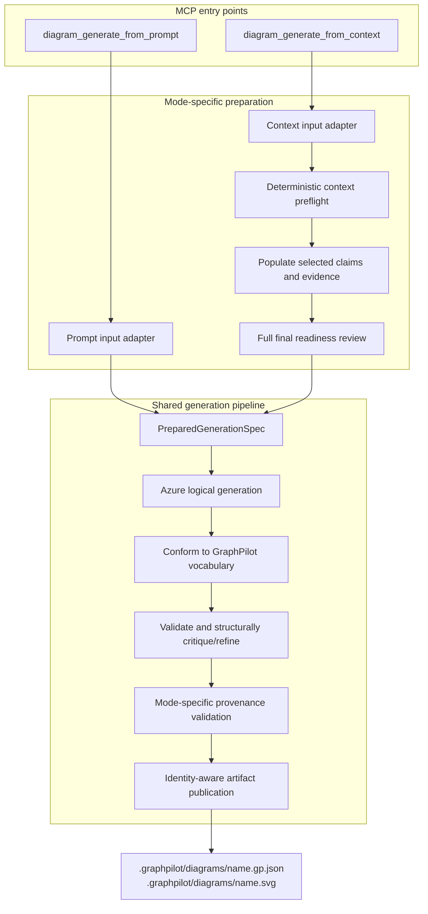
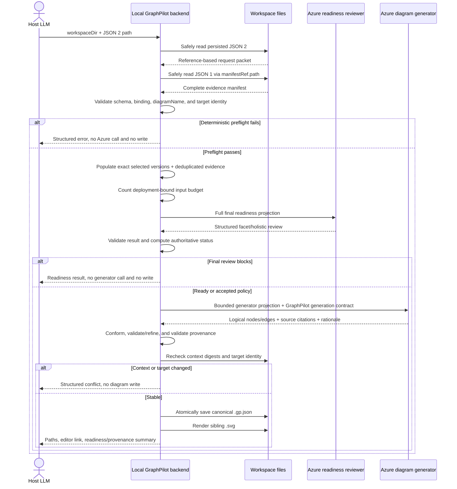

# Context-Backed Generation, Provenance, and Artifact Persistence

> **Status:** Historical generation/provenance design snapshot. Current intended behavior is owned by
> [`05-generation-and-provenance.md`](../../03-design/01-context-generation/05-generation-and-provenance.md);
> runtime services and canonical-schema changes are not implemented.
>
> **Scope of this doc.** This document owns the generation boundary after JSON 2 is ready: local loading,
> deterministic population, the transient Azure generator input, semantic mapping, element-level
> provenance, canonical trace metadata, identity-aware persistence, and rendering behavior. The overall
> flow is [`01-workflows-and-prompts.md`](01-workflows-and-prompts.md); JSON 1, JSON 2, and the reviewer
> framework are [`02-evidence-manifest.md`](02-evidence-manifest.md),
> [`03-diagram-request-context.md`](03-diagram-request-context.md), and
> [`01-readiness-reviewer.md`](05-readiness/01-readiness-reviewer.md).

## Purpose

Turn a reviewed, reference-based JSON 2 packet into a grounded GraphPilot diagram without asking the host
or Azure to join local files, without duplicating JSON 1 into persisted JSON 2, and without creating a
third persisted context packet.

The governing distinction is:

```text
JSON 1                       -> reusable repository facts and evidence
JSON 2                       -> latest intent and exact selections for one diagram
resolved generation context  -> transient populated read model in backend memory
canonical .gp.json           -> durable diagram, element citations, and compact trace metadata
SVG                           -> derived sibling rendering
```

There is **no persisted generation snapshot** in this design. The canonical diagram carries compact trace
metadata; JSON 1 retains immutable claim/evidence history; JSON 2 remains the latest request intent.

## High-level architecture

GraphPilot exposes two generation modes through separate MCP entry points and preparation adapters, then
reuses one generation pipeline:



The direct prompt path keeps today's prompt-only behavior and does not fabricate JSON 1/JSON 2 provenance.
A richer direct-request clarification workflow is future work; the adapter boundary lets it evolve without
replacing the shared pipeline.

## Persisted artifact layout

The workspace layout is:

```text
.graphpilot/
├── context/
│   ├── evidence/
│   │   └── repository.gp-evidence.json
│   └── requests/
│       ├── order-processing.gp-request.json
│       └── payment-flow.gp-request.json
└── diagrams/
    ├── order-processing.gp.json
    ├── order-processing.svg
    ├── payment-flow.gp.json
    └── payment-flow.svg
```

Rules:

1. JSON 1 remains at `.graphpilot/context/evidence/repository.gp-evidence.json`.
2. JSON 2 remains at `.graphpilot/context/requests/<request-file>.gp-request.json`.
3. Every newly created canonical diagram lives under `.graphpilot/diagrams/`, regardless of whether it
   came from direct generation, context-backed generation, or the editor.
4. SVG and optional PNG artifacts are siblings of their canonical `.gp.json` and use the same stem.
5. Root-level `.graphpilot/<name>.gp.json` and `.svg` are not part of the v1 managed layout. No legacy
   discovery or migration layer is required.
6. The transient populated context, reviewer input, generator input, and model responses are never written
   as context files.

`.graphpilot/` remains excluded from JSON 1's source fingerprint, so writing context or diagram artifacts
cannot make the repository evidence snapshot stale.

## Tool roles and shared service boundaries

The settled tool names are:

| Tool | Role |
| --- | --- |
| `diagram_generate_from_prompt` | Fast direct generation from user-supplied conceptual intent; no repository-evidence workflow. |
| `diagram_generate_from_context` | Repository-grounded generation from a persisted JSON 2 request path. |

This proposal cleanly renames today's implemented `diagram_generate` to `diagram_generate_from_prompt`; v1
carries no deprecated alias. Implementation must update clients, tests, and active docs together when the
proposal is promoted.

Their exact public signatures are defined in
[`07-mcp-prompts-and-tool-contracts.md`](07-mcp-prompts-and-tool-contracts.md). The context tool's
minimum conceptual input is:

```json
{
  "workspaceDir": "C:/workspaces/order-service",
  "requestContextPath": ".graphpilot/context/requests/order-processing.gp-request.json"
}
```

The host does **not** send complete JSON 1 or JSON 2 bodies. GraphPilot is local-first: the local backend
loads the persisted files inside the target workspace.

The logical service responsibilities are:

| Responsibility | Owner |
| --- | --- |
| Prepare today's direct prompt/type/style/name input | Prompt input adapter |
| Load/validate JSON 1 and JSON 2, check identity/path/digests, populate context | Context input adapter / context service |
| Run independent and final four-layer readiness review | Readiness review service |
| Turn either mode into one internal generation contract | `PreparedGenerationSpec` adapter boundary |
| Azure logical modeling, conformance, layout, structural validation/refinement | Shared generation pipeline |
| Enforce context-mode origin references and rationale | Provenance validator/policy |
| Validate, create/replace, and render canonical artifacts | Artifact publisher using persistence/file/render services |

These are responsibility boundaries, not a required class count. Planned `08-implementation-and-promotion.md`
will choose the exact refactor. The key architectural rule is that input-specific preparation is separate
while logical generation, conformance, layout, validation, and publication do not drift into two pipelines.

## Context-backed generation sequence



### Ordered phases

The backend performs these phases in order:

1. resolve `workspaceDir` and `requestContextPath` safely;
2. read and validate JSON 2 once;
3. read and validate JSON 1 once through `manifestRef.path`;
4. verify JSON 1 ID/digest binding;
5. validate `diagramName` and preflight output identity/collisions;
6. build immutable-for-the-call in-memory indexes and the resolved generation context;
7. check the deployment-derived generator input budget;
8. run the same complete four-layer readiness service as a final authoritative review;
9. when allowed, call the context-mode Azure logical generator;
10. conform and structurally validate/refine the logical output;
11. deterministically validate all element provenance;
12. recheck JSON 1/JSON 2 digests and target identity immediately before persistence;
13. validate and atomically save the canonical JSON;
14. render the sibling SVG;
15. return structured success or partial render success.

All deterministic failures that can be discovered before Azure—including unsafe paths, malformed packets,
manifest mismatch, name conflict, missing references, and an impossible context budget—must be checked
before the final reviewer call.

## In-memory context lifecycle

The backend parses complete local files into request-scoped memory. Conceptually:

```text
LoadedContext
├── manifest
├── requestContext
├── claimsById
├── evidenceById
├── loadedManifestDigest
└── loadedRequestDigest

ResolvedGenerationContext
├── request framing and scope
├── populated selected claim versions
├── deduplicated evidence records
├── uncertainty dispositions
├── accepted assumptions
└── generation decisions
```

The loaded objects are treated as immutable. Population builds a new object; it never rewrites JSON 1 or
JSON 2. Request memory is discarded after success or failure. A future immutable JSON 1 cache keyed by
manifest digest is a permissible performance optimization, not a persistence or contract requirement.

## Deterministic preflight

### Path and document checks

Before any Azure call:

- `workspaceDir` resolves to a valid local workspace;
- the JSON 2 path is workspace-relative/path-safe and points to a regular JSON file;
- JSON 2 validates and has the expected kind/schema version;
- `manifestRef.path` is workspace-relative/path-safe;
- JSON 1 exists, validates, and has the expected kind/schema version;
- `manifestRef.id` matches JSON 1 `id`;
- `manifestRef.digest` matches the canonical digest of the loaded JSON 1;
- all selected exact claim versions and referenced assumptions/uncertainties exist and are valid;
- every hard JSON 2 invariant passes.

A mismatched manifest digest returns `manifest_reconciliation_required` before Azure. The response reports
the expected/current digests and deterministic status of each selected claim reference. The host updates or
reconciles JSON 2, reruns readiness, and retries. The backend never silently rebinds or mutates host-owned
intent.

### Diagram identity and collision checks

JSON 2 has a required top-level `diagramName`. The host proposes it; the backend validates it as a safe
filename stem. It does not silently substitute an Azure-suggested name.

Targets are:

```text
.graphpilot/diagrams/<diagramName>.gp.json
.graphpilot/diagrams/<diagramName>.svg
```

`requestId` is the stable ownership identity and is copied into the generated diagram metadata.

| Existing target state | Behavior |
| --- | --- |
| Neither target exists | Creation is allowed. |
| Canonical JSON exists and its `metadata.generationContext.request.id` matches JSON 2 `requestId` | This is regeneration; replacement is allowed. |
| Canonical JSON exists with another or missing request identity | Return `diagram_name_conflict`; write nothing. |
| Only an orphan SVG/PNG exists for the proposed stem | Return `diagram_name_conflict`; write nothing. |

The conflict response may include safe alternative stems. The host—not the backend—updates JSON 2
`diagramName` and retries. This retry normally needs no user interaction unless the original name was an
explicit user choice or no suggestion preserves its meaning.

The collision check occurs before any Azure call and is repeated before persistence so generation cannot
replace a target whose identity changed while the call was running.

## Deterministic population

Population is a bounded reference-resolution operation, not an LLM task.

For each JSON 2 `selectedClaims[]` entry, the backend:

1. finds the claim container by stable ID;
2. selects the exact requested immutable version—not `latest` by convenience;
3. deep-copies that complete version, including payload and complete `support` object;
4. carries the claim ID, kind, and current lifecycle status needed to interpret the version;
5. resolves every direct `support.evidenceRefs[]` ID to the complete exact JSON 1 evidence record;
6. adds each evidence record once to a deduplicated evidence array;
7. preserves evidence IDs and claim support references unchanged.

It does **not**:

- copy other historical claim versions;
- recursively populate claim references inside claim payloads;
- include unselected active claims in the generator packet;
- synthesize, rewrite, truncate, or re-summarize evidence;
- read raw source during generation;
- copy the entire manifest.

If one selected claim's payload refers to another claim needed to interpret the diagram, that other exact
claim version must be separately selected (usually as `primary`, `supporting`, or `context`). Readiness owns
detection/recommendation of missing selection closure. Avoiding recursive expansion prevents cycles and
unbounded claim-graph traversal.

### Transient resolved request shape

A compact example:

```json
{
  "schemaVersion": "graphpilot.resolved-diagram-request.v1",
  "kind": "resolvedDiagramRequestContext",
  "requestId": "request-order-processing",
  "diagramName": "order-processing",
  "manifestRef": {
    "path": ".graphpilot/context/evidence/repository.gp-evidence.json",
    "id": "evidence-order-service",
    "digest": "sha256:current-manifest-digest"
  },
  "request": {
    "original": "Create an activity diagram of order processing.",
    "goal": "Explain submission through event publication.",
    "diagramType": "activity_diagram",
    "audience": "Backend developers",
    "detailLevel": "standard"
  },
  "scope": {
    "included": ["Submission, validation, persistence, and publication"],
    "excluded": ["Frontend behavior"]
  },
  "selectedClaims": [
    {
      "claimRef": {
        "id": "claim-validate-before-save",
        "version": 2
      },
      "role": "primary",
      "reason": "Defines the main ordering constraint.",
      "claim": {
        "id": "claim-validate-before-save",
        "kind": "behaviorStep",
        "status": "active",
        "selectedVersion": {
          "version": 2,
          "statement": "The service validates an order before persistence.",
          "appliesToViewpoints": ["as_implemented"],
          "payload": {
            "precedes": "persist order"
          },
          "support": {
            "basis": "repositoryEvidence",
            "derivation": "direct",
            "evidenceRefs": ["evidence-order-validation"]
          },
          "createdAt": "2026-07-13T14:27:00Z"
        }
      }
    }
  ],
  "resolvedEvidence": [
    {
      "id": "evidence-order-validation",
      "kind": "code",
      "locator": {
        "path": "src/orders/order_handler.py",
        "symbol": "OrderHandler.submit",
        "lineRange": {
          "start": 42,
          "end": 58
        }
      },
      "contentDigest": "sha256:evidence-digest",
      "summary": "OrderHandler.submit validates an order before saving it.",
      "capturedInSourceDigest": "sha256:source-digest",
      "status": "current",
      "capturedAt": "2026-07-13T14:25:00Z"
    }
  ],
  "uncertaintyDispositions": [],
  "assumptions": [],
  "decisions": []
}
```

The complete selected version and evidence records are exact deep copies. The wrapper is a deterministic
local read model that keeps selection role/reason next to claim meaning while serializing shared evidence
once. It exists only in backend memory and is never sent wholesale to Azure: the readiness reviewer and
generator receive separate bounded projections.

## Context-size policy

Repository size does not directly determine generator-input size: JSON 1 can contain many claims, while the
generator receives only the reviewed selection. Nevertheless, exact selected context can be too large.

The backend computes the exact input count using the tokenizer/counting mechanism appropriate for the
configured Azure deployment. Its effective limit reserves capacity for:

- system instructions;
- GraphPilot vocabulary and per-type rules;
- strict logical-output schema;
- few-shot examples when enabled;
- model reasoning/response overhead as applicable;
- maximum logical output;
- a configured safety margin.

Policy:

1. readiness should flag a request that is too broad to produce a readable diagram;
2. the backend may report a soft size warning before the hard model limit;
3. the hard generator-input limit is derived from the configured deployment rather than a fixed low product
   cap;
4. building either Azure projection never silently removes selected claims, assumptions, decisions, or
   required instructions; resolved evidence remains complete in local memory;
5. v1 does not split/chunk and merge one diagram across multiple generator calls;
6. an oversized exact generator projection returns `generation_context_too_large` before Azure, including
   claim/assumption counts, estimated tokens, effective limit, and largest contributors.

This no-chunking rule applies to the exact context sent to the **diagram generator**. The readiness
reviewer's separate compact active-claim index may later use deterministic filtering/retrieval/chunking to
retain omission detection for very large manifests; `05-readiness/` records that as a pre-implementation prerequisite
rather than generation behavior owned here.

The host may reduce scope, remove genuinely redundant selections, split the request into multiple diagrams,
or use another configured deployment, then rerun readiness.

## Final readiness review

`diagram_generate_from_context` invokes the same complete four-layer readiness service as a **final review**
after deterministic generation preflight and population:

```text
Layer 1  deterministic preflight
Layers 2 + 3  one structured Azure reviewer call
Layer 4  deterministic response validation, status, and score
```

The final result is authoritative for that generation attempt:

- `ready` proceeds;
- `ready_with_warnings` proceeds only under the approved warning policy;
- an approved override may proceed only within the reviewer contract's bounded override rules;
- `invalid` or unaccepted/non-overrideable `needs_context` returns the full readiness result without calling
  the diagram generator or writing artifacts.

The host applies recommendations or resolves gaps and retries under 04's bounded loop. v1 uses no readiness
token and persists no assessment sidecar. Reviewer variability is addressed by the versioned rubric,
canonical input ordering, fixed prompt/model settings, diagnostics, fixtures, calibration, and no-reroll
rules in [`05-readiness/`](05-readiness/README.md).

[`05-readiness/01-readiness-reviewer.md`](05-readiness/01-readiness-reviewer.md) owns warning/override behavior;
[`07-mcp-prompts-and-tool-contracts.md`](07-mcp-prompts-and-tool-contracts.md) owns its exact digest-bound
transport. This generation contract only consumes the final validated policy result.

## Azure generator input

The context input adapter derives a bounded generator projection from the local resolved context and combines:

1. request framing, confirmed scope, and finalized uncertainty dispositions;
2. each finalized selected claim's exact ID/version, statement, payload, applicability, selection role/reason,
   and support basis/derivation—but no resolved evidence record or evidence summary;
3. accepted assumptions and decisions with their `origin`/`acceptedBy`/`acceptedAt` metadata;
4. GraphPilot's diagram-type vocabulary and applicable UML/SysML semantic/structural rules;
5. generation prompt/version and strict context logical-output schema;
6. bounded answer-key examples;
7. provenance instructions and exact claim/assumption reference allowlists.

The generator does **not** receive:

- complete JSON 1 or the complete local resolved context;
- resolved evidence records, evidence summaries, or historical claim versions;
- unselected active claims or the reviewer's compact active-claim index;
- raw repository source;
- discovery-tool indexes;
- credentials, endpoint configuration, or local absolute source paths;
- the complete readiness result or reviewer reasoning.

Claims—not evidence records—are the generator's factual authority. Keeping evidence in the reviewer/local
backend boundary prevents generation from introducing source details that were never normalized into a
selected claim.

The generator's responsibility is semantic mapping:

```text
generic selected claims + accepted assumptions
  -> GraphPilot semantic node/edge types
  -> logical topology
  -> source citations + concise mapping rationale
```

A claim may produce several elements; several claims may jointly produce one element; a context claim may
shape terminology/boundaries without producing a visible element. The generator must not force one
claim-to-one-node mapping.

## Context logical output and citations

The context adapter uses a mode-specific strict logical schema (conceptually
`graphpilot.logical-diagram.context.v1`). Every logical node and edge carries an `origin` object:

```json
{
  "id": "validate-order",
  "semanticType": "action",
  "label": "Validate Order",
  "origin": {
    "claimRefs": [
      {
        "id": "claim-validate-before-save",
        "version": 2
      }
    ],
    "assumptionRefs": [],
    "schemaRules": [],
    "rationale": "The selected behavior-step claim establishes validation before persistence, so it is represented as an activity action."
  }
}
```

An edge example:

```json
{
  "source": "validate-order",
  "target": "persist-order",
  "semanticType": "controlFlow",
  "label": null,
  "origin": {
    "claimRefs": [
      {
        "id": "claim-validate-before-save",
        "version": 2
      }
    ],
    "assumptionRefs": [],
    "schemaRules": [],
    "rationale": "The claim payload establishes that validation precedes persistence."
  }
}
```

### Origin meaning

| Field | Meaning |
| --- | --- |
| `claimRefs[]` | Smallest sufficient set of exact selected JSON 1 claim versions supporting the element. |
| `assumptionRefs[]` | Smallest sufficient set of explicitly accepted JSON 2 assumptions supporting otherwise unsupported element meaning. |
| `schemaRules[]` | Stable GraphPilot rule IDs permitting non-factual notation scaffolding. |
| `rationale` | Concise user-facing explanation of how the cited inputs map to this node/edge; not hidden chain-of-thought. |

Rules:

1. every factual context-generated node/edge cites at least one selected claim or accepted assumption;
2. multiple claim/assumption refs are allowed when genuinely needed;
3. refs are unique and must be the smallest sufficient set rather than the entire selection;
4. an allowlisted non-factual scaffold may instead cite one or more schema rules;
5. schema-only scaffolding cannot carry unsupported domain-specific labels or relationships;
6. presentation decisions guide generation but do not authorize invented facts;
7. evidence refs are not copied onto elements—claims remain the semantic authority;
8. rationale is required, nonempty, bounded, and suitable for display to a user.

Examples:

```text
"Validate Order" action
  -> claim-order-validation@2

hypothetical recovery branch
  -> assumption-approved-recovery

unlabeled activity initial marker
  -> activity.initial-node schema rule
```

## Canonical provenance extension

The canonical GraphPilot schema gains a typed optional top-level `origin` on both nodes and edges. It is a
sibling of node `data` / edge `data`, not arbitrary visual metadata:

```json
{
  "id": "validate-order",
  "type": "gpNode",
  "position": {
    "x": 100,
    "y": 200
  },
  "data": {
    "label": "Validate Order",
    "semanticType": "action"
  },
  "origin": {
    "claimRefs": [
      {
        "id": "claim-validate-before-save",
        "version": 2
      }
    ],
    "assumptionRefs": [],
    "schemaRules": [],
    "rationale": "The behavior-step claim maps to this activity action."
  }
}
```

Compatibility policy:

- the canonical JSON Schema validates `origin` strictly when present;
- context-backed generation requires it through an additional generation acceptance gate;
- direct, manual, imported, and pre-provenance diagrams may omit it;
- the additive optional field remains compatible with `graphpilot.diagram.v1` unless later implementation
  analysis finds a breaking canonical requirement;
- frontend types/adapters must preserve it round-trip even before the UI displays it;
- SVG rendering ignores it visually;
- manual-edit provenance evolution is deferred to grounded-edit design.

Conformance must explicitly preserve valid origin fields while remapping logical node IDs/endpoints. It may
never drop citations as unknown metadata. Any deterministic scaffold added after Azure receives an
allowlisted schema-rule origin from the backend.

## Deterministic provenance validation

After logical conformance/refinement and before persistence, the context provenance validator enforces:

1. every factual node and edge has a typed origin;
2. every claim ref is an exact member of populated `selectedClaims`;
3. every assumption ref identifies an explicitly accepted JSON 2 assumption that is paired with one `assume` disposition and passed readiness authority checks;
4. every schema rule exists in the stable GraphPilot rule registry and permits that element semantic type;
5. origin arrays contain no duplicate IDs/versions;
6. at least one permitted grounding source exists;
7. schema-only elements contain no unsupported domain meaning;
8. rationale is present and within configured limits;
9. no evidence, decision, discovery, or invented identifier is presented as factual authority.

The prompt instructs Azure to cite the smallest sufficient set; deterministic code can reject duplicates,
unknown refs, empty sets, and obvious cite-everything output, but semantic minimality is also covered by
generation fixtures/evaluation.

Invalid provenance enters the existing bounded critique/refine loop with structured findings. If valid
provenance and canonical structure cannot be obtained within the configured budget, generation fails and
writes nothing.

The evidence chain remains normalized:

```text
canonical element.origin.claimRefs
  -> JSON 1 exact claim version
  -> claimVersion.support.evidenceRefs
  -> JSON 1 exact evidence records
  -> workspace-relative source locators
```

## Canonical diagram trace metadata

Context-backed generation writes compact, non-secret trace metadata into the canonical diagram. It does not
copy populated claims/evidence or raw Azure packets.

```json
{
  "metadata": {
    "source": "mcp",
    "authoring": "generated",
    "generationMode": "context",
    "createdAt": "2026-07-13T18:30:00Z",
    "updatedAt": "2026-07-13T18:30:00Z",
    "generatedBy": "configured-model-identifier",
    "generationContext": {
      "request": {
        "id": "request-order-processing",
        "path": ".graphpilot/context/requests/order-processing.gp-request.json",
        "digest": "sha256:exact-json-2-used"
      },
      "manifest": {
        "id": "evidence-order-service",
        "path": ".graphpilot/context/evidence/repository.gp-evidence.json",
        "digest": "sha256:exact-json-1-used"
      },
      "selectedClaimRefs": [
        {
          "id": "claim-validate-before-save",
          "version": 2
        }
      ],
      "readiness": {
        "status": "ready_with_warnings",
        "score": 87,
        "rubricVersion": "graphpilot.readiness.activity.v1",
        "acceptedWarningCodes": ["assumption_backed_coverage"]
      },
      "generator": {
        "promptVersion": "graphpilot.context-generation.v1",
        "logicalSchemaVersion": "graphpilot.logical-diagram.context.v1",
        "model": "configured-model-identifier"
      },
      "acceptedAssumptions": [
        {
          "id": "assumption-publication-failure-is-terminal",
          "statement": "For this diagram, treat publication failure as terminating without retry.",
          "reason": "The repository does not establish failure handling, and the user accepted the host-formulated fallback.",
          "origin": "host",
          "acceptedBy": "user",
          "acceptedAt": "2026-07-13T17:00:00Z"
        }
      ],
      "generationDecisions": [
        {
          "id": "decision-show-validation-failure",
          "kind": "emphasis",
          "statement": "Show the validation-failure branch explicitly.",
          "reason": "The audience needs to understand the rejection path.",
          "origin": "user",
          "acceptedBy": "user",
          "acceptedAt": "2026-07-13T17:00:00Z"
        }
      ]
    }
  }
}
```

The backend copies the complete JSON 2 assumption/decision arrays from its in-memory input after successful
generation; Azure does not reproduce those objects. They remain small and preserve negative/omission
instructions that may not map to a visible element. Element assumption refs resolve against the copied
`acceptedAssumptions` array even after persisted JSON 2 is overwritten.

Claims/evidence are not copied because JSON 1 retains immutable history. `selectedClaimRefs` preserves the
complete generation selection, including context claims that produced no visible element.

The trace metadata deliberately excludes:

- resolved claim/evidence bodies;
- raw source;
- complete readiness coverage/findings;
- reviewer/generator prompts and raw responses;
- hidden reasoning;
- token telemetry;
- endpoint names, credentials, or secrets.

A direct prompt-generated diagram stores ordinary generation metadata with `generationMode: "prompt"` but
no fake manifest, request, readiness, claims, assumptions, or decisions.

## Context stability during generation

At load, the backend records canonical JSON 1 and JSON 2 digests and uses the parsed objects as immutable
inputs. Before persistence it recomputes the persisted digests:

- unchanged: publication may continue;
- JSON 1 or JSON 2 changed: return `generation_context_changed`; write nothing;
- output target identity changed: return `diagram_name_conflict`; write nothing.

This is optimistic consistency, not a long-lived file lock. It protects against another IDE window, MCP
client, manual edit, or overlapping call changing the request while Azure is running. Such races should be
rare in the local workflow; no automatic Azure retry is performed. The host reconciles and retries.

## Canonical persistence and rendering

The canonical JSON is authoritative; SVG is a derived sibling.

Successful publication is:

```text
validate/refine logical + provenance
  -> assemble canonical JSON
  -> validate canonical JSON
  -> atomically create/replace .graphpilot/diagrams/<name>.gp.json
  -> render .graphpilot/diagrams/<name>.svg
```

Generation preserves today's JSON-first behavior:

1. a canonical validation failure writes nothing;
2. a valid canonical JSON is atomically saved before rendering;
3. SVG rendering failure does not discard the valid canonical diagram;
4. if regeneration leaves an old sibling SVG, a render failure removes that stale SVG so it cannot
   misrepresent the new JSON;
5. the response reports partial success with `diagramPath`, `svgPath: null`, and a retryable render failure;
6. the host may call `diagram_render` on the saved JSON without repeating readiness or Azure generation.

The exact response/error envelope is deferred to 07. The semantic distinction must remain visible: a render
failure after save is not a total generation failure.

## Direct prompt generation boundary

`diagram_generate_from_prompt` is retained for requests whose facts come from the user rather than a
repository manifest, including conceptual/as-designed diagrams, brainstorming, and examples.

It:

- keeps today's prompt, diagram type, optional style, and optional name behavior;
- uses the prompt input adapter and shared logical/canonical pipeline;
- writes new artifacts under `.graphpilot/diagrams/`;
- does not create/read JSON 1 or JSON 2;
- does not run context readiness;
- does not require claim/assumption citations;
- records `generationMode: "prompt"` in ordinary diagram metadata.

A future direct-prompt host clarification workflow for goal, scope, audience, detail, supplied facts,
assumptions, and presentation preferences remains separate from context-backed generation and is tracked in the
active backlog.

## Conceptual outcomes and errors

Exact MCP envelopes/names are defined in `07`; implementation must distinguish:

| Outcome/code (working name) | Phase | Azure used? | Persisted result |
| --- | --- | --- | --- |
| `invalid_request_context` | JSON 2 schema/invariants | No | None |
| `unsafe_path` / `invalid_workspace` | Local path resolution | No | None |
| `manifest_reconciliation_required` | JSON 1 binding | No | None |
| `diagram_name_conflict` | Identity preflight/commit | No if found initially | None |
| `generation_context_too_large` | Populated-input budget | No | None |
| `readiness_blocked` | Final review | Reviewer only | None |
| `llm_not_configured` | Generation setup | No generator call | None |
| `generation_validation_failed` | Logical/canonical validation/refinement | Generator/refiner | None |
| `generation_provenance_failed` | Origin validation/refinement | Generator/refiner | None |
| `generation_context_changed` | Commit precondition | Reviewer/generator | None |
| `render_failed` partial success | SVG rendering after save | Reviewer/generator | Canonical JSON saved; stale SVG absent |
| success | Complete flow | Reviewer/generator | Canonical JSON + SVG |

## Validation invariants

The eventual schemas/services must enforce:

1. context generation receives a safe workspace and persisted JSON 2 path, not inline JSON 1/JSON 2 bodies;
2. JSON 2 and JSON 1 are loaded locally and treated as immutable request inputs;
3. JSON 2 manifest ID/digest binds to the exact loaded JSON 1;
4. `diagramName` is a required safe stem and output paths stay under `.graphpilot/diagrams/`;
5. no Azure call occurs before deterministic path/binding/reference/name/context-budget checks pass;
6. regeneration replaces only a target carrying the same `requestId` identity;
7. local population selects exact immutable versions and all directly referenced exact evidence records;
8. local evidence is deduplicated, never silently truncated, and never recursively expanded through claim refs;
9. reviewer and generator inputs are separate bounded projections of that immutable local context;
10. the reviewer may receive bounded evidence summaries, while the generator receives no resolved evidence records or summaries;
11. the final full readiness review is authoritative for the generation attempt;
12. every factual context-generated node/edge cites selected claims and/or accepted assumptions;
13. schema-only origins are allowlisted and non-factual;
14. element evidence is resolved through claim support rather than duplicated in canonical elements;
15. concise origin rationale is required, preserved through conformance, and bounded;
16. context provenance is deterministically validated before canonical persistence;
17. canonical `origin` is typed/optional generally but mandatory for context-generated factual elements;
18. canonical metadata records compact request/manifest/selection/readiness/generator trace information;
19. exact accepted assumptions and generation decisions are copied into the canonical diagram;
20. no populated context, snapshot, raw model packet, or secret is persisted;
21. context/target digests are rechecked before save; a changed precondition writes nothing;
22. canonical JSON is validated and atomically saved before SVG rendering;
23. render failure preserves canonical JSON, removes stale SVG, and remains locally retryable;
24. all new diagram JSON/rendered artifacts use `.graphpilot/diagrams/` with no root-level legacy fallback.

## Deliberate non-goals

- persisted immutable generation snapshots or resolved-context sidecars;
- copying claim/evidence bodies into persisted JSON 2 or canonical diagram metadata;
- sending complete JSON 1 or raw source to Azure;
- recursive claim-graph population;
- automatic context trimming, chunking, or multi-call topology merging;
- automatic backend mutation of JSON 1/JSON 2 or silent manifest rebinding;
- exact readiness rubric weights/calculations (owned by [`05-readiness/`](05-readiness/README.md));
- exact MCP prompt/tool schemas and response envelopes (owned by `07`);
- runtime implementation classes/slices (owned by the active Epic 3 extension);
- grounded edit/manual provenance evolution;
- remote/non-local context transport;
- legacy root-level diagram migration.

## Dependencies and next design work

This contract consumes the final readiness result and exact policy owned by
[`05-readiness/`](05-readiness/README.md); it does not duplicate facet definitions, findings, typed actions,
or score/status calculation.

After the readiness/generation/MCP boundary is audited:

1. reconcile the proposal with current services/canonical/frontend contracts and slice implementation in
   planned `08-implementation-and-promotion.md`;
2. promote only explicitly approved behavior into GraphPilot's active architecture/design/decision owners.

### Final definition

> Context-backed generation is a local-backend-orchestrated flow that safely loads JSON 2 and its bound
> JSON 1, deterministically populates the exact reviewed claims/evidence into a transient request, performs
> a final readiness gate, asks Azure for a logical diagram with per-element source citations and concise
> rationale, deterministically conforms/validates/provenance-checks the result, and persists only the
> canonical diagram plus derived rendering under `.graphpilot/diagrams/`—with compact trace metadata but no
> generation snapshot.
