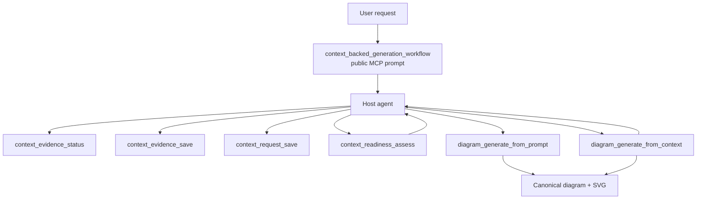
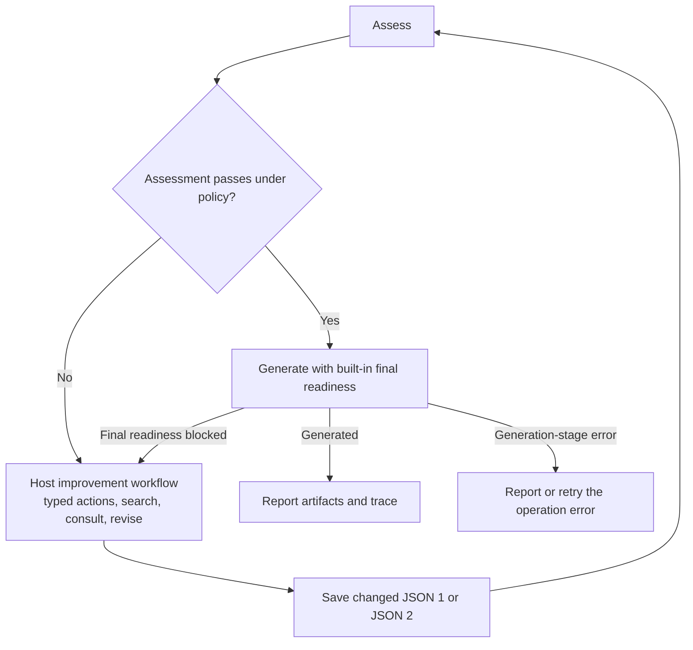

# MCP Prompts and Tool Contracts

> **Status:** Historical MCP design snapshot. Current intended contracts are owned by
> [`03-mcp-tools/`](../../02-architecture/01-mcp-tools/README.md); runtime context tools and workflow are not
> implemented.
>
> **Scope of this doc.** This file is the single owner of the proposed evidence-context MCP tool names,
> arguments, result/error transport, the public host workflow prompt, adaptive consultation, typed-action
> execution, readiness-gated generation loop, per-attempt generation policy, and opt-in readiness diagnostics.
> JSON 1, JSON 2, readiness, and generation internals remain owned by `02`, `03`, `05-readiness/`, and `06`.

## Purpose

Turn the approved context design into a small composable MCP surface. Tools perform one bounded backend
operation; one public prompt tells the host how to combine them. The host remains the semantic author of
JSON 1/JSON 2 and the orchestrator of all typed actions. The backend owns path safety, deterministic checks,
validation, canonicalization, atomic persistence, readiness policy, generation, provenance, and rendering.



## 1. Ownership and boundaries

| Topic | Owner |
| --- | --- |
| Overall source → JSON 1 → JSON 2 → readiness → generation workflow | [`01-workflows-and-prompts.md`](01-workflows-and-prompts.md) |
| JSON 1 structure, source fingerprint, claims/evidence/uncertainties | [`02-evidence-manifest.md`](02-evidence-manifest.md) |
| JSON 2 structure, claim selection, dispositions, assumptions, decisions | [`03-diagram-request-context.md`](03-diagram-request-context.md) |
| Four-layer readiness, private/final JSON, rubrics, typed actions, calculation, host-loop policy | [`05-readiness/`](05-readiness/README.md) |
| Context population, generator input, provenance, trace, persistence/rendering | [`06-context-backed-generation-and-provenance.md`](06-context-backed-generation-and-provenance.md) |
| MCP tools, host prompt, transport, grouped presentation, attempt policy, debug records | This file |
| Codebase reconciliation, implementation slices, active-doc promotion | Planned `08-implementation-and-promotion.md` |

This file does not redefine evidence/claim semantics, JSON 2 invariants, facet anchors, finding/action
registries, semantic mapping, canonical diagram schema, or rendering rules.

## 2. Public MCP surface

### Tools

| Tool | Purpose | Azure call? | Writes canonical files? |
| --- | --- | ---: | ---: |
| `context_evidence_status` | Compare current safe-scope source fingerprint with canonical JSON 1. | No | No |
| `context_evidence_save` | Validate/promote a host-written durable JSON 1 draft. | No | JSON 1 |
| `context_request_save` | Validate/save a complete inline JSON 2 candidate. | No | JSON 2 |
| `context_readiness_assess` | Run one complete readiness assessment and return `contextReadinessResult`. | Reviewer | No, except opt-in debug record |
| `diagram_generate_from_prompt` | Direct conceptual/user-fact generation; renamed current `diagram_generate`. | Generator | Diagram JSON + SVG |
| `diagram_generate_from_context` | One grounded generation attempt with mandatory final readiness. | Reviewer + generator when allowed | Diagram JSON + SVG |

Existing `health`, `echo`, `diagram_list_types`, `diagram_get_schema`, `diagram_validate`, `diagram_render`, and
future `diagram_update` remain outside this evidence-context surface. The rename to
`diagram_generate_from_prompt` has no deprecated `diagram_generate` alias; implementation updates clients,
tests, and active docs together.

### Prompt

| Prompt | Purpose |
| --- | --- |
| `context_backed_generation_workflow` | Guide the host through evidence freshness, JSON 1/JSON 2 authoring, readiness actions, adaptive consultation, readiness-gated generation, and stage-correct error handling. |

Internal evidence instructions embedded in this workflow and backend reviewer/generator prompts are not
additional public MCP prompts.

## 3. Common transport conventions

### 3.1 Local workspace and paths

- `workspaceDir` is an absolute local workspace root.
- Every persisted/draft path is workspace-relative in payloads and resolves beneath `workspaceDir`.
- Canonical context paths are under `.graphpilot/context/`; canonical diagrams are under
  `.graphpilot/diagrams/`.
- JSON 1's exact mandatory safe-scope exclusions are owned only by
  [`02-evidence-manifest.md`](02-evidence-manifest.md); every context tool consumes that same policy rather
  than duplicating its pattern list.
- Draft/debug files are never canonical inputs and `.graphpilot/` remains excluded from JSON 1 source
  fingerprinting.

### 3.2 Candidate transport

The two context documents deliberately use different candidate transport:

```text
JSON 1: potentially large and long-authored
  → host writes durable draft
  → tool receives candidatePath

JSON 2: bounded and frequently updated
  → host sends complete candidate inline
```

Readiness and context generation receive only `workspaceDir` + canonical `requestPath`; the backend loads
JSON 2 and follows `manifestRef.path` to JSON 1 locally.

### 3.3 Full replacement and optimistic concurrency

- JSON 1/JSON 2 saves replace complete documents; v1 defines no patch language.
- First creation uses a null expected digest.
- Updates require the exact canonical digest the host started from.
- JSON 1 promotion also requires the source digest observed before gathering.
- Any target/source/context drift returns a conflict and writes nothing.
- Blind overwrite is forbidden.
- On a digest conflict, the host reloads the current canonical artifact before one bounded retry; it never
  repeatedly retries the same stale candidate or holds a long-lived file lock.

### 3.4 Common error envelope

Expected operation failures use:

```json
{
  "error": {
    "code": "manifest_reconciliation_required",
    "message": "JSON 2 is bound to an older evidence manifest.",
    "retryable": true,
    "details": {}
  }
}
```

`code` and `message` remain required and backward-compatible with the current MCP base envelope.
`retryable` and `details` are optional additive fields; clients that understand only the base fields may
ignore them. `retryable: true` means a retry may succeed after the reported condition changes, never that the
host should repeat an identical call. Every code that uses `details` defines its exact object shape in this
contract. A readiness status (`invalid`, `needs_context`, `ready_with_warnings`, `ready`) is not an MCP
operation error.

Error codes follow five families: path/file, validation, conflict/reconciliation, readiness/LLM, and
generation/rendering. Implementation may extend the existing common error helper additively; migration of
existing tools is planned in `08` and does not require clients to consume the new optional fields.

When present, `details` uses only these bounded shapes:

| Codes | `retryable` | Exact `details` fields |
| --- | ---: | --- |
| `invalid_workspace`, `unsafe_path`, `candidate_not_found`, `request_not_found`, `manifest_not_found` | No after identical call | None |
| `invalid_evidence_manifest`, `evidence_validation_failed`, `request_validation_failed` | Yes after correction | `issues[]` with `path`, `code`, `message` |
| `source_changed` | Yes | `expectedSourceDigest`, `currentSourceDigest` |
| `manifest_conflict`, `request_conflict` | Yes | `expectedDigest`, `currentDigest` |
| `manifest_reconciliation_required` | Yes | `requestPath`, `oldManifestDigest`, `currentManifestDigest` |
| `context_too_large` | Yes after narrowing | `phase`, `estimatedTokens`, `effectiveLimit`, `largestContributors[]`, `suggestedActions[]` |
| `diagram_name_conflict` | Yes after rename | `diagramName`, `targetPath`, optional `existingRequestId` |
| `generation_context_changed` | Yes after reload | `requestPath`, `expectedRequestDigest`, `currentRequestDigest`, `manifestPath`, `expectedManifestDigest`, `currentManifestDigest` |
| `generation_validation_failed`, `generation_provenance_failed`, `generation_failed` | Code-specific | `stage`, `attemptsUsed`, `maxAttempts` |
| `render_failed` | Yes | `diagramPath`, intended `svgPath` |
| `readiness_reviewer_unavailable`, `readiness_review_failed`, `llm_not_configured` | Code-specific | Optional provider/deployment identifier only; never credentials |

All other codes omit `details` unless this owner adds and versions an exact shape.

### 3.5 No hidden mutation or reasoning

- Assessment/generation never silently change JSON 1 or JSON 2.
- Backend recommendations are returned as exact typed actions; the host decides and performs them.
- Results contain bounded rationales/consequences, not hidden chain-of-thought.
- No raw source, secret, complete JSON 1 body, raw Azure response, or discovery index enters tool diagnostics.

## 4. `context_evidence_status`

### Purpose

Run a read-only deterministic freshness check for canonical JSON 1.

### Arguments

```json
{
  "workspaceDir": "C:/projects/order-service",
  "manifestPath": ".graphpilot/context/evidence/repository.gp-evidence.json"
}
```

| Field | Required | Rule |
| --- | --- | --- |
| `workspaceDir` | Yes | Safe existing local workspace. |
| `manifestPath` | No | Defaults to `.graphpilot/context/evidence/repository.gp-evidence.json`. |

### Behavior

1. Resolve workspace/path safely.
2. Build the canonical sorted path/content-digest list over the effective safe scope.
3. Compute the current source digest.
4. If JSON 1 is absent, return `missing`.
5. If present, validate enough envelope/source metadata to compare the stored digest.
6. Return `current` or `stale`; write nothing and call no LLM.

### Result

```json
{
  "status": "stale",
  "manifestPath": ".graphpilot/context/evidence/repository.gp-evidence.json",
  "manifestId": "evidence-order-service",
  "manifestDigest": "sha256:old-manifest",
  "storedSourceDigest": "sha256:old-source",
  "currentSourceDigest": "sha256:new-source",
  "eligibleFileCount": 842
}
```

`status` is `missing|current|stale`.

### Errors

`invalid_workspace`, `unsafe_path`, `manifest_unreadable`, `invalid_evidence_manifest`,
`source_fingerprint_failed`.

## 5. `context_evidence_save`

### Purpose

Validate a durable host-authored JSON 1 draft and atomically promote it to canonical JSON 1.

### Draft lifecycle

```text
Host gathers incrementally
  → .graphpilot/context/drafts/repository.gp-evidence.candidate.json
  → context_evidence_save
      valid   → canonical JSON 1 committed; draft consumed unless retained
      invalid → canonical untouched; draft remains for correction
      conflict→ canonical untouched; draft remains
```

### Arguments

```json
{
  "workspaceDir": "C:/projects/order-service",
  "candidatePath": ".graphpilot/context/drafts/repository.gp-evidence.candidate.json",
  "manifestPath": ".graphpilot/context/evidence/repository.gp-evidence.json",
  "expectedManifestDigest": "sha256:old-manifest",
  "expectedSourceDigest": "sha256:source-before-gathering",
  "retainCandidateOnSuccess": false
}
```

| Field | Required | Rule |
| --- | --- | --- |
| `workspaceDir` | Yes | Safe existing workspace. |
| `candidatePath` | Yes | Workspace-relative regular file under `.graphpilot/context/drafts/`; never canonical input. |
| `manifestPath` | No | Canonical default path above. |
| `expectedManifestDigest` | Yes | Null only for first creation; otherwise exact prior canonical digest. |
| `expectedSourceDigest` | Yes | Exact source digest observed before host gathering. |
| `retainCandidateOnSuccess` | No | Default false; failure/conflict always retains candidate. |

### Behavior

1. Resolve draft/target safely and ensure they differ.
2. Recompute current safe-scope source digest; reject if it differs from `expectedSourceDigest`.
3. Check canonical target digest against `expectedManifestDigest`.
4. Parse complete candidate and validate JSON 1 structure, paths, evidence/source digests, immutable history,
   lifecycle states, claim support/references, uncertainties, and bounds.
5. Set backend-managed source snapshot, revision, canonical digest, and timestamps.
6. Canonically serialize and atomically create/replace JSON 1.
7. Consume the draft on success unless retention was requested. If deletion fails after canonical commit,
   canonical save remains successful and the result includes `cleanupWarning` with code
   `candidate_cleanup_failed`, the leftover `candidatePath`, and `safeToOverwrite: true`. The host may delete
   or overwrite that non-canonical draft later; no cleanup tool exists.

The backend validates facts against locators/digests but does not semantically invent evidence or claims.

### Result

```json
{
  "created": false,
  "manifestPath": ".graphpilot/context/evidence/repository.gp-evidence.json",
  "manifestId": "evidence-order-service",
  "revision": 4,
  "digest": "sha256:new-manifest",
  "sourceDigest": "sha256:current-source",
  "candidateRetained": false,
  "cleanupWarning": null
}
```

When cleanup fails after canonical commit:

```json
{
  "candidateRetained": true,
  "cleanupWarning": {
    "code": "candidate_cleanup_failed",
    "candidatePath": ".graphpilot/context/drafts/repository.gp-evidence.candidate.json",
    "safeToOverwrite": true
  }
}
```

### Errors

`candidate_not_found`, `invalid_candidate_path`, `source_changed`, `manifest_conflict`,
`evidence_validation_failed`, `unsafe_path`, `atomic_write_failed`.

## 6. `context_request_save`

### Purpose

Validate and atomically persist a complete host-authored inline JSON 2 candidate.

### Arguments

```json
{
  "workspaceDir": "C:/projects/order-service",
  "requestPath": ".graphpilot/context/requests/order-processing.gp-request.json",
  "expectedRequestDigest": "sha256:old-request",
  "candidate": {
    "schemaVersion": "graphpilot.diagram-request.v1",
    "kind": "diagramRequestContext",
    "requestId": "request-order-processing",
    "diagramName": "order-processing",
    "manifestRef": {
      "path": ".graphpilot/context/evidence/repository.gp-evidence.json",
      "id": "evidence-order-service",
      "digest": "sha256:current-manifest"
    },
    "request": {},
    "scope": {},
    "selectedClaims": [],
    "uncertaintyDispositions": [],
    "assumptions": [],
    "decisions": []
  }
}
```

| Field | Required | Rule |
| --- | --- | --- |
| `workspaceDir` | Yes | Safe existing workspace. |
| `requestPath` | Yes | Workspace-relative path under `.graphpilot/context/requests/`. |
| `expectedRequestDigest` | Yes | Null only for first creation. |
| `candidate` | Yes | Complete JSON 2 replacement candidate. |

### Behavior

1. Resolve target safely and check expected request digest.
2. Load canonical JSON 1 through candidate `manifestRef.path`.
3. Validate manifest ID/digest binding, request envelope/name/scope, selected claim versions, disposition refs,
   one-to-one assumption pairing, accepted assumption/decision provenance, bounded text/arrays, and prohibited
   content.
4. Canonically serialize, compute JSON 2 digest, and atomically create/replace the request file.
5. Return the small canonical request object so the host can retain the exact normalized baseline.

### Result

```json
{
  "created": false,
  "requestPath": ".graphpilot/context/requests/order-processing.gp-request.json",
  "requestId": "request-order-processing",
  "digest": "sha256:new-request",
  "manifestDigest": "sha256:current-manifest",
  "request": {}
}
```

### Lazy stale-request rebuild

Any JSON 1 digest change invalidates an older JSON 2 for readiness/generation. The old request may remain on
disk untouched until it is next used. `context_request_save`, `context_readiness_assess`, and
`diagram_generate_from_context` share this exact error:

```json
{
  "error": {
    "code": "manifest_reconciliation_required",
    "message": "JSON 2 is bound to an older JSON 1. Rebuild the request context against the current manifest.",
    "retryable": true,
    "details": {
      "requestPath": ".graphpilot/context/requests/order-processing.gp-request.json",
      "oldManifestDigest": "sha256:old",
      "currentManifestDigest": "sha256:new"
    }
  }
}
```

The host re-enters request construction, preserves still-applicable request intent, rebuilds selections and
dispositions against current JSON 1, then saves a complete JSON 2 replacement. There is no partial ref-diff
schema, background reconciliation, reconcile tool, or silent backend mutation.

### Errors

`request_conflict`, `request_validation_failed`, `manifest_not_found`, `manifest_reconciliation_required`,
`unsafe_path`, `atomic_write_failed`.

## 7. `context_readiness_assess`

### Purpose

Run one complete four-layer assessment over persisted canonical JSON 2 and its bound canonical JSON 1.

### Arguments

```json
{
  "workspaceDir": "C:/projects/order-service",
  "requestPath": ".graphpilot/context/requests/order-processing.gp-request.json",
  "diagnostics": {
    "persistReadinessResults": false,
    "runId": null
  }
}
```

| Field | Required | Rule |
| --- | --- | --- |
| `workspaceDir` | Yes | Safe existing workspace. |
| `requestPath` | Yes | Canonical persisted JSON 2 path. |
| `diagnostics` | No | Off by default; may persist validated result snapshots only. |

### Behavior

- Load/validate JSON 2 and bound JSON 1 locally.
- Return structured reconciliation details before Azure when binding is stale.
- Run deterministic Layer 1.
- When valid, build bounded reviewer projection and make one structured Azure reviewer call.
- Deterministically validate/canonicalize the private review, apply exact rubric/finding policy, and calculate
  final status/score.
- Return one `contextReadinessResult` and apply no typed action.
- A valid but unfavorable result is not semantically retried inside this tool.

### Result transport

```json
{
  "readiness": {
    "schemaVersion": "graphpilot.context-readiness.v1",
    "kind": "contextReadinessResult",
    "requestId": "request-order-processing",
    "manifestDigest": "sha256:...",
    "requestDigest": "sha256:...",
    "status": "needs_context",
    "readinessScore": 72,
    "coverage": [],
    "recommendedSelections": [],
    "removeSelections": [],
    "missingContext": [],
    "relevantUncertainties": [],
    "blockers": [],
    "warnings": [],
    "questions": []
  },
  "diagnostics": null
}
```

### Opt-in readiness debug records

When `persistReadinessResults` is true, persist safe validated final results under:

```text
.graphpilot/context/debug/readiness/<request-id>/<run-id>/attempt-001.json
```

Record wrapper:

```json
{
  "schemaVersion": "graphpilot.readiness-debug.v1",
  "kind": "contextReadinessDebugRecord",
  "requestId": "request-order-processing",
  "runId": "run-20260714T183000Z-a1b2c3",
  "attempt": 1,
  "trigger": "standalone_assessment",
  "capturedAt": "2026-07-14T18:30:30Z",
  "requestDigest": "sha256:...",
  "manifestDigest": "sha256:...",
  "rubricVersion": "graphpilot.readiness.activity.v1",
  "reviewerPromptVersion": "graphpilot.context-readiness.v1",
  "model": "configured-model-identifier",
  "result": {}
}
```

`trigger` is `standalone_assessment|generation_final_gate`. The same `runId` is propagated through one host
workflow. When absent, the backend creates a path-safe globally unique run ID and its directories; a supplied
ID must be path-safe and belong to the same request. Attempt files use exclusive creation with the next
sequence number, so concurrent writers never overwrite one another. Debug files are disposable, never
authoritative input, and contain no raw source, prompts, hidden reasoning, secrets, or raw model responses.
They remain until the user/host explicitly deletes them; v1 defines no automatic retention or cleanup tool.
Deleting them changes nothing. `model` is the configured deployment identifier string and
`reviewerPromptVersion` is the exact prompt version used for that result.

### Errors

`invalid_workspace`, `request_not_found`, `manifest_not_found`, `manifest_reconciliation_required`,
`readiness_reviewer_unavailable`, `readiness_review_failed`, `context_too_large`, `unsafe_path`.

Reviewer outage always fails safely; deterministic-only or force-skip readiness is forbidden.

## 8. `diagram_generate_from_prompt`

### Purpose

Rename the current direct `diagram_generate` path while preserving prompt-generation behavior.

### Arguments

```json
{
  "prompt": "Create an order approval workflow.",
  "diagramType": "activity_diagram",
  "workspaceDir": "C:/projects/order-service",
  "style": null,
  "name": "order-approval"
}
```

This path:

- uses no JSON 1/JSON 2/readiness;
- creates no fake evidence, claims, assumptions, or decisions;
- uses the shared logical/conformance/layout/validation/persistence/render pipeline;
- writes canonical output under `.graphpilot/diagrams/`;
- returns Markdown summary plus `diagramPath`, `svgPath`, and `editUrl`;
- retains existing generation/render error semantics.

There is no `diagram_generate` alias. Implementation treats this as a coordinated flag-day migration in one
slice: server registration, smoke/unit tests, known MCP client configuration, active docs, and examples switch
together; `08` records the exact impact and verification.

## 9. `diagram_generate_from_context`

### Purpose

Perform one repository-grounded generation attempt from canonical JSON 2, with mandatory final readiness.

### Arguments

```json
{
  "workspaceDir": "C:/projects/order-service",
  "requestPath": ".graphpilot/context/requests/order-processing.gp-request.json",
  "generationPolicy": {
    "mode": "require_ready"
  },
  "diagnostics": {
    "persistReadinessResults": false,
    "runId": null
  }
}
```

### `generationPolicy`

| Mode | Allowed final readiness | Acceptance fields |
| --- | --- | --- |
| `require_ready` | `ready` only | None |
| `allow_warnings` | `ready_with_warnings` with every current warning acknowledged | `acceptedBy`, `acceptedAt`, reviewed digests, exact `acknowledgedFindingIds` |
| `force_with_gaps` | `needs_context` only when every remaining blocker is overrideable and acknowledged | Explicit user `acceptedBy`, `acceptedAt`, reviewed digests, exact `acknowledgedFindingIds` |

Example:

```json
{
  "mode": "allow_warnings",
  "acceptedBy": "host",
  "acceptedAt": "2026-07-14T18:00:00Z",
  "manifestDigest": "sha256:manifest-reviewed",
  "requestDigest": "sha256:request-reviewed",
  "acknowledgedFindingIds": [
    "finding-assumption_backed_coverage-exceptionPaths"
  ]
}
```

The host selects `acceptedBy` under adaptive consultation. `force_with_gaps` requires explicit user
acceptance because it knowingly proceeds below requested sufficiency. A policy is valid for one exact attempt;
it is not stored in JSON 2. Successful generation copies its final use into canonical trace metadata.

### Behavior

1. Load immutable JSON 2/JSON 1 and perform deterministic preflight, identity/collision, and budget checks.
2. Run the same complete readiness service as the final authoritative gate.
3. Validate `generationPolicy` against exact final request/manifest digests and current finding IDs.
4. If not allowed, return a blocked result with complete readiness and do not call the generator.
5. Populate exact selected claims/evidence locally; build the evidence-free bounded generator projection.
6. Generate logical topology with exact claim/assumption allowlists and concise rationale.
7. Conform, structurally validate/refine, validate provenance, lay out, recheck digests/identity, atomically save
   canonical JSON, and render SVG.

### Blocked result

```json
{
  "outcome": "blocked",
  "code": "readiness_blocked",
  "readiness": {}
}
```

This is a successful readiness outcome, not an MCP transport failure. The host routes it into the normal
readiness improvement loop.

### Success result

```json
{
  "outcome": "generated",
  "diagramPath": "C:/projects/order-service/.graphpilot/diagrams/order-processing.gp.json",
  "svgPath": "C:/projects/order-service/.graphpilot/diagrams/order-processing.svg",
  "editUrl": "http://localhost:5173/editor?diagramPath=...",
  "readiness": {
    "status": "ready_with_warnings",
    "readinessScore": 88,
    "rubricVersion": "graphpilot.readiness.activity.v1",
    "generationPolicyMode": "allow_warnings"
  },
  "diagnostics": null
}
```

### Partial render success

If canonical JSON saves but SVG rendering fails:

```json
{
  "outcome": "partial_success",
  "diagramPath": "C:/projects/order-service/.graphpilot/diagrams/order-processing.gp.json",
  "svgPath": null,
  "error": {
    "code": "render_failed",
    "message": "Canonical JSON was saved; SVG rendering can be retried.",
    "retryable": true
  }
}
```

The host calls existing `diagram_render`; it does not rerun context generation.

### Generation failure feedback

When generation exhausts its bounded validation/refinement budget before persistence:

```json
{
  "error": {
    "code": "generation_provenance_failed",
    "message": "Generated provenance remained invalid after the bounded refinement budget.",
    "retryable": true,
    "details": {
      "stage": "provenance_validation",
      "attemptsUsed": 2,
      "maxAttempts": 2
    }
  }
}
```

Generation-stage failures return operation errors only; they do not invent readiness actions or automatically
re-enter assessment. The host reports/retries them according to code and user intent. Only the built-in final
readiness stage returns `readiness_blocked` into the readiness improvement loop.

### Name and target conflicts

The exact safe `diagramName` grammar is owned by JSON 2 and applied before Azure. Target behavior follows
`06`: no existing siblings permits creation; canonical JSON with the same stored `requestId` permits
regeneration; canonical JSON with another/missing request identity or an orphan rendered sibling returns
`diagram_name_conflict` and writes nothing.

### Errors/outcomes

`invalid_workspace`, `unsafe_path`, `request_not_found`, `manifest_reconciliation_required`,
`diagram_name_conflict`, `context_too_large`, `readiness_reviewer_unavailable`, `readiness_review_failed`,
`llm_not_configured`, `generation_validation_failed`, `generation_provenance_failed`,
`generation_context_changed`, `render_failed`, `generation_failed`.

## 10. `context_backed_generation_workflow` prompt

### Prompt arguments

| Field | Required | Meaning |
| --- | --- | --- |
| `workspaceDir` | Yes | Target local workspace. |
| `request` | Yes | User's original natural-language request, preserved verbatim in JSON 2. |
| `interactionPreference` | No | Free-text user preference for autonomous versus collaborative handling; conversation context also applies. |
| `persistReadinessDebug` | No | Default false; propagate one diagnostic run ID when true. |

### Balanced adaptive default

When no preference exists, the host:

1. applies exact low-risk typed actions automatically;
2. performs focused source searches automatically;
3. uses reversible labeling/presentation defaults;
4. may record narrow assumptions/exclusions when they preserve the confirmed goal and remain visible;
5. batches unresolved serious questions after bounded automatic passes;
6. asks immediately for central ambiguity, contradiction, risk, or a potentially misleading override.

Explicit user context adjusts depth:

```text
"Handle details yourself"      → more autonomous
"Walk me through each choice"  → more collaborative
No preference                  → balanced adaptive
```

Serious escalation includes materially different diagrams, unclear central goal/subject/boundary/actor/
ownership/core sequence, required contradictions, safety/security/compliance/external-contract concerns, an
assumption replacing the central supported subject, or a misleading override.

### Statement routing

| Meaning | Destination |
| --- | --- |
| Supported repository observation | JSON 1 evidence; normalized supported fact becomes claim. |
| Explicit factual user clarification | JSON 1 `userClarification` evidence + claim. |
| Unsupported but accepted diagram-only proposition | JSON 2 assumption paired with `assume` disposition. |
| Non-factual emphasis/labeling/grouping/presentation choice | JSON 2 decision. |
| Deliberate omission of uncertain content | Scope exclusion + `exclude` disposition. |
| Non-blocking unsupported secondary content omitted for now | `defer` disposition. |
| Ambiguous statement that changes central truth/intent | Consult user. |

The host checks existing claims and focused source before creating an assumption. JSON 2 contains accepted
assumptions only; readiness treats `origin`/`acceptedBy` as provenance and never re-approves them.

### Typed action execution

The host consumes the exact discriminated actions from `05-readiness/03-reviewer-json.md`:

- `select_existing_claim` — add exact refs/roles/reasons.
- `remove_selection` — remove exact refs when confirmed intent is unchanged.
- `replace_assumption_with_claim` — select replacement claim and remove paired assumption/disposition together.
- `search_source` — run supplied focused searches; only verified source updates JSON 1.
- `ask_user` — batch referenced questions according to adaptive consultation.
- `revise_request` — update only specified request fields with required user authority.
- `revise_assumption` — narrow/replace/withdraw accepted assumption through host workflow.

After any JSON 1/JSON 2 change, save canonically and reassess. The backend never applies actions silently.

### Readiness-gated generation loop



Exact host behavior:

```text
LOOP
  assess
  if blocked/unaccepted warnings:
      follow typed actions using JSON 1 first, focused search second, user consultation as needed
      save actual context changes
      continue

  generate with one per-attempt policy
  if generation's final readiness is blocked:
      use its full readiness result in the same improvement workflow
      continue

  if generated or partial render success:
      report and stop

  if the generation LLM, validation, or provenance stage fails:
      return/report the operation error; do not synthesize readiness actions
END
```

V1 enforces a hard maximum of two automatic focused change/reassess passes before grouped escalation. After
the limit, the host stops automatic context improvement and consults the user or reports the unresolved result.
Generation-stage retry budgets are owned by the generation service and reported in error details; they do not
restart the readiness loop. Unchanged readiness input is never rerolled merely to seek a better score.

## 11. Reconciliation handling

Any save/readiness/generation preflight may return `manifest_reconciliation_required`. Typical causes:

- reopening an old JSON 2 after JSON 1 refresh;
- readiness-driven source search updated JSON 1 during the same workflow;
- factual user clarification created a new claim;
- another process changed JSON 1 concurrently.

Old JSON 2 may remain untouched until it is next used. On this error, the host re-enters request construction:

1. preserve still-applicable request identity, original request, goal/scope/audience/detail, decisions, and
   accepted assumptions as intent inputs;
2. update `manifestRef` to current JSON 1;
3. rebuild claim selections, uncertainty dispositions, and assumption relevance against current JSON 1;
4. save one complete JSON 2 replacement through `context_request_save`;
5. reassess before generation.

No ref-by-ref reconciliation result, background rebuild, dedicated reconcile tool, or silent backend mutation
exists in v1.

## 12. Warning and override UX

The host presents one grouped update rather than interrupting once per finding:

```text
Blockers
Warnings and consequences
Existing claims available
Focused source searches
Questions requiring user input
Accepted assumptions/decisions
Available truthful omission/override
```

Default policy is `require_ready`. The host first resolves actionable warnings/gaps. Adaptive consultation
determines whether routine warnings may be accepted by the host or should be shown to the user. A
`force_with_gaps` attempt requires explicit user acceptance and exact overrideable finding IDs.

Acceptance is attempt-specific, digest-bound, and copied into final canonical trace metadata; it never mutates
or persists inside JSON 2.

## 13. Oversized context and reviewer availability

### Oversized input

V1 performs no silent trimming, retrieval/filtering, chunked review, or multi-call topology merge. Return:

```json
{
  "error": {
    "code": "context_too_large",
    "message": "The bounded readiness projection exceeds the configured deployment limit.",
    "retryable": true,
    "details": {
      "phase": "readiness_projection",
      "estimatedTokens": 142000,
      "effectiveLimit": 110000,
      "largestContributors": [],
      "suggestedActions": [
        "Narrow scope",
        "Remove redundant selections",
        "Split the request into multiple diagrams"
      ]
    }
  }
}
```

### Reviewer unavailable

If the semantic readiness reviewer is unconfigured/unavailable, return a retryable operation error and do not
context-generate. Deterministic-only and force-skip fallbacks are forbidden. Direct prompt generation remains a
separate explicit mode and never masquerades as grounded generation.

## 14. Debug and observability

Readiness debug persistence is off by default. When enabled:

- group records by request ID and workflow run ID;
- number every standalone and generation-final-gate readiness attempt;
- store only validated final result + safe version/digest metadata;
- return persisted paths in tool diagnostics;
- never include source, secrets, prompts, hidden reasoning, or raw model responses;
- never consume debug records as context;
- allow deletion without changing any canonical artifact.

Normal production results still return to the host even when debug persistence is disabled. Successful
canonical generation always stores only the compact final readiness/policy trace defined by `06`.

## 15. Validation invariants

1. Every public tool performs one bounded operation; only the public prompt owns host looping.
2. JSON 1 and JSON 2 semantic content is host-authored; backend writes only after validation.
3. JSON 1 uses durable draft-path promotion; JSON 2 uses bounded inline replacement.
4. Canonical updates use complete replacement and expected digests; no patch/blind-write mode exists.
5. Readiness/generation load canonical context by path and never use drafts/debug records.
6. Standalone readiness applies no typed action and writes only explicitly requested disposable debug records.
7. Context generation always runs the shared final readiness service before the generator.
8. Readiness statuses are results, not operation errors.
9. Typed actions are executed only by the host and retain exact allowlisted payloads.
10. A stale JSON 2 returns only old/current manifest digests and requires lazy complete rebuild when used; the backend never mutates it silently.
11. JSON 2 contains accepted assumptions; host prompt owns adaptive consultation.
12. Warning/override policy is per attempt, digest-bound, and not persisted in JSON 2.
13. The host loops only on failed/unaccepted readiness; generation-stage failures return operation errors and render failure returns partial success.
14. Reviewer outage and oversized context fail safely without semantic-review bypass or silent trimming.
15. Debug persistence is opt-in, disposable, local, non-authoritative, and off by default.
16. `diagram_generate_from_prompt` and `diagram_generate_from_context` share downstream generation services but
    never fake each other's input/provenance mode.
17. The old `diagram_generate` name has no alias after coordinated implementation migration.

## 16. Deliberate non-goals and next dependency

- No JSON 1/JSON 2 patch API.
- No dedicated reconciliation tool.
- No readiness token or canonical assessment sidecar.
- No semantic-review bypass.
- No v1 retrieval/filtering/chunking or multi-call generated-topology merge.
- No backend-authored evidence, claims, request intent, assumptions, or decisions.
- No public prompt per internal workflow step.
- No raw reviewer/generator packet persistence.
- No remote/non-local context transport.
- No implementation classes or active-doc promotion in this file.

Planned `08-implementation-and-promotion.md` reconciles these contracts with current services, schemas, tests,
frontend implications, delivery slices, and active canonical documentation owners.

### Final definition

> The evidence-context MCP surface is six composable one-shot tools plus one adaptive host workflow prompt:
> the host authors and improves context, deterministic backend boundaries validate/persist it, one shared
> readiness service gates generation, and exact typed results/actions keep every change and exception visible.
