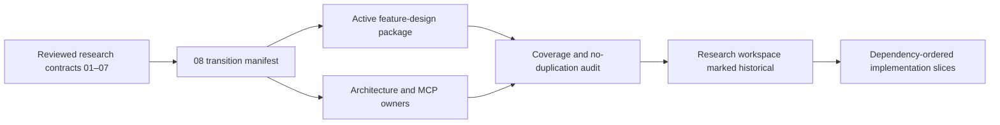

# Implementation and Active-Design Promotion

> **Status:** Completed historical transition record. Slice 01 promoted the reviewed contracts into GraphPilot's
> active feature, MCP, architecture, product, decision, testing, and delivery owners. Runtime implementation has
> not started.
>
> **Authority after promotion:** this file and research `00`–`07` are historical rationale only. Current intended
> behavior lives in `docs/02-design-and-features/08-context-backed-generation/` and
> `docs/01-architecture/03-mcp-tools/`; implementation proceeds through Epic 3's
> `04-context-backed-generation/` slice group.



## 1. Purpose and boundaries

This document has four jobs:

1. map every accepted research responsibility to one active documentation owner;
2. reconcile the target behavior with GraphPilot's existing services, schemas, entry points, tests, and
   local-file model;
3. define promotion stages and proof gates without copying the full contracts from their owners; and
4. establish the dependency order and the first safe implementation slice.

This document does **not**:

- redefine JSON 1, JSON 2, readiness facets, findings, calculations, generation provenance, or MCP
  transport;
- promote a first draft merely by mentioning it;
- authorize implementation from an unresolved research detail;
- become a second active design owner after promotion;
- require a database, authentication, remote context service, or frontend context-authoring UI; or
- authorize a commit or push before user verification.

The detailed research owners remain:

- [`01-workflows-and-prompts.md`](01-workflows-and-prompts.md) — end-to-end workflow and artifact lifecycle;
- [`02-evidence-manifest.md`](02-evidence-manifest.md) — JSON 1 evidence-manifest contract;
- [`03-diagram-request-context.md`](03-diagram-request-context.md) — JSON 2 request-context contract;
- [`05-readiness/`](05-readiness/README.md) — readiness architecture, private/final JSON, policy,
  calculation, findings, rubrics, fixtures, and stability;
- [`06-context-backed-generation-and-provenance.md`](06-context-backed-generation-and-provenance.md) —
  context population, grounded generation, provenance, trace, persistence, and rendering; and
- [`07-mcp-prompts-and-tool-contracts.md`](07-mcp-prompts-and-tool-contracts.md) — MCP tools, public host
  prompt, transport, errors, orchestration, attempt policy, and diagnostics.

## 2. Approved transition decisions

The promotion and implementation plan uses these accepted decisions:

1. The active feature contract becomes a package at
   `docs/02-design-and-features/08-context-backed-generation/`.
2. The active MCP contract becomes a package at `docs/01-architecture/03-mcp-tools/`, containing the
   existing diagram tools, the audited context tools, and the public host workflow contract.
3. Cross-cutting consequences are merged into their existing canonical product, architecture, schema,
   generation, validation, testing, decision, and navigation owners; those owners link to detailed
   contracts instead of restating them.
4. Promotion is staged by topic. The research workspace is marked historical only after all stages pass.
5. JSON 1 v1 does not contain extraction-tool provenance. Discovery tools remain optional host-side
   accelerators; their indexes, graph IDs, scores, confidence values, and raw output are non-canonical.
6. Canonical context paths use `.graphpilot/context/`; canonical diagrams use
   `.graphpilot/diagrams/`. No dual-write model is introduced by this plan.
7. `diagram_generate` becomes `diagram_generate_from_prompt`; the target MCP contract defines no old-name
   alias. The rename is a coordinated breaking change across code, tests, smoke clients, and docs.
8. The common MCP error envelope gains only optional `retryable` and `details` fields; existing required
   `code` and `message` behavior remains.
9. Canonical diagram provenance is additive and backward-compatible: diagrams without context provenance
   remain valid, loadable, editable, renderable, and savable.
10. The first code slice (group-local slice `02`, after the documentation-only promotion slice `01`) is the
    exact readiness-rubric catalog plus deterministic policy and calculation, tested fully offline. It does not
    include an LLM call, MCP tool, context persistence, or generation change.
11. Delivery lives in Epic 3 as the new `04-context-backed-generation/` extension group. Slice numbering is
    local to that group and starts at `01`; Epic 3's original core remains recorded as complete.
12. `DiagramFileService` remains the one low-level `.graphpilot` path and file-I/O owner. It gains clearly
    grouped context-artifact path/read/write methods, but not JSON 1/JSON 2 lifecycle, validation, digest-conflict,
    readiness, or generation policy.
13. Promotion establishes the first active baseline, not a frozen specification. Implementation discoveries
    update the active owner, decision index when consequential, dependent slice plan, tests, and slice outcome in
    the same coherent change; historical research is not rewritten to follow later implementation.

## 3. Current-system reconciliation

### 3.1 Reusable seams

| Current seam | Current responsibility | Reuse in the target design |
| --- | --- | --- |
| [`DiagramFileService`](../../../backend/services/shared/workspace_storage_service.py) | Workspace-root resolution, path safety, flat diagram naming, JSON loading, and atomic writes | Extend it as the one low-level `.graphpilot` file/path owner with grouped context-artifact methods; keep context validation, lifecycle, fingerprint, and conflict semantics outside it. |
| [`DiagramSchemaService`](../../../backend/services/shared/schema_registry.py) | Loads and caches the canonical diagram schema | Follow its cached-artifact pattern for context schemas; keep the diagram schema owner separate. |
| [`DiagramValidationService`](../../../backend/services/diagrams/validation/diagram_validation_service.py) | Deterministic canonical-diagram schema, structure, advisory type, and render-readiness validation | Keep unchanged in responsibility. Context readiness is a separate pre-generation concern and must not become another diagram-validation layer. |
| [`DiagramPersistenceService`](../../../backend/services/diagrams/persistence/diagram_persistence_service.py) | Validated diagram writes | Continue owning canonical diagram persistence; context artifacts use their own validation-gated persistence path. |
| [`DiagramGenerationService`](../../../backend/services/generation/pipeline/diagram_generation_service.py) | Prompt-to-logical generation, conforming, layout, canonical assembly, validation/repair, persistence, and render | Refactor internal reusable generation phases so prompt-backed and context-backed entry methods share downstream behavior without faking each other's input or provenance mode. |
| [`LLMClient` / `AzureLLMClient`](../../../backend/services/generation/llm_client.py) | Structured JSON generation with an injectable offline seam | Reuse the protocol and fake-client pattern for readiness review and grounded generation; keep reviewer and generator prompts/response schemas distinct. |
| [`mcp_server/server.py`](../../../backend/mcp_server/server.py) | Thin FastMCP wrappers over shared services and the base error envelope | Keep handlers thin; add tools and the public prompt only after shared context/readiness services exist. |
| [`diagram.json`](../../../backend/assets/schemas/diagram.json) | Canonical `.gp.json` contract | Add only the approved optional trace/provenance extension, with schema/type parity maintained. |
| [`diagram.ts`](../../../frontend/src/types/diagram.ts) | Frontend mirror and runtime guard for canonical diagrams | Add typed optional trace/provenance fields when the canonical schema changes; JSON 1/JSON 2 remain backend/MCP artifacts. |
| [`backend/tests/`](../../../backend/tests/) | Offline service, contract, MCP, API, generation, and artifact tests | Add tests in the matching `contracts`, `catalog`, `support`, `core`, `generation`, and `mcp_server` layers. |

### 3.2 Gaps that require new behavior

| Area | Current state | Target gap |
| --- | --- | --- |
| JSON 1 | No canonical evidence-manifest schema, validator, lifecycle service, fingerprint service, or persistence path | Add the machine schema and deterministic validation/fingerprint/persistence behavior from `02`. |
| JSON 2 | No request-context schema, manifest binding, reconciliation, or persistence path | Add the machine schema and deterministic reference/lifecycle validation from `03`. |
| Readiness | No rubric catalog, preflight, reviewer projection, reviewer call, policy calculator, finding assembler, or result contract | Add a separate readiness subsystem from `05-readiness/`. |
| Context persistence | Diagrams currently live directly under `.graphpilot/` | Add canonical evidence/request/diagram subpaths and digest-bound atomic replacement. |
| Context generation | Prompt generation has no JSON 1/JSON 2 population, final readiness gate, source citations, origins, or context trace | Add context population and orchestration around shared generation phases. |
| MCP | Current surface has no context tools or public workflow prompt | Add the audited six-tool surface and prompt from `07`; coordinate the direct-generation rename. |
| Frontend | Canonical metadata is open but provenance has no typed contract | Add optional canonical trace types only; no v1 JSON 1/JSON 2 authoring interface. |

### 3.3 Service-boundary recommendation

Implementation should preserve the current thin-entry-point/shared-service architecture:

```text
MCP tool / MCP prompt
  -> context application service
    -> context schema + validation services
    -> context artifact persistence
    -> readiness service
    -> context population
    -> shared generation/layout/diagram validation/persistence/render services
```

Recommended new responsibilities are:

- **Context schema catalog:** loads versioned JSON 1, JSON 2, private reviewer, final readiness-result,
  and rubric schemas/assets. It does not perform semantic review. A shared cached schema-loader abstraction is
  introduced only when these additional schema consumers exist.
- **Extended `DiagramFileService`:** remains the single low-level `.graphpilot` I/O owner and gains grouped
  path, directory, read, and atomic-write methods for canonical diagrams, evidence manifests, request packets,
  drafts, and diagnostics. It does not validate those artifacts or own their lifecycle/conflict policy.
- **Context persistence service:** owns safe-scope fingerprinting, JSON 1/JSON 2 validation-gated replacement,
  expected-digest concurrency, manifest binding, and no-op semantics while delegating every path/read/write to
  `DiagramFileService`.
- **Readiness rubric catalog:** selects one exact versioned rubric by supported diagram type and validates
  the rubric asset before use.
- **Readiness policy service:** pure deterministic applicability, assumption cap, score, finding ordering,
  and authoritative status calculation.
- **Readiness review service:** runs Layer 1, builds the bounded projection, performs one injected reviewer
  call for Layers 2/3, validates that output, then delegates Layer 4 to the policy service.
- **Context population service:** resolves selected claim versions, dispositions, decisions, and assumptions
  into the transient generation input without mutating JSON 1 or JSON 2.
- **Shared generation phases:** direct and context-backed orchestration reuse logical-output handling,
  conformance, layout, canonical assembly, diagram validation/refinement, persistence, and render delivery.
  Extraction occurs when context-backed generation becomes the second consumer, not as an earlier speculative
  refactor.
- **Context generation application service:** owns final readiness gating, context-stability checks,
  generation attempts, provenance validation, canonical persistence, render, and result assembly.

Names may be adjusted to existing conventions during a slice, but these responsibilities must not collapse
into MCP handlers or `DiagramValidationService`.

### 3.4 Architecture rationalization findings

A second review of the current API, MCP, frontend, validation, rendering, persistence, file, schema, and
generation call paths found no broad consolidation that should precede this feature:

- **Keep readiness separate from canonical diagram validation.** Readiness judges whether selected context is
  semantically sufficient before generation; `DiagramValidationService` deterministically checks the produced
  or edited canonical diagram.
- **Keep generation and persistence validation calls.** Generation needs a result to drive bounded refinement;
  persistence revalidates at the write trust boundary. Both share one validator instance and cached schema, so
  removing the second check weakens the validated-write invariant without removing a material bottleneck.
- **Keep renderer and frontend guards.** Renderer guards are deliberately minimal for fail-safe preview, while
  the frontend runtime guard protects the browser from malformed responses. Neither replaces backend domain
  validation.
- **Keep API and MCP adapters separate.** They perform protocol-specific parsing and error translation over
  shared services; merging them would mix HTTP and MCP concerns.
- **Reuse the existing structural critic.** One implementation already serves advisory validation and the
  stricter generation acceptance policy.
- **Make only enabling refactors.** Extend `DiagramFileService`, extract generation phases at the second
  consumer, and share schema loading after additional schemas exist. Any further merge requires demonstrated
  duplication, profiling evidence, or a concrete blocked workflow.

## 4. Target active documentation structure

### 4.1 Feature-design package

```text
docs/02-design-and-features/08-context-backed-generation/
  README.md
  01-workflow.md
  02-evidence-manifest.md
  03-diagram-request-context.md
  01-readiness/
    README.md
    01-readiness-reviewer.md
    02-policy-and-calculation.md
    03-reviewer-json.md
    04-results.md
    05-fixtures-calibration-and-stability.md
    rubrics/
      overview.md
      activity/
        rubric.json
        rubric.md
      use-case/
        rubric.json
        rubric.md
      bdd/
        rubric.json
        rubric.md
  05-generation-and-provenance.md
```

Ownership after promotion:

- package `README.md` owns navigation, read order, and topic ownership only;
- `01-workflow.md` owns the end-to-end feature flow and artifact lifecycle;
- `02-evidence-manifest.md` owns JSON 1;
- `03-diagram-request-context.md` owns JSON 2;
- `01-readiness/` preserves the existing readiness ownership split; and
- `05-generation-and-provenance.md` owns feature-level context population, grounded generation,
  provenance semantics, and trace behavior while linking to architecture owners for runtime placement.

### 4.2 MCP architecture package

```text
docs/01-architecture/03-mcp-tools/
  README.md
  01-diagram-tools.md
  02-context-tools.md
  03-context-workflow.md
```

Ownership after promotion:

- `README.md` owns MCP role, shared rules, complete tool/prompt index, and read order;
- `01-diagram-tools.md` owns the previous diagram tools and their updated direct-generation name;
- `02-context-tools.md` owns context transport, errors, and exact one-shot tool contracts; and
- `03-context-workflow.md` owns the public host prompt, adaptive consultation, typed-action execution,
  readiness loop, warning/override UX, attempt policy, and diagnostics.

The `docs/01-architecture/03-mcp-tools/` package replaces the former single-file MCP owner. The temporary
link-only transition stub is removed after all links resolve directly to the package.

## 5. Research-to-active promotion matrix

### 5.1 Primary documents

| Research source | Active canonical destination | Additional owner updates | Material that remains historical |
| --- | --- | --- | --- |
| [`01-workflows-and-prompts.md`](01-workflows-and-prompts.md) | `08-context-backed-generation/01-workflow.md` | System-design main flow; MCP workflow links | Research walkthrough wording, audit sequencing, and planned-doc notes |
| [`02-evidence-manifest.md`](02-evidence-manifest.md) | `08-context-backed-generation/02-evidence-manifest.md` | Backend artifact/fingerprint boundaries; decision log | Audit notes and the dropped extraction-provenance question |
| [`03-diagram-request-context.md`](03-diagram-request-context.md) | `08-context-backed-generation/03-diagram-request-context.md` | Backend persistence/reconciliation boundaries; decision log | Research status wording and superseded alternatives |
| [`05-readiness/`](05-readiness/README.md) | `08-context-backed-generation/01-readiness/` | Testing-strategy summary; generation/MCP links | Research-only navigation to old paths |
| [`06-context-backed-generation-and-provenance.md`](06-context-backed-generation-and-provenance.md) | `08-context-backed-generation/05-generation-and-provenance.md` | System/backend architecture, diagram schema, frontend types, generation design | Research status, implementation speculation superseded by this reconciliation, and repeated owner summaries |
| [`07-mcp-prompts-and-tool-contracts.md`](07-mcp-prompts-and-tool-contracts.md) | `03-mcp-tools/02-context-tools.md` and `03-mcp-tools/03-context-workflow.md` | MCP index, backend architecture, generation design, environment settings, tests | Research promotion notes and repeated definitions owned by 01–06 |
| [`00-original-handoff.md`](00-original-handoff.md) | None | Historical pointer only | Entire file |
| This `08` | None after transition | Historical record of the promotion | Entire file after closure |

### 5.2 Readiness package

| Research source | Active destination | Promotion rule |
| --- | --- | --- |
| [`05-readiness/README.md`](05-readiness/README.md) | `01-readiness/README.md` | Keep agent navigation and ownership only. |
| [`05-readiness/01-readiness-reviewer.md`](05-readiness/01-readiness-reviewer.md) | `01-readiness/01-readiness-reviewer.md` | Preserve four-layer architecture, status-first gate, override boundary, and bounded loop; exact MCP UX links outward. |
| [`05-readiness/02-policy-and-calculation.md`](05-readiness/02-policy-and-calculation.md) | `01-readiness/03-policy-and-calculation.md` | Preserve exact common policy, anchors, applicability, assumption cap, score, finding order, and status algorithm. |
| [`05-readiness/03-reviewer-json.md`](05-readiness/03-reviewer-json.md) | `01-readiness/04-reviewer-json.md` | Preserve exact private reviewer output, registries, typed actions, and deterministic validation. |
| [`05-readiness/04-results.md`](05-readiness/04-results.md) | `01-readiness/05-results.md` | Preserve the final backend-to-host result contract and invariants. |
| [`05-readiness/05-fixtures-calibration-and-stability.md`](05-readiness/05-fixtures-calibration-and-stability.md) | `01-readiness/06-fixtures-calibration-and-stability.md` | Keep detailed feature fixtures/calibration here; active testing strategy links to it and owns only cross-project test policy. |
| [`05-readiness/rubrics/overview.md`](05-readiness/rubrics/overview.md) | `01-readiness/01-rubrics/overview.md` | Preserve rubric selection and common navigation. |
| Activity, use-case, and BDD rubric pairs | Matching active `rubrics/<type>/rubric.json` and `rubric.md` | Preserve each normative machine-readable rubric and its human companion; backend assets derive from the JSON owners and are parity-tested. |

### 5.3 Existing canonical owners to update

| Existing owner | Merge only this responsibility |
| --- | --- |
| [`00-product-and-requirements/01-user-scenarios.md`](../../01-product/02-user-scenarios.md) | Repository-backed generation journey, user consultation points, warning acceptance, and final outcome. |
| [`00-product-and-requirements/02-requirements.md`](../../01-product/03-requirements.md) | User-visible, local-first, evidence, readiness, provenance, and fail-safe requirements. |
| [`01-architecture/00-system-design.md`](../../02-architecture/02-system-design.md) | New high-level flow, component boundaries, artifact sources of truth, and local runtime relationship. |
| [`01-architecture/01-backend-architecture.md`](../../02-architecture/03-backend.md) | New shared services, storage layout, path safety, atomic replacement, readiness/generation orchestration, and no-database boundary. |
| [`01-architecture/02-frontend-architecture.md`](../../02-architecture/04-frontend.md) | Optional trace-field compatibility and explicit absence of a v1 context-authoring UI. |
| `docs/01-architecture/03-mcp-tools/` | Complete public MCP surface and host workflow after package promotion. |
| [`01-architecture/04-api-routes.md`](../../02-architecture/05-api-routes.md) | Path implications for diagrams under `.graphpilot/diagrams/`; context authoring remains MCP-only unless separately designed. |
| [`02-design-and-features/00-diagram-json-schema.md`](../../03-design/03-diagram-json-schema.md) | Exact optional canonical element-origin and diagram-trace fields. JSON 1 and JSON 2 do not belong here. |
| [`02-design-and-features/02-validation-design.md`](../../03-design/05-validation.md) | Explicit distinction and handoff between context readiness and canonical diagram validation. Do not merge readiness layers into diagram validation layers. |
| [`02-design-and-features/04-generation-design.md`](../../03-design/07-generation.md) | Direct versus context-backed modes and shared downstream generation phases; detailed context contracts link to the new feature package. |
| [`02-design-and-features/decision-decisions.md`](../../05-delivery/04-decisions.md) | Accepted architectural/product decisions and any genuinely unresolved implementation decisions, as index rows rather than a duplicate spec. |
| [`03-development-and-delivery/00-development-environment.md`](../../04-development/01-environment.md) | New settings only when implementation introduces them; never credentials or values. |
| [`03-development-and-delivery/01-testing-strategy.md`](../../04-development/02-testing-strategy.md) | Offline seams, deterministic/readiness test layers, optional live-LLM coverage, and links to detailed calibration fixtures. |
| [`03-development-and-delivery/epics/03-mcp-generation-and-wrappers/00-epic.md`](../../07-history/epics/03-mcp-generation-and-wrappers/00-epic.md) | Preserve the original core completion and add the `04-context-backed-generation/` extension-group boundary and local slice index. |
| [`03-development-and-delivery/epics/00-current-state.md`](../../05-delivery/01-current-state.md) | Keep Epic 3 core complete and show the context-backed extension as planned/active only when its work actually starts; no research narrative. |
| [`docs/README.md`](../../README.md), [`AGENTS.md`](../../../AGENTS.md), and nearest package READMEs | Concise navigation, read order, and source-of-truth additions only. |

## 6. Staged promotion and gates

### Stage 0 — freeze the reviewed research input

- Confirm `01`–`07` links and complete JSON examples parse.
- Record the accepted removal of extraction provenance from JSON 1 v1.
- Reconcile any external audit edits made after this plan was drafted.
- Do not change a contract silently during movement; substantive changes return to its research owner first.

**Gate:** all source documents are readable, internally linked, and have an explicit status.

### Stage 1 — establish active feature owners

- Create `docs/02-design-and-features/08-context-backed-generation/`.
- Promote and rewrite research-facing status/handoff language into active design language.
- Preserve exact JSON/rubric contracts and their single-owner boundaries.
- Keep the new package README concise and agent-focused.

**Gate:** every feature-contract link resolves, JSON examples parse, and no active file points to research for
current behavior that the package now owns.

### Stage 2 — establish active MCP owners

- Create the `03-mcp-tools/` package.
- Move the existing tool contracts into `01-diagram-tools.md` without changing implemented behavior.
- Promote audited `07` transport/tool contracts into `02-context-tools.md`.
- Promote the public prompt/host loop into `03-context-workflow.md`.
- Update all links and source comments that name the old single-file MCP owner.

**Gate:** each public tool and prompt has exactly one active contract; existing implemented and planned states
remain distinguishable.

### Stage 3 — merge cross-cutting consequences

Update only the responsibilities in the matrix above. Prefer short summaries and links over copied schemas,
rubrics, or workflows.

**Gate:** no conflicting storage path, tool name, generation mode, validation boundary, or provenance shape
exists across active docs.

### Stage 4 — coverage audit and historical closure

Create a checklist row for every heading in `01`–`07` and each readiness file, with one of:

- promoted to an active owner;
- merged into a named cross-cutting owner;
- retained as rationale/history; or
- explicitly excluded/non-goal.

Then:

- update documentation navigation;
- simplify the research README to a historical pointer and owner map;
- mark the research workspace historical without deleting it;
- ensure active docs no longer instruct implementation from research; and
- run link, JSON-fence, Mermaid, and whitespace validation.

**Gate:** zero unmapped accepted sections, zero duplicate active owners, and zero broken local links.

## 7. Source-of-truth transition rules

Promotion is section-based, not merely file-based:

1. Before a row passes, the research owner remains authoritative for the proposal.
2. While a row is in motion, the active destination must identify itself as pending promotion and link back.
3. A row passes only after content, links, and cross-owner summaries are verified.
4. After a row passes, the active destination is authoritative and research is history for that topic.
5. The whole research folder becomes historical only when every row passes.
6. After closure, code slices cite active docs, not research or this transition plan.
7. `decision-decisions.md` records decisions; it does not reproduce the promoted contracts.
8. README files provide navigation and ownership only; they do not become substitute specifications.

### Active-design evolution during implementation

Promotion establishes the first active baseline; it does not freeze the design. For every implementation
slice:

1. begin from the current active owner and the previous slice outcomes, never from stale research;
2. when code or a failing fixture exposes a missing constraint, pause the affected behavior and update its
   active owner before or with the implementation;
3. add a concise decision-index row when scope, public behavior, architecture, compatibility, or ownership
   changes;
4. update affected dependent slice docs and tests in the same coherent change;
5. record plan-versus-result, deviations, decisions, verification, and follow-ups in that slice's `## Outcome`;
   and
6. keep the research package historical after promotion rather than rewriting it to match later discoveries.

A discovered implementation detail may refine an active contract, but it must not silently weaken readiness,
path safety, provenance, validation, or no-hidden-mutation invariants.

## 8. Epic 3 delivery group and dependency-ordered implementation plan

The work is an Epic 3 extension, not a new epic. Epic 3's original core remains complete; this group adds a
new independently tracked phase:

```text
docs/03-development-and-delivery/epics/03-mcp-generation-and-wrappers/
  04-context-backed-generation/
    00-group.md
    01-active-design-promotion.md
    02-readiness-rubric-and-policy.md
    03-evidence-and-request-schemas.md
    04-context-persistence.md
    05-readiness-preflight-and-projection.md
    06-semantic-reviewer.md
    07-context-mcp-tools.md
    08-context-population-and-provenance.md
    09-shared-generation-phases.md
    10-context-generation-and-workflow.md
    11-diagnostics-and-release-gate.md
```

Slice numbering is local to this phase folder and starts at `01`; it does not continue the historical global
numbers used by older Epic 3 groups. `00-group.md` owns the stable group goal, boundaries, dependencies, and
slice index. Each numbered slice ends with `## Outcome` and follows the active-design evolution loop in Section 7.

### `01-active-design-promotion.md`

- Deliver promotion Stages 1–4 above with no runtime behavior change.
- Record this architecture-rationalization review as the implementation baseline.
- Create/update active owners, decision rows, navigation, and research historical closure.

### `02-readiness-rubric-and-policy.md`

Implement the first bounded, offline foundation described in Section 9.

### `03-evidence-and-request-schemas.md`

- Resolve implementation-level payload schemas, reference patterns, IDs, bounds, canonical serialization,
  and digest rules without changing the accepted semantics.
- Add versioned JSON Schema artifacts and cached loaders.
- Add deterministic standalone validation and fixtures.
- Keep extraction-tool provenance absent from JSON 1 v1.

### `04-context-persistence.md`

- Extend `DiagramFileService` with grouped context and canonical-diagram directory/path/read/write methods.
- Keep validation, source-fingerprint semantics, expected-digest policy, manifest binding, and reconciliation
  in the context persistence/application boundary rather than the file service.
- Add canonical evidence/request/diagram paths, safe-scope fingerprinting, digest calculation,
  expected-digest replacement, no-op behavior, JSON 1 draft promotion, and inline JSON 2 replacement.
- Coordinate backend, API, MCP, frontend browsing, tests, and docs for the diagram-path cutover without
  automatically moving or deleting existing files.

### `05-readiness-preflight-and-projection.md`

- Implement manifest/request/reference/bounds preflight.
- Build the bounded full-detail plus active-claim-index projection.
- Return deterministic `invalid` results without an LLM call.

### `06-semantic-reviewer.md`

- Add a dedicated reviewer prompt and structured-output schema.
- Reuse the injectable LLM protocol/fake pattern.
- Validate/canonicalize private output and run the deterministic policy from slice `02`.
- Add offline end-to-end tests using fixed fake reviewer results; keep real-Azure tests opt-in.

### `07-context-mcp-tools.md`

Implement `context_evidence_status`, `context_evidence_save`, `context_request_save`, and
`context_readiness_assess` as thin wrappers. Extend the common error helper additively.

### `08-context-population-and-provenance.md`

- Resolve JSON 1/JSON 2 into the transient prepared generation input.
- Add exact origin/trace schema fields and frontend type/runtime-guard parity.
- Add deterministic provenance validation and context-stability checks.
- Keep diagrams with absent provenance backward-compatible.

### `09-shared-generation-phases.md`

- Extract shared logical-output, conformance, layout, canonical assembly, diagram validation/refinement,
  persistence, and render-delivery phases from the current direct-generation module.
- Preserve direct prompt generation behavior and verification before adding the second consumer.
- Do not merge readiness with canonical diagram validation or bypass persistence validation.

### `10-context-generation-and-workflow.md`

- Add context-backed orchestration with mandatory final readiness and bounded generation/refinement attempts.
- Add provenance validation, persistence, render, and partial-render-success behavior.
- Coordinate `diagram_generate` to `diagram_generate_from_prompt` with no alias.
- Add `diagram_generate_from_context` and register `context_backed_generation_workflow`.
- Expand handler tests and the real stdio smoke test.

### `11-diagnostics-and-release-gate.md`

- Add opt-in safe readiness debug records.
- Run deterministic fixtures, semantic human-labeled calibration, and repeated-run stability checks.
- Verify path cutover and required frontend follow-through.
- Do not persist prompts, raw model output, source content, secrets, or hidden reasoning.
- Keep provenance/readiness UI outside scope unless separately designed and approved.

## 9. First code slice (`02-readiness-rubric-and-policy.md`) — exact scope

### 9.1 Goal

Turn the most fully specified part of the research—the exact per-type rubrics and deterministic readiness
policy—into executable, offline backend assets and pure policy code.

### 9.2 Proposed target areas

Final names should match nearby conventions, but the slice should be limited to areas equivalent to:

```text
backend/assets/readiness/
  rubrics/
    activity.v1.json
    use-case.v1.json
    bdd.v1.json
backend/services/diagrams/catalog/readiness_rubric_service.py
backend/services/readiness/readiness_contract.py
backend/services/context/readiness_policy_service.py
backend/tests/catalog/test_readiness_rubric_service.py
backend/tests/core/test_readiness_policy_service.py
```

The machine rubric assets must be copied/generated from the promoted exact rubric owners and protected by a
parity test; they must not become a separately hand-maintained definition.

### 9.3 Test-first contract

Write failing tests for at least:

1. one rubric exists for each generatable MVP type and not for `custom`;
2. rubric identity/version/diagram type are stable and unique;
3. every facet has a unique key, valid mode, positive weight, purpose, and complete `0..4` anchors;
4. required and conditional applicability rules use only the allowed structure;
5. included-facet and denominator calculation excludes non-applicable facets exactly;
6. the assumption cap limits assumption-backed effective ratings to `3` and emits the required warning;
7. weighted score calculation and rounding match the documented fixtures;
8. blocking findings force `needs_context` regardless of score;
9. warning findings produce `ready_with_warnings` when no blocker exists;
10. no findings produce `ready`;
11. invalid input combinations fail deterministically rather than being guessed or repaired; and
12. finding assembly order is stable.

### 9.4 Explicit non-scope

This slice does not add:

- JSON 1 or JSON 2 machine schemas;
- repository fingerprinting or file persistence;
- Layer 1 request/manifest preflight;
- a reviewer prompt or Azure call;
- an MCP tool or public prompt;
- context population, generation, provenance, rendering, or frontend behavior; or
- a commit before user verification.

### 9.5 Verification

From `backend/`:

```text
uv run python manage.py test tests.catalog.test_readiness_rubric_service
uv run python manage.py test tests.core.test_readiness_policy_service
uv run python manage.py test
```

The full suite must remain offline and require no Azure key.

**Exit gate:** exact rubric assets load and validate, deterministic fixtures pass, the full backend suite passes,
and no runtime path can invoke an LLM or write a workspace file through this slice.

## 10. Compatibility and migration policy

### Storage cutover

The target canonical layout is:

```text
.graphpilot/
  context/
    evidence/
    requests/
  diagrams/
```

The storage slice updates backend, API, MCP, frontend browsing, tests, docs, and examples together. It must not
silently move or delete existing flat files. If a one-time migration is later desired, it requires a separately
specified and explicitly approved operation. The target runtime does not dual-write old and new locations.

### Direct-generation rename

The target contract has `diagram_generate_from_prompt` and no `diagram_generate` alias. The rename occurs only
when all current references, tests, smoke clients, and docs can change atomically. It must not be smuggled into an
unrelated readiness or schema slice.

### Error envelope

`retryable` and `details` are optional additions. Existing `code` and `message` remain required. An implementation
must verify current clients tolerate unknown optional fields before broad use.

### Canonical diagram provenance

New trace/origin fields are optional and versioned within the existing canonical schema strategy. Existing
prompt-generated or manually edited diagrams remain valid. Direct prompt generation must not fabricate grounded
claim citations.

### Reviewer/generator failure

Reviewer unavailability, oversized context, and invalid structured output fail safely. Direct prompt generation
remains a separate explicit mode; no fallback may label an unreviewed direct result as context-backed.

## 11. Frontend disposition

The v1 evidence workflow is IDE/MCP-driven. The browser continues to load, edit, validate, save, preview, and
export canonical diagrams.

Required frontend work is limited to:

- accepting and preserving optional canonical trace/provenance fields;
- maintaining schema/type/runtime-guard parity;
- following the canonical diagram path after storage cutover; and
- remaining robust when provenance is absent.

The following are deferred until separately designed:

- browsing or editing JSON 1/JSON 2;
- showing readiness actions or overrides;
- evidence/claim inspection;
- provenance panels; and
- triggering the context-backed workflow from the browser.

## 12. Implementation details still to settle

These details do not block the first code slice (`02`), but must be settled in their owning slice before code
is written:

- exact JSON 1 claim-kind payload schemas and bounded sizes;
- exact ID formats, canonical JSON serialization, digest algorithm/version fields, and compaction policy;
- exact source-fingerprint file enumeration and exclusion implementation;
- exact grouping and naming of the new context-artifact methods within `DiagramFileService`;
- deployment-derived reviewer/generator token-budget settings and contributor accounting;
- optional debug-record retention/location; and
- whether any future one-time flat-diagram migration is offered.

Each becomes **specified** in the active owner or slice design before becoming **implemented**. None may be
silently invented inside an MCP handler.

## 13. Verification and historical-closure checklist

### Documentation

- [x] Every research heading has a promotion-matrix disposition.
- [x] Every active topic has one canonical owner.
- [x] Active owner READMEs are concise navigation documents.
- [x] All local Markdown links resolve.
- [x] Complete JSON examples and rubric assets parse.
- [x] Mermaid render validation remains opt-in and was not requested for this promotion.
- [x] No active doc describes research as implemented behavior.
- [x] No active doc points to research for current design after its row passes.
- [x] `git diff --check` passes.

### Future implementation architecture and contract gates

- [ ] Context readiness remains separate from canonical diagram validation.
- [ ] MCP handlers remain thin.
- [ ] JSON 1/JSON 2 semantic authorship remains with the host; backend mutation is validation-gated.
- [ ] Every canonical write is path-safe and atomic.
- [ ] Expected digests prevent blind overwrite.
- [ ] Context generation always performs final readiness.
- [ ] Direct and context-backed generation cannot masquerade as each other.
- [ ] Provenance is deterministic, bounded, and backward-compatible.

### Future implementation testing gates

- [ ] New deterministic units run without Azure credentials.
- [ ] Fake reviewer/generator seams cover semantic orchestration offline.
- [ ] Real-provider checks remain explicit operator-triggered tests.
- [ ] Existing backend and frontend verification remains green after affected slices.
- [ ] Calibration and repeated-run targets pass before semantic readiness is release-ready.

### Historical closure

- [x] All promotion stages pass.
- [x] Active navigation and decision logs are updated.
- [x] The research README points to active owners and says historical.
- [x] `00`–`08` remain available only as rationale/history.
- [x] Delivery planning and code cite active owners rather than research.

## 14. Completion definition

This transition is complete only when:

1. the active feature and MCP packages exist;
2. every cross-cutting owner contains its assigned responsibility;
3. every accepted research section has exactly one active destination;
4. active links, JSON, diagrams, and ownership checks pass;
5. the research workspace is marked historical; and
6. Epic 3 group-local slice `02-readiness-rubric-and-policy.md` can be executed using active docs alone.

The transition is complete. The immediate next action is user verification of group-local slice
`01-active-design-promotion.md`; the first deterministic readiness code slice (`02`) follows only after that gate.
No commit occurs until the user runs or approves the supplied verification steps.
