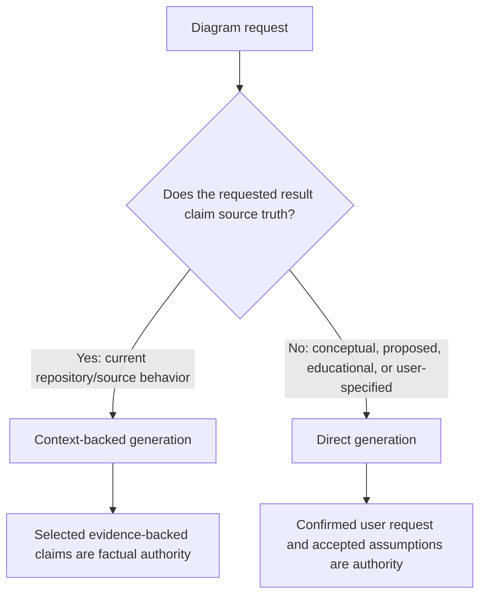

# Goals and Generation-Mode Boundaries

> **Status: accepted working direction; not active authority.** This document owns the research distinction
> between direct and context-backed generation. Exact contracts remain in later package documents.

## Problem

Context-backed generation has stronger request framing, bounded source authority, readiness, provenance, and
machine-readable LLM input. Direct generation still receives one large rendered Markdown user message and may
infer too much from a terse prompt. The redesign should improve direct request fidelity and shared generation
quality without making direct mode pretend to be repository-grounded.

## Goals

- Make direct generation accurate with respect to confirmed user intent.
- Preserve a cheaper conceptual path when repository evidence is unnecessary or unavailable.
- Route repository-truth requests to context generation rather than silently falling back to direct generation.
- Give direct and context inputs a consistent machine-readable layout where semantics genuinely overlap.
- Keep factual authority, inference, readiness, and provenance mode-specific.
- Add optional shared post-generation semantic review without weakening deterministic validation.
- Make prompt/example/schema/rubric versions explicit and consistently named.
- Support controlled quality, latency, call-count, and token experiments before promotion.

## Non-goals

- Making direct output evidence-grounded without evidence.
- Creating JSON 1 or JSON 2 for brainstorming or ordinary conceptual diagrams.
- Adding a separate backend LLM solely to normalize natural language before generation.
- Allowing direct generation to bypass context readiness when grounded generation is blocked.
- Combining direct and context into one ambiguous authority mode.
- Persisting a new direct-request sidecar before regeneration/editing has a concrete consumer.
- Implementing best-of-N candidate generation in the first proof.

## Authority model



| Concern | Direct | Context |
| --- | --- | --- |
| Primary authority | Confirmed user request and requirements | Selected exact JSON 1 claim versions |
| Intended viewpoint | Conceptual, proposed, user-specified | Current managed source truth (`as_implemented` in V1) |
| Conventional inference | Allowed within the request policy | Forbidden for unsupported repository meaning |
| Host-owned assumptions | Allowed and disclosed | Never become repository truth |
| User assumptions | Allowed | Allowed only through the context contract/policy |
| Readiness review | No repository-context readiness | Mandatory |
| Element origins | Not required | Required |
| Provenance allowlists | Not applicable | Required |
| Typical runtime overhead | Lower | Higher due to evidence/readiness/provenance work |

## Direct use cases

- Greenfield architecture before code exists.
- Proposed future design that intentionally differs from current implementation.
- Brainstorming and workshops.
- Teaching and notation examples.
- A complete user-supplied design specification.
- A quick conceptual sketch before deciding whether full repository analysis is warranted.

## Context use cases

- “Diagram this repository.”
- Current authentication, deployment, data, workflow, or architecture behavior.
- Diagrams that claim correspondence with local source or managed documents.
- Regeneration after source change where traceability matters.
- Any request whose correctness depends on inspecting a local artifact outside the confirmed conversation.

## Routing rule

The unified generation workflow begins with authority classification. Its direct branch is selected only after
source-truth requests are routed to the context branch. Ambiguous requests ask one focused question, for example:

> Do you want a conceptual design proposal, or a diagram of the repository's current implementation?

The direct branch may use the conversation and explicitly user-supplied statements. It does not inspect local
source to establish implementation facts. Local authoritative documents route through the context branch.

## Product language

The implementation names may remain explicit, but user-facing language should communicate trust rather than
transport:

| Technical path | Candidate user-facing label | Promise |
| --- | --- | --- |
| Direct generation | Quick Concept / Guided Design | Faithful to confirmed user intent; may use stated inference |
| Context generation | Grounded from Repository | Evidence-managed, readiness-gated, origin-traceable |

## Quality levels

Quality policy is orthogonal to authority:

```text
Direct + standard  = confirmed conceptual request + deterministic validation
Direct + reviewed  = above + semantic candidate review
Context + standard = readiness + grounding/provenance + deterministic validation
Context + reviewed = above + grounded semantic candidate review
```

A reviewed direct diagram is still conceptual. A standard context diagram is still grounded. Quality review does
not change the authority source.

## Accepted boundaries

- Direct and context share downstream conformance, layout, canonical assembly, persistence, and rendering where
  their inputs permit.
- Direct/context adapters and prompts remain separate.
- Similar JSON layout must not add empty claim/provenance fields to direct mode or user requirements to context
  as competing factual authority.
- Every result and trace identifies its generation mode and contract versions.
