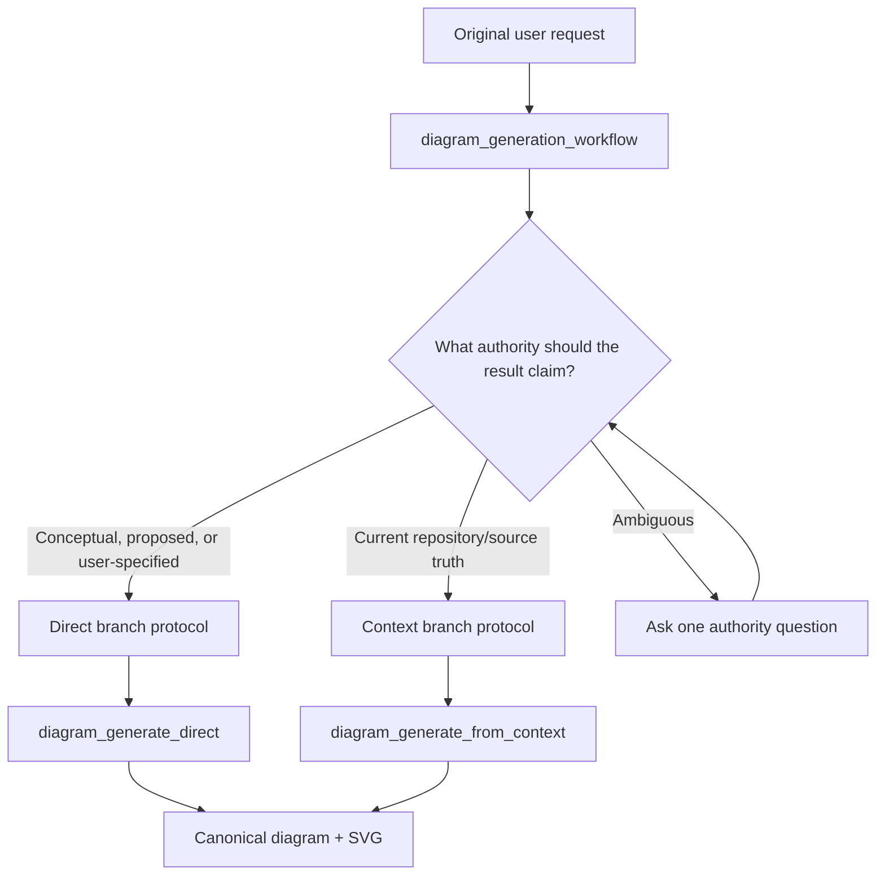

# Unified Diagram Generation MCP Workflow

> **Status: accepted workflow architecture; exact prompt text and public result schemas remain open.** This
> document owns the proposed single public `diagram_generation_workflow`, its authority router, and its internal
> direct/context branch protocols.

## Public surface

Expose one public MCP prompt:

```text
diagram_generation_workflow
```

The host follows it to choose exactly one authority branch:



Do not register separate public direct and context workflow prompts. Internal branch templates may remain modular
for maintainability, but the user/host sees one generation workflow entry point.

## Prompt arguments

| Field | Required | Meaning |
| --- | --- | --- |
| `workspaceDir` | Yes | Existing target workspace for generated artifacts/context |
| `request` | Yes | Original user request preserved verbatim |
| `interactionPreference` | No | `autonomous`, `balanced`, or `collaborative`; defaults to `balanced` |
| `persistGenerationTrace` | No | Persist compact generated-diagram trace sidecar; defaults to `false` |
| `persistGenerationDebug` | No | Explicit per-workflow local diagnostics toggle; defaults to `false` |

`interactionPreference` belongs only to host orchestration and is neither persisted in a request nor sent to a
diagram generator. `persistGenerationTrace` and `persistGenerationDebug` are independent workflow-only booleans.
Trace writes a compact successful-diagram sidecar; debug creates one safe run ID and passes strict internal
diagnostics objects with that ID to readiness/generation tools. Neither has an environment default, changes
semantic acceptance, or adds model/review metadata to canonical diagram JSON.

| Preference | Behavior |
| --- | --- |
| `autonomous` | Use reasonable allowed defaults; ask on authority/type conflict or no safe default |
| `balanced` | Ask when authority, type, scope, required meaning, or material assumptions are ambiguous |
| `collaborative` | Present framing and material assumptions/acceptance choices before generation |

The transport is a required bounded enum when supplied; balanced adaptive behavior is the default.

## Prompt behavior

The MCP prompt returns instructions. It does not inspect files, call Azure, or write artifacts itself. The host uses
conversation/repository tools and bounded GraphPilot MCP tools according to the selected branch. The backend remains
stateless between public calls except for canonical workspace artifacts.

The original request is embedded in an explicit data delimiter. The host treats it as user request data, not as a
replacement for workflow rules.

## Shared rules

- Preserve the original request verbatim.
- Select one branch before authoring mode-specific inputs.
- Do not mix direct requirements with context claims as competing factual authority.
- Do not represent a direct diagram as repository-grounded.
- Do not inspect source for implementation facts and then call the direct generator.
- Do not fall back to direct generation when context readiness/generation is blocked.
- A user may explicitly change the goal from grounded to conceptual; that starts a new direct request rather than
  disguising a failed grounded attempt.
- Generate once after the selected branch is ready/accepted.
- Do not reroll unchanged input merely seeking stochastic success.
- Recover a render failure from the saved canonical diagram; never regenerate for an image.
- Report the selected generation mode and material assumptions/acceptances truthfully.

## Authority routing

### Context branch

Select context for requests such as:

- diagram this repository/workspace/source/document as implemented;
- show how authentication/deployment/data flow currently works;
- update a diagram to match source;
- use a local artifact as factual authority;
- preserve evidence-backed provenance or reconcile source changes.

### Direct branch

Select direct for:

- greenfield/conceptual design;
- proposed/future architecture;
- brainstorming;
- educational/notation examples;
- exact user-specified design content;
- requests that delegate reasonable conceptual decisions to the host.

### Ambiguous request

Ask one focused question:

> Do you want a conceptual design proposal, or a diagram of this workspace's current implementation?

Do not inspect source merely to avoid asking an authority question.

## Direct branch protocol

### 1. Select type

| Intent | Primary type |
| --- | --- |
| Process, decisions, concurrency, data movement, outcomes | Activity |
| People/external systems and goals/capabilities | Use case |
| Components, ownership, interfaces, properties, constraints | BDD |

Ask only when multiple types create materially different answers.

### 2. Frame request

Gather one self-contained `graphpilot.direct.diagram-request.v1` containing:

- verbatim original request;
- normalized goal;
- diagram type;
- audience;
- detail level;
- included/excluded scope;
- typed plain-language requirements;
- material assumptions;
- presentation decisions;
- exact safe diagram name;
- style if retained by the final request contract.

### 3. Type-specific completeness

Use a host checklist without pre-building GraphPilot topology.

**Activity:** trigger, actions/responsibility, decisions/conditions, concurrency, outcomes, relevant data movement.

**Use case:** subject, human/external actors, goals/participation, reused behavior, extensions, specialization.

**BDD:** structural subject, blocks, ownership/references, relationships/generalization, properties/multiplicities,
interfaces/ports, constraints.

The host writes plain requirements; the generator maps them to exact `semanticType`s and topology.

### 4. Assumptions and adaptive consultation

- `owner: user` means explicitly stated/adopted by the user.
- `owner: host` means selected under delegated conceptual design authority.
- Host-owned assumptions require a reasonable conventional choice and cannot contradict user requirements.
- If no safe default exists, ask the user.
- Ask one grouped question when several related material choices remain.
- A detailed unambiguous request may proceed without an explicit wait; material host assumptions remain visible.

### 5. Persist request and generate once

Call the shared `diagram_request_save` tool to validate and persist the complete direct request under
`.graphpilot/requests/` using complete replacement and expected-digest concurrency control. Then pass its canonical
request path to `diagram_generate_direct`. There is no raw prompt-only contract. The backend adds vocabulary,
guidance, rules, examples, versions, strict logical schema, and configured quality mode.

## Context branch protocol

The context branch retains the evidence-managed lifecycle:

1. Check canonical JSON 1 freshness.
2. If missing/stale, inspect the complete safe source scope and author/reconcile one complete evidence manifest.
3. Author/reconcile one complete context diagram request (historical JSON 2) bound to current JSON 1 identity/digest.
4. Persist it through the shared `diagram_request_save` tool under `.graphpilot/requests/`.
5. Assess readiness.
6. Follow validated actions: existing claims first, focused source search second, user authority only when needed.
7. Save actual JSON 1/request changes and reassess; never rerun unchanged readiness input seeking a different result.
8. Select one exact accepted generation policy (`require_ready`, `allow_warnings`, or permitted user-authorized
   `force_with_gaps`).
9. Call `diagram_generate_from_context` once; the tool performs mandatory final readiness.
10. Report readiness summary, canonical diagram/SVG paths, grounded provenance state, and stage-correct warnings.

The context branch never calls `diagram_generate_direct` as a fallback for repository-grounded claims.

## Shared request persistence tool

```text
diagram_request_save(
  workspaceDir,
  requestPath,
  expectedRequestDigest,
  candidate
)
```

- canonical path is `.graphpilot/requests/<diagramName>.gp-request.json`;
- candidate is a discriminated `directDiagramRequest | contextDiagramRequest`;
- `schemaVersion` and `kind` must agree;
- mode-specific validators remain separate;
- complete replacement, expected digest, canonicalization, and atomic write are shared;
- mode/request ID/diagram name are immutable;
- after a successful owned diagram exists, V1 treats the request as finalized;
- result returns request path, digest, and kind.

The former context-only request-save surface is replaced cold turkey; there is no public third base schema.

## Two bounded generation tools

Keep separate one-shot tools because their authority/input contracts differ:

```text
diagram_generate_direct
  input: workspaceDir + canonical direct requestPath

diagram_generate_from_context
  input: workspaceDir + canonical context requestPath + exact generationPolicy
```

Both accept strict tool-level diagnostics objects. The unified workflow exposes only the simple
`persistGenerationDebug` boolean, owns the shared run ID, and translates it into readiness/generation diagnostics
transport. Do not create one polymorphic generation tool with optional requirements, claims, origins, and policies.

## Generation result contracts

Use two public schemas with a shared internal base:

```text
graphpilot.direct.generation-result.v1
graphpilot.context.generation-result.v1
```

Every result contains:

- `outcome: generated | blocked`;
- `generationMode`;
- request ID/path/digest;
- canonical diagram path;
- nullable SVG path and edit URL when generated;
- bounded goal/material assumption/material decision summary;
- always-present quality object;
- separate operational warnings.

Context results additionally carry final readiness:

- generated: compact status/score/policy/rubric plus exact accepted warning IDs/messages/consequences;
- blocked: complete bounded actionable final readiness result.

`blocked` is a normal MCP result (`isError: false`) because the gate worked and the host needs findings/actions.
Provider, contract, unsafe-path, invalid-response, persistence, and other technical failures use `OperationProblem`
with MCP `isError: true`.

Canonical JSON persistence defines generation success. SVG render failure does not create `partial_success`:

```text
outcome: generated
diagramPath: present
svgPath: null
operationWarnings: [render_failed]
```

Semantic findings live under `quality.findings`; render/diagnostic/runtime warnings live under
`operationWarnings`. The quality object always reports:

```text
mode: standard | reviewed
reviewStatus: not_run | clean | warnings | blocked
semanticRepairRoundsUsed
bounded findings
```

Warnings may be generated; blocking findings after the configured repair budget return `blocked` and write no
canonical diagram.

## MCP enforcement limitation

MCP does not let a tool prove that a host fetched a prompt. Enforcement is therefore outcome/contract based:

- only `diagram_generation_workflow` is a supported public prompt;
- no raw prompt-only generation tool remains;
- direct generation requires a complete validated direct request;
- context generation requires canonical JSON 2 and exact policy;
- tool descriptions identify generation tools as workflow-owned primitives;
- docs expose no supported bypass sequence.

A sophisticated caller may manually construct a valid request, but cannot bypass its required framing fields.

## Internal modularity

The public prompt may be composed from internal templates without registering those templates as MCP prompts:

```text
backend/assets/prompts/
  diagram-generation-workflow.md
  branches/
    direct-generation-branch.md
    context-generation-branch.md
```

Shared rules live once. Branch templates remain independently reviewable/testable. The rendered public prompt must
be tested for complete route instructions and bounded size; exact composition mechanism remains implementation
detail.

## Stage-correct recovery

| Outcome | Host behavior |
| --- | --- |
| Authority mismatch | Switch branch before generation; never relabel output afterward |
| Direct request validation | Repair/reconfirm complete request |
| Context artifact/readiness issue | Continue context lifecycle; never direct fallback |
| Provider unavailable | Report actual stage; do not mutate intent |
| Structural/provenance failure | Respect bounded backend repair/result |
| Semantic review failure | Present exact findings; change authority only through branch-owned request/context updates |
| Name conflict | Reconcile host-owned identity through the selected branch |
| Render failure after save | Render saved canonical diagram only |
| Unchanged failed input | Do not blind-reroll |

## Accepted decisions

- Exactly one public MCP generation prompt: `diagram_generation_workflow`.
- It routes to one internal direct or context branch based on requested authority.
- Separate public direct/context workflow prompts are removed with no aliases under the V1 cold-turkey policy.
- Internal direct/context branch templates may remain separate but are not registered MCP prompts.
- `interactionPreference` is `autonomous | balanced | collaborative`, defaults to `balanced`, and is workflow-only.
- `persistGenerationTrace` and `persistGenerationDebug` are independent explicit workflow booleans, both default
  `false`. Trace writes a compact successful-diagram sidecar; debug propagates one safe run ID/settings across all
  reached stages.
- Shared `diagram_request_save` persists both request schemas under `.graphpilot/requests/`.
- Two bounded generation tools remain: `diagram_generate_direct` and `diagram_generate_from_context`.
- Direct/context results use parallel public schemas and the common result behavior above.
- `blocked` is a normal actionable outcome; actual failures use `OperationProblem`.
- Canonical JSON persistence defines success; render failure is an operational warning, not partial success.
- Quality is always explicit; semantic and operational warnings remain separate.
- Successful results include bounded goal/assumption/decision summaries plus exact request reference.
- No direct fallback from a blocked grounded workflow.

## Still open

- Exact prompt text, branch-template composition, and rendered size bound.
- Formal request-save/direct/context result JSON Schemas and bounded finding/action shapes.
- Exact `OperationProblem` codes/details for each stage.
- Public wording that marks tools workflow-owned while remaining discoverable.
