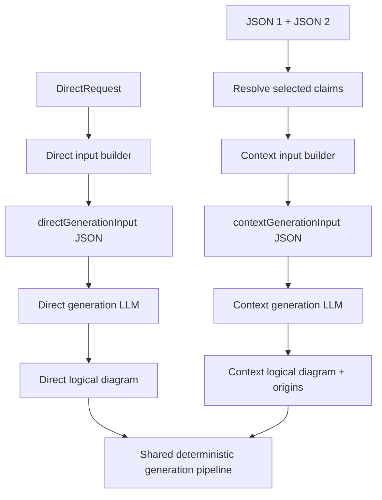

# Generation Inputs and Prompt Packaging

> **Status: architecture accepted; exact schemas and prompt text remain proposed.** This document owns the
> research design for parallel direct/context generator packets, Azure message packaging, logical output, and
> structured repair. It does not replace the active generation design.

## Core direction

Both generation modes use one role-specific canonical JSON user message, one concise role-specific system prompt,
and one strict out-of-band logical response schema. Strict Azure `json_schema` support is required for generation,
readiness review/repair, semantic review, and semantic repair; the current silent `json_object` fallback is removed
and unsupported deployments return `structured_output_unsupported` without a hidden second call.



No separate backend LLM call is added solely to normalize natural language. The mandatory MCP host workflow
frames the direct request before the backend call.

## Current direct packaging

The current direct service sends:

```text
system: short generator identity
user: large rendered generate.md
response_format: LOGICAL_SCHEMA
```

The Markdown user message embeds vocabulary, guidance, rules, examples, style, raw prompt, and a textual output
skeleton. The redesign replaces only the role-specific input packaging; shared deterministic phases remain.

## Target Azure request envelope

Conceptually:

```json
{
  "model": "configured-deployment",
  "messages": [
    {
      "role": "system",
      "content": "<role-specific instructions>"
    },
    {
      "role": "user",
      "content": "<canonical generation-input JSON string>"
    }
  ],
  "response_format": {
    "type": "json_schema",
    "json_schema": {
      "name": "<schema name>",
      "schema": {},
      "strict": true
    }
  },
  "reasoning_effort": "<configured value>"
}
```

The original human request is data inside the JSON user message, not a third chat message.

## Parallel top-level layout

Use the same section order where concepts genuinely overlap:

```text
1. Contract identity
2. Request/output identity
3. Request and scope
4. Mode-specific authority
5. Assumptions and decisions
6. Diagram model
7. Mode-specific constraints
8. Examples
9. Contract versions
```

Do not add empty claim/provenance fields to direct mode or direct requirements to context mode merely for symmetry.

## Direct generation input

Working ID and kind:

```text
schemaVersion: graphpilot.direct.generation-input.v1
kind: directGenerationInput
```

Illustrative shape:

```json
{
  "schemaVersion": "graphpilot.direct.generation-input.v1",
  "kind": "directGenerationInput",
  "diagramName": "event-driven-order-platform",
  "diagramType": "bdd_diagram",
  "request": {
    "original": "Design an event-driven order-processing architecture.",
    "goal": "Explain service responsibilities and event interactions.",
    "diagramType": "bdd_diagram",
    "audience": "Platform and application developers",
    "detailLevel": "standard"
  },
  "scope": {
    "included": ["Order Service", "Payment Service", "Event Bus"],
    "excluded": ["Deployment infrastructure"]
  },
  "requirements": [
    {
      "id": "requirement-order-event",
      "kind": "behaviorStep",
      "statement": "Order Service publishes an order-created event."
    }
  ],
  "assumptions": [
    {
      "id": "assumption-event-delivery",
      "statement": "Event delivery is at least once.",
      "reason": "Delivery behavior is required for the conceptual design.",
      "origin": "host",
      "acceptedBy": "host",
      "acceptedAt": "2026-07-16T12:00:00Z"
    }
  ],
  "decisions": [],
  "diagramModel": {
    "nodeVocabulary": [],
    "edgeVocabulary": [],
    "semanticGuidance": [],
    "structuralRules": []
  },
  "examples": [],
  "versions": {
    "promptVersion": "graphpilot.direct.generation-prompt.v1",
    "logicalSchemaVersion": "graphpilot.direct.logical-diagram.bdd.v1"
  }
}
```

### Direct authority

- Original/normalized request, scope, requirements, and finalized assumptions are authority.
- Conventional inference is allowed only within that authority.
- No repository claims, evidence, claim allowlists, or origins appear.
- The system prompt clearly labels the output conceptual rather than source-verified.

## Context generation input

Standardized target ID and existing kind:

```text
schemaVersion: graphpilot.context.generation-input.v1
kind: contextGenerationInput
```

Illustrative shape:

```json
{
  "schemaVersion": "graphpilot.context.generation-input.v1",
  "kind": "contextGenerationInput",
  "requestId": "request-order-processing",
  "diagramName": "order-processing",
  "diagramType": "activity_diagram",
  "request": {},
  "scope": {},
  "uncertaintyDispositions": [],
  "selectedClaims": [],
  "assumptions": [],
  "decisions": [],
  "diagramModel": {
    "nodeVocabulary": [],
    "edgeVocabulary": [],
    "semanticGuidance": [],
    "structuralRules": []
  },
  "allowlists": {
    "claimRefs": [],
    "assumptionRefs": [],
    "schemaRules": []
  },
  "examples": [],
  "versions": {
    "promptVersion": "graphpilot.context.generation-prompt.v1",
    "logicalSchemaVersion": "graphpilot.context.logical-diagram.activity.v1"
  }
}
```

The backend derives this one LLM packet from persisted JSON 1/JSON 2 and a fuller local resolved context. It does
not send raw source, resolved evidence records/summaries, absolute paths, complete manifests, or readiness raw
responses to the generator.

## Shared and distinct fields

| Section | Direct | Context |
| --- | ---: | ---: |
| Contract/name/type | Yes | Yes |
| `request` and `scope` | Yes | Yes |
| `requirements` | Yes | No |
| `selectedClaims` | No | Yes |
| `uncertaintyDispositions` | No | Yes |
| Assumptions/decisions | Yes | Yes |
| Diagram vocabulary/rules | Yes | Yes |
| Provenance allowlists | No | Yes |
| Examples | Direct pairs | Grounded pairs |
| Versions | Yes | Yes |

## System prompts

### Direct

The concise direct system prompt establishes:

- user request/requirements are conceptual authority;
- allowed conventional inference must remain within scope and assumptions;
- use only supplied semantic vocabulary/guidance/rules;
- return only the logical nodes and edges;
- no repository provenance or false grounding.

### Context

The context system prompt establishes:

- selected claims/accepted assumptions are complete factual authority;
- no unsupported repository facts or identifiers;
- every element has a valid smallest-sufficient origin;
- schema rules authorize neutral scaffolding only;
- return sparse/unfavorable structure rather than inventing missing facts.

## Logical outputs

```text
graphpilot.direct.logical-diagram.{activity|use-case|bdd}.v1
  -> exact selected-type nodes + edges, no origins

graphpilot.context.logical-diagram.{activity|use-case|bdd}.v1
  -> exact selected-type nodes + edges, required element origins
```

Six explicit strict schemas prevent cross-type vocabulary before output. Context permits only the existing
`activity.initial-node` schema-rule origin for neutral scaffolding; every other element requires selected claim or
accepted-assumption grounding. All logical outputs omit name, diagram type, coordinates, sizes, visual runtime
fields, and rendered markers. Immutable request `diagramName`
is the only output identity. GraphPilot owns conformance, semantic review, layout, canonical assembly, final
validation, persistence, and rendering.

## Structured repair direction

Direct and context repair user messages become canonical JSON rather than Markdown interpolation.

### Direct repair

```json
{
  "schemaVersion": "graphpilot.direct.generation-repair-input.v1",
  "kind": "directGenerationRepairInput",
  "originalGenerationInputDigest": "sha256:...",
  "authority": {},
  "previousLogicalDiagram": {},
  "validationIssues": [],
  "structuralIssues": [],
  "semanticFindings": [],
  "repairRound": 1
}
```

### Context repair

```json
{
  "schemaVersion": "graphpilot.context.generation-repair-input.v1",
  "kind": "contextGenerationRepairInput",
  "originalGenerationInputDigest": "sha256:...",
  "authority": {},
  "previousLogicalDiagram": {},
  "validationIssues": [],
  "structuralIssues": [],
  "provenanceIssues": [],
  "semanticFindings": [],
  "repairRound": 1
}
```

Repair receives the same authority, exact previous candidate, and validated diagnostics. It excludes few-shot
examples, makes the smallest necessary correction, and never rerolls unchanged input seeking a different result.
The original input digest proves which generation attempt is being repaired.

Six strict mode/type schemas prevent wrong vocabulary/shape. Remaining graph-level defects (duplicate IDs, dangling
endpoints, invalid fork/join/decision topology, cross-reference/multiplicity/provenance-allowlist failures) enter one
bounded explicit generation-repair path by default. The backend does not silently reverse, coerce, or drop semantic
elements; unresolved issues return blocked/error and write no canonical diagram. Meaning/authority defects remain
the separate semantic-review repair stage.

## Shared semantic guidance

Direct and context consume the same cleaned per-type core semantic profile: allowed node/edge identities, semantic
guidance, and structural rules. Mode-specific system prompts own inference and provenance differences. Existing
blueprint guidance must be rebaselined because it mixes layout instructions and compatibility-only semantic types.
Layout remains deterministic backend ownership.

## Examples in generation packets

- direct and context use separate formal example schemas and pools;
- both use the shared `{input, output}` wrapper;
- direct compact input is derived from `DirectDiagramRequest` dynamic authority;
- context compact input is derived from JSON 1 + context request through the real resolver/projection builder;
- direct output has no origins; context output requires origins;
- each type receives exactly two fixed curated examples;
- configured examples are never silently dropped, skipped, or substituted;
- missing/corrupt examples or a complete packet above the local transport safety ceiling fail before the LLM call;
- repair packets do not repeat examples.

## Provider capacity, transport safety, and observability

GraphPilot does not configure or guess deployment token capacities/tokenizers/pricing. It sends the complete exact
packet and lets Azure enforce its input/output/context limits. A safe provider context rejection maps to typed
`llm_context_limit_exceeded` and returns to the host; unchanged input is not rerolled and authority/examples are not
truncated, dropped, or substituted.

Fixed code-owned memory/file ceilings are:

```text
complete outbound LLM packet:       16 MiB
raw provider response before parse:  8 MiB
one diagnostics artifact:           16 MiB
one diagnostics run:               128 MiB
```

A local packet/response overflow returns `llm_packet_size_exceeded` or `llm_response_size_exceeded`. Diagnostics
stop optional writes at their bounds without changing the primary generated/blocked/error result. These ceilings
are not model-capacity claims and are not environment settings.

Input builders record canonical packet digest/bytes, exact included example IDs/set version/digest, exact
prompt/logical/semantic-profile versions, stage timing/call counts, and provider-reported input/output/total token
usage when available. Runtime does not calculate money; evaluation may apply pricing externally.

## Logical candidate bounds

Direct/context logical schemas share generation-only limits (canonical manual/imported diagrams remain separate):

```text
nodes:                              1..256
edges:                              0..512
node/edge ID:                       max 128
label:                              max 256
BDD feature arrays:                 max 64 each per Block
use-case extension points:          max 32
context claim refs per element:     max 16
context assumption refs per element:max 8
context schema rules per element:   max 8
```


## Layout runtime and distribution

Accepted redesign direction:

```text
primary: pygraphviz==2.0 using bundled Graphviz libgvc/dot layout
fallback during migration/testing: existing engines only until parity verification
final supported-platform behavior: PyGraphviz only; missing runtime is typed failure
```

PyGraphviz 2.0 binary wheels bundle Graphviz libraries/plugins and were verified on Python 3.14 Windows x64 with
no `dot` executable on `PATH`. Published wheels cover Windows x64, macOS x64/ARM64, and Linux x64/AArch64.
Windows ARM64 V1 uses the packaged x64 GraphPilot/Python runtime under Windows emulation; native Windows ARM64
Python/wheel support is deferred.

Implementation sequence:

1. add `PyGraphvizLayoutEngine` behind the existing layout interface;
2. verify sizing, containment, deterministic positions, examples, rendering, and supported platform wheels;
3. switch generation/example layout to the pinned PyGraphviz engine;
4. remove subprocess `dot`, `GRAPHVIZ_DOT_PATH`, portable `.graphviz`/`tools/graphviz` plans, Grandalf dependency,
   silent engine fallback, and manual Graphviz setup docs;
5. return `layout_engine_unavailable` rather than silently changing algorithms.

The semantic reviewer operates before layout. PyGraphviz receives only an accepted normalized logical graph and
calculates node positions; GraphPilot then assembles/validates/persists canonical JSON and renders connectors. Trace
records engine, PyGraphviz version, platform architecture, and GraphPilot layout-configuration version.

Force-directed Graphviz engines (`neato`/`fdp`/`sfdp`) are not used for the current directed UML/SysML profiles;
they remain a future option only for network-style diagram types.

Activity layout remains top-to-bottom with horizontal fork/join bars in this redesign. Per-diagram TB/LR direction,
vertical synchronization bars, orientation-aware sizing/handles/SVG routing, and mixed local orientations are a
separate future presentation/layout design. No V1 request field, logical/canonical orientation field, training
requirement, or implementation slice is introduced for them.

## Expected benefits of JSON direct input

- deterministic snapshot/schema tests;
- consistent direct/context engineering model;
- explicit example pairs;
- less Markdown/output-shape duplication;
- clearer separation of system instructions and user authority;
- structured repair and semantic-review handoff;
- easier size and latency measurement.

Token reduction and quality improvement are hypotheses, not accepted facts; they require A/B evidence.

## Remaining specification work

- Formal self-contained direct/context generation-input, logical-output, and repair JSON Schemas.
- Exact direct/context system and repair prompt text.
- Exact provider context-error classification and transport/diagnostics bound enforcement.
- Final semantic-profile identifiers and exact operation telemetry/trace fields.
