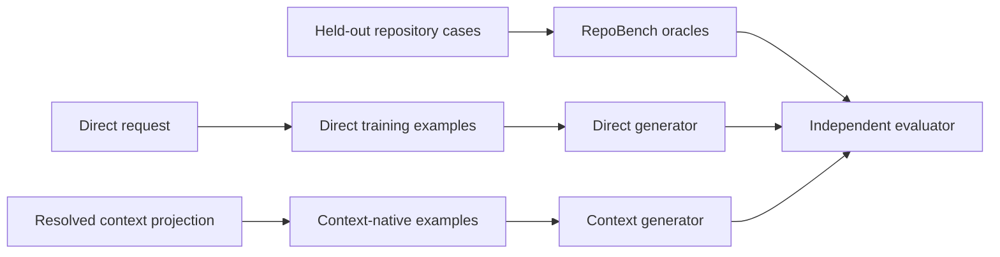

# Examples and Answer Keys

> **Status: training/eval separation, source/runtime fixture model, compact pair wrapper, fixed V1 selection, and
> generator-versus-RepoBench evaluation boundary are accepted.** Exact fixture metadata and full library contents
> remain to be specified.

## Three different artifacts



| Artifact | Input -> output | Consumer |
| --- | --- | --- |
| Direct training example | Natural-language/structured direct request -> logical diagram | Direct generator only |
| Context training example | Grounded projection excerpt -> logical diagram with origins | Context generator only |
| RepoBench answer key | Repository state + request -> canonical `.gp.json` | Evaluator only |

No held-out answer key may be injected into generation or used to select runtime examples.

## Current direct examples

The current pool stores:

```text
backend/assets/blueprints/<type>/examples/
  training/<name>/{prompt.md, output.gp.json}
  eval/<name>/{prompt.md, output.gp.json}
```

Direct generation takes the first configured training examples in sorted path order and projects canonical
outputs to logical JSON. The redesign retains the direct training concepts but changes runtime representation to
an explicit structured pair matching `directGenerationInput`.

Target pair:

```json
{
  "input": {
    "request": {
      "original": "Show an employee onboarding workflow.",
      "goal": "Explain onboarding from acceptance through access provisioning.",
      "diagramType": "activity_diagram",
      "audience": "HR and IT staff",
      "detailLevel": "standard"
    },
    "scope": {
      "included": ["Offer acceptance", "Account setup", "Orientation"],
      "excluded": ["Payroll internals"]
    },
    "requirements": [],
    "assumptions": [],
    "decisions": []
  },
  "output": {
    "nodes": [],
    "edges": []
  }
}
```

The backend supplies vocabulary/rules globally in the live packet; examples should not repeat large static
sections unless a measured failure requires it.

## Current context-example mismatch

Context generation currently reads the same direct `training/*/output.gp.json` files and injects projected output
only as `structuralExamples`. Those diagrams:

- do not carry context origins;
- do not include the selected claims they allegedly cite;
- cannot demonstrate claim/assumption/schema-rule mapping;
- introduce unrelated domain content;
- consume tokens in an already larger context call;
- conflict with the context logical schema's required `origin` contract.

The redesign removes direct examples from context input. Context mode receives a separate context-native pool.

## Context-native example

A context example teaches:

```text
selected generic authority
  -> exact GraphPilot semantics
  -> logical topology
  -> smallest sufficient origin
```

Illustrative pair:

```json
{
  "input": {
    "request": {
      "goal": "Show validation before persistence.",
      "diagramType": "activity_diagram"
    },
    "scope": {
      "included": ["Validation", "Persistence"],
      "excluded": []
    },
    "selectedClaims": [
      {
        "claimRef": {
          "id": "claim-example-validate-before-save",
          "version": 1
        },
        "kind": "behaviorStep",
        "statement": "The service validates an order before saving it.",
        "appliesToViewpoints": ["as_implemented"],
        "payload": {
          "actor": "OrderService",
          "action": "validate order",
          "precedes": "save order"
        },
        "support": {
          "basis": "repositoryEvidence",
          "derivation": "direct"
        },
        "selection": {
          "role": "primary",
          "reason": "Defines the requested sequence."
        }
      }
    ],
    "assumptions": [],
    "decisions": [],
    "allowlists": {
      "claimRefs": [
        {
          "id": "claim-example-validate-before-save",
          "version": 1
        }
      ],
      "assumptionRefs": [],
      "schemaRules": ["activity.initial-node"]
    }
  },
  "output": {
    "nodes": [
      {
        "id": "validate",
        "semanticType": "opaqueAction",
        "label": "Validate Order",
        "origin": {
          "claimRefs": [
            {
              "id": "claim-example-validate-before-save",
              "version": 1
            }
          ],
          "assumptionRefs": [],
          "schemaRules": [],
          "rationale": "The selected behavior claim establishes order validation."
        }
      }
    ],
    "edges": []
  }
}
```

Example IDs are demonstration-only and must be explicitly forbidden in actual output unless they occur in the
actual request allowlist. Runtime provenance validation remains authoritative.

## What context examples should cover

Across a small pool:

- one claim -> multiple elements;
- multiple claims -> one element or relationship;
- context claims that influence terminology but create no visible element;
- user- and host-owned assumptions where allowed by the mode;
- neutral scaffolding through schema rules;
- smallest-sufficient citations;
- sparse accepted context without invented filler;
- mode-specific directions such as include/extend and part-to-whole composition.

Do not force every pattern into one oversized example.

## Accepted V1 runtime policy

```text
Direct generation:
    exactly 2 fixed curated direct examples per diagram type

Context generation:
    exactly 2 fixed curated context-native examples per diagram type

Readiness:
    no runtime few-shot examples initially
```

| Type | Direct training examples injected | Context training examples injected |
| --- | ---: | ---: |
| Activity | 2 | 2 |
| Use case | 2 | 2 |
| BDD | 2 | 2 |

Examples are selected by a fixed per-type manifest—not tag matching, lexical matching, or embeddings. Every run
records exact example IDs and example-set version. Missing/corrupt configured examples, silent substitution, and
elastic dropping are forbidden. The exact examples are part of one indivisible packet and generation fails before
the LLM call if it exceeds the configured token budget.

## Accepted first-rollout scenario identities

Direct and context scenarios are distinct. Each mode/type pair places the foundational fixture first and advanced
fixture second.

| Mode | Type | Level | Scenario | Primary coverage |
| --- | --- | --- | --- | --- |
| Direct | Activity | Foundational | Parcel Locker Pickup | Guarded success/failure |
| Direct | Activity | Advanced | Device Repair Assessment | Horizontal fork/join and post-join decision |
| Context | Activity | Foundational | Return Authorization | Minimal claim-to-element grounding |
| Context | Activity | Advanced | Multi-Channel Alert Delivery | Horizontal concurrency, retry, mixed origins, accepted assumption |
| Direct | Use case | Foundational | Pet Care Appointment Portal | Subject, actors, associations, include |
| Direct | Use case | Advanced | Makerspace Access System | Include, extend, extension point, actor generalization |
| Context | Use case | Foundational | Volunteer Shift Portal | Minimal grounded capabilities/include |
| Context | Use case | Advanced | Equipment Maintenance Portal | Grounded include/extend/generalization |
| Direct | BDD | Foundational | Camping Stove Specification | One compact Block with internal properties/features |
| Direct | BDD | Advanced | Digital Publishing Platform | Separate Blocks and four structural relationship kinds |
| Context | BDD | Foundational | Irrigation Controller | Grounded composition/properties/multiplicity |
| Context | BDD | Advanced | Laboratory Analyzer Platform | Mixed relationships/features and bounded assumption |

All old direct training fixtures are replaced, not rebaselined or moved into held-out eval. New fixtures use only the
canonical authorable core. Activity remains top-to-bottom with horizontal fork/join bars; vertical/LR activity layout
is future work. BDD Camping Stove intentionally uses property rows without separate property-type Block nodes;
Digital Publishing demonstrates when separate Block definitions/relationships are useful.

## Accepted sign-off and set versions

Each fixture has one recorded author and a distinct recorded reviewer. Automation validates schemas, core profile,
IDs/refs/origins, deterministic projection, PyGraphviz layout, canonical output, render, and digests. The reviewer
checks authority fidelity, type semantics, abstraction, unsupported meaning, and context origin relevance/minimality.

Six immutable ordered manifests identify exactly what one call saw:

```text
graphpilot.direct.training-examples.activity.v1
graphpilot.direct.training-examples.use-case.v1
graphpilot.direct.training-examples.bdd.v1
graphpilot.context.training-examples.activity.v1
graphpilot.context.training-examples.use-case.v1
graphpilot.context.training-examples.bdd.v1
```

Each manifest locks mode/type, foundational-then-advanced IDs, input/output digests, and set digest. Changing one
example versions only its mode/type set. Generation traces record set version/digest and ordered IDs.

## Accepted future built-in eval scope

After prompt/schema/training-example freeze, independent authors create 48 held-out generator cases: eight for each
of the six mode/type combinations. Each cell covers foundational, alternative valid topology, intermediate
multi-intent, advanced type semantics, ambiguity/assumption boundary, required-content omission, unsupported
addition, and scale/complexity boundary. Two concepts per type may be paired across direct/context for controlled
comparison; others remain mode-distinct. No case reuses a training identity or RepoBench scenario.

This section defines slots/count only. Exact golds/matchers are authored under the later independent evaluation
process and never used to tune frozen prompts/examples.

The exact first-rollout authority/topology/origin intent for all twelve training fixtures is specified in
[`11-training-fixture-specification.md`](11-training-fixture-specification.md). That file is training design, not
held-out content; actual fixture files still require distinct recorded author/reviewer sign-off and automated proof.

## Accepted source/runtime fixture model

Use the same complete source shape for training and built-in eval; only training fixtures derive model-visible
few-shot pairs.

```text
backend/assets/blueprints/<type>/
  direct-examples/
    training/<name>/
      request.gp-request.json
      expected.logical.json
      output.gp.json
      metadata.json
    eval/<name>/
      same source shape; gold never injected
  context-examples/
    training/<name>/
      evidence.gp-evidence.json
      request.gp-request.json
      expected.logical.json
      output.gp.json
      metadata.json
    eval/<name>/
      same source shape; gold never injected
```

Direct builders derive `directGenerationInput` and compact direct pairs from the saved direct request. Context
builders derive the local resolved request, `contextGenerationInput`, and compact context pairs from JSON 1 plus
the context request. Populated requests/generation packets are derived in memory rather than independently authored
source files; exact generated snapshots may be asserted in tests when useful.

The shared runtime wrapper is `{input, output}`, but direct/context example schemas, pools, input authority, output
origins, and validators remain separate:

```text
graphpilot.direct.generation-example.v1
graphpilot.context.generation-example.v1
```

Built-in GraphPilot eval owns the generator boundary:

```text
DirectRequest -> direct diagram gold
JSON 1 + context request -> context generation input -> grounded diagram gold
```

RepoBench separately owns end-to-end repository + natural-language request evaluation.

## Accepted authoring sequence

Training examples are part of generation design and are finalized before implementation planning. Real held-out
golds are different: do not author the built-in-eval or RepoBench corpus while prompts, schemas, training examples,
or semantic-review behavior are still being designed. First complete generation design, then design and promote the
evaluation framework, then implement the required capture/matcher seams. After prompts/contracts/training examples
freeze, an independent author/reviewer group creates and adjudicates held-out cases.

Synthetic/visible calibration fixtures may test example/evaluator schemas, validators, matchers, reports, and
failure attribution before freeze, but they never count as training content or hidden quality evidence. The current
implementation is identified by Git for an optional isolated historical run only. Required certification evaluates
the frozen reviewed redesign against sealed hidden golds/settings. Hidden failures inform keep/revise/reject, not
prompt tuning; hidden-informed changes require a new independent set for recertification.

## Gold authoring

Answer keys and training golds are hand-curated. A runtime generation tool never authors its own key.

1. Choose an independent, realistic scenario.
2. Define user/context authority before selecting GraphPilot semantics.
3. Hand-author the expected logical diagram.
4. For context, author every origin against an actual example allowlist.
5. Run conform, layout, canonical assembly, deterministic validation, structural critic, provenance validation,
   and render check.
6. Review semantic correctness, realism, abstraction, direction, containment, structured fields, and origin
   minimality.
7. Record source, reviewer, review status, contract versions, and coverage tags.

## RepoBench boundary

- RepoBench target repositories contain no visible answer key or oracle.
- Oracles live in an external benchmark-control scope keyed to repository state.
- RepoBench cases never enter direct/context runtime training pools.
- Evaluation ignores cosmetic IDs/layout where appropriate and scores exact semantic types, topology, structured
  data, and grounding independently.

## Required tests

- Direct and context pools are disjoint from held-out eval cases.
- Direct examples match direct logical schema and contain no origins.
- Context examples match context logical schema and every element has valid origin.
- Example refs resolve only within their example input.
- Context runtime output cannot cite demonstration IDs.
- Canonical outputs validate and render.
- Training/eval pool counts and metadata are complete.
- Generator input budgets include enabled example bytes.

## Proof plan

Compare the fixed direct/context pair sets against no-example historical baselines while holding model, input,
semantic profile, and repair budget fixed. Measure first-pass validity, semantic-review score, origin behavior,
unsupported additions, repair calls, input tokens, and latency. Promotion does not depend on runtime retrieval.

## Remaining specification work

- Exact direct/context example JSON Schemas, compact projection fields, metadata bounds, and manifest schemas.
- Exact authored fixture/gold content under the approved scenario identities and sign-off process.
- Built-in eval matcher/equivalence policy and later independent post-freeze gold authoring.
