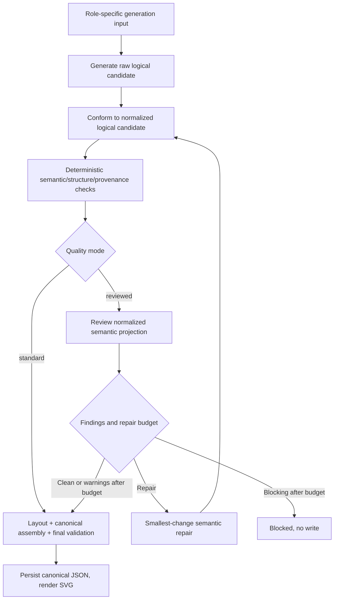

# Semantic Candidate Review and Generation Quality Mode

> **Status: accepted architecture and backend toggle; exact reviewer schemas, rubrics, prompts, and telemetry
> remain open.** This document owns the proposed shared post-generation semantic review phase.

## Why this phase exists

Different checks answer different questions:

```text
Readiness:
Is context input sufficient before generation?

Deterministic validation:
Is the candidate structurally/schema/provenance-reference valid?

Semantic candidate review:
Did the candidate represent its authority faithfully and completely?
```

Context provenance validation can prove that a cited claim ID is selected, but not that the claim's meaning
actually supports an element labeled “Approve Order.” Direct structural validation can prove a diagram is valid,
but not that it covered every required user concept.

## Position



The reviewer evaluates a normalized semantic projection after conformance and pre-layout deterministic checks. It
does not receive raw unnormalized output or positions/styles/canonical runtime metadata. Raw candidates remain
available to tests/evaluation. Final canonical validation still runs before persistence.

The LLM reviewer does not become part of deterministic validation. Direct and context orchestrators invoke a
shared review service through mode-specific adapters.

## Backend quality configuration

Accepted configuration (default shown first):

```text
GRAPHPILOT_GENERATION_QUALITY_MODE=reviewed
```

or explicit diagnostic/ablation mode:

```text
GRAPHPILOT_GENERATION_QUALITY_MODE=standard
```

### `standard`

Explicit environment-only diagnostic/ablation behavior:

- direct: generation + deterministic diagram validation/repair;
- context: readiness + generation + deterministic diagram/provenance validation/repair;
- no semantic-review LLM call.

It is not the production default or an automatic fallback. A reviewer/provider failure in a reviewed attempt remains
an operation error rather than silently weakening quality.

### `reviewed`

Production/default behavior. It adds semantic candidate review over normalized semantics, bounded review-guided
repair, deterministic revalidation, and final review before layout/persistence.

Accepted repair setting:

```text
GRAPHPILOT_GENERATION_SEMANTIC_REPAIR_MAX_ROUNDS=1
allowed range: 0..2
default: 1
```

Warnings and blockers may trigger repair while budget remains. After exhaustion, warnings may persist with the
generated result; blocking findings return `outcome: blocked` and write no canonical diagram.

The setting is validated strictly at startup. Invalid values do not silently become `standard`, because that would
mislabel experiments and product guarantees. Backend restart is required after environment changes.

No real `.env` is committed or modified by implementation work; settings belong in code and `.env.example` when
promoted.

All chat roles use one explicit deployment:

```text
AZURE_OPENAI_DEPLOYMENT
```

Generation, readiness review, semantic review, evaluation judging, and report analysis make separate role-specific
calls but do not require duplicate deployment settings. The deployment used by each call is recorded in trace/results.

## Shared service boundary

Working service concept:

```text
CandidateSemanticReviewService
  <- DirectSemanticReviewAdapter
  <- ContextSemanticReviewAdapter
```

The shared service owns:

- structured LLM call;
- strict review-result validation;
- deterministic finding/element/reference allowlists;
- accepted/rejected aggregation;
- bounded review/repair orchestration;
- metrics and typed failures.

Adapters own authority projection and mode-specific rubric selection.

## Rubric composition

GraphPilot owns six final mode/type rubrics through deterministic composition, not six independently duplicated
files and not one universal conditional rubric:

```text
final rubric = common facets + authority-mode facets + diagram-type facets
```

Examples:

```text
Direct Activity = Common + Direct + Activity
Context BDD     = Common + Context + BDD
```

The reviewer receives one fully expanded rubric. Tests snapshot every final combination. Each facet has one source
owner, preventing shared/type rules from drifting between modes.

## Accepted facet catalog

### Common — every review

```text
goalFidelity
scopeCompliance
abstractionConsistency
unsupportedAdditions
internalCoherence
```

### Direct authority

```text
requirementCoverage
assumptionCompliance
decisionApplication
inferenceAppropriateness
```

Direct authority is the saved request, typed requirements, finalized assumptions/decisions, and permitted
non-material conventional inference. Exact requirement/assumption/decision IDs are allowlisted.

### Context authority

```text
selectedClaimCoverage
originRelevance
originMinimality
assumptionAuthority
decisionApplication
viewpointFidelity
groundingCompleteness
```

Context authority is the context generation input, selected exact claim meaning, accepted assumptions, decisions,
and candidate origins. The reviewer receives no raw source or resolved evidence records.

### Activity

```text
trigger
behaviorSequence
decisionGuards
completionOutcomes
concurrency
dataMovement
exceptionPaths
```

### Use case

```text
subjectBoundary
actorCoverage
actorGoalCoverage
participationCorrectness
includeExtendCorrectness
generalizationCorrectness
extensionPointCorrectness
```

### BDD

```text
structuralSubject
entityCoverage
relationshipCorrectness
ownershipComposition
propertiesAndTypes
multiplicity
generalizationDependency
constraints
```

The BDD facets align with the reduced core generation profile and do not require compatibility-only specialist or
port semantics.

## Rating, applicability, and deterministic acceptance

Every applicable facet uses one shared 0–4 scale:

| Rating | Meaning |
| ---: | --- |
| `0` | Contradicted, absent, or wholly unsupported |
| `1` | Major semantic failure; mostly incorrect |
| `2` | Partial, ambiguous, or materially incomplete |
| `3` | Sufficient and correct for requested scope |
| `4` | Complete, precise, and unambiguous |

Each rubric facet owns `weight`, `minimumRating`, `blockingBelow`, rating anchors, and `always|conditional`
applicability. The reviewer may mark only conditional facets not applicable and must provide allowed refs/rationale;
backend validation rejects N/A on mandatory facets and excludes valid N/A facets from status/score.

```text
rating >= minimumRating     -> sufficient
rating < blockingBelow      -> blocking
otherwise                   -> warning
```

The reviewer returns applicability, rating, bounded rationale, and allowlisted element/authority references. It
does not choose severity, overall status, or score. The backend deterministically computes:

```text
clean    = every applicable facet sufficient
warnings = no blocker and at least one warning
blocked  = at least one blocking facet
invalid  = reviewer result/schema/reference invalid
```

A secondary weighted 0–100 score is:

```text
round(100 * sum(weight * rating) / sum(applicable weight * 4))
```

It is reporting/calibration data only; one blocking facet blocks regardless of average score.

### V1 calibration weight/threshold baseline

All facets initially use `minimumRating: 3`. Entries below are `weight/blockingBelow`; calibration may change them
only through a new immutable rubric version and evidence-backed review.

```text
Common:
  goalFidelity 4/2; scopeCompliance 4/2; abstractionConsistency 2/1;
  unsupportedAdditions 4/3; internalCoherence 3/2

Direct:
  requirementCoverage 4/2; assumptionCompliance 4/3; decisionApplication 2/1;
  inferenceAppropriateness 4/3

Context:
  selectedClaimCoverage 4/2; originRelevance 4/3; originMinimality 2/1;
  assumptionAuthority 4/3; decisionApplication 2/1; viewpointFidelity 4/3;
  groundingCompleteness 4/3

Activity:
  trigger 3/2; behaviorSequence 4/2; decisionGuards 4/2; completionOutcomes 4/2;
  concurrency 3/2; dataMovement 2/1; exceptionPaths 3/2

Use case:
  subjectBoundary 2/1; actorCoverage 4/2; actorGoalCoverage 4/2;
  participationCorrectness 4/2; includeExtendCorrectness 4/2;
  generalizationCorrectness 3/2; extensionPointCorrectness 3/2

BDD:
  structuralSubject 3/2; entityCoverage 4/2; relationshipCorrectness 4/2;
  ownershipComposition 4/2; propertiesAndTypes 3/2; multiplicity 3/2;
  generalizationDependency 3/2; constraints 3/2
```

Always-applicable facets are all common facets; direct requirement/inference; context claim coverage/origin
relevance/origin minimality/viewpoint/grounding; activity trigger/sequence/completion; use-case actor/goal/participation;
and BDD structural subject/entity coverage. Other facets are conditional on supplied authority/candidate semantics.

## Typed findings and authority-aware actions

The reviewer proposes bounded typed findings with allowlisted code/facet, candidate element IDs,
requirement/claim/assumption refs, message, and recommended action. Backend validation derives severity from the
facet rating/thresholds.

Shared action categories:

```text
repair_candidate
ask_user
report_warning
```

Direct authority actions:

```text
revise_request
```

Context authority actions:

```text
select_existing_claim
remove_selection
revise_context
replace_assumption_with_claim
search_source
```

Only `repair_candidate` enters the semantic repair LLM. Direct repair may use explicit authority and non-material
conventional inference, but never creates material assumptions. A needed material assumption returns to the host;
according to `interactionPreference`, the host/user accepts it, saves a revised request, and starts a new attempt.
Context repair never invents authority.

## Bounded call and outcome policy

```text
initial review
  -> clean: continue
  -> findings + repair rounds remain: repair existing candidate, revalidate, review again
  -> warnings after budget: continue and return bounded warnings
  -> blockers after budget: outcome=blocked, no write
```

Repair is never a fresh reroll: it receives original authority without few-shot examples, previous normalized
candidate, validated findings, round number, and original generation-input digest. No unbounded loop exists.

`outcome: blocked` is a normal MCP result (`isError: false`) carrying validated findings and typed next actions.
It stops only the current tool attempt and always returns to the unified host workflow. The host repairs direct
request authority or context claims/selection/source/user authority, saves through owned tools, reruns readiness
where required, and starts a new generation attempt. No unchanged blind reroll is allowed.

Reviewer/provider/contract failures use `OperationProblem` (`isError: true`). Reviewed mode never silently returns
an unreviewed diagram.

Canonical JSON persistence defines successful generation. SVG failure leaves `outcome: generated`, returns
`svgPath: null`, and adds `render_failed` to `operationWarnings`; there is no `partial_success` outcome.

Every generation result includes an explicit quality object:

```text
mode: standard | reviewed
reviewStatus: not_run | clean | warnings | blocked
semanticRepairRoundsUsed
bounded findings
```

Semantic findings live under `quality.findings`; render/diagnostics/runtime warnings live under
`operationWarnings`. Context generated results return compact final readiness plus exact accepted warnings; context
blocked results return the complete bounded actionable final readiness result. Successful results also include a
bounded goal/material-assumption/material-decision summary beside exact request ID/path/digest.

## Private response versus deterministic result

The strict reviewer response contracts (`graphpilot.<mode>.semantic-review-response.v1`) contain only canonical-order
facet applicability/rating/rationale/refs and typed proposed findings/actions. They never contain severity, weighted
score, overall status, or acceptance. One mode-specific review-response contract-repair call fixes invalid response
shape/refs without reevaluating the candidate; a second invalid response is an operation error.

The backend validates the private response against the final composed rubric and allowlists, then emits
`graphpilot.<mode>.semantic-review-result.v1` with effective facet outcomes, deterministic severity, weighted score,
`clean|warnings|blocked`, final finding IDs, and validated host/repair actions. Exact fields, code registry, bounds,
and prompt text are specified in [`10-mechanical-generation-specification.md`](10-mechanical-generation-specification.md).

## Canonical, trace-sidecar, and debug separation

Canonical `.gp.json` stays clean. It retains generic diagram metadata, minimal generation mode/request ownership,
context manifest reference when applicable, and context element origins. It does not copy model/prompt/schema/example,
readiness, semantic-review/rubric/score, layout-engine, usage, finding, action, or diagnostic metadata.

Every MCP result returns a compact generation/quality summary. When public workflow
`persistGenerationTrace: true`, successful generation additionally writes atomic `<name>.gp.trace.json` under
`graphpilot.generation.trace.v1`, bound to the exact diagram digest. It stores compact model/version/example/rubric/
score/layout/usage summaries but no full packet/rubric/candidate/finding rationale/source. Sidecar failure returns
`trace_write_failed` without undoing canonical persistence; blocked/error attempts have no sidecar.

`persistGenerationDebug` remains independent and writes the complete numbered external workflow trace. Editing does
not rewrite a sidecar; diagram-digest mismatch makes it historical/stale. Neither trace nor diagnostics is runtime
input or canonical authority.

## Runtime versus evaluation

Runtime semantic review improves and gates generation. The held-out RepoBench evaluator independently scores the
final output. Do not use the same runtime reviewer as the only benchmark judge, or evaluation becomes circular.

## Opt-in generation diagnostics

The public `diagram_generation_workflow` accepts `persistGenerationDebug` (default `false`). When true, the host
creates one safe run ID and enables strict internal diagnostics for every reached direct/context stage. It is not
Django `DEBUG`, has no V1 environment default, and never changes acceptance or permits a blocked canonical write.

Diagnostics use stable stage numbers across both modes; optional/rejected stages are absent rather than renumbered:

```text
.graphpilot/diagnostics/generation/<request-id>/<run-id>/
  00-run.json
  01-authority/
  02-readiness/                 # context only
  03-generation/
  04-semantic-review/
  05-layout/
  06-canonical-validation/
  07-persistence-render/
  08-result.json
```

One collection-level `.graphpilot/diagnostics/generation/README.md` explains the stable stage flow, direct/context
differences, file meanings, reached/missing folders, safe interpretation, and host recovery. Runs do not duplicate
it: `00-run.json` and `08-result.json` hold run-specific facts. Exact JSON remains machine authority and the README
is never model/runtime input by default.

Reviewed runs save one exact composed `rubric.json` snapshot/digest plus authority projection, normalized
candidate(s), exact model-visible review packets, bounded raw/validated reviewer results, validation issues,
repair packets, final findings/actions, versions/models/tokens/latency, and result/error. Standard mode records
semantic review as `not_run` and saves no fake rubric. Secrets, auth headers, raw unselected source/evidence, and
unbounded provider transport are never saved.

Valid blockers and operational review failures both save reached diagnostics when enabled but never canonical
`.gp.json`. A diagnostics-only write failure preserves the primary generated/blocked/error result, adds
`diagnostics_write_failed` where transport permits, and never retries generation/review. Diagnostics are local,
gitignored, disposable, and never training/evaluation/runtime authority.

## Telemetry and proof

Record per attempt without persisting prompt/model content:

- generation mode;
- quality mode;
- model/prompt/rubric/schema/example-set versions;
- generation/review/repair call counts;
- first-review and final-review outcomes;
- review and total latency;
- Azure input/output token counts when instrumented;
- semantic repair performed;
- typed failure code;
- held-out final semantic score in experiments.

A/B `standard` versus `reviewed` on fixed requests/contexts and models. Use captured candidates first to isolate
reviewer impact, then repeated end-to-end runs. Measure quality lift, hallucination reduction, false-block rate,
latency, tokens, and calls.

## Removability

- Isolated service and prompt/schema/rubric package.
- One branch in each role-specific generation orchestrator.
- No changes to deterministic validation semantics.
- No required canonical diagram fields for the experiment.
- Optional review summary/trace only after a consumer is approved.
- Removing the feature restores standard behavior without rewriting shared generation phases.

## Future public input

Deferred until proof:

```json
{
  "qualityMode": "reviewed"
}
```

Future precedence may be caller mode over backend default, bounded by server policy. User-facing names could be
Standard and Reviewed. Best-of-N and additional tiers are explicitly deferred.

## Accepted semantic-review design checkpoint

- Review target is normalized logical semantics after conformance/prechecks and before layout.
- Rubrics compose common + authority-mode + diagram-type facet owners into six final snapshot-tested rubrics.
- Accepted facet catalog is listed above.
- Ratings are 0–4 with rubric-constrained applicability, `minimumRating`, and `blockingBelow`.
- Backend computes clean/warnings/blocked and a secondary weighted score; the reviewer never chooses severity/status.
- Findings/actions are typed and fully reference-validated.
- Candidate repairs never mutate authority; material authority gaps return to the unified host workflow.
- Warnings/blockers may repair within configured rounds; warnings may persist afterward, blockers may not.
- Reviewed mode has no force-save of blocked candidates.
- Every blocked result returns bounded actions to the host rather than ending the overall workflow.
- Optional role-specific semantic-review deployment falls back to the default/generation deployment.
- Minimum live calibration is clean/warning/blocking for every direct/context × type combination (18 cases).
- Runtime review remains independent from held-out evaluation.

## Remaining specification and calibration work

- Exact facet prose, weights, thresholds, anchors, and applicability rules.
- Complete finding/action code registries and direct/context reviewer JSON Schemas.
- Bounded reviewer/repair prompt text, sizes, timeout/retry behavior, and telemetry fields.
- Calibration fixture content and release pass/false-pass/false-block targets.

These are specification/calibration tasks under the accepted architecture; they do not reopen the product design
unless evidence exposes a contradiction.
