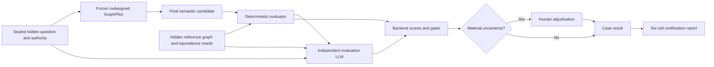

# Generation Pipeline Evaluation Plan

> **Status: user-approved offline evaluation-framework design (2026-07-17); implementation/live calls/hidden-gold
> authoring not approved.** Approval is recorded in `evaluation-framework-approval.json`. Exact contracts, rubric,
> thresholds, run policy, reports, and leakage controls are owned by
> [`12-evaluation-framework-specification.md`](12-evaluation-framework-specification.md).

## Purpose

Certify the frozen redesigned GraphPilot generator against absolute hidden-gold quality gates. The framework grades
whether final delivered diagrams are correct, grounded, useful, and consistently produced, while capturing calls,
tokens, latency, repair/reviewer behavior, and failure attribution.

The current implementation is identified by exact Git commit and may be run later as an optional isolated historical
reference. No old generation path remains in the redesigned runtime and historical comparison is not a certification
gate.



## Boundaries

Built-in direct evaluation uses frozen validated `DirectRequest` authority. Built-in context evaluation uses frozen
validated JSON 1 + JSON 2 plus deterministic resolution and accepted generation-policy identity. It does not call the
live readiness-review LLM; RepoBench separately evaluates the complete repository → evidence → request → readiness →
generation workflow.

The primary quality target is final canonical `.gp.json` projected to normalized semantics. Layout/style/runtime
metadata is removed; exact semantic types, labels, topology, structured fields, and context origins remain. Raw and
repaired candidates are captured for failure attribution. Blocked/error runs are delivery failures, never excluded.

## Hidden answer keys

Each oracle contains:

```text
one reviewed reference logical diagram
required/optional/forbidden concepts
required relationships/topology/structured fields
accepted label aliases
acceptable structural alternatives
acceptable grounding sets
critical-concept markers
```

The generator sees only question/authority. Gold is evaluator-only.

## Deterministic evaluator

The matcher aligns renamed concepts through approved aliases, fixed embedding similarity, hard semantic-type
compatibility, topology/field compatibility, and deterministic maximum-weight one-to-one assignment. It grades
final delivery, required/forbidden/extra concepts, element types, relationships/direction, topology/containment,
guards/multiplicities/features/constraints, render validity, and context origin-reference mechanics. Ambiguous
alignment is explicitly recorded.

## Independent evaluation LLM

Every candidate receives one blinded strict judge call using the single configured `AZURE_OPENAI_DEPLOYMENT`; missing
chat configuration is a typed failure and there is no alternate deployment fallback. Independence comes from a
separate call, private evaluation prompt/rubric, blinded input, and recorded same-deployment caveat—not a second
configuration value. The judge sees question/authority, hidden oracle, candidate, and deterministic report, but not
generator model, runtime review result, or condition identity.

The versioned 0–4 rubric grades intent/completeness/authority, element and topology meaning, structured-data fidelity,
abstraction, extra-content quality, usefulness, direct inference, and context grounding/viewpoint fidelity. It returns
bounded ratings/evidence/findings plus up to 64 material fact assessments (`supported|unsupported|contradicted|
uncertain`). Backend validates refs and owns scores, gates, and pass/fail. Humans resolve only material ambiguity,
disagreement, uncertainty, or promotion-changing borderlines.

## Metrics and gates

Every critical quality category has its own gate; no composite score overrides a failed category. Metrics aggregate
per observation → case across three repetitions → each of six equal-weight mode/type cells → informational overall.
Hard gates cover invalid canonical graphs/origins, wrong vocabulary, silent truncation/fallback, persisted blockers,
forbidden concepts, contradictory context facts, and corrupt run identity.

Initial per-cell thresholds include `>=95%` delivery, `100%` critical concept coverage, `>=90%` concept recall and
relationship/topology F1, `>=95%` semantic-type accuracy, `>=90%` structured fields, strong judge authority/context
grounding means, `<=2%` unsupported material facts, `<=5%` runtime false-pass/false-block/harmful-repair rates, and
`>=90%` judge/human calibration agreement. Exact tables live in `12`.

## Production condition and repetitions

Generation defaults to `reviewed`. Explicit `standard` is environment-only diagnostic/ablation mode and never an
automatic fallback. Required certification evaluates reviewed mode only:

```text
48 hidden cases × 3 repetitions = 144 observations
minimum per observation: generation + runtime semantic review + independent evaluation judge
minimum confirmatory LLM calls: 432 plus repairs and one report-analysis call
```

Standard ablation and the recorded historical baseline are optional, separately manifested, informational runs.

## Execution control

Every command requires explicit `executionMode=dry_run|live`; there is no default. Dry-run validates/plans with no
provider calls. Live writes an immutable exact manifest before calls, resumes by observation identity, and never
expands cases/repetitions/conditions or rerolls failures automatically. Invoking live is authorization for that exact
manifest only.

## Reports

Artifacts live under `.graphpilot/evaluation/runs/<run-id>/` and include immutable manifest, observations, case/cell
summaries, `report-analysis.json`, authoritative `report.json`, and human-readable `report.md`. Status is
`pass|fail|not_run`.

One strict aggregate report-analysis LLM call per completed run interprets strengths, risks, failure patterns,
runtime reviewer/repair behavior, usage/latency, recommendations, and caveats with exact evidence references. It
cannot invent metrics/cases or change backend certification. Failure leaves deterministic reports valid.

## Leakage firewall

Visible synthetic/human-labeled cases develop and calibrate matcher, embeddings, judge rubric, reports, and live
integration. Generator/evaluator/thresholds freeze before hidden authoring. Prompt/training authors cannot author or
approve hidden gold; every hidden case has independent author, reviewer, and adjudicator. Gold lives outside
model-visible repositories/workspaces and the production package.

There is no hidden pilot. All 48 sealed cases are reserved for frozen three-repeat certification. If hidden outcomes
drive generator/evaluator changes, the old set becomes historical and a new independent set is required. Framework
defects invalidate a run and exposed cases are replaced when independence is compromised. RepoBench uses the same
firewall.

## Optional visible ablations

Before freeze, visible non-held-out fixtures may compare one factor at a time for engineering understanding:

```text
current Markdown packaging versus direct JSON
raw prompt versus workflow-framed request
no examples versus fixed two examples
old direct examples versus approved examples
context-native example behavior
standard versus reviewed
optional historical commit
```

These are not hidden certification and never substitute for absolute reviewed-mode gates.

## Delivery sequence

```text
1. Generation-contract design approved and mechanically specified.
2. Evaluation-framework design approved.
3. Complete migration slices and jointly promote generation/evaluation active owners.
4. Implement generation plus evaluator capture/matcher/judge/report infrastructure.
5. Prove framework on visible calibration cases and freeze generator/evaluator identities.
6. Independently author/adjudicate/seal 48 built-in cases and RepoBench golds.
7. Run explicit live reviewed certification, three repetitions per case.
8. Promote redesigned production behavior only after all hard/category gates pass.
```
