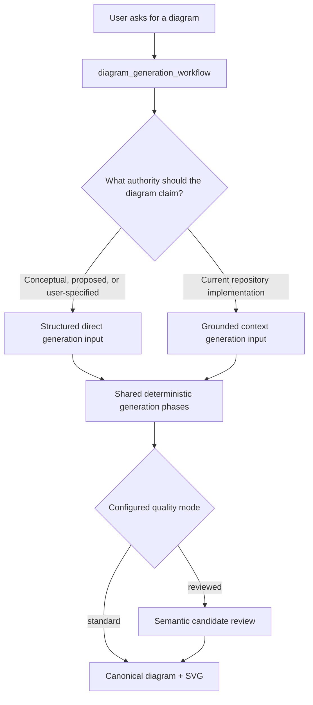

# Generation Redesign — Active Research Handoff

> **Status: approved research handoff; canonical promotion in progress.** This package records the accepted
> direct/context generation, evaluation, migration, and audit specifications. It is not active product,
> architecture, MCP, schema, delivery, or implementation authority. The approved contracts are promoted once into
> their canonical owners before implementation.
>
> **Checkpoint:** 2026-07-17 generation-contract and offline evaluation-framework approvals. The user approved
> authority/request/MCP/generation/repair/review/examples/canonical trace/PyGraphviz/safety behavior plus the
> deterministic matcher, blinded evaluation/report LLMs, absolute reviewed-mode gates, explicit dry/live runs,
> three repetitions, and leakage firewall. Records are `generation-contract-approval.json` and
> `evaluation-framework-approval.json`; neither authorizes implementation, live calls, hidden-gold authoring before
> freeze, or production promotion. Mechanical owners are `10`–`13`. Revised migration/promotion/implementation
> execution is approved in `migration-plan-approval.json`: first audit/commit the compatibility plus complete S1–S14
> plan, then audit/commit active design promotion before any code; compatibility implementation and S1–S13 follow,
> with S14 as the final full-backend audit/remediation gate. Hidden gold remains post-freeze and independently authored.

This folder is the durable generation-design review package. Numbered Markdown documents `01`–`09` own design
blocks/checklists and `10`–`13` own approved mechanical/evaluation/migration specifications; [`generation-contract-approval.json`](generation-contract-approval.json)
records the final 2026-07-17 chat approval of the seven generation-contract blocks. No separate review subfolder or
HTML artifact is required. The package redesigns direct generation without weakening the repository-grounded
context workflow. The core product distinction is authority:



## Read order

1. [`01-goals-and-mode-boundaries.md`](01-goals-and-mode-boundaries.md) — goals, terminology, authority,
   routing, and non-goals.
2. [`02-diagram-generation-workflow.md`](02-diagram-generation-workflow.md) — one public MCP workflow,
   authority routing, direct/context branches, adaptive consultation, and stage-correct recovery.
3. [`03-direct-request-contract.md`](03-direct-request-contract.md) — accepted `DirectRequest` shape,
   typed requirements, assumptions, output identity, and unresolved field details.
4. [`04-generation-inputs-and-prompts.md`](04-generation-inputs-and-prompts.md) — direct/context LLM input
   packets, message packaging, logical outputs, and structured repair direction.
5. [`05-examples-and-answer-keys.md`](05-examples-and-answer-keys.md) — direct examples, context-native
   examples, held-out answer keys, leakage boundaries, and authoring.
6. [`06-semantic-review-and-quality-mode.md`](06-semantic-review-and-quality-mode.md) — shared post-generation
   semantic review and the `standard|reviewed` backend toggle.
7. [`07-contract-naming-standard.md`](07-contract-naming-standard.md) — accepted namespace-first IDs, kind/file
   naming, version rules, and cold-turkey V1 migration.
8. [`08-evaluation-plan.md`](08-evaluation-plan.md) — semantic quality, validation, repair, call, latency,
   and token experiments.
9. [`09-remaining-design-and-promotion.md`](09-remaining-design-and-promotion.md) — covered topics, unresolved
   decisions, proof order, promotion map, and implementation boundary.
10. [`10-mechanical-generation-specification.md`](10-mechanical-generation-specification.md) — exact implementation-
    facing contract registry, fields/bounds, prompts, errors, trace/debug, and PyGraphviz proof gates.
11. [`11-training-fixture-specification.md`](11-training-fixture-specification.md) — exact authority, logical topology,
    context origins, and verification intent for the twelve approved training fixtures.
12. [`12-evaluation-framework-specification.md`](12-evaluation-framework-specification.md) — approved offline
    evaluator boundaries, oracle/matcher, LLM rubric, runs, gates, reports, and leakage controls.
13. [`13-migration-promotion-and-implementation-plan.md`](13-migration-promotion-and-implementation-plan.md) —
    approved compatibility prerequisite, Phase 0 slice planning/design promotion, redesign S1–S13, final backend
    audit/remediation S14, rollback, verification, freeze, and certification gates.

## Accepted working decisions

- Direct generation is for conceptual, proposed, brainstorming, educational, or user-specified designs.
- Context generation is required for claims about current repository implementation or other managed source
  truth.
- `diagram_generation_workflow` is the single public MCP generation prompt and routes to one internal direct or
  context branch based on requested authority.
- Separate public direct/context workflow prompts and the raw prompt-only direct contract are removed.
- Two bounded workflow-owned tools remain: `diagram_generate_direct` and `diagram_generate_from_context`.
- MCP cannot prove a prompt was invoked, so enforcement occurs through complete validated mode-specific contracts
  and documented workflow ownership of the underlying one-shot tools.
- Direct host consultation is adaptive. The host asks only when authority, type, scope, requirements, or
  material assumptions are meaningfully ambiguous.
- `interactionPreference` affects host consultation only, defaults to balanced behavior, and is not persisted
  or sent to the generator.
- Direct requirements are typed plain-language statements using the generic fact kinds already used by the
  evidence model.
- Direct/context requests share `.graphpilot/requests/` and `diagram_request_save` but retain separate schemas.
- Request mode, request ID, and diagram name are immutable; requests are replaceable only before successful V1
  generation, after which post-generation editing is deferred.
- `diagramName` is required and host-owned; logical LLM outputs contain only nodes and edges.
- Assumptions/decisions reuse `origin`, `acceptedBy`, and `acceptedAt`; direct allows disclosed host acceptance.
- Free-text style is removed; semantic presentation uses decisions and typed visual styling is deferred.
- Direct and context generator packets use a parallel top-level layout while preserving different authority,
  provenance, readiness, and inference semantics.
- Direct generation uses a structured JSON user message rather than the current large Markdown user message;
  no extra NL-to-JSON backend LLM call is introduced initially.
- Direct/context share cleaned core semantic guidance but retain separate authority prompts and schemas.
- Direct/context training examples use separate formal schemas/pools inside a shared `{input, output}` wrapper.
- Complete source fixtures derive compact runtime pairs; built-in eval owns the generator boundary and RepoBench
  owns end-to-end repository evaluation.
- Each generation call uses exactly two fixed curated examples per type; examples are never dropped/substituted and
  repair packets omit them.
- Twelve exact new-core training scenarios are accepted, each with distinct author/reviewer sign-off and one of six
  immutable ordered mode/type set manifests. Old direct training is replaced, not reused as held-out gold.
- Future built-in generator eval contains 48 independently authored post-freeze cases (eight per mode/type cell).
- A shared candidate semantic reviewer evaluates normalized logical semantics before layout through mode-specific
  authority adapters.
- Backend generation quality defaults to `GRAPHPILOT_GENERATION_QUALITY_MODE=reviewed`; explicit `standard` remains
  environment-only diagnostic/ablation mode with no automatic fallback. Semantic repair defaults to one round
  (allowed `0..2`).
- Semantic reviewer deployment is optional and falls back to the default/generation deployment.
- Semantic rubrics compose common + mode + type facets, use deterministic 0–4/threshold/status scoring, typed
  findings/actions, bounded repair, no blocker force-save, and host-routing for every blocked result.
- PyGraphviz 2.0 is the target pinned layout engine; after parity/platform verification, subprocess Graphviz,
  Grandalf, old path/download configuration, and silent fallback are removed. Windows ARM64 V1 uses x64 runtime
  emulation; native ARM64 wheels are deferred.
- Contract identifiers use `graphpilot.<namespace>.<artifact>.vN`:  `direct`/`context` for mode-owned contracts
  and `generation` for cross-mode workflow contracts; canonical `graphpilot.diagram.v1` remains unchanged.
- The V1 naming migration is cold turkey: no aliases, dual acceptance, dual writes, or silent local-artifact
  migration/deletion.
- Complete and freeze generation design before evaluation-framework design; approve both designs before generation
  implementation begins.
- Evaluation design is user-approved in `evaluation-framework-approval.json`: final semantic projection, deterministic
  matcher plus blinded evaluation/report LLMs, absolute reviewed-mode gates, explicit dry/live runs, three
  repetitions, and sealed post-freeze golds. The current commit is optional historical context only.
- Do not author the real held-out corpus before prompt/contracts/training examples freeze. After that freeze, an
  independent author/reviewer group creates held-out built-in-eval and RepoBench cases, then old and redesigned
  implementations run against the same hidden golds and fixed provider settings.

## Deliberately unresolved

- Formal JSON Schema files and exact valid/invalid worked artifacts under the mechanical field specification.
- Semantic-review calibration case content and evidence-backed pass/false-pass/false-block release targets.
- Actual twelve training source files and distinct author/reviewer sign-off under the exact fixture specification.
- Independent post-freeze hidden gold content under the approved oracle/matcher contracts.
- Cold-turkey code/artifact impact map, implementation slices, verification matrix, and final promotion sequence.

## Morning continuation

The next agent should:

1. Read repository `AGENTS.md`, `docs/README.md`, this handoff, then
   [`06-semantic-review-and-quality-mode.md`](06-semantic-review-and-quality-mode.md) and the
   [`09` checklist](09-remaining-design-and-promotion.md).
2. Run `git status` before editing and preserve unrelated working-tree changes.
3. Treat the seven generation-contract blocks recorded in `generation-contract-approval.json` as approved; do not
   reopen them without user request or new conflicting evidence.
4. Resume at **exact mechanical generation/reviewer contract specification and authored training fixture content**.
5. Ask one material design question at a time and keep the design task list current.
6. Finish formal schema artifacts, calibration content, authored training fixtures, provider/diagnostics proof,
   and migration impact until the generation specification is complete.
7. Treat `evaluation-framework-approval.json` and `12` as approved; proceed to migration/promotion/implementation
   slicing without authoring hidden golds.
8. Author held-out answer keys only after prompts/contracts/training examples/evaluator freeze; keep authors/reviewers
   independent from prompt/training authors and never tune against hidden results.
9. Continue updating only this research package during design review. Do not edit active product/MCP/schema/delivery
   owners or implementation until generation/evaluation designs and migration plan are jointly promoted.

Current unfinished design task list:

```text
1. Cold-turkey code/artifact/dependency impact map and implementation slices
2. Joint active-document promotion and rollback/verification matrix
3. Post-promotion implementation of generation plus evaluator infrastructure and visible calibration artifacts
4. Post-freeze independent 48-case held-out answer-key and RepoBench corpus authoring
```

## Promotion targets

| Research topic | Eventual active owner |
| --- | --- |
| Product mode boundary and user scenarios | `docs/00-product-and-requirements/` |
| Backend generation phases and service ownership | `docs/01-architecture/01-backend-architecture.md` |
| MCP workflow prompt and one-shot tool contracts | `docs/01-architecture/03-mcp-tools/` |
| Direct/context generation behavior | `docs/02-design-and-features/04-generation-design.md` |
| Answer-key/example authoring | `docs/02-design-and-features/06-answer-key-generation-design.md` |
| Evaluation design | `docs/02-design-and-features/07-evaluation-and-doe-design.md` |
| Context-specific accepted changes | `docs/02-design-and-features/08-context-backed-generation/` |
| Final decisions | `docs/02-design-and-features/decision-decisions.md` |
| Delivery plan/status | `docs/03-development-and-delivery/epics/` |

## Working rules

- Use **Proposed**, **Accepted**, **Specified**, **Promoted**, **Implemented**, and **Verified** precisely.
- Do not implement directly from this package.
- Do not edit the historical evidence-based-context research package forward.
- Record new design decisions here during review, then promote approved coherent contracts once.
- Preserve direct/context authority differences even when sharing names, JSON layout, or backend phases.
- Prefer one smallest proof over speculative options: fixed inputs, held-out answer keys, measured quality,
  latency, calls, and tokens.
