### Add Labels to Class Relationships

Source: https://github.com/mermaid-js/mermaid/blob/develop/cypress/platform/yari.html

Annotate class relationships with descriptive labels using the : notation. Labels appear on the relationship lines and describe the nature of the connection between classes.

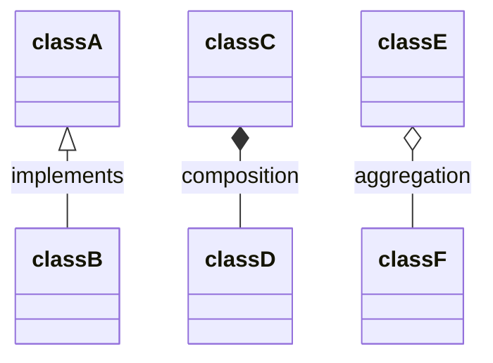

--------------------------------

### Define Classes Explicitly and via Relationship

Source: https://github.com/mermaid-js/mermaid/blob/develop/packages/mermaid/src/docs/syntax/classDiagram.md

Shows two ways to define classes: explicitly using the 'class' keyword and implicitly through a relationship definition.

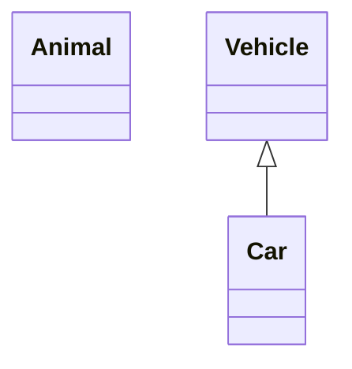

--------------------------------

### Create Bidirectional Class Relationships

Source: https://github.com/mermaid-js/mermaid/blob/develop/cypress/platform/yari.html

Define two-way relationships between classes using the o--|> notation, which represents bidirectional aggregation or association. Both classes reference each other in the relationship.

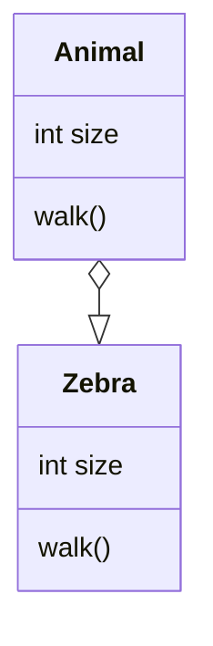

--------------------------------

### Mermaid Class Diagram: Generic Classes and Relationships

Source: https://github.com/mermaid-js/mermaid/blob/develop/demos/classchart.html

Illustrates class relationships and members, incorporating generic type parameters for classes like Class01 and Class07.

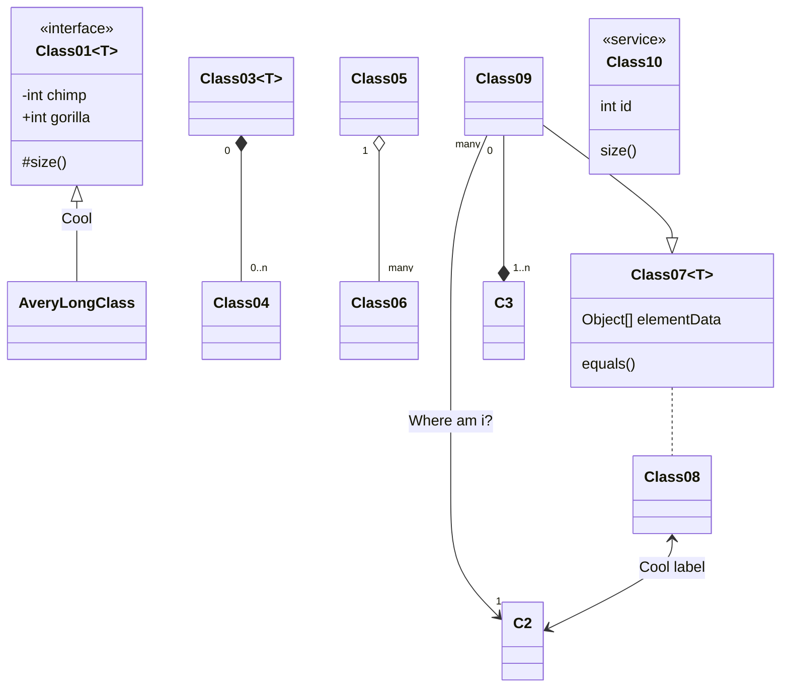

--------------------------------

### Basic Class Relationship Syntax

Source: https://github.com/mermaid-js/mermaid/blob/develop/docs/syntax/classDiagram.md

Illustrates the fundamental syntax for defining relationships between classes. Use this for simple, direct connections.

```text
[classA][Arrow][ClassB]
```

--------------------------------

### Define Class Relationships and Inheritance

Source: https://github.com/mermaid-js/mermaid/blob/develop/cypress/platform/yari.html

Establish relationships between classes using various relationship symbols: <|-- for inheritance, *-- for composition, o-- for aggregation, <-- for association, -- for link, <.. for dependency, <|.. for realization, and .. for dashed link.

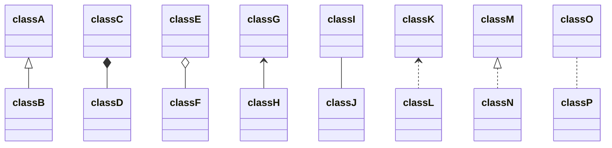

--------------------------------

### Attaching Classes to Nodes with Relationships in ER Diagrams

Source: https://github.com/mermaid-js/mermaid/blob/develop/packages/mermaid/src/docs/syntax/entityRelationshipDiagram.md

Demonstrates attaching classes to nodes involved in relationships, showing how styles affect nodes connected in an ER diagram. Multiple classes can be applied.

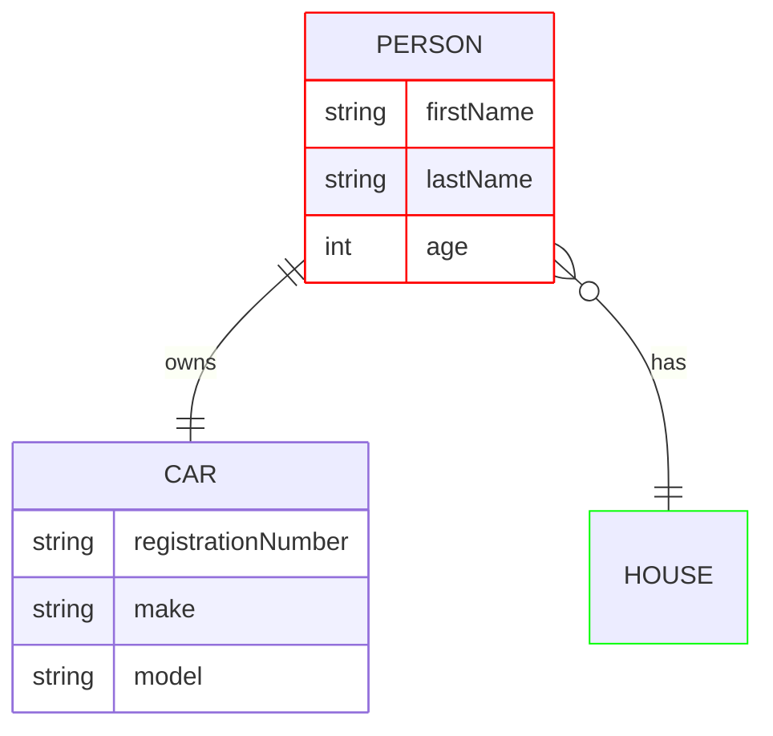

--------------------------------

### Mermaid Class Diagram Basic Relationships

Source: https://github.com/mermaid-js/mermaid/blob/develop/packages/mermaid/src/docs/syntax/classDiagram.md

Demonstrates the basic syntax for defining various relationship types between classes in a Mermaid class diagram.


--------------------------------

### Mermaid Class Diagram: Relationships and Members

Source: https://github.com/mermaid-js/mermaid/blob/develop/demos/classchart.html

Demonstrates various class relationships (inheritance, aggregation, composition, association) and class member visibility in a Mermaid diagram.

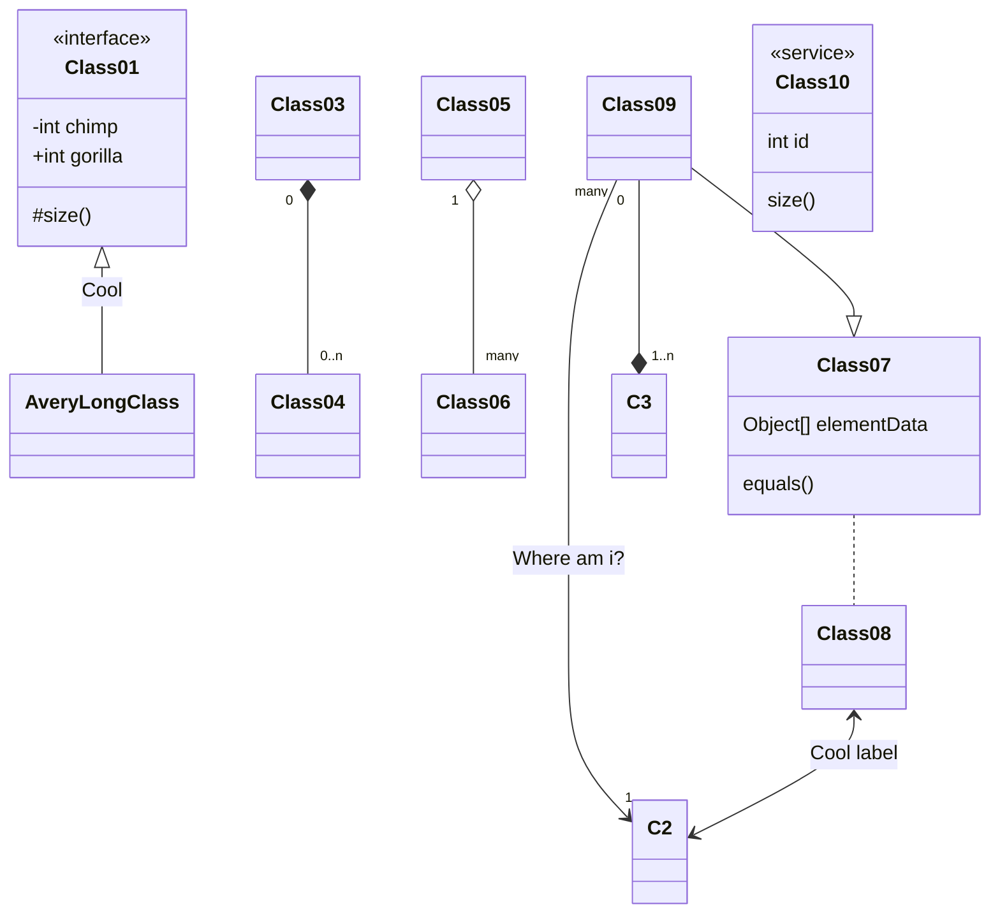

--------------------------------

### Mermaid Class Diagram Relationships with Labels

Source: https://github.com/mermaid-js/mermaid/blob/develop/packages/mermaid/src/docs/syntax/classDiagram.md

Shows how to add descriptive labels to different relationship types in a Mermaid class diagram.

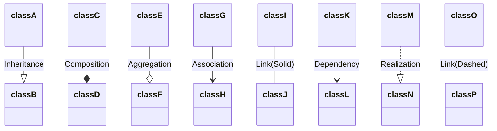

--------------------------------

### Mermaid Class Diagram Relationships with Labels (Short)

Source: https://github.com/mermaid-js/mermaid/blob/develop/packages/mermaid/src/docs/syntax/classDiagram.md

Illustrates adding labels to common relationship types like inheritance, composition, and aggregation in Mermaid class diagrams.


--------------------------------

### Create Class diagram with Mermaid

Source: https://github.com/mermaid-js/mermaid/blob/develop/docs/intro/index.md

Defines an object-oriented class diagram showing class relationships, inheritance, composition, and aggregation. Includes class properties and methods with various relationship types between classes.

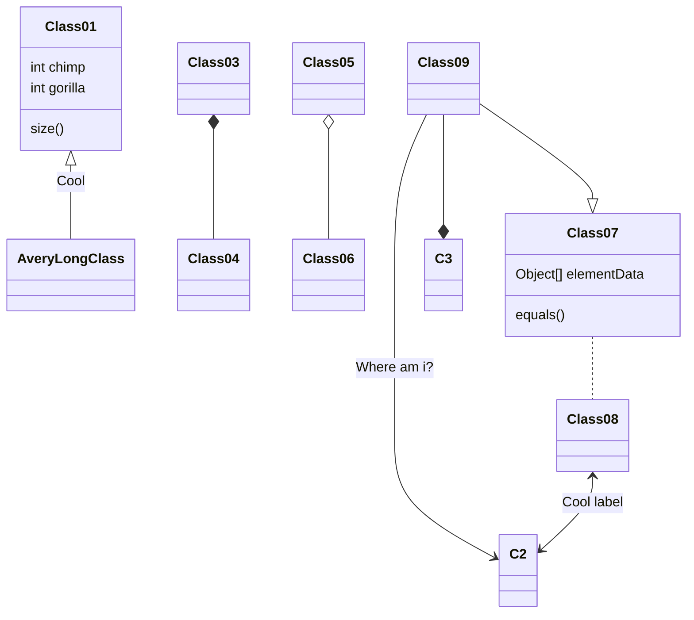

--------------------------------

### Specify Cardinality and Multiplicity in Relationships

Source: https://github.com/mermaid-js/mermaid/blob/develop/cypress/platform/yari.html

Define cardinality constraints on class relationships using numeric notation in quotes. Supports specific numbers (1, *), ranges (1..*), and descriptive text (many) to indicate how many instances of each class can participate in the relationship.

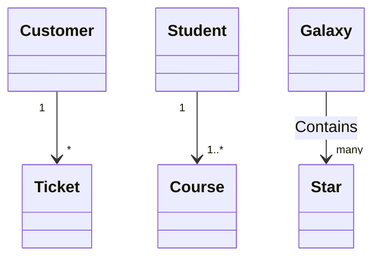

--------------------------------

### Mermaid Class Diagram Two-way Relations

Source: https://github.com/mermaid-js/mermaid/blob/develop/packages/mermaid/src/docs/syntax/classDiagram.md

Defines a two-way relationship between classes, representing an N:M association in Mermaid class diagrams.

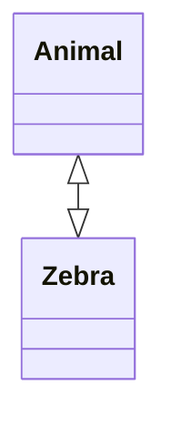

--------------------------------

### Mermaid Class Diagram: Nested Namespaces and Relationships

Source: https://github.com/mermaid-js/mermaid/blob/develop/demos/classchart.html

Illustrates nested namespaces and relationships between classes defined in different namespaces within a Mermaid diagram.

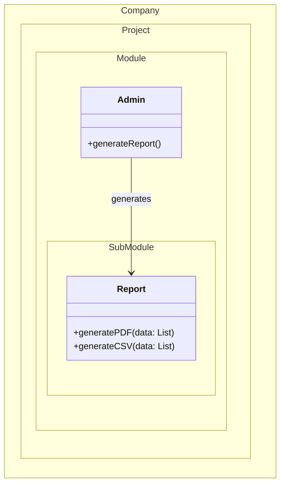

--------------------------------

### Mermaid Class Diagram: Multiple Namespaces and Cross-Namespace Relationships

Source: https://github.com/mermaid-js/mermaid/blob/develop/demos/classchart.html

Demonstrates defining multiple distinct namespaces, inheritance within namespaces, and relationships between classes from different namespaces.

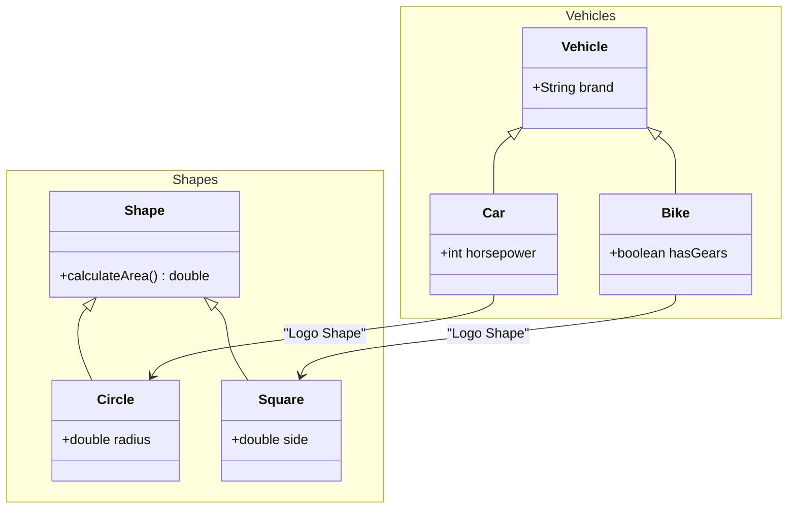

--------------------------------

### Model Class Relationships and Members with Mermaid Class Diagram

Source: https://github.com/mermaid-js/mermaid/blob/develop/cypress/platform/showcase_neutral.html

This Mermaid class diagram defines several classes (Animal, Duck, Fish, Zebra) and illustrates various relationships like inheritance (`<|--`), aggregation (`<--o`), and associations. It also shows how to define class members (attributes and methods) with visibility modifiers, providing a clear object-oriented structure.

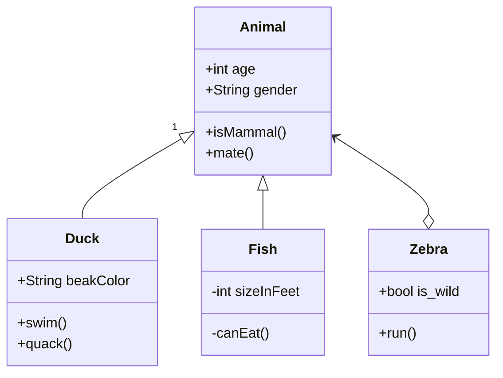

--------------------------------

### Mermaid Class Diagram with Various Relationship Types and Elk Layout

Source: https://github.com/mermaid-js/mermaid/blob/develop/cypress/platform/yari.html

An advanced Mermaid class diagram example illustrating a wide array of relationship types, including aggregation, composition, dependency, and bidirectional associations, with cardinality labels. It also demonstrates interface definition, class attributes, methods, and custom class stereotypes, configured to use the `elk` layout engine.

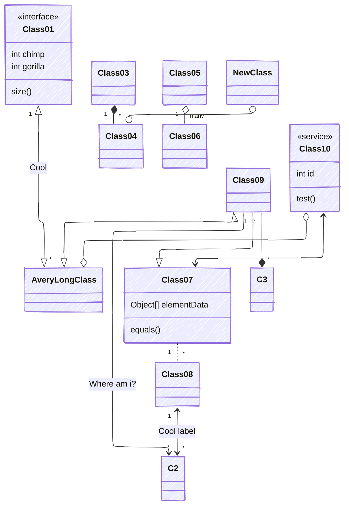

--------------------------------

### Mermaid Class Diagram: Multiple Classes in Namespace

Source: https://github.com/mermaid-js/mermaid/blob/develop/demos/classchart.html

Defines multiple classes (User, Admin, Report) within a single namespace and shows their relationships.

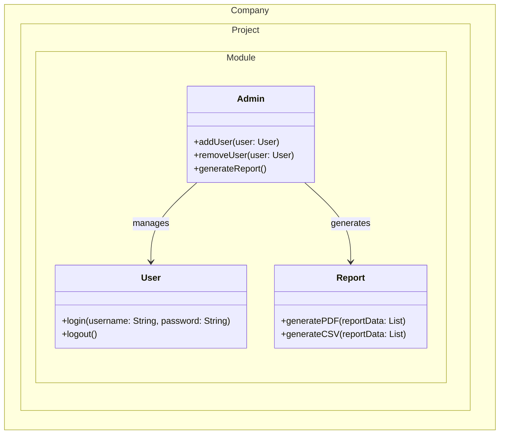

--------------------------------

### Mermaid Class Diagram Example

Source: https://github.com/mermaid-js/mermaid/blob/develop/README.md

This snippet demonstrates how to define a class diagram using Mermaid syntax. It shows classes, their relationships (inheritance, association, aggregation), attributes, and methods, including stereotypes like "<<Interface>>" and "<<service>>".

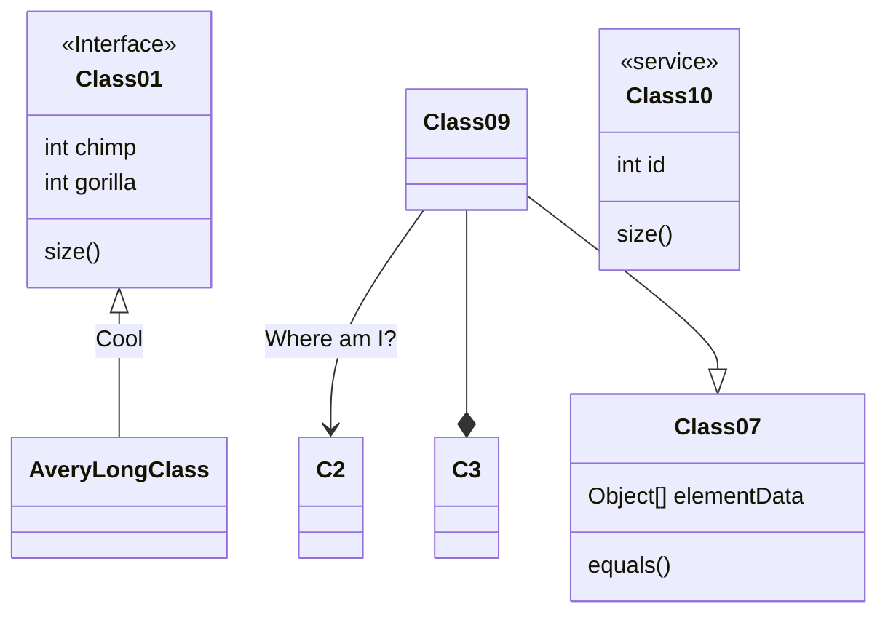

--------------------------------

### Defining and Attaching Classes to Nodes in ER Diagrams

Source: https://github.com/mermaid-js/mermaid/blob/develop/packages/mermaid/src/docs/syntax/entityRelationshipDiagram.md

Defines a class of styles and attaches it to nodes for consistent styling. This is more convenient than styling each node individually. Multiple classes can be attached.

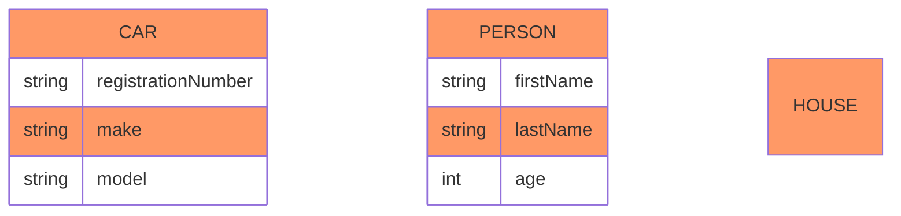

--------------------------------

### Class Diagram with Cardinality

Source: https://github.com/mermaid-js/mermaid/blob/develop/packages/mermaid/src/docs/syntax/classDiagram.md

Defines a class diagram with specified cardinality on the relations between classes. Use quotes for cardinality text.

```mermaid
classDiagram
    Customer "1" --> "*" Ticket
    Student "1" --> "1..*" Course
    Galaxy --> "many" Star : Contains
```

--------------------------------

### Create Class Diagram with Inheritance and Composition

Source: https://github.com/mermaid-js/mermaid/blob/develop/cypress/platform/showcase_base.html

Defines a class diagram showing inheritance relationships, composition, class attributes, and methods. Models an Animal base class with Duck, Fish, and Zebra subclasses, demonstrating different relationship types and access modifiers.

```mermaid
classDiagram
	Animal "1" <|-- Duck
	Animal <|-- Fish
	Animal <--o Zebra
	Animal : +int age
	Animal : +String gender
	Animal: +isMammal()
	Animal: +mate()
	class Duck{
		+String beakColor
		+swim()
		+quack()
	}
	class Fish{
		-int sizeInFeet
		-canEat()
	}
	class Zebra{
		+bool is_wild
		+run()
	}
```

--------------------------------

### Defining and Attaching a Style Class to Nodes

Source: https://github.com/mermaid-js/mermaid/blob/develop/packages/mermaid/src/docs/syntax/classDiagram.md

Defines a reusable class of styles with 'classDef' and attaches it to nodes using 'cssClass' or the ':::' operator for cleaner graph definitions.

```mermaid
classDiagram
    class Animal:::someclass
    classDef someclass fill:#f96
```

```mermaid
classDiagram
    class Animal:::someclass {
        -int sizeInFeet
        -canEat()
    }
    classDef someclass fill:#f96
```

--------------------------------

### Attach a Style Class to a Node in Class Diagram

Source: https://github.com/mermaid-js/mermaid/blob/develop/docs/syntax/classDiagram.md

Attach a predefined style class to a node using 'cssClass' followed by the node ID and class name. This can be done for a single node or a list of nodes.

```text
cssClass "nodeId1" className;
```

```text
cssClass "nodeId1,nodeId2" className;
```

--------------------------------

### Mermaid Class Diagram with Relationships, Members, and Notes

Source: https://github.com/mermaid-js/mermaid/blob/develop/cypress/platform/knsv2.html

This Mermaid class diagram showcases various UML class diagram features. It defines multiple classes, different types of relationships (inheritance, composition, aggregation, association, dependency, realization), class members (fields, methods with visibility), stereotypes, and attached notes to classes and the diagram itself.

```mermaid
classDiagram
note "I love this diagram!\nDo you love it?"
Class01 <|-- AveryLongClass : Cool
<<interface>> Class01
Class03 "1" *-- "*" Class04
Class05 "1" o-- "many" Class06
Class07 "1" .. "*" Class08
Class09 "1" --> "*" C2 : Where am i?
Class09 "*" --* "*" C3
Class09 "1" --|> "1" Class07
Class12 <|.. Class08
Class11 ..>Class12
Class07 : equals()
Class07 : Object[] elementData
Class01 : size()
Class01 : int chimp
Class01 : int gorilla
Class01 : -int privateChimp
Class01 : +int publicGorilla
Class01 : #int protectedMarmoset
Class08 <--> C2: Cool label
class Class10 {
  <<service>>
  int id
  test()
}
note for Class10 "Cool class\nI said it's very cool class!"
```

--------------------------------

### Define and attach CSS classes to nodes

Source: https://github.com/mermaid-js/mermaid/blob/develop/packages/mermaid/src/docs/syntax/flowchart.md

Use `classDef` to define reusable style classes and attach them to nodes via the `class` keyword. Multiple nodes can be styled in one statement.

```mermaid
flowchart LR
    A:::someclass --> B
    classDef someclass fill:#f96
```

--------------------------------

### Create Class Diagram - Mermaid

Source: https://github.com/mermaid-js/mermaid/blob/develop/packages/mermaid/src/docs/intro/examples.md

Models object-oriented class structures with relationships and members. Supports inheritance (<|--), composition (*--), aggregation (o--), dependency (-->), and various relationship notations. Includes class properties and methods for comprehensive UML-style documentation.

```mermaid
classDiagram
Class01 <|-- AveryLongClass : Cool
Class03 *-- Class04
Class05 o-- Class06
Class07 .. Class08
Class09 --> C2 : Where am i?
Class09 --* C3
Class09 --|> Class07
Class07 : equals()
Class07 : Object[] elementData
Class01 : size()
Class01 : int chimp
Class01 : int gorilla
Class08 <--> C2: Cool label
```

--------------------------------

### Basic Mermaid Class Diagram Syntax

Source: https://github.com/mermaid-js/mermaid/blob/develop/cypress/platform/yari.html

Illustrates fundamental Mermaid class diagram syntax for defining classes and simple relationships. This snippet shows how to declare classes and a basic directed association between two classes.

```mermaid
classDiagram
C1 --> C2
class C3
class C4
```

--------------------------------

### Mermaid Class Diagram: Direction and Attributes (RL)

Source: https://github.com/mermaid-js/mermaid/blob/develop/demos/classchart.html

Illustrates right-to-left diagram direction, class relationships, and defining class attributes with different visibility.

```mermaid
classDiagram
direction RL
Fruit ()-- Apple
Apple : color()
Apple : -int leafCount()
Fruit ()-- Pineapple
Pineapple : color()
Pineapple : -int leafCount()
Pineapple : -int spikeCount()
```

--------------------------------

### Mermaid Class Diagram: Direction and Notes (LR)

Source: https://github.com/mermaid-js/mermaid/blob/develop/demos/classchart.html

Demonstrates left-to-right diagram direction, class relationships, and adding notes to specific classes in a Mermaid diagram.

```mermaid
classDiagram
direction LR
Animal ()-- Dog
Animal ()-- Cat
note for Cat "should have no members area"
Dog : bark()
Dog : species()
```

--------------------------------

### Apply Classes to Multiple Elements Using `class` Keyword in Mermaid

Source: https://github.com/mermaid-js/mermaid/blob/develop/docs/syntax/requirementDiagram.md

This snippet illustrates applying a previously defined class to one or more elements using the `class` keyword. It demonstrates assigning the `important` class to both `test_req` and `test_entity` elements, providing a way to apply consistent styling across multiple diagram components.

```text
class test_req,test_entity important
```

--------------------------------

### Mermaid Class Diagram: Interface Implementation

Source: https://github.com/mermaid-js/mermaid/blob/develop/demos/classchart.html

A simple example showing the implementation relationship between an interface and its concrete class.

```mermaid
classDiagram
Interface1 ()-- Interface1Impl
```