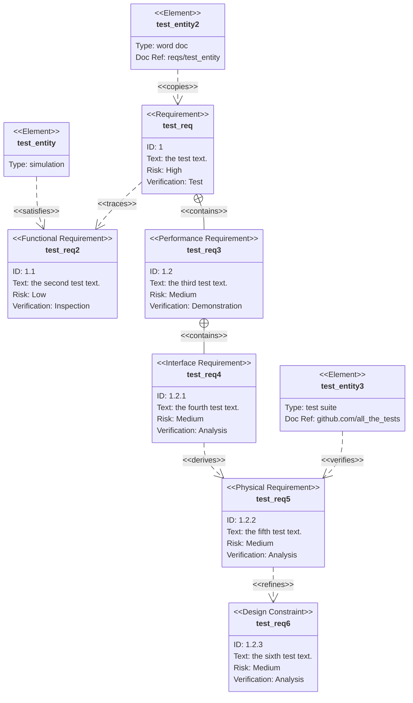
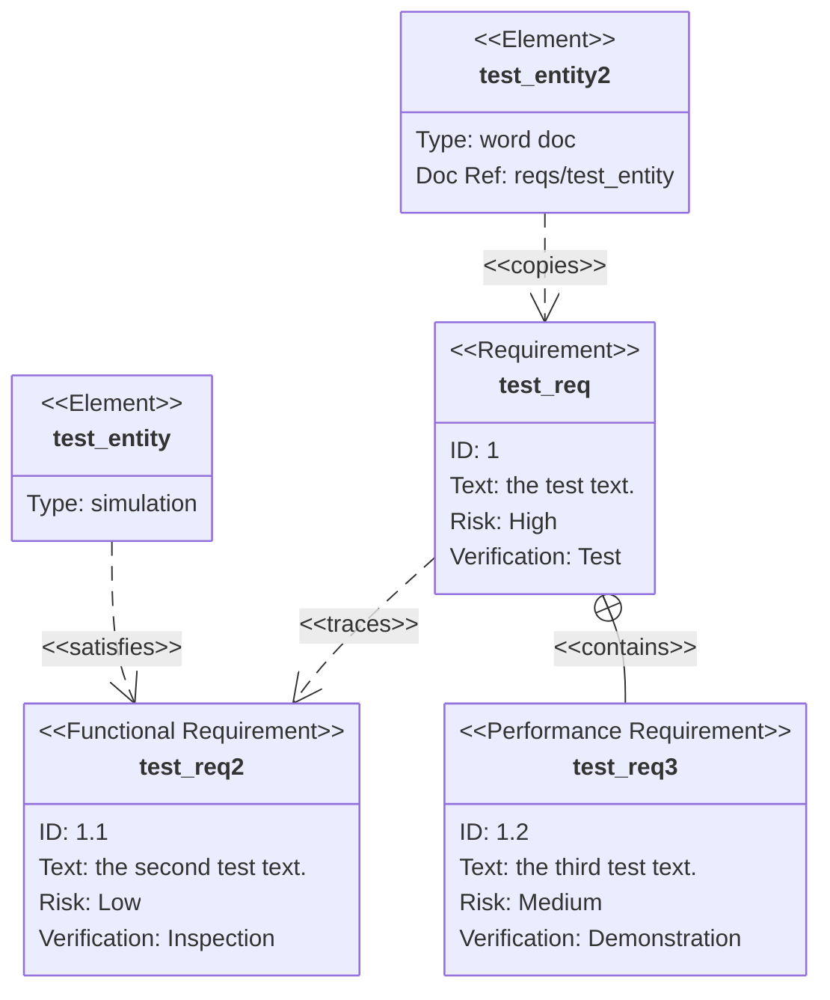
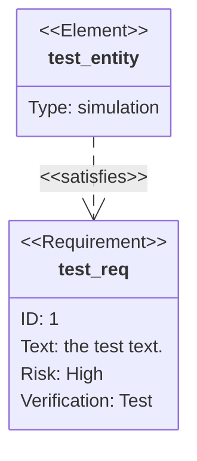
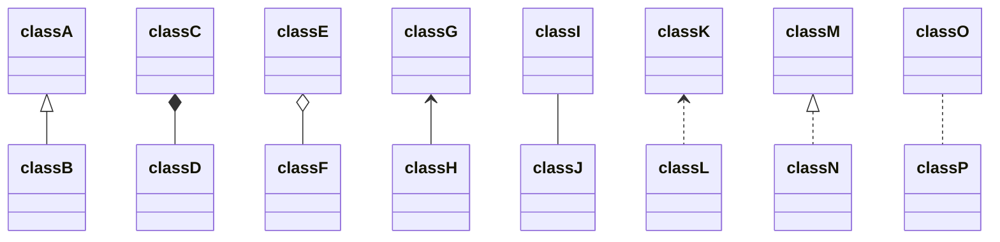
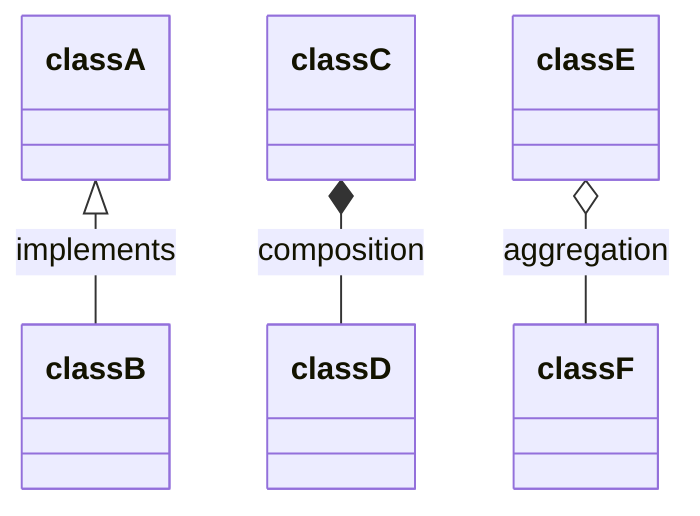
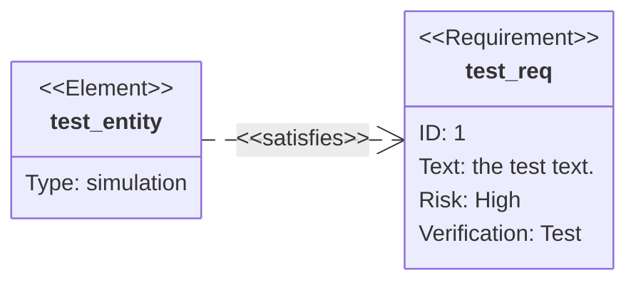

### Relationship Definition Syntax in Requirement Diagram

Source: https://github.com/mermaid-js/mermaid/blob/develop/docs/syntax/requirementDiagram.md

Shows the syntax for defining relationships between requirement and element nodes. Relationships consist of a source node, destination node, and relationship type, with support for forward and reverse arrow directions.

```text
{name of source} - <type> -> {name of destination}

or

{name of destination} <- <type> - {name of source}
```

--------------------------------

### Define a Relationship in Mermaid Requirement Diagrams

Source: https://github.com/mermaid-js/mermaid/blob/develop/packages/mermaid/src/docs/syntax/requirementDiagram.md

This snippet illustrates the two possible syntax formats for defining relationships between nodes (requirements or elements) in a Mermaid requirement diagram. It specifies the use of source and destination node names and a relationship type, such as 'satisfies' or 'traces'.

```text
{name of source} - <type> -> {name of destination}
```

```text
{name of destination} <- <type> - {name of source}
```

--------------------------------

### Create a Comprehensive Requirement Diagram with Multiple Relationships and Types in Mermaid

Source: https://github.com/mermaid-js/mermaid/blob/develop/packages/mermaid/src/docs/syntax/requirementDiagram.md

This extensive example showcases a full range of features in a Mermaid requirement diagram, including various requirement types (functional, performance, interface, physical, design constraint), multiple elements, and diverse relationship types like satisfies, traces, contains, derives, refines, verifies, and copies.



--------------------------------

### Build Requirement Diagram with Elements and Relationships

Source: https://github.com/mermaid-js/mermaid/blob/develop/cypress/platform/showcase_forest.html

Constructs a requirement diagram with different requirement types (requirement, functionalRequirement, performanceRequirement), elements, and relationships (satisfies, traces, contains, copies). Supports risk levels and verification methods for requirements management.



--------------------------------

### Define Requirement Diagrams and Element Relationships in Mermaid

Source: https://github.com/mermaid-js/mermaid/blob/develop/demos/requirements.html

Demonstrates the syntax for creating requirement diagrams, including various requirement types (functional, performance, interface, physical, design constraint) and their relationships like satisfies, traces, and contains.


--------------------------------

### Create Comprehensive Requirement Diagram with All Features

Source: https://github.com/mermaid-js/mermaid/blob/develop/docs/syntax/requirementDiagram.md

Demonstrates a complete requirement diagram using all available requirement types (requirement, functionalRequirement, performanceRequirement, interfaceRequirement, physicalRequirement, designConstraint), element definitions with optional document references, and various relationship types (satisfies, traces, contains, derives, refines, verifies, copies). This example shows how to structure complex requirement hierarchies with risk levels and verification methods.


--------------------------------

### Create Requirement Diagram with Elements and Relations

Source: https://github.com/mermaid-js/mermaid/blob/develop/docs/config/accessibility.md

Defines a requirement diagram with requirement and element definitions, establishing relationships between entities. Includes requirement properties like id, text, risk level, and verification method. Demonstrates how elements satisfy requirements through directional relationships.



--------------------------------

### Mermaid Requirement Diagram Defining Requirements and Elements

Source: https://github.com/mermaid-js/mermaid/blob/develop/cypress/platform/knsv2.html

This Mermaid requirement diagram defines a 'test_req' requirement with properties like ID, text, risk, and verification method. It also defines an 'test_entity' element of type 'simulation' and shows a 'satisfies' relationship between the element and the requirement.


--------------------------------

### Requirement Diagram Syntax Structure

Source: https://github.com/mermaid-js/mermaid/blob/develop/docs/syntax/requirementDiagram.md

Shows the template syntax for defining a requirement with all required fields: type, user-defined name, id, text, risk level, and verification method. Type, risk, and method are enumerations defined in SysML.

```text
<type> user_defined_name {
id: user_defined_id
text: user_defined text
risk: <risk>
verifymethod: <method>
}
```

--------------------------------

### Create Basic Requirement Diagram with Mermaid

Source: https://github.com/mermaid-js/mermaid/blob/develop/docs/syntax/requirementDiagram.md

Defines a simple requirement diagram with a requirement node, an element node, and a satisfies relationship between them. The requirement includes an id, text, risk level, and verification method. This example demonstrates the basic structure for rendering requirements.


--------------------------------

### Define a Requirement Diagram in Mermaid.js

Source: https://github.com/mermaid-js/mermaid/blob/develop/cypress/platform/showcase_default.html

This Mermaid.js snippet constructs a requirement diagram, which is used to visualize and manage system requirements. It defines various requirement types (general, functional, performance) and elements, specifying their IDs, text, risk levels, and verification methods. The diagram also illustrates relationships between requirements and elements, such as satisfaction, tracing, containment, and copying.


--------------------------------

### Create a Basic Requirement Diagram in Mermaid

Source: https://github.com/mermaid-js/mermaid/blob/develop/packages/mermaid/src/docs/syntax/requirementDiagram.md

This example demonstrates the fundamental structure of a Mermaid requirement diagram, including defining a requirement, an element, and a 'satisfies' relationship between them. It showcases basic ID, text, risk, and verification method attributes for a requirement.


--------------------------------

### Model Requirements with Mermaid Requirement Diagram

Source: https://github.com/mermaid-js/mermaid/blob/develop/cypress/platform/showcase_dark.html

Defines system requirements, functional requirements, and performance requirements along with their relationships like satisfies and traces. It allows for detailed property definitions such as risk levels and verification methods.


--------------------------------

### Mermaid Class Diagram Basic Relationships

Source: https://github.com/mermaid-js/mermaid/blob/develop/packages/mermaid/src/docs/syntax/classDiagram.md

Demonstrates the basic syntax for defining various relationship types between classes in a Mermaid class diagram.



--------------------------------

### Element Definition Syntax in Requirement Diagram

Source: https://github.com/mermaid-js/mermaid/blob/develop/docs/syntax/requirementDiagram.md

Defines the syntax structure for creating an element node in a requirement diagram. Elements contain a user-defined name, type, and optional document reference, allowing requirements to connect to portions of other documents.

```text
element user_defined_name {
type: user_defined_type
docref: user_defined_ref
}
```

--------------------------------

### Mermaid Class Diagram Relationships with Labels (Short)

Source: https://github.com/mermaid-js/mermaid/blob/develop/packages/mermaid/src/docs/syntax/classDiagram.md

Illustrates adding labels to common relationship types like inheritance, composition, and aggregation in Mermaid class diagrams.



--------------------------------

### Set Requirement Diagram Direction

Source: https://github.com/mermaid-js/mermaid/blob/develop/docs/syntax/requirementDiagram.md

Controls the layout direction of the requirement diagram using the `direction` statement. Supports four directions: TB (Top to Bottom, default), BT (Bottom to Top), LR (Left to Right), and RL (Right to Left). This example demonstrates left-to-right rendering with a simple requirement and element relationship.

