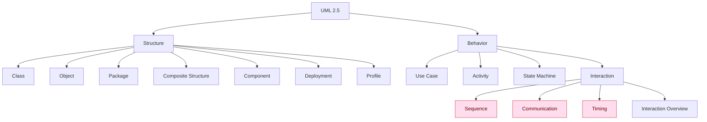
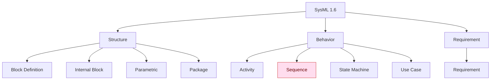
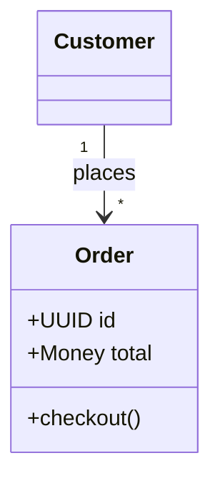
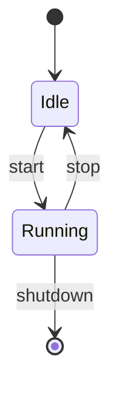
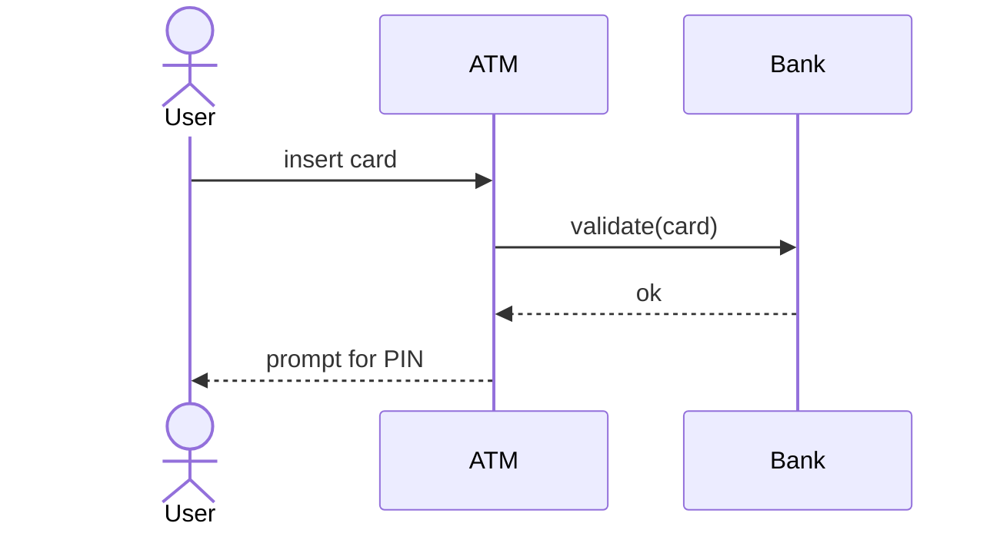
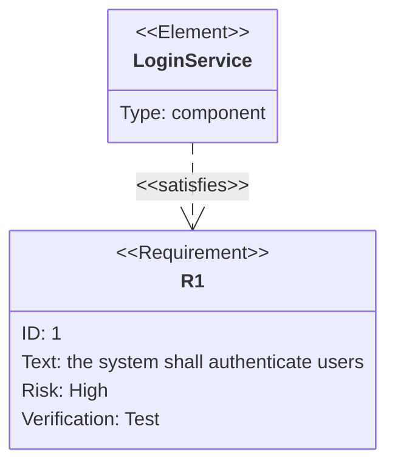
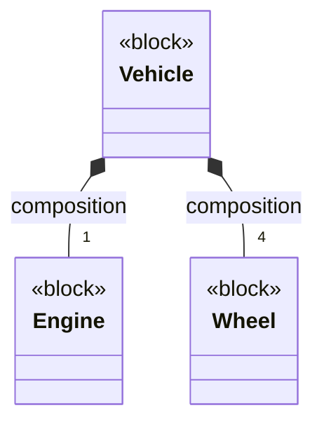

# UML + SysML Vocabulary — Neutral Extraction

A **spec-first, tool-agnostic** catalog of the visually meaningful vocabulary of UML 2.5.1 and
SysML 1.6 diagrams: diagram types; node/container symbols; structured features and compartments;
relationships; end labels and other adornments; and constructs that require special layout. This is
the *raw* extraction — deliberately **independent of GraphPilot's JSON schema**. GraphPilot's
opinionated implementation + render mapping lives in
`../../02-design-and-features/00-diagram-json-schema.md`; this document is the neutral ground
truth it is derived from and can be checked against.

**Sources retrieved 2026-07-02; clause-level extraction revised 2026-07-10.** Sources live alongside this file (see the folder
[`README.md`](README.md)).

## Contents

1. [Diagram-type taxonomy](#1-diagram-type-taxonomy) — UML + SysML diagram families
2. [Symbols, features, and compartments](#2-symbols-features-and-compartments) — visually meaningful non-relationship vocabulary
3. [Relationships and adornments](#3-relationships-and-adornments) — connectors, direction, ends, labels, and modifiers
4. [Special-rendering diagrams](#4-special-rendering-diagrams-why-theyre-set-apart) — lifeline/time-axis families
5. [Tool-naming corroboration](#5-tool-naming-corroboration-tier-2-extra)
6. [Source traceability](#6-source-traceability-clause-tier)
7. [Relationship to the GraphPilot standard](#7-relationship-to-the-graphpilot-standard)
8. [Visual gallery (Mermaid)](#8-visual-gallery-mermaid) — examples where Mermaid is faithful

## How this was compiled (provenance & precedence)

The vocabulary is taken from the **OMG specs** (the source of truth). Mermaid is kept only as a
notation cross-check (and as the tool that draws the visuals). Where they differ, the spec wins:

| Tag | Tier | Source file | Role |
| --- | --- | --- | --- |
| **[T1-UML]** | 1 — normative | `01-normative-omg-specs/omg-uml-2.5.1.pdf` | OMG UML 2.5.1 — the authority for UML |
| **[T1-SYS]** | 1 — normative | `01-normative-omg-specs/omg-sysml-1.6.pdf` | OMG SysML 1.6 — the authority for SysML |
| **[T2-mm]** | 2 — corroboration | `02-tool-corroboration/context7_mermaid-*.md` | Mermaid naming/notation cross-check (also the drawing tool) |

**Method.** UML entries are derived from the normative notation clauses and concrete classifier
lists in UML clauses 7–22 and Annex A/B [T1-UML]. SysML entries are derived from each clause's
`Diagram Elements`, `Diagram Extensions`, stereotype, and model-library sections [T1-SYS]. Every
entry is classified as one of: **symbol/container**, **structured feature/compartment**,
**relationship**, **relationship end/adornment**, or **special-layout construct**. Abstract support
metaclasses are named only when they affect visible notation. Relationship notation is
cross-checked against Mermaid [T2-mm]; Mermaid never overrides the specs.

**Coverage rule (2026-07-10).** A term-presence search is not evidence of semantic classification or
completeness. The extraction is instead traced by normative clause in §6. Non-normative examples,
model-library conveniences, deprecated notation, and tool-only extensions are labeled explicitly.
The result is a visual-vocabulary reference, not an assertion that every UML/SysML metamodel class
must become a separate palette item.

---

## 1. Diagram-type taxonomy

### 1.1 UML 2.5 [T1-UML]

UML 2.5 defines two families — **structure** (static) and **behavior** (dynamic) — with **14
"leaf" diagram types** (7 + 7; the four interaction diagrams are the leaves under *Interaction*).
The **Render** column flags whether the diagram is an ordinary **node-edge graph** (box-and-arrow)
or needs a **special renderer** (a time/axis or lifeline layout that is not a plain graph).

| Family | Diagram | Purpose (short) | Render |
| --- | --- | --- | --- |
| Structure | **Class** | classes/interfaces + features + relationships | graph |
| Structure | **Object** | instance-level snapshot of a class diagram | graph |
| Structure | **Package** | packages + their dependencies | graph |
| Structure | **Composite Structure** | internal structure of a classifier (parts/ports/connectors) | graph |
| Structure | **Component** | components + provided/required interfaces | graph |
| Structure | **Deployment** | artifacts deployed to nodes/devices | graph |
| Structure | **Profile** | stereotypes/extensions (lightweight UML extension) | graph |
| Behavior | **Use Case** | actors + use cases + subject boundary | graph |
| Behavior | **Activity** | control/object flow between actions | graph |
| Behavior | **State Machine** | states + transitions (behavioral / protocol) | graph |
| Behavior · Interaction | **Sequence** | messages between lifelines over ordered time | **special** |
| Behavior · Interaction | **Communication** | messages between lifelines with sequence numbering | **special** |
| Behavior · Interaction | **Timing** | state/condition changes along a time axis | **special** |
| Behavior · Interaction | **Interaction Overview** | activity-diagram variant whose nodes are interactions | graph |

> **Beyond the 14 canonical types**, the spec defines a few concepts sometimes drawn as their own
> views — *Information Flows* (clause 20), *Manifestation* (Deployments), and *Model* (a packageable
> grouping) — but they aren't part of the 14-type taxonomy. (Tool-only conventions such as a
> "network-architecture diagram" are **not** UML.)

### 1.2 SysML 1.6 [T1-SYS]

SysML is a UML **profile**: it reuses some UML diagrams unchanged, modifies others, and adds its
own. It defines **9 diagram types** (all nine confirmed present in the spec's diagram taxonomy):

| Family | Diagram | Basis | Render |
| --- | --- | --- | --- |
| Structure | **Block Definition Diagram (bdd)** | modifies UML **Class** | graph |
| Structure | **Internal Block Diagram (ibd)** | modifies UML **Composite Structure** | graph |
| Structure | **Parametric Diagram (par)** | SysML-specific (a restricted ibd) | graph |
| Structure | **Package Diagram (pkg)** | same as UML **Package** | graph |
| Requirement | **Requirement Diagram (req)** | **SysML-specific** | graph |
| Behavior | **Activity Diagram (act)** | extends UML **Activity** | graph |
| Behavior | **Sequence Diagram (sd)** | same as UML **Sequence** | **special** |
| Behavior | **State Machine Diagram (stm)** | same as UML **State Machine** | graph |
| Behavior | **Use Case Diagram (uc)** | same as UML **Use Case** | graph |

### 1.3 Taxonomy at a glance (Mermaid)

Visual companion to the tables above. Nodes styled red **need a non-graph (special) renderer**.

---

## 2. Symbols, features, and compartments

This section contains visually meaningful **non-relationship** notation. It deliberately separates
standalone/container symbols from features that live inside or on another symbol. A render primitive
may be shared by many semantic elements; sharing a shape does not make them the same semantic type.

### 2.1 UML structure-diagram vocabulary [T1-UML]

| Diagram / clause | Symbols and containers | Structured features / visible adornments |
| --- | --- | --- |
| Class — clauses 9–11 | `class`, `interface`, `dataType`, `primitiveType`, `enumeration`, `signal`, `associationClass` | property/attribute and association-end rows; operations; receptions; parameters and return parameters; literals; visibility, derivation, static/abstract/read-only markers; multiplicity, default, ordering/uniqueness; constraints; template signatures/bindings |
| Object — clauses 9–11 | `instanceSpecification` (object) | slots and value specifications; classifier/name underline; link-end values |
| Package — clauses 7, 12 | `package`, `model`, nested package | packaged-element and import compartments; visibility on imports |
| Composite Structure — clause 11 | `structuredClassifier`, `collaboration`, `collaborationUse`, property/part symbol, `port` | roles/connectable elements; connector ends; port name/type/multiplicity; provided/required interfaces; collaboration-use role bindings |
| Component — clause 11 | `component`, `interface`, `artifact`, `port` | component compartments; provided/required interface notation; realization |
| Deployment — clause 19 | `node`, `device`, `executionEnvironment`, `artifact`, `deploymentSpecification` | nested nodes/artifacts; deployment properties |
| Profile — clauses 12, 22 | `profile`, `stereotype`, referenced metaclass | stereotype property compartments, tagged values, extension-required marker, profile application |

`Feature`, `Classifier`, `PackageableElement`, `StructuredClassifier`, and similar abstract metamodel
classes organize the model but are not automatically independent palette symbols. Their concrete,
visible specializations are listed above.

### 2.2 UML use-case vocabulary — clause 18 [T1-UML]

| Category | Vocabulary | Notation / data |
| --- | --- | --- |
| Symbols | `actor`, classifier-style actor, `useCase`, subject boundary | actor stick figure or classifier rectangle with `«actor»`; use-case ellipse; subject classifier shown as a containing rectangle |
| Use-case features | `extensionPoint` | named entries in the use case's extension-points compartment |
| Shared annotations | comment/note, constraint | folded-corner note or constraint notation attached to an element |

`Include` and `Extend` are **relationships**, not node types and not UML stereotypes; see §3.3.

### 2.3 UML activity vocabulary — clauses 15–16 [T1-UML]

**Activity and control/object symbols**

| Family | Concrete visual vocabulary | Notation |
| --- | --- | --- |
| Frame/parameters | activity frame, `activityParameterNode`, parameter set | activity frame with parameter nodes on its border |
| Control nodes | `initialNode`, `activityFinalNode`, `flowFinalNode`, `decisionNode`, `mergeNode`, `forkNode`, `joinNode` | filled disc; bull's-eye; circle-X; diamond; synchronization bar |
| Object nodes | generic `objectNode`, `centralBufferNode`, `dataStoreNode` | object rectangle; `«centralBuffer»`; `«datastore»` |
| Pins | `inputPin`, `outputPin`, `valuePin`, `actionInputPin` | small rectangles attached to an action; value pins carry a value specification |
| Groups/regions | `activityPartition`, `interruptibleActivityRegion`, `structuredActivityNode`, `sequenceNode`, `conditionalNode`, `loopNode`, `expansionRegion`, `expansionNode` | swimlane/container, dashed interruptible region, structured frames, expansion-region boundary marks |
| Other visible data | variable, exception handler | variable/structured-node notation; handler path from a protected executable node |

**Executable action kinds**

All concrete action kinds below are semantically distinct even when they reuse the rounded action
shape. Signal/event actions retain their canonical convex/concave signal glyphs.

- **Generic/invocation:** `opaqueAction`, `callBehaviorAction`, `callOperationAction`,
  `broadcastSignalAction`, `sendSignalAction`, `sendObjectAction`, `acceptEventAction`,
  `acceptCallAction`, `replyAction`.
- **Objects/classification:** `createObjectAction`, `destroyObjectAction`, `readSelfAction`,
  `readExtentAction`, `readIsClassifiedObjectAction`, `reclassifyObjectAction`,
  `startClassifierBehaviorAction`, `startObjectBehaviorAction`.
- **Structural features/variables:** add, remove, clear, read, and write structural-feature value
  actions; add, remove, clear, read, and write variable-value actions.
- **Links:** create/destroy/read/write link actions, create-link-object, read-link-object-end,
  clear-association, link-end creation/destruction data, and qualifier values.
- **Structured/other:** `conditionalNode`, `loopNode`, `sequenceNode`, `expansionRegion`,
  `raiseExceptionAction`, `reduceAction`, `testIdentityAction`, `unmarshallAction`,
  `valueSpecificationAction`.

### 2.4 UML state-machine and interaction vocabulary [T1-UML]

| Family / clause | Symbols and containers | Structured features / modifiers |
| --- | --- | --- |
| State Machine — clause 14 | state, composite/orthogonal state, submachine state, final state, region, connection-point reference | entry/exit/do behavior, internal transitions, deferred triggers; pseudostates: initial, terminate, entry point, exit point, choice, junction, shallow/deep history, fork, join |
| Sequence/Communication — clause 17 | interaction frame, lifeline, execution specification, state invariant, combined fragment and operands, interaction use, continuation, gate, destruction occurrence | combined-fragment operators/guards, message arguments, selectors, decomposition, duration/time observations and constraints |
| Timing — clause 17 | lifeline, state/condition timeline, time ruler, destruction occurrence | duration/time observations and constraints |
| Interaction Overview — clauses 15, 17 | activity control nodes plus interaction/interaction-use nodes | duration/time constraints and activity-flow adornments |

Sequence, communication, and timing need special layout; §4 explains why.

### 2.5 SysML modeling constructs — clause 7 [T1-SYS]

SysML's general model-view vocabulary includes `view`, `viewpoint`, `stakeholder`, `conform`,
`expose`, `problem`, and `rationale`. They are valid SysML model/diagram constructs but are not BDD
classifier kinds.

### 2.6 SysML blocks and BDD vocabulary — clause 8 [T1-SYS]

**Definition symbols and modifiers**

| Element | Metamodel form | Notation / role |
| --- | --- | --- |
| `block` | SysML stereotype of UML Class | `«block»` compartment box |
| `valueType` | SysML stereotype of UML DataType | `«valueType»`; may reference a unit and quantity kind |
| `enumeration` | UML Enumeration | classifier box with literal compartment |
| `propertySpecificType` | SysML stereotype | type definition local to a property |
| abstract definition | classifier `isAbstract=true` | italic name or `{abstract}` |
| instance specification | UML InstanceSpecification | underlined `name : Type` |
| unit / quantity kind | SysML model-library instances | unit and quantity-kind definition notation |
| association block | `Block` applied to a UML AssociationClass | association with its own block features |

**Block feature/property classifications**

SysML clause 8.3.2.4 defines these as classifications of properties—not classifier stereotypes and
not independent block definitions:

| Property kind | Definition / notation |
| --- | --- |
| **part property** | property typed by a Block with composite aggregation; `parts` compartment or nested property symbol |
| **reference property** | property typed by a Block without composite aggregation; `references` compartment |
| **value property** | property typed by a ValueType; `values` compartment |
| **constraint property** | property typed by a ConstraintBlock; `constraints` compartment or parametric property symbol |
| **port** | property on an owning block/property boundary; specialized in clause 9 |

Additional standard property/feature notation includes `boundReference`, `adjunctProperty`,
`classifierBehaviorProperty`, `connectorProperty`, `distributedProperty`, `participantProperty`,
property paths, nested connector ends, end-path multiplicity, operations, receptions, constraints,
behavior/namespace/structure compartments, and stereotype-property compartments.

### 2.7 SysML ports, flows, and interfaces — clause 9 [T1-SYS]

| Element | Normative notation / semantics |
| --- | --- |
| `port` | rectangle overlapping the boundary of its owning block/property; label uses property-end syntax; may be nested |
| `proxyPort` | SysML port stereotype exposing owner/internal-part features; typed by an InterfaceBlock |
| `fullPort` | SysML port stereotype representing a separate element with its own features/behavior |
| `interfaceBlock` | specialized Block used to type interaction points, especially proxy ports |
| `flowProperty` | property with `in`, `out`, or `inout` direction; type identifies data/material/energy that may flow |
| directed feature | provided/required property, operation, or reception |
| provided/required interface | ball/socket interface notation inherited from UML |
| item flow | item/property conveyed along an association or connector; direction shown by a filled arrowhead |

`FlowPort` and `FlowSpecification` are deprecated compatibility notation in Annex C; proxy/full
ports, directed features, flow properties, and item flows are the current SysML 1.6 vocabulary.

### 2.8 SysML constraint/parametric vocabulary — clause 10 [T1-SYS]

- `constraintBlock`: `«constraint»` classifier carrying a constraint expression and constraint
  parameters.
- `constraintProperty`: use of a ConstraintBlock in a context.
- constraint parameter: value property exposed by a constraint block.
- binding connector: equality binding between value/constraint parameters.
- parametric frame: restricted internal-block context containing a constraint network.

### 2.9 SysML activity extensions and allocation — clauses 11 and 15 [T1-SYS]

- Activity extensions: `continuous`, `discrete`, `rate`, `probability`, `optional`, `noBuffer`,
  `overwrite`, `controlOperator`, control values, activities-as-blocks, and adjunct properties that
  bind blocks to activity nodes/actions.
- Allocation: `allocate`, `allocateActivityPartition`, allocation callouts, and tabular allocation.

### 2.10 SysML requirements — clause 16 [T1-SYS]

The sole normative requirement kind is `Requirement`, built on `AbstractRequirement`, with normative
`id` and `text` properties. `TestCase` supports verification. Derived relationship properties such as
`satisfiedBy` and `verifiedBy` reflect model relationships rather than independent user-entered text
fields.

`functionalRequirement`, `interfaceRequirement`, `performanceRequirement`,
`physicalRequirement`, `designConstraint`, `ExtendedRequirement`, `risk`, and `verifyMethod` are
non-normative example/model-library or tool concepts. They may be useful profile extensions, but
must not be presented as the normative base SysML requirement vocabulary.

### 2.11 Shape reuse at a glance

The canonical specs define far more semantic elements than drawing primitives: classifier and
compartment boxes, action/state boxes, object nodes and pins, ellipses, diamonds, bars, initial/final
symbols, frames/regions, actor figures, notes, ports, and a small marker family. Render reuse is an
implementation property; semantic identities and structured features remain distinct.

---

## 3. Relationships and adornments

Relationships are classified by semantic identity, not only by how their line is drawn. Several
standard concepts share a dashed/open-arrow primitive without being stereotypes or subclasses of
one another. End ownership, aggregation, role, multiplicity, and navigability are part of the
relationship model—not independent free-floating labels.

### 3.1 Core UML structural relationships — clauses 7–13, 19–20 [T1-UML][T2-mm]

| Relationship | Line / marker | Direction / end semantics |
| --- | --- | --- |
| `association` | solid; optional navigability arrow | association ends carry role, type, multiplicity, ownership, navigability, qualifiers, and aggregation |
| shared aggregation | association with hollow diamond | diamond is on the association end whose aggregation is `shared` (the whole) |
| composite aggregation | association with filled diamond | diamond is on the association end whose aggregation is `composite` (the whole) |
| `generalization` | solid, hollow triangle | specific → general/parent |
| `realization` / interface realization | dashed, hollow triangle | implementing client → supplier/specification |
| `dependency` | dashed, open arrow | client → supplier |
| `usage` | dependency with `«use»` keyword | client → supplier |
| `substitution` | dashed, open arrow with `«substitute»` | substituting classifier → contract classifier |
| `abstraction` | dashed, open arrow; optional keyword | client → supplier; includes realization/manifestation/refinement forms |
| `templateBinding` | dashed, open arrow with bindings | bound element → template |
| `connector` | solid between connectable elements | connector ends identify roles/ports; assembly/delegation meaning derives from the connected roles |
| `link` | association-instance path | instance → instance in an object diagram |
| `componentRealization` | dashed, hollow triangle | realizing classifier → component |
| `deployment` | dependency-like deployment path | deployed artifact → deployment target |
| `manifestation` | dashed, open arrow with `«manifest»` | artifact → manifested model element |
| `communicationPath` | association-like path | deployment target ↔ deployment target |
| `informationFlow` | dashed line with open arrow and `«flow»`/conveyed items | information source → target; may be realized by another connector |

Mermaid corroborates the six common class-diagram markers, but UML association-end semantics are
richer than Mermaid's abbreviated relationship syntax.

### 3.2 UML package/profile relationships — clauses 7, 12, 22 [T1-UML]

- `elementImport` and `packageImport` (`«import»` / `«access»`) point from importing namespace to
  imported element/package.
- `packageMerge` (`«merge»`) points from receiving package to merged package.
- `profileApplication` applies a profile to a package.
- profile `extension` connects a stereotype to a metaclass; a filled end denotes required extension.

These share familiar dependency/extension drawings but are distinct UML metaclasses, not arbitrary
stereotype strings.

### 3.3 UML use-case relationships — clause 18 [T1-UML]

| Relationship | Notation | Direction / structured data |
| --- | --- | --- |
| actor/use-case association | solid, normally no arrow | actor ↔ use case |
| generalization | hollow triangle | specialized actor/use case → parent of the same kind |
| `include` | dashed open arrow labeled `«include»` | including/base use case → included use case |
| `extend` | dashed open arrow labeled `«extend»` | extending use case → extended/base use case; carries condition and extension locations |

`Include` and `Extend` are first-class UML relationship classes. Their shared dependency-like
rendering does not make them dependency stereotypes.

### 3.4 UML activity relationships and adornments — clauses 15–16 [T1-UML]

| Relationship / adornment | Notation / semantics |
| --- | --- |
| `controlFlow` | solid open arrow carrying control tokens |
| `objectFlow` | solid open arrow carrying object/data tokens; may have selection and transformation behavior |
| exception handler | handler edge from a protected executable node to handler body; exception type/input are structured data |
| interrupting edge | activity edge leaving an interruptible region, marked as interrupting |
| expansion flow | flow through expansion nodes on an expansion-region boundary |
| guard | bracketed condition on an activity edge |
| weight | edge weight annotation |
| join specification | Boolean join condition associated with a join node |
| object state | bracketed state on an object node/flow |

### 3.5 UML state/interaction relationships — clauses 14, 17 [T1-UML]

- State-machine `transition`: source → target, labeled `trigger [guard] / effect`; transition kind
  may be external, internal, or local.
- Protocol transition adds pre/postconditions and referred operation semantics.
- Interaction messages distinguish synchronous call, asynchronous call/signal, reply, create,
  delete, lost, and found messages; arrowhead and line style vary by message sort.
- General ordering, duration/time constraints, gates, and occurrence specifications constrain the
  interaction trace and are not ordinary domain relationships.

### 3.6 SysML structural, requirement, and allocation relationships [T1-SYS][T2-mm]

| Relationship | Line / marker | From → To / meaning |
| --- | --- | --- |
| block/requirement namespace containment | solid with crosshair at container | container → nested child |
| reference association | UML association whose owned property is a SysML reference property | owning block ↔ referenced type |
| part association | UML association with composite end/property | whole block → part type |
| participant-property path | association-block participant property linked to an association end | association block property → end |
| connector-property callout | dotted callout from connector to the property representing it | connector → connector property |
| nested connector end/property path | connector end traverses nested properties/ports | path data on connector end |
| binding connector | solid equality binding | value/constraint parameter ↔ parameter |
| item flow | filled directional arrow on an association/connector | direction of conveyed item(s); item property identifies conveyed value |
| `deriveReqt` | dashed open arrow | derived requirement → source requirement |
| `satisfy` | dashed open arrow | design element → requirement |
| `verify` | dashed open arrow | test case → requirement |
| `refine` | dashed open arrow | refining element → requirement |
| `trace` | dashed open arrow | source element → traced target |
| `copy` | dashed open arrow | slave/copy → master requirement |
| `allocate` | dashed open arrow | allocated source → allocated target |
| `conform` / `expose` | SysML view/viewpoint relationships | view → viewpoint / exposed element |

Requirement and allocation keywords are standard SysML stereotypes or relationships as defined by
their clauses. Mermaid corroborates a subset of their names and arrows only.

### 3.7 Relationship-end and label vocabulary

Across UML/SysML, a complete relationship representation may require: source/target role names,
ordered lower/upper multiplicity, navigability, ownership, aggregation kind, qualifiers, ordering and
uniqueness, redefinition/subsetting modifiers, association name/direction, connector role/property
paths, item-flow direction and conveyed item, stereotype keyword/properties, guard/condition, and
central labels. These are structured adornments—not substitutes for the relationship's semantic
identity.

---

## 4. Special-rendering diagrams (why they're set apart)

Three UML/SysML interaction diagrams are **not ordinary node-edge graphs** — they need a dedicated
renderer, so they sit outside a box-and-arrow vocabulary:

| Diagram | Why special | Key elements [T1-UML] |
| --- | --- | --- |
| **Sequence** | vertical **lifelines** + ordered time axis; messages are horizontal between activations | `lifeline`, `execution specification`, `message`, `combined fragment`, `interaction use`, `state invariant`, `destruction occurrence` |
| **Communication** | objects + **numbered** messages (sequence encoded in numbering, not geometry) | `lifeline`, `message` |
| **Timing** | value/state changes plotted along a **linear time axis** | `lifeline`, `state or condition timeline`, `destruction event`, `duration constraint`, `time constraint` |

*(Interaction Overview is an **activity-diagram variant** and renders as a normal graph — it is
not in this special group.)*

---

## 5. Tool-naming corroboration (Tier 2 — extra)

Cross-check only; never overrides Tier 1 (the specs).

- **Mermaid class relationships** [T2-mm]: `<|--` inheritance, `*--` composition, `o--`
  aggregation, `-->` association, `..>` dependency, `..|>` realization, `--`/`..` link; supports
  multiplicities (`"1"`, `"0..*"`) and stereotypes (`<<interface>>`, `<<service>>`).
- **Mermaid requirement** [T2-mm]: requirement kinds + `satisfies` / `traces` / `contains` /
  `derives` / `refines` / `verifies` / `copies`.

---

## 6. Source traceability (clause → tier)

| Extracted area | Normative source | Corroboration |
| --- | --- | --- |
| UML taxonomy and diagram interchange | [T1-UML] Annex A/B | — |
| UML common/classification/package vocabulary | [T1-UML] clauses 7–13, 21–22 | [T2-mm] class notation only |
| UML state-machine vocabulary | [T1-UML] clause 14 | — |
| UML activity/control/object/group vocabulary | [T1-UML] clause 15 | — |
| UML concrete action kinds and pins | [T1-UML] clause 16 | — |
| UML interactions and special layouts | [T1-UML] clause 17 | — |
| UML use-case vocabulary | [T1-UML] clause 18 | — |
| UML deployment/information-flow vocabulary | [T1-UML] clauses 19–20 | — |
| SysML taxonomy | [T1-SYS] clause 5 diagram taxonomy | — |
| SysML model views/viewpoints | [T1-SYS] clause 7 | — |
| SysML blocks, properties, BDD/IBD | [T1-SYS] clause 8 | — |
| SysML ports, flows, interfaces | [T1-SYS] clause 9; deprecated forms Annex C | — |
| SysML constraint blocks/parametrics | [T1-SYS] clause 10 | — |
| SysML activity extensions | [T1-SYS] clause 11 | — |
| SysML allocation | [T1-SYS] clause 15 | — |
| SysML requirements | [T1-SYS] clause 16 | [T2-mm] tool naming only |
| Core relationship marker cross-check | [T1-UML]/[T1-SYS] clauses above | [T2-mm] |

---

## 7. Relationship to the GraphPilot standard

This extraction is intentionally **neutral**. How GraphPilot selects and represents a subset of
this vocabulary (semantic identities, structured features, render primitives, per-type subsets, the
`custom` canvas, and React Flow alignment) is defined in
**`../../02-design-and-features/00-diagram-json-schema.md`**. Shape reuse must not collapse distinct
standard semantics, and property classifications/adornments must not be promoted to unrelated node
or edge kinds merely because that is easier to draw.

---

## 8. Visual gallery (Mermaid)

Rendered examples for the types Mermaid supports natively enough to serve as a **Tier-2 notation
cross-check** (they embed directly in Markdown). They are illustrations, never normative evidence;
the clause-traced tables above remain authoritative.

> **Scope note.** Mermaid has true-to-UML syntax for only a subset of the family. The examples
> below (class, state machine, sequence, requirement, + BDD via `classDiagram`) are faithful.
> **Omitted:** use case, activity, component, deployment, object, package, IBD, parametric,
> profile, communication, timing — Mermaid has no faithful syntax for these (at best a generic
> flowchart), so a mockup would misrepresent the real notation.

### Class diagram (UML)

### State machine (UML / SysML)

### Sequence (UML / SysML) — a "special-rendering" type Mermaid *can* draw

### Requirement (SysML)

### Block Definition (SysML) — via `classDiagram` + `<<block>>`

