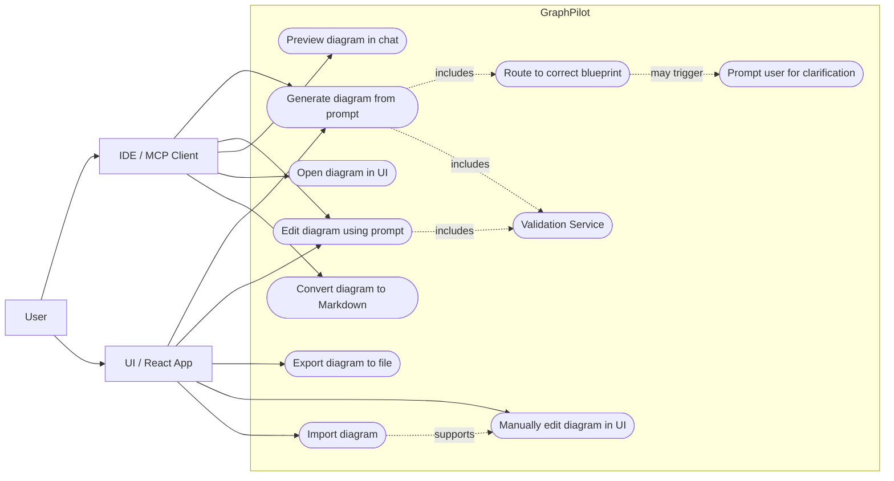
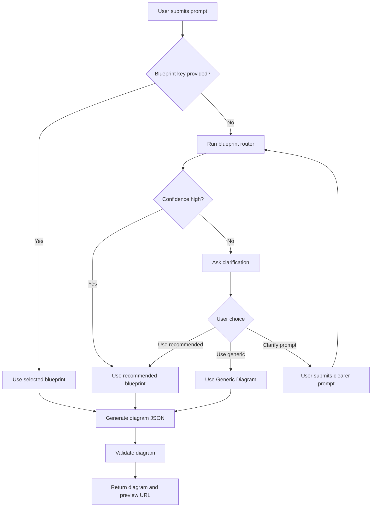

# Use Cases

## Purpose

This document defines the user-facing goals for GraphPilot.

It focuses on what people accomplish through GraphPilot's two entry points:

- **IDE / MCP Client** for chat-driven generation, editing, preview, and handoff into the UI
- **UI / React App** for generation, AI-assisted editing, manual editing, import, and export

The use cases in this document describe externally visible behavior. They do **not** treat GraphPilot Core, the local HTTP API, Azure OpenAI, blueprint files, preview caching, routing, or validation as primary actors.

GraphPilot MVP assumptions reflected here:

- MCP-first architecture
- database-free MVP
- local-file-based workflows
- no users/auth for MVP

## Actors

### User

The person who wants to generate, review, edit, import, or export diagrams.

### IDE / MCP Client

An MCP-capable IDE integration, such as Cursor, that invokes GraphPilot generation and editing capabilities on the user's behalf.

### UI / React App

The local React application that lets the user generate, inspect, edit, import, and export diagrams through the browser.

## Use Case Summary

| ID | Use case | Primary actor(s) | MVP/Future | Description |
| --- | --- | --- | --- | --- |
| UC-01 | Generate diagram from prompt | IDE / MCP Client, UI / React App | MVP | Generate a diagram from a natural-language prompt through either entry point, including blueprint routing, clarification when needed, and validation before returning the result. |
| UC-02 | Edit diagram using prompt | IDE / MCP Client, UI / React App | MVP | Update an existing diagram using the current GraphPilot JSON as context, with validation applied before returning patch operations or an updated diagram. |
| UC-03 | Preview diagram in chat | IDE / MCP Client | MVP | Return a preview summary and preview URL for a generated or edited diagram; later may expand to Mermaid Markdown or SVG preview responses. |
| UC-04 | Open diagram in UI | IDE / MCP Client | MVP | Return a link that opens the current diagram in the React UI for inspection or continued editing. |
| UC-05 | Convert diagram to Markdown | IDE / MCP Client | MVP | Convert a diagram into Mermaid / flowchart markdown so the user can paste it into an `.md` file. |
| UC-06 | Export diagram to file | UI / React App | MVP | Export the current diagram to JSON, PNG, JPG, or SVG. |
| UC-07 | Manually edit diagram in UI | UI / React App | MVP | Directly manipulate the diagram by moving, creating, deleting, connecting, and relabeling elements. |
| UC-08 | Import diagram | UI / React App | MVP | Import an existing `.graphpilot.json` file and render it in the UI for continued editing. |

## UML-Style Use Case Diagram

## Generation Supporting Flow

Blueprint routing is a **supporting behavior** inside generation. Validation is also supporting behavior inside generation and edit flows. Neither is a standalone top-level user use case.

For both MCP-driven generation and UI-driven generation:

- If `blueprintKey` is provided, GraphPilot uses the requested blueprint.
- If `blueprintKey` is missing, GraphPilot runs blueprint routing.
- If routing confidence is high, GraphPilot generates with the recommended blueprint.
- If routing confidence is medium or low, GraphPilot returns a clarification flow.
- After generation, GraphPilot validates the diagram before returning the result.

When clarification is needed, GraphPilot should return only these options:

1. Use recommended
2. Use Generic Diagram
3. I will clarify my prompt

GraphPilot should **not** show a giant list of all blueprints. If the user wants a different diagram type, they can clarify in natural language.

## Shared Use Cases

### UC-01 Generate diagram from prompt

**Primary actors:** IDE / MCP Client, UI / React App  
**Supporting actor:** User

**Goal:** Create a new diagram from a natural-language prompt through either GraphPilot entry point.

**Main success scenario:**

1. The user submits a prompt through the IDE / MCP Client or the UI / React App.
2. The entry point sends the prompt to GraphPilot.
3. GraphPilot determines the blueprint using the rules below.
4. GraphPilot generates GraphPilot JSON.
5. The Validation Service validates the generated diagram.
6. GraphPilot returns the diagram and, when available, preview information.

**Supporting behavior: blueprint routing**

- If `blueprintKey` is provided, use the requested blueprint.
- If `blueprintKey` is missing, run blueprint routing.
- If routing confidence is high, generate with the recommended blueprint.
- If routing confidence is medium or low, return clarification with only:
  1. Use recommended
  2. Use Generic Diagram
  3. I will clarify my prompt

**Blueprint routing outcomes inside this use case:**

- Class Diagram
- ERD
- UML Use Case Diagram
- Sequence Diagram
- Generic Diagram fallback

**Supporting behavior: Validation Service**

- validates the generated diagram before it is returned
- helps catch schema, structure, or blueprint-rule issues before the result is shown to the user

**Clarification rule:** Do not show a giant list of all blueprints. If the user wants another diagram type, they can clarify in natural language.

### UC-02 Edit diagram using prompt

**Primary actors:** IDE / MCP Client, UI / React App  
**Supporting actor:** User

**Goal:** Modify an existing diagram using a natural-language instruction through either entry point.

**Main success scenario:**

1. The user requests an edit through the IDE / MCP Client or the UI / React App.
2. The entry point sends the edit prompt plus the current diagram JSON.
3. GraphPilot uses the current GraphPilot JSON as context for the edit.
4. GraphPilot proposes patch operations or an updated diagram.
5. The Validation Service validates the proposed result.
6. GraphPilot returns patch operations or updated GraphPilot JSON.
7. In the UI flow, the user can review and accept or reject the proposed changes.

**Supporting behavior: Validation Service**

- validates patch operations or the updated diagram before the response is returned
- helps prevent invalid or structurally inconsistent edits from being applied

## IDE / MCP Client Use Cases

### UC-03 Preview diagram in chat

**Primary actor:** IDE / MCP Client  
**Supporting actor:** User

**Goal:** Give the user enough preview information to evaluate the diagram from chat.

**Main success scenario:**

1. A generated or edited diagram is available.
2. The IDE requests preview-ready output.
3. GraphPilot returns a preview summary.
4. GraphPilot returns a preview URL.

**Expected outputs:**

- Preview summary
- Preview URL
- Later, this may expand to Mermaid Markdown or SVG preview output

### UC-04 Open diagram in UI

**Primary actor:** IDE / MCP Client  
**Supporting actor:** User

**Goal:** Let the user continue working with the current diagram in the React UI.

**Main success scenario:**

1. A diagram has been generated or edited from the IDE path.
2. GraphPilot returns a link to open the diagram in the React UI.
3. The user opens the link.
4. The UI loads the diagram for viewing or further editing.

### UC-05 Convert diagram to Markdown

**Primary actor:** IDE / MCP Client  
**Supporting actor:** User

**Goal:** Convert a diagram into Mermaid / flowchart markdown for use in a Markdown file.

**Main success scenario:**

1. The user asks the IDE to convert a diagram into markdown.
2. The IDE sends the current diagram or source content to GraphPilot's convert capability.
3. GraphPilot converts the diagram into Mermaid / flowchart markdown.
4. GraphPilot returns markdown the user can paste into an `.md` file.

**Expected outputs:**

- Mermaid markdown
- Flowchart markdown when appropriate

## UI / React App Use Cases

### UC-06 Export diagram to file

**Primary actor:** UI / React App  
**Supporting actor:** User

**Goal:** Save the current diagram in a format the user can keep or share.

**Supported export formats:**

- JSON
- PNG
- JPG
- SVG

**Main success scenario:**

1. The user chooses an export action in the UI.
2. The user selects the desired output format.
3. The UI exports the current diagram to the selected file format.

### UC-07 Manually edit diagram in UI

**Primary actor:** UI / React App  
**Supporting actor:** User

**Goal:** Let the user directly adjust the diagram without AI assistance.

**Supported manual edit actions:**

- Move nodes
- Add nodes
- Delete nodes
- Connect nodes
- Edit labels and properties

**Main success scenario:**

1. The user opens, imports, or generates a diagram in the UI.
2. The UI renders the diagram in an editable canvas.
3. The user makes direct visual edits.
4. The UI updates the current diagram state.

### UC-08 Import diagram

**Primary actor:** UI / React App  
**Supporting actor:** User

**Goal:** Load a previously saved GraphPilot diagram into the UI for continued work.

**Main success scenario:**

1. The user selects an import action in the UI.
2. The user provides an existing `.graphpilot.json` file.
3. The UI imports the file.
4. The UI renders the diagram for editing.

**Relationship to other use cases:**

- Import supports continued work in **UC-07 Manually edit diagram in UI**.

## Notes

- Shared use cases remove duplication between the IDE / MCP Client and UI / React App entry points for generation and AI-assisted editing.
- Blueprint routing is supporting behavior inside **UC-01 Generate diagram from prompt**. It is not its own top-level use case.
- Validation Service is supporting behavior inside **UC-01 Generate diagram from prompt** and **UC-02 Edit diagram using prompt**. It is not a primary actor.
- **UC-05 Convert diagram to Markdown** captures the IDE-facing conversion flow for Mermaid / flowchart markdown that can be pasted into `.md` files.
- **UML Use Case Diagram** refers to a supported diagram type. That wording is used deliberately to avoid confusion with use cases in requirements documentation.
- The UI and MCP entry points use the same GraphPilot Core behavior through different entry points:
  - **Cursor / IDE -> MCP Server -> GraphPilot Core**
  - **React UI -> Local HTTP API -> GraphPilot Core**
- GraphPilot Core works with Azure OpenAI, local blueprint files, and a temporary preview cache.
- This use case model assumes no database and no users/auth for the MVP.
