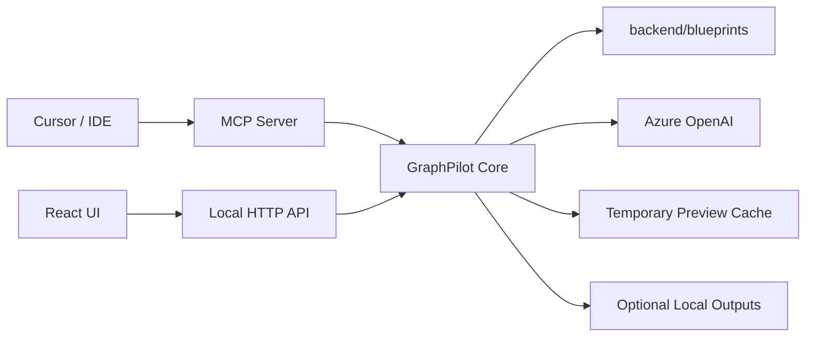
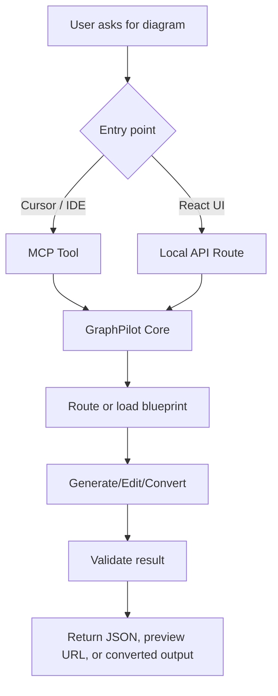

# 03 System Architecture

## Architecture Overview

GraphPilot is an MCP-first, database-free, local-file-based system with two request entry points feeding a shared backend core.

Major components:

- React UI
- Local HTTP API
- MCP Server
- GraphPilot Core
- Azure OpenAI
- Local blueprint files
- Temporary preview cache

## High-Level Architecture Diagram

## High-Level Request Flow

## Request Entry Points

### Cursor / IDE

Cursor or another IDE uses MCP tools for backend generation, edit, and conversion workflows.

### React UI

The React UI uses the local HTTP API to preview diagrams, edit them visually, and request backend conversion where needed.

## High-Level Flows

### Generate

- route request if `blueprintKey` is missing
- load the selected blueprint
- generate GraphPilot JSON
- validate the result
- return diagram JSON and optional preview URL

### Edit

- load the current diagram context and blueprint
- request edits from the backend
- validate the edited result or patch
- return patch operations or updated diagram JSON

### Convert

- accept semantic or text-based source input
- run deterministic, LLM, or hybrid conversion
- validate against source semantics when appropriate
- return converted output and validation results

## Where Detailed Design Lives

- see `docs/04-backend-architecture.md` for backend flow and service detail
- see `docs/05-frontend-architecture.md` for frontend routes, editor flows, and export detail
- see `docs/06-mcp-tools.md` for MCP tool behavior and clarification flow
- see `docs/07-api-routes.md` for local API route contracts
- see `docs/10-preview-export-conversion.md` for preview, convert, and export details
