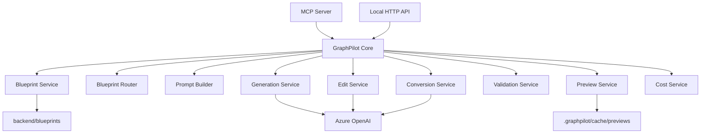
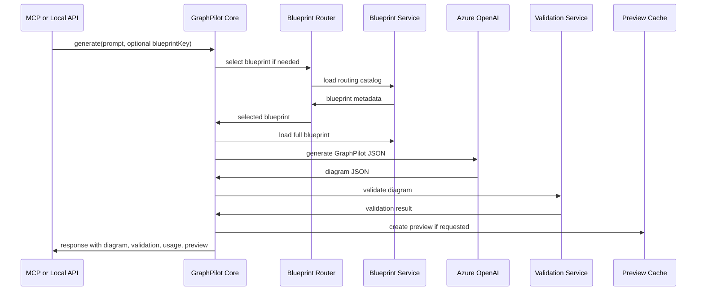
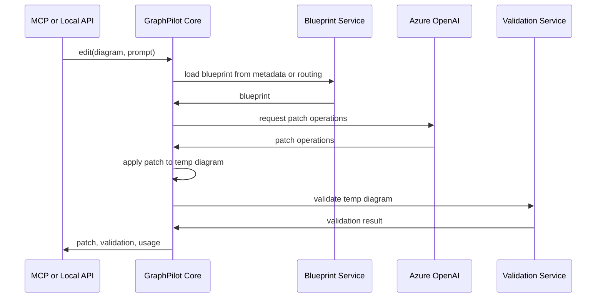
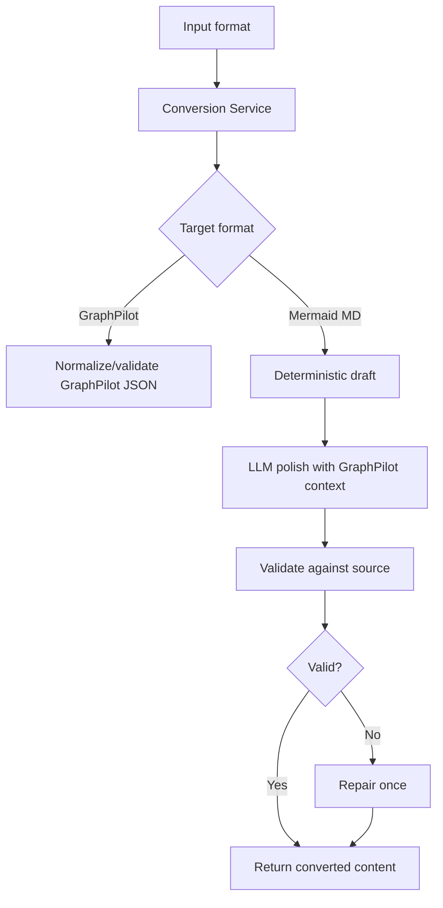

# 04 Backend Architecture

## Backend Responsibilities

The backend owns:

- blueprint loading and routing
- prompt construction
- Azure OpenAI calls
- generate, edit, and convert workflows
- validation
- preview cache creation and cleanup
- local config files and runtime env configuration
- examples and output folders used by backend workflows

The backend does **not** own browser image export for the MVP.

## Suggested Backend Folder Structure

**This is the suggested structure for the MVP. It can change if implementation needs require it.**

```text
backend/
  README.md
  .env.example
  requirements.txt
  blueprints/
  config/
  examples/
  outputs/
  graphpilot_core/
    services/
    schemas/
  mcp_server/
  local_api/
```

## Backend Component Diagram



## GraphPilot Core Services

Suggested service areas:

- blueprint service
- blueprint router
- prompt builder
- generation service
- edit service
- conversion service
- validation service
- preview service
- cost service
- file or output helper service if needed

## MCP Server

The MCP server is the IDE-facing backend entry point.

Responsibilities:

- expose `graphpilot_generate`, `graphpilot_edit`, and `graphpilot_convert`
- validate tool input
- call GraphPilot Core directly
- return structured results without blocking for user interaction

## Local HTTP API

The local HTTP API is the UI-facing backend entry point.

Responsibilities:

- expose local UI routes
- return preview JSON by `previewId`
- call GraphPilot Core directly
- return JSON responses for generate, edit, and convert workflows

## Preview Cache

The preview cache is temporary local storage used to support preview URLs.

Suggested location:

- `.graphpilot/cache/previews/`

The preview cache should:

- store normalized GraphPilot JSON
- generate preview IDs
- clean up old entries over time
- avoid exposing arbitrary file paths

## Generate Pipeline



## Edit Pipeline



## Convert Pipeline


