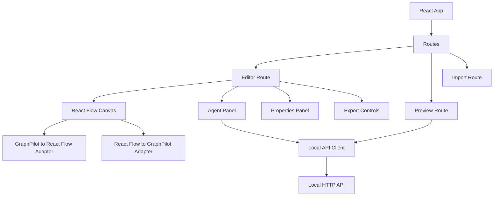
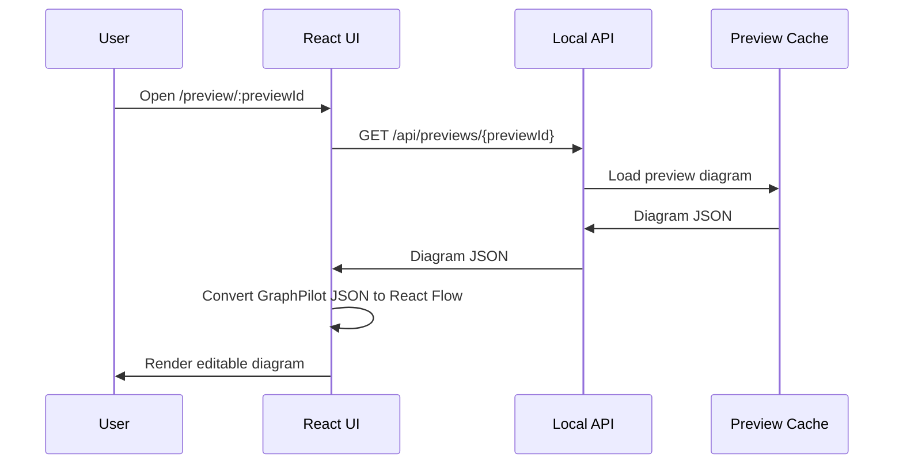
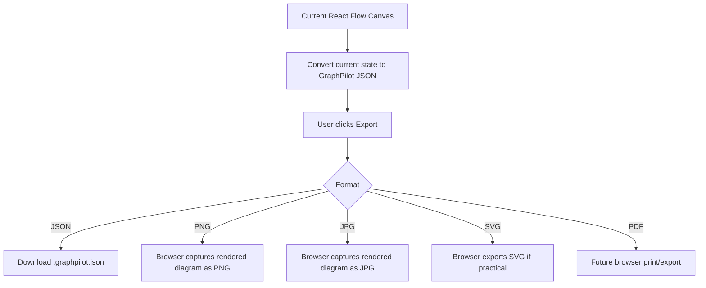

# 05 Frontend Architecture

## Frontend Responsibilities

The frontend owns:

- preview rendering in React Flow
- manual diagram editing
- GraphPilot-to-React-Flow adapter logic
- agent panel requests for generate, edit, and convert
- browser-based JSON export
- browser-based PNG, JPG, and SVG export if practical

The frontend is UI-only and must not contain Azure OpenAI secrets.

## Suggested Frontend Folder Structure

**This is the suggested structure for the MVP. It can change if implementation needs require it.**

```text
frontend/
  README.md
  .env.example
  package.json
  src/
    main.tsx
    App.tsx
    routes/
    components/
    features/
    services/
    types/
    utils/
```

## Main Routes

- `/`
- `/preview/:previewId`
- `/import`

## Frontend Component Diagram



## React Flow Editor

React Flow is the live canvas layer used for:

- preview display
- node movement and resizing
- manual edge creation and deletion
- properties editing
- visual export from the browser

## GraphPilot JSON Adapters

The frontend maintains two local adapters:

- GraphPilot JSON -> React Flow state
- React Flow state -> GraphPilot JSON

These adapters keep live editing local for performance.

## Agent Panel

The agent panel is the UI surface for:

- generate requests
- edit requests
- convert requests
- clarification prompts returned by the backend

## Import and Export

Import and export responsibilities include:

- importing `.graphpilot.json`
- exporting `.graphpilot.json`
- exporting browser-rendered PNG and JPG
- exporting SVG if practical in the browser
- converting to Mermaid through backend `POST /api/convert`

## Preview Route

The preview route loads temporary diagrams by `previewId`.

## Preview Load Sequence



## Frontend Export Flow


