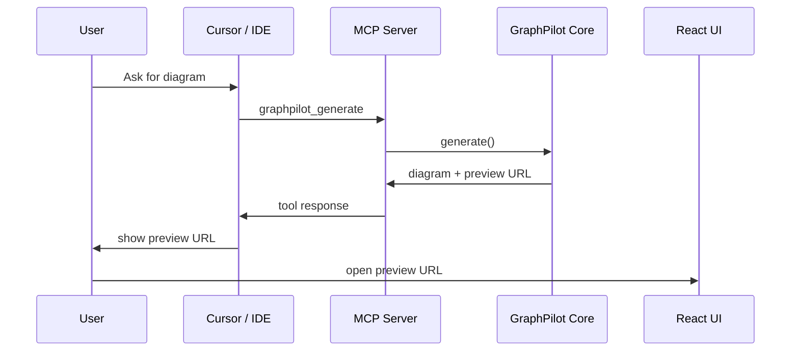
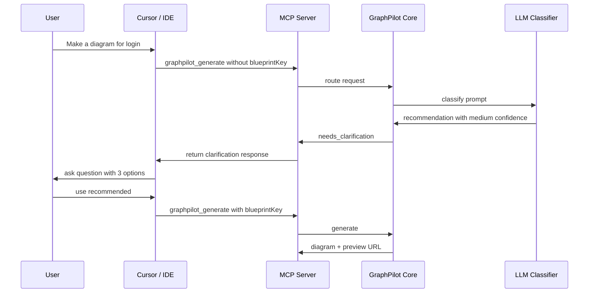

# 06 MCP Tools

## MCP Server Purpose

The MCP server is the IDE-facing integration layer for GraphPilot.

It allows Cursor or another MCP-capable IDE to call backend generation, edit, and conversion workflows without directly invoking local HTTP routes.

## MVP Tool List

- `graphpilot_generate`
- `graphpilot_edit`
- `graphpilot_convert`

`graphpilot_render` is not an MVP MCP tool.

## MCP Tool Flow



## Tool Contracts

### `graphpilot_generate`

Purpose:

- generate GraphPilot JSON from a prompt
- optionally create preview output
- optionally write output when `outputPath` is explicitly provided

### `graphpilot_edit`

Purpose:

- edit an existing GraphPilot JSON diagram
- return patch operations or an updated diagram

### `graphpilot_convert`

Purpose:

- convert between semantic and text-based representations
- support Mermaid Markdown as the first major text-based conversion target

## Clarification Flow

MCP does not block waiting for user input.

When routing is uncertain:

- the tool returns `needs_clarification`
- the IDE asks the user
- the IDE calls the tool again with `blueprintKey` or a clarified prompt

Clarification options are only:

1. Use recommended
2. Use Generic Diagram
3. I will clarify my prompt



## Example Response Envelope

Shared response structure:

- `status`
- `data`
- `clarification`
- `error`
- `usage`
- `validation`

### Success example

```json
{
  "status": "success",
  "data": {
    "diagram": {},
    "preview": {
      "previewId": "preview_abc123",
      "previewUrl": "http://localhost:5173/preview/preview_abc123"
    }
  },
  "clarification": null,
  "error": null,
  "usage": {},
  "validation": {}
}
```

### Clarification example

```json
{
  "status": "needs_clarification",
  "data": null,
  "clarification": {
    "question": "Do you have a specific diagram type in mind?",
    "reason": "Your request could fit more than one supported diagram style.",
    "recommended": {
      "blueprintKey": "sequence_diagram",
      "label": "Sequence Diagram"
    },
    "options": [
      { "id": "use_recommended" },
      { "id": "use_generic" },
      { "id": "clarify_prompt" }
    ]
  },
  "error": null,
  "usage": null,
  "validation": null
}
```
