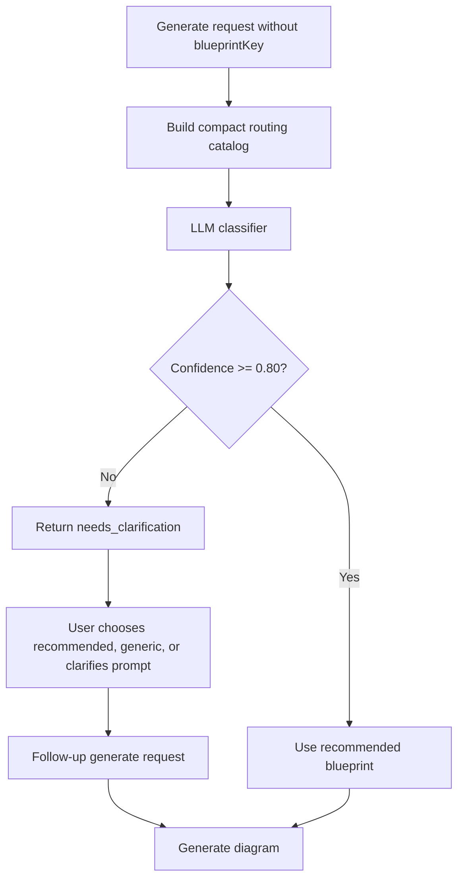

# 08 Blueprint Design

## Blueprint Purpose

Blueprints define diagram-specific guidance, routing metadata, allowed structures, and examples.

Blueprints are durable backend-owned local JSON files stored under `backend/blueprints/`.

## Blueprint Folder Structure

```text
backend/blueprints/
  README.md
  erd/
    blueprint.json
    examples/
    tests/
  flowchart/
    blueprint.json
    examples/
    tests/
  class_diagram/
    blueprint.json
    examples/
    tests/
  sequence_diagram/
    blueprint.json
    examples/
    tests/
  system_architecture/
    blueprint.json
    examples/
    tests/
  generic_diagram/
    blueprint.json
    examples/
    tests/
```

`generic_diagram` is required as the fallback blueprint.

## Blueprint JSON Fields

Suggested top-level shape:

```json
{
  "schemaVersion": "graphpilot.blueprint.v1",
  "key": "system_architecture",
  "name": "System Architecture",
  "diagramType": "system_architecture",
  "description": "Creates diagrams showing applications, services, databases, users, external systems, and integrations.",
  "version": "1.0.0",
  "routing": {},
  "ai": {},
  "nodeTypes": [],
  "edgeTypes": [],
  "schema": {},
  "layout": {},
  "validation": {},
  "examples": []
}
```

## Routing Section

When `blueprintKey` is missing, GraphPilot uses an LLM classifier and a compact routing catalog built from blueprint routing metadata.

The classifier may generate a question and reason, but GraphPilot controls the clarification option structure.

Clarification options are only:

1. Use recommended
2. Use Generic Diagram
3. I will clarify my prompt

## Routing Diagram



## AI Instructions

Blueprint `ai` sections can define prompt guidance for generation and edit workflows.

## Node and Edge Types

Each blueprint should define allowed node types and edge types appropriate for that diagram family.

## Examples

Blueprint examples reinforce expected semantic output and help guide both generation quality and DOE testing.
