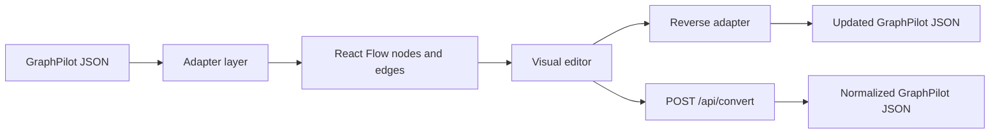

# 09 Diagram JSON Format

## Why Semantic JSON

GraphPilot uses semantic diagram JSON because it is easier to:

- generate with AI
- validate
- edit
- convert
- export
- keep stable across IDE and UI workflows

GraphPilot JSON is **not** raw React Flow JSON.

## Top-Level Structure

```json
{
  "schemaVersion": "graphpilot.diagram.v1",
  "kind": "diagram",
  "diagramType": "system_architecture",
  "id": "diagram_work_order_architecture",
  "name": "Work Order Architecture",
  "metadata": {
    "source": "mcp",
    "blueprintKey": "system_architecture"
  },
  "canvas": {
    "viewport": { "x": 0, "y": 0, "zoom": 1 },
    "grid": { "enabled": true, "size": 20 }
  },
  "nodes": [],
  "edges": [],
  "groups": []
}
```

## Nodes

Nodes represent semantic entities in the diagram.

Typical node information includes:

- `id`
- `type`
- `label`
- `position`
- `size`
- `style`
- metadata as needed

## Edges

Edges represent semantic relationships between nodes.

Typical edge information includes:

- `id`
- `type`
- `from`
- `to`
- `label`
- style or metadata as needed

## Groups

Groups allow related nodes to be visually or semantically grouped when appropriate.

## Canvas

Canvas contains viewport and grid information used by the visual editor.

## Metadata

Metadata may contain:

- source (`mcp`, `ui_import`, `ui_edit`, `convert_api`)
- blueprint key
- generated or edited timestamps
- optional model information

## Patch Operations

Patch operations are used primarily for edit workflows.

Typical patch intent may include:

- add node
- update node
- remove node
- add edge
- update edge
- remove edge
- update metadata

## React Flow Adapter Notes

GraphPilot JSON is the canonical source of truth.

React Flow state is derived from it for editing and rendering.



Practical rule:

- local adapters should handle routine live editing
- backend conversion should handle normalization, validation, defaults, and import or text-conversion workflows
