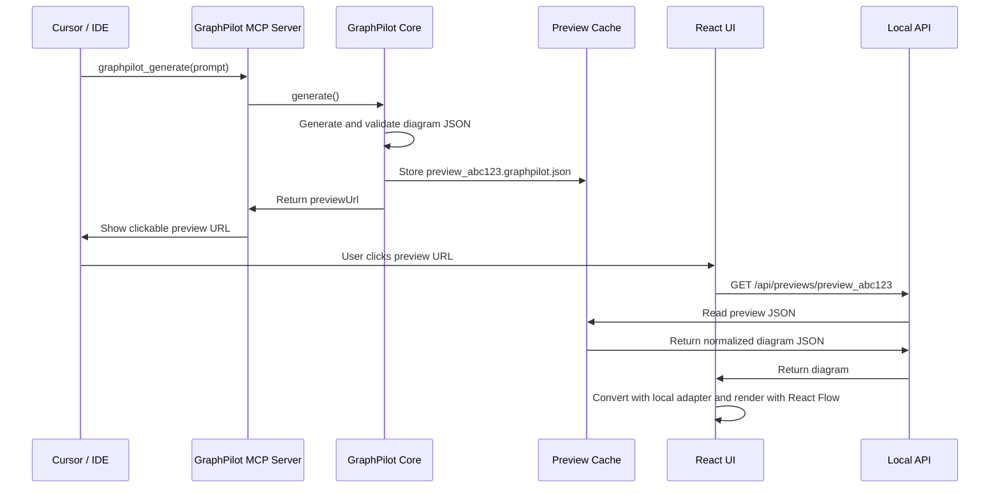
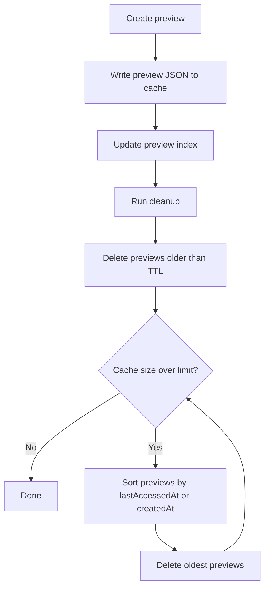
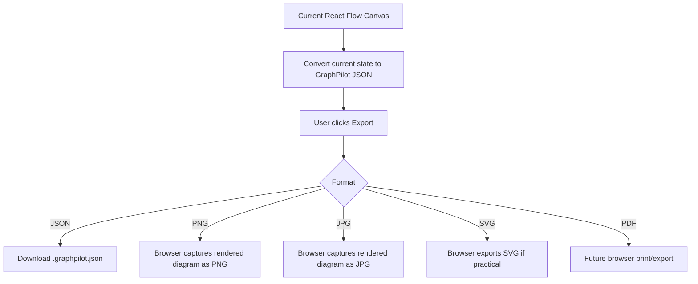
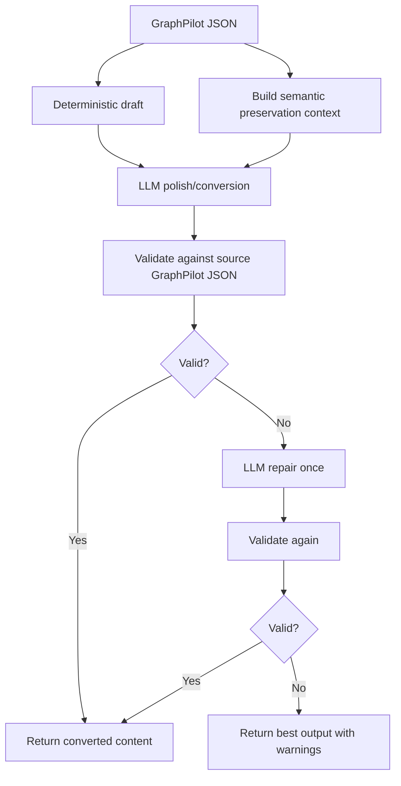

# 10 Preview Export Conversion

## Preview URL Strategy

GraphPilot is preview-first in the MVP.

Generated diagrams are returned as JSON by default, and preview URLs are used to open editable diagrams in the UI without requiring durable persistence.

## Temporary Preview Cache

Preview URLs are backed by a temporary local preview cache.

Suggested folder:

```text
.graphpilot/cache/previews/
  preview_abc123.graphpilot.json
  preview_def456.graphpilot.json
  index.json
```

Preview entries should store normalized GraphPilot JSON and be resolved by `previewId`.

## Preview Sequence



## Cache Cleanup Policy

The preview cache should:

- keep recent previews
- delete previews older than the configured TTL
- enforce a max cache size
- delete oldest entries first when over the limit
- run cleanup on startup and after preview creation

## Cache Cleanup Flow



## Frontend Visual Export

Frontend handles visual export in the browser for the MVP.

MVP export formats:

- JSON
- PNG
- JPG
- SVG if practical
- PDF later through browser print or export flows

## Frontend Export Flow



## Backend Conversion

Backend handles semantic and text-based conversion through:

- `graphpilot_convert`
- `POST /api/convert`
- `conversion_service`

The first major convert target is Mermaid Markdown.

## Backend Convert Flow



## Mermaid Markdown Conversion

Recommended hybrid approach:

1. deterministic draft
2. GraphPilot semantic context
3. LLM polish
4. validation against the source GraphPilot JSON
5. one repair attempt if needed

## Future or Deferred Work

Backend image or PDF rendering is future or deferred work.

Examples:

- backend image or PDF export using Playwright
- backend SVG renderer
- Mermaid parser validation
- HTML document conversion
