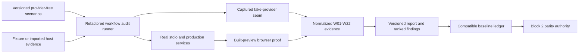

# Epic 3 Part 6 Block 1 Design Plan

**Plan ID:** `graphpilot-epic3-part6-block1-v1`  
**State:** Proposed — not approved, promoted, implemented, or verified  
**Review base:** commit `4a0ab8ba04bf2566b122e85a0b38fd29510dce8f`  
**Implementation boundary:** Provider-free Block 1 only. No Azure call, live budget, runtime promotion, Block 2 work, push, or modification of user-owned artifacts is authorized by this plan.

## Recommendation

Refactor and complete the existing S15 offline workflow-audit foundation rather than rewrite it. Preserve its real-stdio path, W01–W22 taxonomy, service wrappers, generation observer, cold/warm orchestration, recovery proof, and accounting logic. Remove its runtime dependency on S15's frozen H/M case and runner package, add the missing versioned scenario/report/ledger contracts and browser evidence, and make a new provider-free command the canonical Block 1 entry point.

Keep S15's `full_effort_*` cases, manifests, observations, stopped identities, live ceilings, and historical outcome unchanged. `run_full_effort_evaluation` will retain only the S15 operations `offline|prepare|stage_b|stage_c`; its internal `audit_offline` operation will be replaced by the separate `run_workflow_audit` command and all current references will migrate atomically.



## Why the Current Foundation Is Not Yet Block 1

The current `FullWorkflowAuditService` is useful but remains coupled to `FullEffortCaseSetService` and `FullEffortFakeClientFactory`, returns an unregistered transient report, deletes its default temporary workspaces, always leaves W22 unmeasured, has no cumulative ledger or compatibility gate, and lives under the S15 `run_full_effort_evaluation audit_offline` command. S15's own outcome correctly classifies that work as an initial pass rather than the permanent reusable capability.

## Design Decisions

### 1. Stable boundary and accounting model

- Retain W01–W22 as stable detailed boundary IDs and map them to Block 1's ten broader audit areas.
- Account non-overlapping complete-wall time as `host`, `azure`, `mcp`, `local`, `browser`, and `residual`.
- Every value carries evidence status, source, reason, and confidence. Supported statuses are `measured`, `derived`, `simulated`, `imported`, `not_measured`, `not_reached`, and `not_applicable`.
- An unavailable value is `null`, never zero. Zero is valid only for an explicitly observed zero or a deliberately provider-free `not_called` condition.
- Fake-provider duration is local harness time and never Azure evidence. Copilot credits remain host evidence and are never converted into Azure usage.

### 2. Independent scenario interface

Add a bounded, namespace-first workflow-audit scenario-set contract and a checked-in default bundle with new non-S15 identities. Runtime code will not import or reference `FullEffortCaseSetService`, `FullEffortFakeClientFactory`, H/M conditions, stopped run IDs, or full-effort schema identities.

The default bundle contains:

- six success anchors: basic and complex context workflows for Activity, Use Case, and BDD, each cold and warm;
- the smallest guard scenarios needed to cover readiness-blocked output, response and candidate repair paths, provider failure/interruption, finalized-output recovery, and no-rerun behavior;
- explicit thermal, artifact, and process-cache state;
- a bounded fake-provider script, expected outcome/quality, browser eligibility, and no-rerun assertions.

This is plumbing and reliability evidence, not representative validation or certification.

### 3. Selective extraction, not repository restructuring

Keep `backend/services/evaluation/full_workflow_audit_service.py` during Block 1 to avoid a file-layout decision owned by Block 2. Rename its main class to `WorkflowAuditService` and refactor the existing code in place. Explicitly replace the current S15 dependencies in both the runner and `FullWorkflowAuditFakeClient` with the new scenario provider and provider-free client factory. Add only small workflow-audit modules where separate ownership is necessary for contracts, scenario loading, artifact storage, report/ledger logic, or browser evidence.

### 4. Evidence adapters without production behavior changes

Use current consumers to justify each seam:

- fixture-host adapter for provider-free runs;
- optional strictly validated external-host evidence importer for future real host clocks, searches, reads, bytes, tokens, and credits;
- evaluation-only `WorkflowAuditCapturingClient` around the existing LLM client protocol to capture role/state, bytes, duration, input/output/reasoning/cached tokens, provider request ID, service tier, and requested/effective controls;
- current generation observer for stage, candidate, repair, quality, and result events;
- real-stdio MCP adapter for startup, discovery, transport, serialization, response bytes, and recovery;
- Playwright browser adapter for W22.

The capturing client follows the proven S15 capture pattern but is independent of H/M logic. Block 1 does not modify or version the production generation-observer event contract. A future live package may wrap an authorized Azure client, but this plan exposes no live flag and constructs no Azure client.

### 5. Browser-safe completion proof

Use the existing Playwright dependency and dedicated ports `127.0.0.1:18080` (Django) and `127.0.0.1:15173` (frontend). A dedicated audit configuration builds the frontend, serves `npm run preview`, starts Django with `--noreload`, and opens one exact generated representative path cold and warm.

Evidence includes navigation-to-visible duration, diagram/node/edge identity, API response timing/status, and console, page, and failed-network results. Diagnostic runs may explicitly omit browser execution and report W22 as `not_measured`; recording a baseline fails closed unless the required browser proof passes.

### 6. Immutable run package and baseline ledger

Store non-canonical audit artifacts under:

```text
.graphpilot/evaluation/workflow-audit/
  runs/<run-id>/
    manifest.json
    observations/*.json
    browser-evidence.json
    report.json
    report.md
  baseline-ledger.json
```

- Run and observation identities are unique and immutable.
- Writes are bounded, path-safe, secret-scanned, and exclusive or atomic with expected-digest concurrency checks.
- Reports retain safe metrics, identities, versions, and generated JSON/SVG digests and byte counts, not raw source, prompts, provider responses, hidden reasoning, secrets, or hidden gold.
- The ledger has append-only semantics, a fixed entry bound, and atomic expected-digest updates. It stores baseline/run identity, report path/digest, summary, and compatibility key rather than full observations.
- Comparison requires an exact compatibility key over audit/report/scenario/schedule versions and digests, relevant assets/dependencies/platform, and browser mode. Incompatible runs are explicitly `incomparable`; percentages are never fabricated.
- S13–S15 numbers remain prior evidence only and are never imported as Block 1 ledger baselines.

### 7. Deterministic ranked findings

Rank candidates by:

1. failure, interruption, retry, quality, or no-rerun risk;
2. measured contribution to a valid complete-wall denominator;
3. material unknown coverage that blocks attribution.

A versioned W01–W22 definition catalog supplies the responsible boundary and safe diagnostic defaults. Each row includes evidence references, owner confidence, smallest proven behavioral fix or otherwise the smallest diagnostic proof, strongest alternative, trade-off, bounded expected-benefit ceiling, offline proof, required live proof, and disposition. No model-generated recommendation changes runtime behavior, configuration, prompts, schemas, schedules, architecture, or promotion state.

## Block 1 Slice Group

Block 1 receives its own nested slice folder. The existing root-level block document remains the approved high-level owner; the nested `00-group.md` owns the executable slice index and links back rather than restating the block contract. Future blocks receive their own numbered slice folders only when their direction is approved.

```text
06-workflow-reliability-and-optimization/
  01-workflow-audit-and-measurement/
    00-group.md
    01-audit-contracts-and-scenarios.md
    02-capture-and-evidence-adapters.md
    03-audit-runner-and-recovery.md
    04-browser-completion-proof.md
    05-reports-and-baseline-ledger.md
    06-fresh-provider-free-baseline.md
```

| Slice | Purpose | Exit proof |
| --- | --- | --- |
| **01 · Audit Contracts and Scenarios** | Create the canonical workflow-audit design owner; define scenario, manifest, observation, report, external-evidence, and ledger contracts; define storage/compatibility/security semantics; add the independent default scenario bundle/loader. | Schema inventory and examples pass; bundle is bounded, complete, and contains no S15/H/M/stopped identity; invalid paths, sizes, refs, statuses, null/zero misuse, and unsafe payloads fail. |
| **02 · Capture and Evidence Adapters** | Refactor the existing metric/observer/wrapper foundation into normalized W01–W22 capture; add scenario-backed fake and capturing clients, fixture/external-host and real-stdio adapters, five-domain accounting, confidence/coverage. | Instrumented and uninstrumented runs have identical provider call order, result, canonical JSON, SVG, and writes; callback/capture failure is isolated; rich provider metadata and missing values are exact. |
| **03 · Audit Runner and Recovery** | Refactor `WorkflowAuditService` and `FullWorkflowAuditFakeClient` off S15 services; implement immutable manifests/observations, cold/warm states, blocked/repair/failure paths, finalized recovery, terminal/no-rerun behavior, and zero-Azure enforcement. | Success and guard scenarios pass; every W01–W22 boundary is measured, derived, simulated, imported, not reached/applicable, or `not_measured` with reason; completed/uncertain identities cannot rerun. |
| **04 · Browser Completion Proof** | Add dedicated built-preview Playwright orchestration and merge exact W22 evidence into the run package. | Cold/warm representative diagram loads visibly with exact identity, no console/page/network failures; malformed/mismatched evidence and browser failure block baseline recording. |
| **05 · Reports and Baseline Ledger** | Add deterministic ranked findings, versioned JSON/Markdown report, immutable artifact store, compatibility comparison, atomic ledger, and canonical `run_workflow_audit`; retire the old `audit_offline` operation and migrate tests/docs. | Report/ledger schemas validate; stale/concurrent ledger writes and incompatible comparisons fail safely; command constructs no Azure client; old workflow-audit tests migrate rather than disappear. |
| **06 · Fresh Provider-Free Baseline** | Run the audited package against the current repository with new identities and record the pre-Block2 baseline. | Focused/full gates pass; one exact report/ledger entry records commit/assets/scenarios, cold/warm/browser results, quality, ranked gaps, confidence limits, and Block 2 parity key; no live call occurs. |

## Verification and Delivery Cadence

For the plan and every implementation slice:

1. create/update slice plan and canonical owner;
2. audit scope, ownership, contracts, dependencies, reversibility, acceptance, and checks;
3. commit the audited plan;
4. implement only that slice;
5. audit the diff for correctness, parity, stale behavior, security, and missing tests;
6. run focused checks and the required broader gate;
7. commit the verified implementation.

Required final gates:

```powershell
cd backend; uv run python manage.py test
cd backend; uv run python manage.py check
cd backend; uv run python mcp_server/smoke_test.py
cd backend; uv run python -m compileall -q api mcp_server services
cd frontend; npm run verify
```

Also required: focused scenario/schema/capture/runner/report/command tests; blocked/failure/recovery/no-rerun tests; secret/redaction bounds; instrumented-equivalence tests; ledger stale-digest/concurrent-writer tests; dedicated built-preview browser proof; `git diff --check`; final implementation/security audit.

## Reversibility and Non-Goals

Rollback removes the new workflow-audit schemas/bundle/modules/command/browser configuration and restores the old provider-free audit entry if needed. It does not migrate or delete canonical diagrams, requests, context artifacts, S15 evidence, or ledger files. Production MCP/API contracts and generation acceptance remain unchanged.

Not owned by this block:

- fixing any ranked behavioral bottleneck;
- repository-wide restructuring or file moves;
- readiness redesign/correction;
- live provider execution, H/M replacement screening, Stage C, or certification;
- runtime setting, prompt, schema, label, example, caching, async, or architecture promotion;
- representative stability claims.

## Strongest Alternative

Generalize the complete S15 `full_effort_*` case/manifest/runner/report stack and keep `run_full_effort_evaluation audit_offline` as the operator surface. This reuses more names and files but carries H/M conditions, stage budgets, fixed identities, and stopped-run semantics into the permanent audit. The recommended selective extraction costs a dedicated scenario/report contract and internal CLI migration but gives Block 1 a clean reusable boundary while leaving historical evidence immutable.

## Plan Audit

**Pass after revision.** Independent review first identified ambiguity about duplicate command/service work, artifact ordering, browser orchestration, scenario/fake-client dependency depth, test migration, and stale documentation. The corrected plan explicitly refactors the existing service rather than rewriting it, separates the internal command, defines storage/ledger contracts first, reuses existing ports with built preview, extracts both runner and fake-client S15 dependencies, migrates tests, and updates every reference. A final review found no material defect after replacing the proposed production observer change with an evaluation-only capturing client.

## Approval Scope

Approval authorizes creation and commitment of the nested Block 1 Slice 01–06 plans under `01-workflow-audit-and-measurement/`, replacement of the internal `run_full_effort_evaluation audit_offline` entry with `run_workflow_audit`, the internal class rename/refactor, provider-free implementation, verification, fresh baseline recording, and one coherent commit per required checkpoint under the repository's standing permission.

Approval does **not** authorize Azure calls, any live budget, reuse/rerun of S15 identities, Block 2 implementation, release/promotion/certification, destructive deletion of user artifacts, modification of `.env`, push, or remote changes.

The unrelated untracked `backend/_diag_llm.py` remains untouched and excluded from every commit.

## Canonical Sources Reviewed

- `AGENTS.md`
- `.devin/rules/graphpilot.md`
- `docs/03-development-and-delivery/epics/00-current-state.md`
- `docs/02-design-and-features/decision-decisions.md`
- `docs/03-development-and-delivery/epics/03-mcp-generation-and-wrappers/00-epic.md`
- `docs/03-development-and-delivery/epics/03-mcp-generation-and-wrappers/06-workflow-reliability-and-optimization/00-group.md`
- `docs/03-development-and-delivery/epics/03-mcp-generation-and-wrappers/06-workflow-reliability-and-optimization/01-success-contract.md`
- `docs/03-development-and-delivery/epics/03-mcp-generation-and-wrappers/06-workflow-reliability-and-optimization/02-block-01-workflow-audit-and-measurement.md`
- `docs/03-development-and-delivery/epics/03-mcp-generation-and-wrappers/04-context-backed-generation/13-context-performance-and-recovery.md`
- `docs/03-development-and-delivery/epics/03-mcp-generation-and-wrappers/04-context-backed-generation/14-readiness-effort-evaluation.md`
- `docs/03-development-and-delivery/epics/03-mcp-generation-and-wrappers/04-context-backed-generation/15-full-effort-evaluation.md`
- `docs/02-design-and-features/07-evaluation-and-doe-design.md`
- `docs/02-design-and-features/08-context-backed-generation/`
- `docs/01-architecture/01-backend-architecture.md`
- `docs/01-architecture/03-mcp-tools/`
