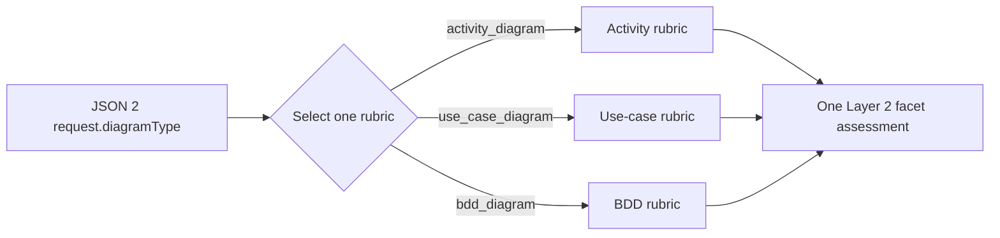

# Per-Type Readiness Rubrics

This document is the human-readable entry point for the three per-type rubric owners; it defines no additional
JSON format.

## Purpose

A readiness review selects exactly one rubric from JSON 2 `request.diagramType`:

| JSON 2 type | Machine contract | Explanation |
| --- | --- | --- |
| `activity_diagram` | [`activity/rubric.json`](activity/rubric.json) | [`activity/rubric.md`](activity/rubric.md) |
| `use_case_diagram` | [`use-case/rubric.json`](use-case/rubric.json) | [`use-case/rubric.md`](use-case/rubric.md) |
| `bdd_diagram` | [`bdd/rubric.json`](bdd/rubric.json) | [`bdd/rubric.md`](bdd/rubric.md) |

Each `rubric.json` is the complete normative machine contract: descriptions, exact applicability,
facet-specific `0..4` anchors, weights, and gap policy. Its sibling Markdown explains the contract without
redefining it. Common rating semantics, assumption, score, and status policy lives in
[`../02-policy-and-calculation.md`](../03-policy-and-calculation.md).

## Selection flow

Only the selected rubric is sent in the bounded reviewer projection. The other two do not contribute facets,
weights, or prompt content.

## Common structure

Every rubric declares:

- immutable `rubricVersion` and `diagramType`;
- ordered facets;
- required `always` applicability or explicit conditional `appliesWhenAny`/`notApplicableWhenAll`/`uncertainWhen` rules;
- exact facet-specific anchors for each rating `0..4`;
- integer weight and minimum rating;
- deterministic below-minimum gap policy.

The exact common field semantics are owned by `02-policy-and-calculation.md`; exact facet data is owned by the
selected `rubric.json`, with human explanation in the sibling `rubric.md`.

### Final definition

> The rubric set is three mutually exclusive static policies; each readiness review selects exactly one from
> the requested diagram type and produces one coverage array against that policy.
