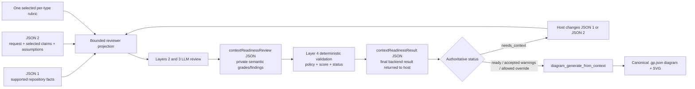
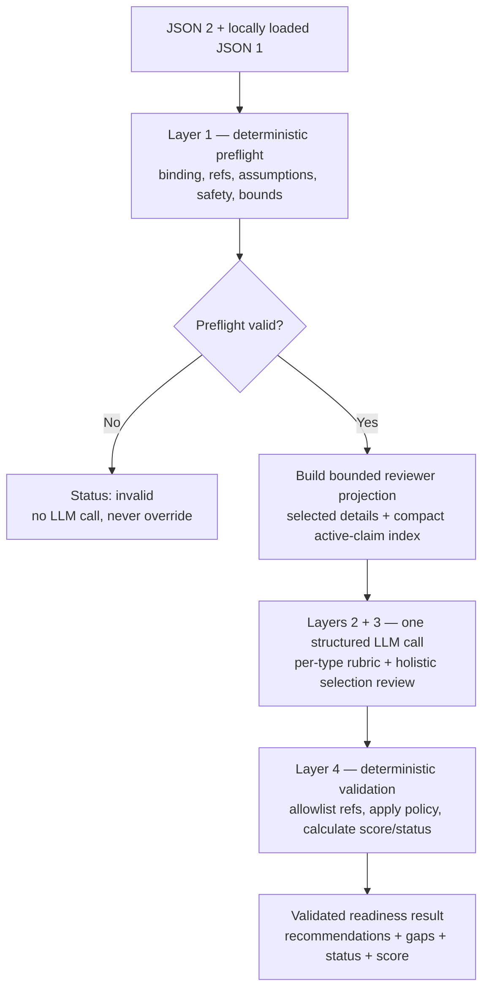
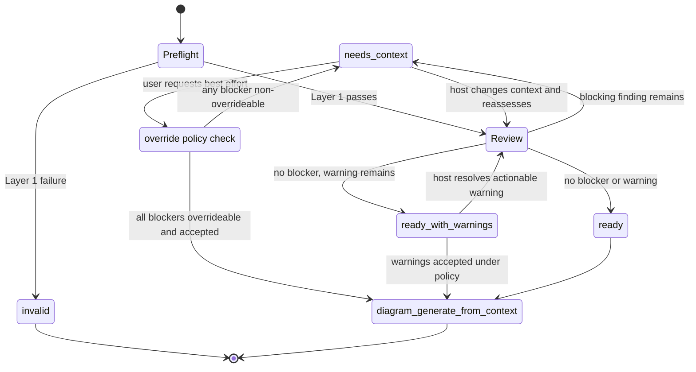

# JSON 2 Readiness Reviewer

> **Scope of this doc.** This document owns the definition and architecture of "JSON 2 is good enough to
> generate": the four review layers, reviewer projection, final readiness-result contract, status-first
> policy, recommendations, bounded improve-before-ask loop, and user override boundary. Exact facets, applicability, anchors, weights,
> assumption cap, finding registry, structured reviewer-output validation, score/rounding/status algorithm,
> fixtures, calibration, and repeated-run stability belong to the linked files in this package. The overall
> feature flow is [`../01-workflow.md`](../02-workflow.md); JSON 1 and JSON 2 structures are
> [`../02-evidence-manifest.md`](../03-evidence-manifest.md) and
> [`../03-diagram-request-context.md`](../04-diagram-request-context.md).

## Purpose

The readiness reviewer prevents an incomplete, noisy, contradictory, or weakly grounded JSON 2 selection
from reaching generation and forcing the generator to guess. It answers:

> Given this request and the supported repository knowledge in JSON 1, does JSON 2 contain a complete,
> minimal, coherent, and sufficiently grounded context selection for the requested diagram type? If not,
> which existing claims should be added or removed, which facts are genuinely missing, and what should the
> host search for or ask the user?

The reviewer is **not** a source-code fact checker and does not generate the diagram. The host has already
verified source into generic JSON 1 evidence/claims; the reviewer judges whether the JSON 2 selection is
adequate. Under the v1 **Option A** boundary, the separate backend generator—not the host or reviewer—
maps finalized generic claims to GraphPilot semantic types and logical topology.

## Position in the workflow

```text
host refreshes JSON 1
  -> host creates/loads the persisted JSON 2 request packet
  -> backend readiness review:
       Layer 1 deterministic preflight
       Layers 2 + 3 one structured LLM reviewer call
       Layer 4 deterministic validation + aggregation
  -> needs_context / actionable warnings:
       host applies validated selection repairs first
       then performs focused source search when facts are missing
       asks the user only when repository context cannot resolve the issue
       updates JSON 1 or JSON 2 and re-runs readiness within the bounded loop
  -> ready / accepted warnings / explicitly allowed override:
       diagram_generate_from_context(workspaceDir + JSON 2 path)
```

The host may provide an initial `selectedClaims` set or leave it empty. An empty or weak first selection is
not a failure by itself: the reviewer may propose a grounded selection from the compact active-claim index.
The reviewer never silently edits JSON 1 or JSON 2; it returns a validated proposal for the host to apply
and persist.

### JSON flow



The private review JSON is documented in [`03-reviewer-json.md`](04-reviewer-json.md). The one final result
JSON is documented in [`04-results.md`](05-results.md). Neither is persisted inside JSON 1 or JSON 2.

## What "good enough" means

A JSON 2 packet is ready when:

1. the manifest binding and every selected reference are valid and current;
2. required and conditionally applicable per-type facets satisfy the exact selected rubric;
3. the selected claims form a coherent model at the requested scope/detail level;
4. no material contradiction remains among selected/current `as_implemented` claims, and no blocking
   uncertainty remains;
5. every unsupported choice is an explicitly accepted assumption whose recorded authority is sufficient for its materiality;
6. important relevant JSON 1 claims have not been omitted;
7. irrelevant/redundant context does not overwhelm the requested subject;
8. the exact transient populated generator input fits deployment-derived safety/token bounds;
9. no deterministic or reviewer blocking finding remains.

Status is the authoritative gate; score is secondary progress/diagnostic information. A high average never
hides a required gap or non-overrideable blocker.

## Reviewer input

The deterministic backend loads the complete JSON 1 manifest locally, but Azure receives a bounded
projection rather than raw source, complete evidence history, or the entire manifest body.

### Full selected details

For each currently selected claim, the reviewer receives:

- exact claim ID + version, kind, statement, applicability, and structured payload;
- support derivation/rationale;
- bounded supporting evidence summaries (not raw source);
- JSON 2 selection role/reason;
- related open uncertainties.

### Compact active-claim index

To detect omissions, the reviewer receives one bounded index entry per current active claim:

| Field | Meaning |
| --- | --- |
| `id` + `version` | Exact current active claim reference. |
| `kind` | Generic JSON 1 claim kind. |
| `statement` | Bounded normalized fact. |
| `keyFacts` | Compact deterministic projection of material payload meaning. |

No historical versions, raw evidence, discovery graph, or graph-native scores are included. V1 includes every
claim that is `active`, current, and selectable for `as_implemented` exactly once. It never filters, retrieves,
truncates, or chunks the index: if that complete projection exceeds the effective reviewer-input limit, readiness
returns `context_too_large` before Azure so omission checking is never presented as complete when it is not.

The projection exposes selected, indexed, and indexed-but-unselected claim refs as separate deterministic allowlists. `unselectedIndexedClaimRefs` is exactly the active indexed set minus the selected set in canonical claim order and is an explicit empty array when no omission recommendation is possible; the reviewer never computes this set difference implicitly.

`graphpilot.context.readiness-input.v1` is a private, digest-bound provider projection with no external consumer or persisted public contract. Additive rule/allowlist clarifications remain v1; the exact projection digest binds the concrete packet, while removals or meaning changes require a new identity.

### Other reviewer inputs

- JSON 2 request framing, scope, assumptions, decisions, and current uncertainty dispositions;
- the selected diagram type and exact versioned rubric from this package;
- a compact index of every open uncertainty so relevance can be assessed, with selected-claim-related uncertainty
  details also colocated with those claims;
- an allowlist of selected and indexed claim IDs/versions, uncertainty IDs, assumption IDs, and decision IDs; and
- explicit instructions not to invent facts, IDs, or source assertions.

### V1 projection and budget contract

The private projection has one versioned envelope and deterministic section order: request identity/digests and
framing; selected claim details in JSON 2 order; selectable active-claim index sorted by claim ID/version; open
uncertainties sorted by ID; JSON 2 dispositions, assumptions, and decisions in packet order; exact selected rubric;
and sorted allowlists. Selected claim details contain the exact immutable claim version/payload/support, selection
role/reason, directly referenced evidence summaries, and directly related open uncertainties. Repository evidence
contributes only its bounded summary/kind/status; user clarification contributes its bounded question/statement,
asserted viewpoint, and status. Source locators, raw source, content digests, historical versions, and complete
manifest bodies are omitted.

`keyFacts` is a closed per-claim-kind structured projection of the exact payload: boundary name/included/external;
entity name/role/purpose; capability subject/outcome; actor goal actor/result; relationship endpoint refs/type;
behavior actor/action/outcome/order/branches; property owner/name/type/multiplicity/value; or constraint subject/rule.
No field is semantically shortened. Projection size is the canonical compact UTF-8 byte count, used as a
conservative token upper bound because byte-level tokenization cannot produce more tokens than input bytes. The
service receives a positive effective deployment input limit after caller-owned prompt/response reserves, reports
phase `readiness_projection`, the complete
estimate, limit, and top ten contributors sorted by descending estimate then stable path, and fails rather than
silently changing content when the estimate exceeds that limit. Corrective actions are fixed: narrow scope, remove
irrelevant selections, split the request into diagrams, or select a larger configured deployment.

## Four-layer review



Layers 2 and 3 are two reviewer responsibilities in the same Azure call, not two model round trips.

### Layer 1 — deterministic preflight

No LLM is called until these checks pass.

#### Manifest binding

- `manifestRef.path` is workspace-relative and path-safe;
- JSON 1 exists and validates;
- JSON 1 ID and digest match JSON 2;
- a changed digest is reconciled before review.

#### Request and packet shape

- JSON 2 validates;
- `diagramType` is one of the concrete generatable types;
- goal and included scope are non-empty and bounded;
- audience/detail level are valid;
- no duplicate packet-local IDs, selected claim refs, or uncertainty-disposition refs exist;
- assumption/decision `origin` and `acceptedBy` actors are valid, and user-origin items are user-accepted;
- every decision kind uses an allowed accepting actor, and `scope` is not a decision kind.

#### Claim/reference integrity

- every selected claim ID/version exists;
- normal v1 selection uses an `active` claim's `currentVersion`;
- selected claims cite only current evidence;
- payload claim references resolve;
- every direct payload claim reference needed by a selected relationship/property/constraint is inspected exactly
  once without recursive expansion;
- an unselected reference to a selectable active/current `as_implemented` version records a deterministic closure
  requirement; Layer 4 emits the non-overrideable `selection_closure_missing` finding and
  `select_existing_claim` action using role `context`; the backend never silently adds it to JSON 2; and
- a required exact reference that is historical, inactive, or otherwise unselectable in v1 invalidates preflight
  because no legal JSON 2 selection can close it.

#### Uncertainty and assumption integrity

- every uncertainty reference exists and remains open;
- every `assume` disposition references exactly one packet assumption, and no other disposition carries an
  `assumptionRef`;
- every assumption is referenced by exactly one `assume` disposition and has a valid `origin`, `acceptedBy`,
  and `acceptedAt`;
- any `exclude` disposition requires at least one explicit request-scope exclusion; because v1 carries no
  machine link between those prose fields, semantic correspondence/conflict is judged by Layer 3's
  `exclude_disposition_incoherent`/`scope_conflicts_with_goal` findings rather than guessed by Layer 1;
- every `defer` disposition remains advisory unless Layers 2/3 determine it affects required in-scope
  meaning;
- `block` dispositions remain structurally valid inputs but are recorded as deterministic non-overrideable blocker
  inputs for Layer 4, so they can never yield a generatable result; and
- assumptions never masquerade as JSON 1 claims.

#### Safety and bounds

- the closed JSON 1/JSON 2 contracts and projection allowlist structurally exclude raw source, discovery output,
  source locators, and copied manifest history;
- high-confidence credential/private-key markers in projected prose produce `forbidden_context_content` without
  echoing the matched value: PEM private-key begin delimiters, or a case-insensitive
  `password|passwd|api key|api_key|client secret|client_secret|access token|access_token` label followed by `:`/`=`
  and at least 12 non-whitespace secret characters, or `Authorization: Bearer` followed by such a token; this
  defense does not replace host-side secret hygiene;
- input sizes stay within the injected effective reviewer limit;
- reviewer allowlists are complete and internally consistent.

Layer 1 returns a sorted `invalid` issue result when parsed local objects provide enough safe request identity,
digests, type, and rubric information to identify the attempted assessment; it is never sent to the LLM and cannot
be overridden. Unparseable/missing files, unsafe paths, stale manifest binding, absent required identity, and other
load failures that prevent a safe identified result remain typed operation errors.

### Layer 2 — LLM per-type rubric evaluation

The backend selects the immutable rubric for `request.diagramType`. For each facet, the reviewer returns
only semantic judgments: applicability, rating when applicable, exact supporting claim/assumption refs, and
a bounded rationale. Non-applicable or uncertain coverage has `rating:null` and empty claim/assumption support arrays. It does not return weights, derived facet status, severity, overrideability, score, or
overall status.

Required versus conditional behavior, all facet IDs/criteria, `0..4` anchors, assumption handling, and valid
field combinations are defined only in this package; start at [`README.md`](README.md).

### Layer 3 — LLM holistic selection/context review

In the same structured call, Layer 3 checks:

1. **Request alignment** — does the selection answer the confirmed goal?
2. **Scope coherence** — are selected facts in scope, and are important in-scope facts absent?
3. **Omission detection** — does the compact active-claim index contain relevant unselected claims?
4. **Sufficiency/connectedness** — can selected facts form a meaningful diagram rather than disconnected
   labels?
5. **Ambiguity** — are relationship meaning, ordering, ownership, multiplicity, guards, or responsibility
   too vague for the requested detail?
6. **Contradictions** — do current selected facts make incompatible assertions?
7. **Abstraction consistency** — does the selection mix architecture-level subjects with incidental helpers
   or state variables?
8. **Assumption quality** — is each already-accepted assumption necessary, narrow, non-contradictory, and
   still unsupported by every current active claim?
9. **Decision quality** — is each decision non-factual, compatible with the request/context, and within its
   permitted decision kind?
10. **Noise/redundancy** — should claims be removed because they are duplicate, irrelevant, or too detailed?

The reviewer distinguishes:

| Result | Meaning / host action |
| --- | --- |
| `recommendedSelections` | Relevant claim already exists in JSON 1; add it to JSON 2 before searching source. |
| `removeSelections` | Selected claim is irrelevant, redundant, or outside scope. |
| `missingContext` | Required fact does not exist in JSON 1; host searches source or asks the user. |
| `relevantUncertainties` | JSON 1 already records this request-relevant gap. |
| `questions` | Focused user clarification is needed. |
| holistic findings | Registered conditions with structured consequence and recommended action. |

Exact codes, severity, overrideability, consequence/action semantics, and raw item shapes belong only to this
package.

### Layer 4 — deterministic validation and aggregation

The LLM is advisory. Layer 4 validates the strict raw structured result against the exact package rules:

- all expected facets occur once and use valid applicability/rating/ref combinations;
- all claim/uncertainty/assumption refs exist and are allowlisted;
- recommendations use only the explicit active/current `unselectedIndexedClaimRefs` allowlist and are empty when that allowlist is empty;
- findings use registered codes and permitted structured actions;
- required cross-field relationships and rationales are present;
- no LLM-supplied policy field is accepted;
- configured size bounds are respected.

If reviewer output is invalid, one repair call receives validation diagnostics and the identical projection. Repair obeys the same explicit unselected-claim and action-policy allowlists, emits no recommendation when no unselected claim exists, and cannot make an unfavorable judgment more favorable merely to pass. A second invalid response returns an operation error; a valid but unfavorable judgment is never retried.

After validation, backend code:

1. derives facet statuses and injects rubric weights;
2. applies the assumption cap and finding registry;
3. calculates the secondary score using exact deterministic rounding;
4. assigns authoritative status;
5. computes `canGenerate` and `canOverride` under this document's policy;
6. returns one validated result without mutating JSON 1 or JSON 2.

## Status-first policy

Use both status and score, but status is authoritative. Exact formulas and synthesized-finding rules live in
[`02-policy-and-calculation.md`](03-policy-and-calculation.md); this section owns how their result gates the
workflow.

### Overall statuses

| Status | Meaning | Normal generation behavior |
| --- | --- | --- |
| `invalid` | Deterministic preflight failed after enough input was available to form a safe result. | Never generate; never override. |
| `needs_context` | One or more validated blocking findings remain. | Run the bounded resolution loop; explicit force is possible only when every blocker is overrideable. |
| `ready_with_warnings` | No blockers remain, but assumptions or non-blocking limitations remain. | First improve actionable warnings within the remaining loop budget; then follow warning-acceptance policy. |
| `ready` | No blocker or material warning remains. | Generate. |

A reviewer/tool failure is an operation error, not a readiness status. For `invalid`, no semantic score or
coverage exists: `readinessScore` is `null`, `coverage` is empty, and sorted Layer 1 diagnostics are returned in
required `invalidIssues`. `canGenerate` is true only for `ready`; `ready_with_warnings` requires a separate later
attempt whose generation policy explicitly accepts warnings.

### Score role

For a successful Layer 2/3 review, Layer 4 returns the exact weighted integer score over applicable and
uncertain facets. `not_applicable` facets are excluded; uncertain applicability contributes zero while
retaining its weight. The score communicates progress and supports calibration, but no v1 numeric threshold
changes status. A high score cannot hide a required gap.

### Status transitions



## User override / "generate anyway"

The user may request best-effort generation, but only context-quality findings are candidates for override.
Force never bypasses safety, provenance, canonical validation, or generated-diagram structural validity.

### Never override

- invalid JSON 1/JSON 2, unsafe paths, or manifest digest mismatch;
- nonexistent/inactive claim versions or invalid references;
- assumptions without valid recorded acceptance;
- input/token safety limits;
- unknown provenance references;
- non-overrideable coverage or holistic findings from the readiness registry;
- generated `.gp.json` schema errors;
- residual structural-critic findings that generation must hard-block on.

### Potentially overrideable

Only blockers whose exact registry policy has `overrideable: true`, such as a secondary conditional facet
that can be truthfully omitted or detail below the request when a smaller truthful diagram remains. Overall
`canOverride` is true only when at least one blocker remains, every blocker is overrideable, and Layer 1 is
valid.

### Override is not an assumption

- **Override:** generate a smaller/partial diagram while omitting acknowledged unknown content.
- **Assumption:** explicitly treat an unsupported statement as true for this diagram.

An override never licenses invention. If missing content must be included, the host records an accepted JSON
2 assumption under the host/user consultation policy owned by the
[unified MCP generation workflow](../../../02-architecture/01-mcp-tools/README.md); readiness never creates
or re-approves that assumption.

### Attempt policy information

Exact per-attempt transport lives in the
[MCP context-tool contract](../../../02-architecture/01-mcp-tools/02-context-tools.md). The readiness boundary
requires a policy with:

| Field | Meaning |
| --- | --- |
| `mode` | One of the policy modes below. |
| `approvedBy` / `approvedAt` | Explicit user authority and acceptance time. |
| `acknowledgedFindingIds` | Exact remaining overrideable findings the user accepted. |

It is consumed by final generation readiness and summarized in the generation result and optional digest-bound trace sidecar.

| Mode | Behavior |
| --- | --- |
| `require_ready` | Strict default: generate only at `ready`; unresolved warnings require a separate `allow_warnings` attempt policy. |
| `allow_warnings` | Proceed at `ready_with_warnings` after the bounded improvement attempt without another acceptance question. |
| `force_with_gaps` | User explicitly accepts listed overrideable `needs_context` findings. |

This policy is attempt-specific and deliberately not a JSON 2 field. Its digest-bound call shape, optional sidecar-trace behavior, and host UX are defined by the
[MCP context-tool](../../../02-architecture/01-mcp-tools/02-context-tools.md) and
[unified-workflow](../../../02-architecture/01-mcp-tools/README.md) contracts without changing
the override boundary above.

## Final readiness result

Layer 4 returns one authoritative `contextReadinessResult` JSON to the host. Its complete JSON example,
top-level fields, coverage/finding fields, status behavior, and invariants are owned by
[`04-results.md`](05-results.md). This reviewer document owns when that result is produced and how the host
uses it, not a duplicate result contract.

## Bounded improve-before-ask loop

V1 permits at most **two** automatic focused change/reassess passes before grouped escalation. After that
hard limit, the host must stop automatic passes and consult the user or report the unresolved result. The
objective is to improve context—not repeatedly reroll the reviewer.

Resolution order:

1. **Use JSON 1 first.** Apply validated `recommendedSelections`, supported-assumption replacements, and
   obvious removal recommendations that preserve confirmed goal/scope; no repository search is needed. A
   replacement selects the exact claim and removes the paired assumption + `assume` disposition atomically
   in the host's JSON 2 update; the backend never silently mutates the packet.
2. **Search source second.** For genuine `missingContext`, perform focused searches, verify source, update
   JSON 1, reconcile JSON 2 (including uncertainty dispositions), and reassess.
3. **Ask only when needed.** Escalate when repository context cannot settle a factual ambiguity, alternatives
   require user authority, intent/scope must change, or warning acceptance/override is needed. Assumption
   consultation happens before the accepted assumption is persisted, under the
   [unified MCP host workflow](../../../02-architecture/01-mcp-tools/README.md).
4. **Batch user feedback.** Present remaining findings, consequences, attempted/available actions, and focused
   questions together rather than interrupting once per warning.

```text
validated readiness result
  -> existing claim replaces an assumption: host swaps the pair for the claim; re-review
  -> other existing claim available: host updates JSON 2; re-review
  -> irrelevant selection: host removes it when intent/scope is unchanged; re-review
  -> fact genuinely missing: host searches source
       found -> JSON 1 evidence/claim update; reconcile JSON 2; re-review
       not found -> ask user once with remaining grouped issues
            factual answer -> JSON 1 clarification/claim; re-review
            assumption -> explicit JSON 2 assumption; re-review
            omit/accept -> disposition, warning acceptance, or allowed override
```

`ready_with_warnings` uses any remaining automatic pass budget to resolve actionable warnings through JSON 1
selection or focused source search. If warnings remain, strict `require_ready` does not generate; the host may
consult under the adaptive [unified MCP host policy](../../../02-architecture/01-mcp-tools/README.md) and
submit a separate `allow_warnings` attempt. An already explicit truthful-best-effort preference may permit the
host to choose that mode without another omission question. Persisted assumptions are already accepted;
readiness keeps their warnings visible but does not re-evaluate who accepted them.

Every reassessment follows an actual JSON 1 or JSON 2 change. An unchanged valid input is never resubmitted
until it happens to receive a more favorable status/score. The only unchanged-input retry is the single
structured-output repair call. Every loop operates against an exact manifest digest; a JSON 1 change requires
JSON 2 reconciliation before re-review.

After the automatic limit, the user may explicitly request another focused investigation pass. The default
never creates an unbounded host/reviewer loop.

## What the reviewer may and may not do

### May

- interpret generic claims against exact versioned per-type facets;
- identify relevant existing claim versions from the active index;
- recommend selection additions/removals, supported-assumption replacements, and uncertainty dispositions;
- identify missing facts, ambiguity, contradiction, scope/abstraction problems, and redundancy;
- propose focused searches and user questions;
- assess assumption necessity, breadth, conflict, and supported-claim replacement, then return structured consequences/actions.

### May not

- inspect or fact-check repository source directly;
- create evidence or claims;
- invent claim/uncertainty/assumption IDs;
- declare an unsupported statement true;
- accept or write an assumption on behalf of the host/user;
- silently mutate JSON 1 or JSON 2;
- assign final GraphPilot semantic types or build logical topology;
- choose policy fields owned by deterministic Layer 4;
- bypass deterministic safety, provenance, validation, or structural rules.

## Errors (not statuses)

Operational failures return `error: OperationProblem` with MCP `isError: true` rather than readiness statuses:

- JSON 1/JSON 2 cannot be safely loaded or identified enough to form a result;
- unsafe path or manifest binding mismatch that cannot be reconciled;
- reviewer not configured/unavailable;
- reviewer structured-output validation failure after the one repair attempt;
- complete reviewer projection exceeds the injected effective input limit;
- unexpected internal failure.

When Azure semantic review is unavailable, readiness returns a retryable `OperationProblem` and context-backed
generation does not proceed. Deterministic-only and force-skip fallbacks are forbidden. Exact public error
transport is owned by the
[MCP context-tool contract](../../../02-architecture/01-mcp-tools/02-context-tools.md).

## Implementation-owned delivery details

This package owns the reviewer/rubric/result/calculation/finding/calibration policy. The MCP package owns the
readiness tool, attempt policy, host workflow, and grouped presentation. The corresponding delivery slices
specify and verify:

- exact reviewer deployment, timeouts, token limits, and fail-safe oversized-input mechanism;
- deployment-change recertification;
- deployment allocation for review and generation; and
- the concrete services and schemas that realize this contract.

These details do not alter the accepted readiness semantics in this package.

## Related contracts

1. [`../05-generation-and-provenance.md`](../05-generation-and-provenance.md) consumes this final readiness
   interface inside generation and records compact status/score/rubric/warning data in the result and optional trace sidecar.
2. [`../../../01-architecture/03-mcp-tools/02-context-tools.md`](../../../02-architecture/01-mcp-tools/02-context-tools.md)
   owns the one-shot tool and attempt-policy transport.
3. The [unified MCP workflow owner](../../../02-architecture/01-mcp-tools/README.md) owns the readiness-gated host loop, typed-action execution, warning/override UX, and opt-in diagnostics.

### Final definition

> The readiness reviewer is a deterministic-first, LLM-interpreted, deterministically-validated gate that
> assesses JSON 2 against the exact selected per-type rubric and supported JSON 1 knowledge; it returns one
> final result with authoritative status, secondary score, grounded grades, structured
> findings/consequences/actions, and bounded override information. The host improves JSON 1/JSON 2
> automatically before asking the user, without source fact-checking by the reviewer, invented facts, silent
> context mutation, unchanged-input rerolls, or diagram generation.
