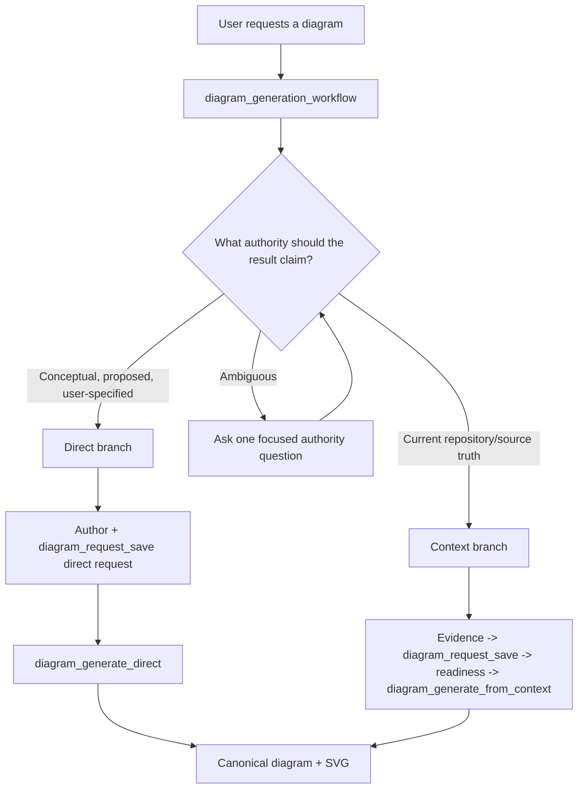
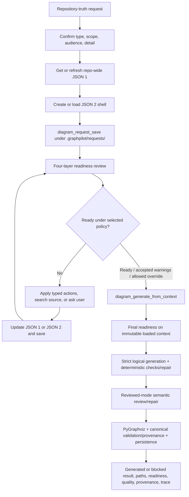
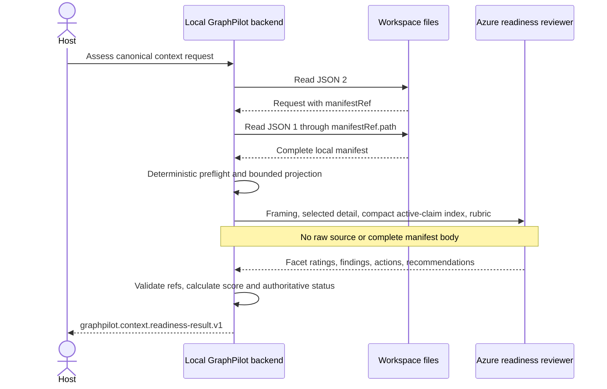
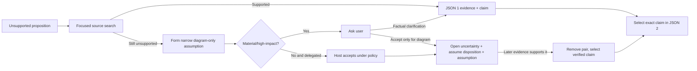

# Context Branch of the Diagram Generation Workflow

## Purpose

The context branch makes repository authority reusable, reviewable, readiness-gated, and traceable while GraphPilot owns UML/SysML mapping, semantic review, deterministic validation/repair, PyGraphviz layout, persistence, and rendering. JSON 1 records reusable supported facts; JSON 2 records one diagram's intent and exact selections; neither pre-builds final topology.

This branch is selected by the single public `diagram_generation_workflow` when the requested diagram claims current repository or managed-source truth. Conceptual, proposed, educational, and user-specified designs use the workflow's direct branch; a blocked context attempt never silently falls back to direct authority.

## Unified workflow routing



GraphPilot exposes the same public workflow instructions through the MCP prompt and tool namespaces. Both registrations use one private renderer and return instruction parity. The workflow itself reads no files, calls no provider, and writes no artifacts; the host follows its selected branch and invokes bounded one-shot tools. There is no supported raw prompt-only generation tool: both branches persist complete mode-specific authority through the shared request path/tool before generation. Exact public arguments and transport are owned by the [MCP workflow contract](../../02-architecture/01-mcp-tools/README.md).

The host preserves the original request verbatim and selects exactly one authority branch before authoring mode-specific artifacts. `interactionPreference` controls consultation only. Trace/debug options control observability only; none changes semantic acceptance.

## End-to-end context branch



## Workflow steps

### 1. Route by authority

- **Owner:** host + user.
- Select context when correctness depends on inspecting a local repository, source file, test, configuration, or managed document, or when the result claims `as_implemented` truth.
- Select direct for conceptual/greenfield/proposed/educational/user-specified content that does not claim repository truth.
- If authority is ambiguous, ask one focused question such as: “Do you want a conceptual design proposal, or a diagram of this workspace's current implementation?”
- Do not inspect source to avoid the authority question, mix direct requirements with context claims, or use direct generation as recovery from a blocked context branch.

### 2. Confirm context intent

- **Owner:** host + user.
- Preserve the original wording.
- Use light reconnaissance to propose diagram type, conceptual scope, audience, and detail level; ask only where the choices materially change the result.
- V1 context diagrams depict `as_implemented`.
- Generatable types are `activity_diagram`, `use_case_diagram`, and `bdd_diagram`.
- The confirmed framing becomes JSON 2 request and scope data; the host does not pre-build GraphPilot topology.

### 3. Get or refresh JSON 1

- **Owner:** host gathers and verifies meaning; GraphPilot validates, fingerprints, and persists.
- JSON 1 is the reusable, type-independent evidence/claim knowledge base plus open uncertainties.
- Refresh is complete, bounded, and Git-independent. Before first gathering, `context_evidence_status` fingerprints either its returned default `.` scope or an explicitly proposed pair of included roots/configured exclusions; the host copies that returned `sourceScope` exactly into JSON 1. Existing manifests always use their canonical scope. An unchanged fingerprint returns the canonical manifest as-is; a changed fingerprint requires a complete same-scope regather and reconciliation before the manifest becomes current.
- Backend-enforced cache, virtual-environment, dependency, build, secret, and GraphPilot-tool exclusions stabilize the digest independently of configured exclusions. A failed refresh writes nothing and never presents stale evidence as current.
- Every newly supported reusable fact belongs in JSON 1, not only in one request.
- Discovery/search systems are optional host accelerators. Their output becomes evidence only after source verification and capture under [`02-evidence-manifest.md`](03-evidence-manifest.md).
- `diagram_get_schema` is not evidence gathering; the backend owns semantic-type mapping.

### 4. Create or load JSON 2

- **Owner:** host authors and reconciles; GraphPilot validates and persists.
- JSON 2 uses `graphpilot.context.diagram-request.v1` / `contextDiagramRequest`.
- It contains the confirmed request/scope, exact JSON 1 path/ID/digest binding, exact claim selections, relevant uncertainty dispositions, accepted assumptions, and non-factual decisions.
- `selectedClaims` may be an informed first pass or empty. Readiness may recommend validated additions/removals; the host decides and applies every change.
- Every `assume` disposition is paired one-to-one with one accepted assumption. `origin` records who introduced an assumption/decision; `acceptedBy` records who authorized it.
- JSON 2 shares request storage and persistence mechanics with direct mode:

```text
.graphpilot/requests/<diagramName>.gp-request.json
diagram_request_save(workspaceDir, requestPath, expectedRequestDigest, candidate)
```

- `diagram_request_save` performs full validation, expected-digest concurrency control, path containment, and atomic complete replacement. Mode, `requestId`, and `diagramName` are immutable.
- Before successful generation, the host may replace the same request while resolving findings. Successful generation finalizes the V1 request; post-generation request editing/regeneration belongs to the future edit workflow.
- The validated `diagramName` controls `.graphpilot/diagrams/<diagramName>.gp.json` and sibling artifacts.

Complete fields and invariants are in [`03-diagram-request-context.md`](04-diagram-request-context.md).

### 5. Complete and assess JSON 2 in a bounded loop

- **Owner:** deterministic backend + readiness reviewer; host executes actions.
- In the normal generation workflow, the host calls `diagram_generate_from_context` first with `require_ready`; its complete final gate is the readiness assessment. `context_readiness_assess` is reserved for explicitly requested readiness-only preview and never replaces or caches the final gate.
- The backend loads canonical JSON 2, follows its exact `manifestRef.path`, and loads canonical JSON 1 inside the same workspace.
- Complete JSON 1 remains local. The reviewer sees request/scope/current selection, full selected claim meaning with bounded evidence summaries, a complete compact current-claim index, relevant uncertainties, assumptions, decisions, and the exact per-type rubric. Raw source is never sent.



Assessment order is invariant:

1. deterministic preflight;
2. one strict structured reviewer call for per-type facets and holistic selection review; and
3. deterministic response validation, finding/action assembly, score, and status.

The result status is exactly `invalid`, `needs_context`, `ready_with_warnings`, or `ready`. Score is secondary; status remains authoritative.

The host improves before interrupting the user:

1. apply validated existing-claim actions first, including replacing an assumption with a claim supporting the same proposition;
2. perform focused source search only for genuinely missing facts;
3. ask the user only for unresolved intent/scope, material assumptions, non-default decisions, warning acceptance, or permitted override;
4. persist every actual JSON 1 or JSON 2 change; and
5. reassess only after input changes—never reroll unchanged readiness input seeking stochastic success.

Exact bounds, override rules, status calculation, and stability policy remain in [`01-readiness/`](01-readiness/README.md). The backend never silently mutates context.

### 6. Select one accepted generation policy

The first generation attempt uses `require_ready`, so ready context proceeds without a duplicate standalone assessment.
After a complete readiness block, a later attempt may select exactly one digest-bound policy:

- `require_ready` — after actual context/request improvement;
- `allow_warnings` — exact warnings from `ready_with_warnings` are explicitly acknowledged; or
- `force_with_gaps` — only when every remaining blocker is overrideable and the user explicitly authorizes the exact finding IDs.

Policy acceptance never converts unsupported meaning into repository fact, bypasses a non-overrideable blocker, or survives a request/manifest digest change.

### 7. Generate once

The host calls `diagram_generate_from_context` with the canonical JSON 2 reference and `require_ready` initially, or one exact accepted policy after a readiness block.

GraphPilot performs, in order:

1. path/workspace, document, binding, reference, identity, and local size preflight;
2. exact deterministic population of selected immutable claim versions and directly referenced evidence into request-scoped memory;
3. a complete final four-layer readiness assessment over immutable loaded context;
4. strict context logical generation with exactly two fixed context-native examples for the selected type;
5. strict/deterministic graph and provenance validation with bounded explicit repair;
6. reviewed-mode semantic candidate review and bounded semantic repair (or explicit environment-only `standard` ablation);
7. PyGraphviz layout, canonical assembly/validation, exact origin validation, and context/target stability recheck;
8. atomic canonical persistence, optional digest-bound trace sidecar, and sibling SVG rendering; and
9. a mode-specific `graphpilot.context.generation-result.v1` result.

The final readiness gate uses the same semantics as standalone assessment. If it blocks, generation returns `outcome: blocked` with complete actionable final readiness and makes no generator call or canonical write. A semantic blocker after repair also returns `outcome: blocked` and writes nothing.

### 8. Report the result

The host reports:

- selected generation mode and authority;
- `outcome: generated|blocked`, or the stage-correct `OperationProblem` for a failed operation;
- request reference and bounded goal/assumption/decision summary;
- canonical `.gp.json` path and backend-provided `editUrl` as a clickable **Open in the GraphPilot editor** link when generated or recovered after a lost client response;
- sibling SVG path, or `svgPath: null` plus `render_failed` in `operationWarnings` when canonical JSON persisted but rendering failed;
- final readiness and accepted policy summary;
- reviewed quality summary and typed next actions when blocked;
- provenance availability; and
- optional trace/diagnostics paths and any non-fatal write warnings.

A generated result remains generated when rendering or optional observability fails. The host retries rendering from saved canonical JSON and never repeats generation merely for an image. A client timeout is an unknown transport outcome: one exact no-op request save may establish finalized canonical output and return its editor link; it never authorizes unchanged readiness/generation retry or polling. Exact MCP transport belongs to the MCP owners; semantic result behavior is in [`05-generation-and-provenance.md`](05-generation-and-provenance.md).

## Artifact lifecycle and authority

```text
repository source                 -> actual code/test/doc/config/clarification authority
JSON 1 evidence manifest          -> reusable supported repository facts                 persistent
JSON 2 context request            -> one diagram's framed intent and exact selection     persistent, finalized after success
resolved context                  -> exact populated selection                            transient local memory
normalized logical candidates     -> generation/review/repair working state              transient unless debug opted in
<diagramName>.gp.json             -> editable canonical diagram + minimal ownership       persistent authority
<diagramName>.gp.trace.json       -> optional digest-bound generation trace               persistent non-authority sidecar
<diagramName>.svg                 -> rendering derived from canonical JSON                persistent sibling
```

| Question | Authoritative artifact |
| --- | --- |
| What the repository/domain says | Source, tests, docs, configuration, or factual clarification |
| What reusable facts GraphPilot retained | [JSON 1](03-evidence-manifest.md) |
| What one context diagram may use | [JSON 2](04-diagram-request-context.md) |
| What exact facts GraphPilot populated | Transient deterministic resolution of bound JSON 1 + JSON 2 |
| What diagram exists and what each context element cites | Canonical `.gp.json` with minimal ownership and typed origins |
| Which model/contract/example/review/layout/usage identities produced that exact digest | Optional `.gp.trace.json` sidecar |
| What users view/export | Sibling SVG rendered from canonical JSON |

Managed layout:

```text
.graphpilot/
├── context/
│   └── evidence/repository.gp-evidence.json
├── requests/
│   └── <diagramName>.gp-request.json
├── diagrams/
│   ├── <diagramName>.gp.json
│   ├── <diagramName>.gp.trace.json   # optional; successful generation only
│   └── <diagramName>.svg
└── diagnostics/generation/
    └── <request-id>/<run-id>/        # optional numbered debug run
```

Transient resolved context, reviewer/generator packets, model responses, and candidates are not context artifacts. Full diagnostics are opt-in under `.graphpilot/diagnostics/generation/`, may describe generated, blocked, or failed attempts, and never become canonical authority. `.graphpilot/` remains excluded from the JSON 1 fingerprint.

## Actor responsibilities and safety

| Actor | Responsibility |
| --- | --- |
| User | Confirms authority/intent, supplies factual clarification where appropriate, and authorizes material assumptions/warning acceptance/permitted overrides. |
| Host | Routes authority; verifies source; authors JSON 1 and JSON 2; calls persistence/readiness/generation tools; executes typed actions; presents results. |
| Backend LLM roles | Readiness review, logical generation, and semantic candidate review/repair through separate strict role-specific calls using bounded inputs. They never mutate authority. |
| Deterministic backend | Path safety, schemas, fingerprints, digest binding, request persistence/finalization, context population, reviewer validation, status/gates, provenance, PyGraphviz layout, canonical validation/persistence, trace binding, and rendering. |

Repository content is untrusted evidence, not instruction. The host ignores embedded instructions and never collects secrets, credentials, `.env` files, vendor trees, caches, or irrelevant generated output. Paths remain workspace-relative and every file operation remains confined to the caller's workspace.

## Resolving unsupported propositions



An assumption never becomes JSON 1 truth. Later support creates or activates a claim; explicit reconciliation replaces the paired assumption/disposition with that exact claim.

## User-answer routing

| User response | JSON 1 | JSON 2 |
| --- | --- | --- |
| “This is factually how it works.” | Add `userClarification` evidence and an `as_implemented` claim. | May select the resulting exact claim version. |
| “This is intended/required.” | Add clarification and latent `as_designed` / `as_required` claim. | Not selectable as context authority in V1 `as_implemented` diagrams. |
| “I don't know; assume it here.” | Keep/add the open uncertainty. | Add one accepted assumption paired one-to-one with `assume`. |
| “Leave that out.” | No change. | Add `exclude` and a confirmed scope exclusion. |
| “Show/label this prominently.” | No change. | Add an accepted `emphasis` / `labeling` decision. |

The host writes every accepted change through the owning save tool. Backend reviewers recommend actions but are never persisted as accepting actors.

## Workflow invariants

1. Authority routing occurs before mode-specific artifact authoring.
2. Context is mandatory for current repository/source truth; blocked context never falls back to direct.
3. JSON 1 remains reusable/type-independent; JSON 2 remains one request's exact intent/selection.
4. Context request storage is shared with direct mode, but schemas and authority remain separate.
5. The host persists all changes through `diagram_request_save`; readiness/generation never mutate context.
6. Readiness is mandatory and status-first; score cannot override a blocker.
7. Existing claims are preferred before source search; source search precedes user interruption where possible.
8. Unchanged readiness or generation input is never blind-rerolled.
9. Generation receives no raw source, complete manifest, or resolved evidence records.
10. Every context node/edge has a valid smallest-sufficient origin.
11. Reviewed quality is orthogonal to grounded authority and never weakens provenance/readiness.
12. Successful generation finalizes the V1 request and writes canonical JSON before rendering.
13. Optional trace/debug artifacts are digest-bound observability, not canonical authority or future runtime input.
14. Render/trace/debug failure cannot relabel a persisted canonical diagram as failed generation.
15. No source file, version-control state, secret, or unmanaged local artifact is rewritten or deleted.
