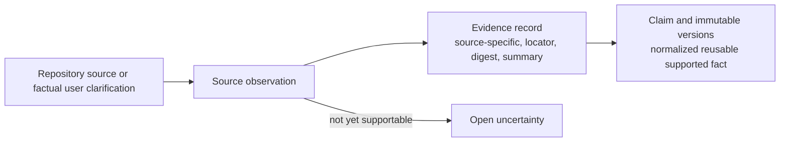

# JSON 1 — Evidence Manifest

## Purpose

The evidence manifest is the reusable, versioned, **repo-wide and diagram-type-independent** knowledge base: what supported facts are known, where they came from, which versions are current, and what remains unresolved. It does not describe one requested diagram; that belongs to [JSON 2](04-diagram-request-context.md). The host records rich generic facts, and the backend maps the finalized JSON 2 selection to GraphPilot semantic types.

Canonical path:

```text
<workspace>/.graphpilot/context/evidence/repository.gp-evidence.json
```



- **Evidence** is source-specific: a code call, test assertion, document statement, configuration binding, or factual user clarification.
- **Claim** is a normalized reusable fact supported by one or more evidence records, directly or by inference.
- **Assumption** is not a claim. A diagram-only “assume this” belongs in JSON 2.

The manifest is Git-independent. GraphPilot fingerprints the complete eligible safe scope and requires a full bounded refresh when that fingerprint changes. Discovery systems are optional host-side accelerators; JSON 1 never stores a discovery graph, graph-native IDs/scores, confidence values, raw output, or a requirement that such a system be installed.

The [workflow owner](02-workflow.md) defines refresh, uncertainty resolution, and user-answer routing. Public persistence transport belongs to the [MCP context-tool owner](../../02-architecture/01-mcp-tools/02-context-tools.md).

## Simple complete example

```json
{
  "schemaVersion": "graphpilot.context.evidence-manifest.v1",
  "kind": "evidenceManifest",
  "id": "evidence-order-service",
  "source": {
    "kind": "repository",
    "displayName": "Order Service",
    "root": ".",
    "snapshot": {
      "digest": "sha256:1111111111111111111111111111111111111111111111111111111111111111",
      "fileCount": 84,
      "capturedAt": "2026-07-13T14:20:00Z"
    }
  },
  "scope": {
    "baseline": "boundedArchitecture",
    "includedPaths": ["."],
    "excludedPaths": [
      ".git/**",
      ".graphpilot/**",
      "**/.env*",
      "**/node_modules/**",
      "**/dist/**"
    ],
    "includedConcerns": [
      "systemPurpose",
      "systemBoundaries",
      "publicEntryPoints",
      "topLevelComponents",
      "externalSystems",
      "publicCapabilities",
      "importantInterfaces",
      "majorWorkflows",
      "importantConstraints"
    ],
    "stoppingReason": "The bounded architecture baseline is covered."
  },
  "evidence": [
    {
      "id": "evidence-order-validation-abc123",
      "kind": "code",
      "locator": {
        "path": "src/orders/order_handler.py",
        "symbol": "OrderHandler.submit",
        "lineRange": {
          "start": 42,
          "end": 61
        }
      },
      "contentDigest": "sha256:2222222222222222222222222222222222222222222222222222222222222222",
      "summary": "OrderHandler.submit validates an order before saving it.",
      "capturedInSourceDigest": "sha256:1111111111111111111111111111111111111111111111111111111111111111",
      "status": "current",
      "capturedAt": "2026-07-13T14:24:00Z"
    }
  ],
  "claims": [
    {
      "id": "claim-validate-before-save",
      "kind": "behaviorStep",
      "currentVersion": 1,
      "status": "active",
      "versions": [
        {
          "version": 1,
          "statement": "The system validates a submitted order before saving it.",
          "appliesToViewpoints": ["as_implemented"],
          "payload": {
            "actor": "OrderHandler",
            "action": "validate submitted order",
            "order": [
              {
                "relation": "before",
                "step": "save order"
              }
            ]
          },
          "support": {
            "basis": "repositoryEvidence",
            "derivation": "direct",
            "evidenceRefs": ["evidence-order-validation-abc123"]
          },
          "createdAt": "2026-07-13T14:27:00Z"
        }
      ]
    }
  ],
  "uncertainties": [
    {
      "id": "uncertainty-validation-failure",
      "kind": "missing_information",
      "statement": "The repository evidence does not establish what happens after validation fails.",
      "relatedEvidenceRefs": ["evidence-order-validation-abc123"],
      "relatedClaimRefs": [
        {
          "id": "claim-validate-before-save",
          "version": 1
        }
      ],
      "suggestedSearches": [
        "invalid-order tests",
        "OrderHandler validation error handling"
      ],
      "createdAt": "2026-07-13T14:28:00Z"
    }
  ],
  "revision": 1,
  "digest": "sha256:47a52f748ddc29477df0c435b6dfafcb2dbacd19f96dc177f6cbc9f6a6d1223d",
  "createdAt": "2026-07-13T14:20:00Z",
  "updatedAt": "2026-07-13T14:28:00Z"
}
```

## Complete section map

```json
{
  "schemaVersion": "graphpilot.context.evidence-manifest.v1",
  "kind": "evidenceManifest",
  "id": "evidence-current-repository",
  "source": {},
  "scope": {},
  "evidence": [],
  "claims": [],
  "uncertainties": [],
  "revision": 1,
  "digest": "sha256:...",
  "createdAt": "2026-07-13T14:20:00Z",
  "updatedAt": "2026-07-13T14:20:00Z"
}
```

| Section | Question it answers |
| --- | --- |
| document envelope | What kind of file is this, and which contract validates it? |
| `source` | Which repository state did the host inspect? |
| `scope` | What did the host inspect, exclude, and stop at? |
| `evidence` | What did specific sources directly show or state? |
| `claims` | What reusable facts are supported by that evidence? |
| `uncertainties` | What important facts could not yet be established? |
| revision metadata | Which exact manifest update is this? |

## 1. Document envelope

```json
{
  "schemaVersion": "graphpilot.context.evidence-manifest.v1",
  "kind": "evidenceManifest",
  "id": "evidence-current-repository"
}
```

| Field | Required | Meaning | Why it is saved |
| --- | --- | --- | --- |
| `schemaVersion` | Yes | Constant identifying this manifest format. | Selects validation and supports future migration. |
| `kind` | Yes | Constant identifying an evidence manifest. | Distinguishes manifests from requests, transient resolved context, and diagrams. |
| `id` | Yes | Stable manifest identity independent of path. | Detects moved/replaced files and gives requests, canonical ownership, and optional digest-bound trace sidecars a durable reference. |

Constants:

| Field/value | Meaning |
| --- | --- |
| `schemaVersion: graphpilot.context.evidence-manifest.v1` | First GraphPilot evidence-manifest contract. |
| `kind: evidenceManifest` | Reusable evidence context, not a diagram request, transient resolved request, or canonical diagram. |

## 2. `source`

The source section identifies the complete safe repository scope the current manifest describes. It does not depend on Git, a branch, or a clean working tree.

```json
{
  "source": {
    "kind": "repository",
    "displayName": "Example System",
    "root": ".",
    "snapshot": {
      "digest": "sha256:1111111111111111111111111111111111111111111111111111111111111111",
      "fileCount": 84,
      "capturedAt": "2026-07-13T14:20:00Z"
    }
  }
}
```

| Field | Required | Meaning | Why it is saved |
| --- | --- | --- | --- |
| `source.kind` | Yes | Source category. V1 supports only `repository`. | Allows future source categories without changing the envelope. |
| `source.displayName` | Yes | Human-readable repository/system name. | Keeps packets understandable without path resolution. |
| `source.root` | Yes | Workspace-relative source root. | Keeps manifests portable and path-safe. |
| `source.snapshot` | Yes | Fingerprint of every eligible file in the effective safe scope. | Detects additions, edits, removals, and renames without version control. |
| `source.snapshot.digest` | Yes | SHA-256 over the canonical sorted relative-path/per-file-digest list. | Supplies one deterministic source-change token. |
| `source.snapshot.fileCount` | Yes | Number of eligible fingerprinted files. | Supplies a bounded troubleshooting hint. |
| `source.snapshot.capturedAt` | Yes | UTC time the digest was accepted after successful full refresh. | Correlates the manifest with inspected workspace state. |

### `source.kind`

| Value | Meaning |
| --- | --- |
| `repository` | The user's current workspace repository; the only v1 source kind. |

`source.root` is always workspace-relative. GraphPilot normalizes the configured included roots, applies the deterministic union of built-in and configured exclusions, hashes each eligible file, sorts by relative path, and hashes that canonical path/content-digest list. Because paths are included, additions, removals, renames, and content edits change the digest. Status fingerprints and returns the exact configured `sourceScope`; JSON 1 promotion requires the candidate to carry an equivalent scope and the exact digest observed before gathering.

`.git/`, `.graphpilot/`, secrets, credentials, dependencies, virtual environments, caches, build output, and GraphPilot tooling output are always outside the effective source scope. Backend-enforced patterns include `.git/**`, `.graphpilot/**`, `**/.env*`, `**/__pycache__/**`, `**/*.pyc`, `**/*.pyo`, `**/.pytest_cache/**`, `**/.mypy_cache/**`, `**/.ruff_cache/**`, `**/.cache/**`, `**/.venv/**`, `**/venv/**`, `**/node_modules/**`, `**/dist/**`, `**/build/**`, `**/coverage/**`, `**/vendor/**`, `**/.playwright-cli/**`, `**/.serena/**`, and `**/graphify-out/**`. The status result exposes their deterministic union with configured exclusions as `effectiveExcludedPaths`; they need not be duplicated into JSON 1. Git metadata may be returned as optional host diagnostics, but it is not part of this contract and never determines whether JSON 1 is current.

## 3. `scope`

The scope section records the boundary of repository gathering: what the host considered, what it deliberately ignored, and why it stopped.

```json
{
  "scope": {
    "baseline": "boundedArchitecture",
    "includedPaths": ["."],
    "excludedPaths": [
      ".git/**",
      ".graphpilot/**",
      "**/.env*",
      "**/node_modules/**",
      "**/dist/**",
      "**/coverage/**",
      "**/vendor/**"
    ],
    "includedConcerns": [
      "systemPurpose",
      "systemBoundaries",
      "publicEntryPoints",
      "topLevelComponents",
      "externalSystems",
      "publicCapabilities",
      "importantInterfaces",
      "majorWorkflows",
      "importantConstraints"
    ],
    "stoppingReason": "The bounded architecture baseline is covered; private helpers were excluded."
  }
}
```

| Field | Required | Meaning | Why it is saved |
| --- | --- | --- | --- |
| `scope.baseline` | Yes | Gathering strategy used for the reusable baseline. | Prevents “gather the repository” from becoming an unbounded crawl. |
| `scope.includedPaths` | Yes | Plain workspace-relative POSIX roots included in fingerprinting and gathering; `.` is allowed, trailing slashes and globs are not. | Makes the full-refresh boundary explicit and prevents a root from being confused with an exclusion pattern. |
| `scope.excludedPaths` | Yes | Configured workspace-relative v1 glob patterns excluded before fingerprinting or gathering; `*`, `?`, and whole `**` segments are supported. | Records owner-specific exclusions while the backend independently applies and reports its built-in safety/noise exclusions. |
| `scope.includedConcerns` | Yes | Architecture questions the host attempted to answer. | Makes baseline coverage explicit and machine-checkable. |
| `scope.stoppingReason` | Yes | Human-readable reason gathering stopped. | Distinguishes a completed bounded baseline from an abandoned scan. |

### `scope.baseline`

| Value | Meaning |
| --- | --- |
| `boundedArchitecture` | Gather enough reusable context for purpose, boundaries, major parts, public capabilities, external dependencies, and important flows without cataloguing every file, class, or helper. |

### `scope.includedConcerns[]`

| Value | Question the host must answer |
| --- | --- |
| `systemPurpose` | What problem does this system solve? |
| `systemBoundaries` | What is inside the system, and what is external? |
| `publicEntryPoints` | How do users or other systems enter or call it? |
| `topLevelComponents` | Which major services/modules/components carry the architecture? |
| `externalSystems` | Which outside services, actors, stores, or devices does it depend on? |
| `publicCapabilities` | What useful outcomes can the system provide? |
| `importantInterfaces` | Which APIs, messages, schemas, or contracts connect important parts? |
| `majorWorkflows` | Which important end-to-end behaviors cross the system? |
| `importantConstraints` | Which rules or limits materially shape the system? |

These concern IDs describe the reusable, type-agnostic baseline. Diagram-specific scope and selection belong in JSON 2; per-type coverage judgments belong to [readiness](01-readiness/README.md).

> **Refresh invariant:** a changed safe-scope source digest requires a successful full bounded refresh before JSON 1 is current; an unchanged digest returns the canonical manifest as-is. No-op checks change no revision, digest, or timestamp.

## 4. `evidence`

Evidence records preserve source-specific observations: “what did this source show or state?” They do not contain the final architectural conclusion.

Evidence has two record shapes:

1. repository evidence: `code`, `test`, `documentation`, or `configuration`;
2. factual `userClarification` evidence.

### 4.1 Repository evidence record

```json
{
  "id": "evidence-service-a-call-abc123",
  "kind": "code",
  "locator": {
    "path": "src/service_a.py",
    "symbol": "ServiceA.process",
    "lineRange": {
      "start": 20,
      "end": 35
    }
  },
  "contentDigest": "sha256:...",
  "summary": "ServiceA.process invokes client_b.execute().",
  "capturedInSourceDigest": "sha256:1111111111111111111111111111111111111111111111111111111111111111",
  "status": "current",
  "capturedAt": "2026-07-13T14:25:00Z"
}
```

| Field | Required | Meaning | Why it is saved |
| --- | --- | --- | --- |
| `id` | Yes | Stable evidence-record identity. | Gives claim versions an exact support reference. |
| `kind` | Yes | Repository source category. | Communicates the observation's authority type. |
| `locator` | Yes | Workspace-relative navigation details. | Lets host/user return to source. |
| `locator.path` | Yes | One concrete workspace-relative source file; directories, trailing slashes, and globs are invalid. | Provides a safe portable citation rather than an ambiguous source collection. |
| `locator.symbol` | No | Function, class, configuration section, or logical anchor. | More stable and meaningful than line numbers alone. |
| `locator.lineRange` | No | Start/end lines at capture time. | Provides a navigation hint. |
| `locator.lineRange.start` | With line range | First 1-based source line. | Defines the captured range. |
| `locator.lineRange.end` | With line range | Last inclusive source line. | Defines the captured range. |
| `contentDigest` | Yes | SHA-256 of the bounded cited source content. | Detects evidence change. |
| `summary` | Yes | Concise source-specific observation. | Supplies the fact when Azure cannot open local source. |
| `capturedInSourceDigest` | Yes | Whole-scope source digest current when first captured. | Correlates immutable evidence with its repository state without version control. |
| `status` | Yes | Current source-availability state. | Prevents stale support from backing new claims. |
| `capturedAt` | Yes | UTC capture timestamp. | Supports refresh planning and ordering. |

### 4.2 User-clarification evidence record

```json
{
  "id": "evidence-user-clarification-operation-owner",
  "kind": "userClarification",
  "question": "Which System B component owns the operation called by System A?",
  "statement": "FulfillmentService owns it.",
  "assertedAs": "as_implemented",
  "clarifiedBy": "user",
  "status": "current",
  "recordedAt": "2026-07-13T16:30:00Z"
}
```

| Field | Required | Meaning | Why it is saved |
| --- | --- | --- | --- |
| `id` | Yes | Stable clarification-evidence identity. | Lets claims cite the exact clarification. |
| `kind` | Yes | Constant `userClarification`. | Keeps user authority distinct from repository sources. |
| `question` | Yes | Exact focused question answered. | Preserves context needed to interpret the answer. |
| `statement` | Yes | Factual answer supplied by the user. | Preserves the supporting assertion. |
| `assertedAs` | Yes | Lifecycle viewpoint the fact belongs to. | Prevents design/requirements facts being mistaken for implementation facts. |
| `clarifiedBy` | Yes | V1 constant `user`. | Records who supplied the clarification. |
| `status` | Yes | Current clarification lifecycle state. | Prevents corrected/withdrawn assertions from supporting active claims. |
| `supersedesEvidenceRef` | On correction | Prior clarification replaced by this record. | Preserves an immutable correction chain. |
| `recordedAt` | Yes | UTC clarification timestamp. | Supports ordering. |

A correction creates a new immutable `userClarification` record with `supersedesEvidenceRef`; the old record becomes `corrected`. A withdrawal changes only the old record's status to `withdrawn`. Every dependent claim is re-evaluated. Clarification content is never rewritten.

“I do not know; assume this for this diagram” is not factual clarification. It keeps or creates an open JSON 1 uncertainty and becomes a paired `assume` disposition + accepted JSON 2 assumption; it creates no evidence.

### Evidence-kind enum

| Value | Category question | Example |
| --- | --- | --- |
| `code` | What does implementation directly contain, call, or compute? | A handler invokes a repository method. |
| `test` | What behavior does an automated test demonstrate or require? | Invalid orders are rejected before persistence. |
| `documentation` | What does a repository document say about purpose, design, requirement, or behavior? | An architecture doc names a service boundary. |
| `configuration` | How are components, routes, dependencies, or runtime behavior wired? | `client_b` points to System B's endpoint. |
| `userClarification` | What factual point did an authoritative user explicitly clarify? | The user confirms which service owns an operation. |

### Repository evidence `status`

| Value | Meaning | Usable for a new active claim? |
| --- | --- | --- |
| `current` | The source exists and its cited content matches after the latest successful full refresh. | Yes. |
| `outdated` | The source exists but cited content changed. | No; retain for history. |
| `missing` | The referenced path/symbol no longer exists. | No; retain for history. |

Evidence source content is immutable after creation; only lifecycle `status` may change. Refreshed source produces a new evidence record rather than rewriting the old observation. A current manifest may retain `outdated`/`missing` evidence, but active claims cannot use it.

### User-clarification evidence `status`

| Value | Meaning | Usable for a new active claim? |
| --- | --- | --- |
| `current` | The clarification remains the user's current factual assertion. | Yes. |
| `corrected` | A newer clarification supersedes it. | No; retain for history. |
| `withdrawn` | The user withdrew it without replacement. | No; retain for history. |

### User clarification `assertedAs`

| Value | Meaning |
| --- | --- |
| `as_implemented` | True of current implementation/runtime behavior. |
| `as_designed` | True of intended architecture/design. |
| `as_required` | Required behavior or structure. |
| `domain_fact` | Domain fact not tied to implementation/design/requirements. |

## 5. `claims`

Claims are normalized, reusable facts supported by evidence: “what can GraphPilot safely say about the system?”

```json
{
  "claims": [
    {
      "id": "claim-system-a-interacts-system-b",
      "kind": "relationship",
      "currentVersion": 1,
      "status": "active",
      "versions": []
    }
  ]
}
```

| Field | Required | Meaning | Why it is saved |
| --- | --- | --- | --- |
| `id` | Yes | Stable identity of one evolving fact. | Lets requests and diagrams cite exact versions over time. |
| `kind` | Yes | Generic repository/domain fact category. | Guides payload validation, selection, and review. |
| `currentVersion` | Yes | Latest usable/historical version pointer. | Identifies which immutable version currently represents the claim. |
| `status` | Yes | Current claim lifecycle state. | Controls normal selection. |
| `versions` | Yes | Immutable history of meaning/support. | Keeps old diagram provenance valid after facts change. |

### Claim-kind enum

| Value | Category question | Example |
| --- | --- | --- |
| `boundary` | What is inside or outside the system/subsystem? | The public API is the order-submission boundary. |
| `entity` | What architecturally meaningful thing exists? | `OrderHandler` is an orchestration service. |
| `capability` | What useful outcome can the system provide? | Customers can submit orders. |
| `actorGoal` | Who wants what result? | A customer wants to submit a valid order. |
| `relationship` | How are important things connected? | `OrderHandler` delegates persistence to `OrderRepository`. |
| `behaviorStep` | What happens in a workflow, decision, or outcome? | The system validates before saving. |
| `property` | What typed data, feature, or owned characteristic exists? | A vehicle has one engine part. |
| `constraint` | What rule, invariant, or limit must hold? | Orders above a threshold require approval. |

These are evidence-manifest categories, not GraphPilot/UML/SysML `semanticType`s.

### Claim payload contract

`payload` is selected by the parent claim's `kind`. Every v1 payload is a closed object: the listed required and
optional fields are the complete allowed shape, and every string is non-empty after trimming.

| Claim kind | Required fields | Optional fields |
| --- | --- | --- |
| `boundary` | `name: string`, `included: string[]`, `external: string[]` | — |
| `entity` | `name: string`, `role: string`, `purpose: string` | — |
| `capability` | `subject: string`, `outcome: string` | — |
| `actorGoal` | `actor: string`, `result: string` | — |
| `relationship` | `sourceClaimRef: claimVersionRef`, `relationship: string`, `targetClaimRef: claimVersionRef` | — |
| `behaviorStep` | `actor: string`, `action: string` | `outcome: string`, `order: behaviorOrder[]`, `branches: behaviorBranch[]` |
| `property` | `ownerClaimRef: claimVersionRef`, `name: string`, `valueType: string` | `multiplicity: multiplicity`, `value: string` |
| `constraint` | `subjectClaimRef: claimVersionRef`, `rule: string` | — |

The reusable payload shapes are exact:

- `claimVersionRef` is `{ "id": "claim-...", "version": <positive integer> }` with no other fields.
- `behaviorOrder` is `{ "relation": "before" | "after" | "concurrent", "step": <string> }`.
- `behaviorBranch` is `{ "condition": <string>, "outcome": <string> }`.
- `multiplicity` is `{ "lower": <non-negative integer>, "upper": <non-negative integer | "*"> }`; a numeric
  upper bound cannot be lower than `lower`.

Only `relationship`, `property`, and `constraint` payloads contain claim references in v1. Each reference names
an exact existing immutable version; the containing version cannot reference itself. Target claim kinds and graph
depth are deliberately unrestricted because readiness requires needed direct references to be selected separately
and population never recursively expands them. Payload never assigns final GraphPilot node/edge types; backend
modeling owns that mapping.

### Claim-status enum

| Value | Meaning | Available to normal selection? |
| --- | --- | --- |
| `active` | Current version is supported entirely by current evidence after successful refresh. | Yes. |
| `unverified` | Full refresh could not re-establish the fact from current evidence. | No. |
| `disputed` | Current sources within the same viewpoint make incompatible assertions. | No, pending resolution. |
| `retired` | Fact no longer applies but remains for historical diagrams. | No. |

## 6. Claim versions

One stable claim owns immutable versions. Each version records exactly what the claim meant, where it applied, and how it was supported.

```json
{
  "version": 1,
  "statement": "System A interacts with System B during processing.",
  "appliesToViewpoints": ["as_implemented"],
  "payload": {
    "sourceClaimRef": {
      "id": "claim-system-a",
      "version": 1
    },
    "relationship": "interactsWith",
    "targetClaimRef": {
      "id": "claim-system-b",
      "version": 1
    }
  },
  "support": {
    "basis": "repositoryEvidence",
    "derivation": "inferred",
    "evidenceRefs": [
      "evidence-service-a-call-abc123",
      "evidence-client-b-binding-abc123"
    ],
    "rationale": "ServiceA calls client_b, and configuration binds client_b to System B."
  },
  "createdAt": "2026-07-13T14:30:00Z"
}
```

| Field | Required | Meaning | Why it is saved |
| --- | --- | --- | --- |
| `version` | Yes | Positive integer unique within the claim. | Makes every cited fact version exact and immutable. |
| `statement` | Yes | Human-readable normalized fact. | Makes the claim understandable without decoding payload. |
| `appliesToViewpoints` | Yes | Lifecycle truth contexts in which the claim applies. | Prevents implementation, design, and requirement facts being blended. |
| `payload` | Yes | Claim-kind-specific structured meaning. | Supports deterministic references and reliable modeling. |
| `support` | Yes | Grouped provenance/derivation information. | Explains why the claim is supportable. |
| `supersedesVersion` | On later versions | Prior version replaced. | Makes history navigation explicit. |
| `changeReason` | On later versions | Why the new version exists. | Explains factual/support evolution. |
| `createdAt` | Yes | UTC creation timestamp. | Supports ordering. |

### `appliesToViewpoints[]`

| Value | Meaning |
| --- | --- |
| `as_implemented` | Current implementation/runtime behavior. |
| `as_designed` | Intended architecture/design. |
| `as_required` | Requirement/specification. |
| `domain_fact` | General domain fact not tied to one lifecycle viewpoint. |

The manifest has no global viewpoint. Applicability is reusable latent metadata. V1 context-backed diagrams implicitly select `as_implemented` because JSON 2 has no viewpoint field. Support for selecting `as_designed` and `as_required` is deferred to later request versions, and JSON 1 retains those claims as latent metadata. Simultaneously valid alternatives across viewpoints are separate claims, not historical versions or disputes. Incompatible current assertions within the same viewpoint mark the affected claim `disputed` and create a `contradictory` uncertainty.

## 7. Claim `support`

The support object groups source basis, direct/inferred derivation, exact evidence references, and—when inferred—the rationale connecting them.

```json
{
  "support": {
    "basis": "repositoryEvidence",
    "derivation": "inferred",
    "evidenceRefs": [
      "evidence-service-a-call-abc123",
      "evidence-client-b-binding-abc123"
    ],
    "rationale": "ServiceA calls client_b, and configuration binds client_b to System B."
  }
}
```

| Field | Required | Meaning | Why it is saved |
| --- | --- | --- | --- |
| `basis` | Yes | Broad source composition. | Distinguishes repository support, user clarification, and mixed support. |
| `derivation` | Yes | Direct restatement or inference. | Makes abstraction/inference explicit. |
| `evidenceRefs` | Yes | Exact supporting evidence IDs. | Creates the claim-to-source chain. |
| `rationale` | For inferred claims | Explanation connecting evidence to the fact. | Makes inference reviewable. |

### `support.basis`

| Value | Meaning | Required composition |
| --- | --- | --- |
| `repositoryEvidence` | Relies only on code, tests, repository docs, or configuration. | One or more non-user evidence records. |
| `userClarification` | Relies on factual user clarification. | One or more clarification records and no repository records. |
| `mixed` | Repository evidence and factual clarification jointly support it. | At least one repository and one clarification record. |

### `support.derivation`

| Value | Meaning | Rationale rule |
| --- | --- | --- |
| `direct` | Closely restates what evidence explicitly says. | Optional. |
| `inferred` | Combines, interprets, or abstracts evidence. | Required and explicit. |

Examples:

```json
{
  "support": {
    "basis": "userClarification",
    "derivation": "direct",
    "evidenceRefs": ["evidence-user-clarification-operation-owner"]
  }
}
```

```json
{
  "support": {
    "basis": "mixed",
    "derivation": "inferred",
    "evidenceRefs": [
      "evidence-client-b-endpoint",
      "evidence-user-clarification-operation-owner"
    ],
    "rationale": "The endpoint maps to FulfillmentService, and the user confirms its ownership."
  }
}
```

## 8. Historical claim versions

```json
{
  "id": "claim-order-validation",
  "kind": "behaviorStep",
  "currentVersion": 2,
  "status": "active",
  "versions": [
    {
      "version": 1,
      "statement": "The system validates orders.",
      "appliesToViewpoints": ["as_implemented"],
      "payload": {
        "actor": "Order service",
        "action": "validate orders"
      },
      "support": {
        "basis": "repositoryEvidence",
        "derivation": "direct",
        "evidenceRefs": ["evidence-order-validation-v1"]
      },
      "createdAt": "2026-07-13T14:30:00Z"
    },
    {
      "version": 2,
      "statement": "The system validates submitted orders before persistence.",
      "appliesToViewpoints": ["as_implemented"],
      "payload": {
        "actor": "Order service",
        "action": "validate submitted orders",
        "order": [
          {
            "relation": "before",
            "step": "persist order"
          }
        ]
      },
      "support": {
        "basis": "repositoryEvidence",
        "derivation": "direct",
        "evidenceRefs": ["evidence-order-validation-v2"]
      },
      "supersedesVersion": 1,
      "changeReason": "Tests established ordering before persistence.",
      "createdAt": "2026-07-13T15:30:00Z"
    }
  ]
}
```

Rules:

- existing version content cannot be edited;
- changed meaning, payload, or support appends a version;
- `currentVersion` advances to the new version;
- a different fact gets a different claim ID;
- simultaneously valid viewpoint alternatives are separate claims;
- historical versions remain local unless selected by a request; and
- old diagrams continue citing the exact version originally used.

## 9. `uncertainties`

Uncertainties are important propositions or questions that cannot yet become supported claims. Only currently open uncertainties live in this array.

```json
{
  "uncertainties": [
    {
      "id": "uncertainty-system-b-owner",
      "kind": "ambiguous",
      "statement": "The receiving component inside System B has not been established.",
      "relatedEvidenceRefs": ["evidence-service-a-call-abc123"],
      "relatedClaimRefs": [
        {
          "id": "claim-system-a-interacts-system-b",
          "version": 1
        }
      ],
      "suggestedSearches": [
        "System B API routes",
        "client_b endpoint configuration",
        "integration tests for client_b.execute"
      ],
      "createdAt": "2026-07-13T14:32:00Z"
    }
  ]
}
```

| Field | Required | Meaning | Why it is saved |
| --- | --- | --- | --- |
| `id` | Yes | Stable open-uncertainty identity. | Lets gathering/assessment refer to the same gap. |
| `kind` | Yes | Why the proposition is unresolved. | Guides the next action. |
| `statement` | Yes | Clear unknown/conflict description. | Makes the gap understandable without source inspection. |
| `relatedEvidenceRefs` | Yes; may be empty | Relevant evidence already found. | Shows existing support context. |
| `relatedClaimRefs` | Yes; may be empty | Existing claim versions affected. | Connects the gap to reusable knowledge. |
| `suggestedSearches` | Yes | Focused files/symbols/questions to investigate. | Avoids repeated broad rescans. |
| `createdAt` | Yes | UTC creation timestamp. | Supports ordering. |

### Uncertainty-kind enum

| Value | Meaning | Example |
| --- | --- | --- |
| `missing_information` | A needed fact has not been found. | No source establishes a failure outcome. |
| `ambiguous` | Evidence permits multiple interpretations. | Service ownership is unclear. |
| `contradictory` | Relevant sources make incompatible assertions. | Code and current design docs disagree. |
| `changed_source` | Source changed/disappeared and refresh could not re-establish the fact. | A cited handler was rewritten. |
| `unsupported_inference` | A plausible conclusion has insufficient support. | Retry exists but may not apply to this workflow. |

JSON 1 does not attach percentages, readiness facets, severity, resolution objects, or resolved history to uncertainties. Resolution belongs to the [workflow](02-workflow.md): search may produce evidence, factual user input may produce clarification evidence, or a diagram-only proposition may become a JSON 2 assumption. When support is established, the host creates or updates the separate claim and removes the open uncertainty. Any bound JSON 2 packet then reconciles by selecting that claim and removing its paired assumption/disposition; the assumption itself never becomes evidence or a claim.

## 10. Revision metadata

```json
{
  "revision": 4,
  "digest": "sha256:...",
  "createdAt": "2026-07-13T14:20:00Z",
  "updatedAt": "2026-07-13T16:31:00Z"
}
```

| Field | Required | Meaning | Why it is saved |
| --- | --- | --- | --- |
| `revision` | Yes | Positive integer incremented after each successful atomic update. | Orders updates and helps detect conflicts. |
| `digest` | Yes | SHA-256 of canonical JSON with top-level `digest` omitted. | Pins exact content and detects mismatch/corruption. |
| `createdAt` | Yes | UTC document-creation timestamp. | Records creation. |
| `updatedAt` | Yes | UTC latest-successful-update timestamp. | Supports refresh planning. |

GraphPilot manages revision, digest, and update time. The host cannot submit arbitrary canonical values for them.

| Version concept | Example | What it versions |
| --- | --- | --- |
| source snapshot digest | `sha256:...` | Exact eligible repository path/content state. |
| manifest revision | `4` | Sequence of atomic manifest updates. |
| claim version | `claim-order-validation@2` | One fact's immutable meaning/support history. |
| manifest digest | `sha256:...` | Exact canonical content of one manifest revision. |

## 11. User-answer routing

Only factual clarification adds `userClarification` evidence and a claim here. “Assume this for the diagram” never becomes evidence. The complete routing table is in the [workflow owner](02-workflow.md#user-answer-routing).

## 12. Validation and update invariants

The schema and services enforce:

1. all IDs obey their role prefix/grammar and are unique across the document;
2. all paths and patterns obey the bounded relative POSIX contract;
3. mandatory safe-scope exclusions cannot be overridden;
4. the source snapshot digest covers the canonical sorted eligible path/content-digest list;
5. `.graphpilot/` is excluded so context and diagram artifacts cannot invalidate the source snapshot;
6. a changed scope or source digest requires a successful full refresh before JSON 1 is current;
7. a failed refresh writes nothing and never returns an outdated manifest as current;
8. existing evidence source content and claim versions are immutable;
9. only evidence lifecycle status and claim container status/current-version pointers may change in place;
10. claim version numbers are unique and ascending, later versions supersede their immediate predecessor, and
    `currentVersion` identifies the highest existing version;
11. every claim version uses the exact closed payload selected by its claim kind;
12. an active claim's current version cites only `current` evidence;
13. `repositoryEvidence` support cites only current repository evidence kinds;
14. `userClarification` support cites only current clarification evidence whose `assertedAs` is compatible with
    the claim viewpoint;
15. `mixed` support cites at least one current repository and one current clarification record;
16. inferred claims have a non-empty rationale;
17. claim-to-claim references identify existing exact versions and never the containing version itself;
18. evidence and claim refs within one record are unique;
19. line-range end is not before start, numeric multiplicity upper is not below lower, and managed timestamps are
    valid UTC values with `updatedAt` not before `createdAt`;
20. uncertainty evidence/claim references are valid;
21. incompatible assertions across different viewpoints remain separate claims, while same-viewpoint conflicts
    are disputed;
22. assumptions never appear in the manifest;
23. diagram-specific type/scope/facets and GraphPilot semantic types never appear;
24. historical evidence and claim versions cannot be rewritten, compacted, or deleted;
25. no-op source checks do not change revision, digest, or timestamps;
26. revision, digest, and managed timestamps are backend-owned;
27. canonical manifest and source digests match the v1 algorithm;
28. every string, array, integer, and decoded file stays within the v1 bounds;
29. discovery-tool indexes, graph IDs, scores, confidence values, and raw output never appear;
30. `.env`, secrets, credentials, vendor trees, caches, and irrelevant generated output are never collected; and
31. complete-replacement persistence is path-safe, validation-gated, optimistic-concurrency checked, and atomic.

## 13. Deliberately not stored in JSON 1

- requested diagram type;
- request audience or request-level viewpoint;
- diagram-specific included/excluded scope;
- selected claims for one diagram;
- accepted assumptions;
- modeling or presentation choices;
- readiness scores or findings;
- GraphPilot semantic types;
- generated nodes, edges, layout, or rendering data;
- raw source excerpts beyond bounded evidence summaries;
- discovery indexes or tool-native metadata; or
- secrets or credentials.

## 14. V1 machine contract

### Identifiers, paths, and timestamps

Every identifier is at most 128 characters and uses the exact lowercase ASCII kebab grammar for its role:

| Role | Pattern |
| --- | --- |
| manifest and evidence record | `^evidence-[a-z0-9]+(?:-[a-z0-9]+)*$` |
| claim | `^claim-[a-z0-9]+(?:-[a-z0-9]+)*$` |
| uncertainty | `^uncertainty-[a-z0-9]+(?:-[a-z0-9]+)*$` |

IDs are unique across the complete document. IDs are durable caller-authored identities, not content hashes, and
GraphPilot never silently rewrites them.

Portable paths use `/`, are at most 1024 characters, and contain no drive, leading slash, backslash, empty
segment, or `..` segment; `source.root` and an included root may use the special value `.`. Exclusion patterns use
this same relative POSIX form. Within one segment `*` matches zero or more characters and `?` one character; a
complete `**` segment matches zero or more path segments. Negation, escaping, and character classes are not v1
syntax. Matching is case-sensitive on every platform. The effective exclusions must contain `.git/**`,
`.graphpilot/**`, and `**/.env*`; configured exclusions may add stricter patterns.

Every timestamp is an actual UTC instant in `YYYY-MM-DDTHH:MM:SSZ` form, optionally with one through six
fractional-second digits before `Z`. Offsets other than `Z`, leap-second values, and timezone-less strings are
invalid.

### Bounds

Bounds protect local parsing and later reviewer projection. They are compatibility floors: a later v1
implementation may increase them, but cannot reduce them for already valid artifacts.

| Value | V1 maximum |
| --- | ---: |
| identifier | 128 characters |
| path or exclusion pattern | 1024 characters |
| short name, role, type, actor, subject, relationship, symbol, or search | 512 characters |
| summary, reason, rationale, purpose, action, outcome, rule, value, or scope item | 2000 characters |
| normalized statement, clarification question/statement, or change reason | 4000 characters |
| included or excluded paths | 256 each |
| evidence records | 10,000 |
| claims | 5,000 |
| immutable versions per claim | 256 |
| open uncertainties | 1,000 |
| evidence or claim references in one containing record | 256 |
| suggested searches | 32 |
| payload `included`, `external`, `order`, or `branches` entries | 128 each |
| decoded canonical JSON 1 file | 50 MiB |

Integer counters, line numbers, revisions, claim versions, and numeric multiplicity bounds cannot exceed
2,147,483,647. Line numbers and versions are positive; file counts, multiplicity bounds, and collection counts
may be zero where their field permits it.

### Canonical JSON and digests

GraphPilot canonical JSON v1 is the digest representation for JSON 1, JSON 2, and later context results:

1. accept only standard JSON values and reject non-finite numbers;
2. sort object keys lexicographically, preserve array order, and preserve string code points without Unicode
   normalization;
3. emit integers in base-10 without leading zeros, emit no insignificant whitespace or byte-order mark, and use
   standard JSON escaping while writing non-ASCII characters directly as UTF-8; and
4. hash the resulting UTF-8 bytes with SHA-256 and encode the token as `sha256:` plus 64 lowercase hexadecimal
   digits.

The Python reference operation is `json.dumps(value, sort_keys=True, ensure_ascii=False, allow_nan=False,
separators=(",", ":")).encode("utf-8")`. JSON 1's manifest digest uses a shallow copy with only the top-level
`digest` member omitted; every other field, including revision and managed timestamps, participates. Persisted
files use two-space indentation, UTF-8 without a byte-order mark, LF line endings, and one final newline; storage
format never changes the canonical digest.

For a source snapshot, GraphPilot expands every included workspace-relative root, applies every effective
exclusion with the v1 case-sensitive POSIX matcher, deduplicates overlapping roots, and considers only regular
non-symlink files. Symlinks are never traversed or hashed. Every eligible path is resolved beneath the workspace
before reading; an eligible-file read failure aborts the complete fingerprint rather than returning a partial
result. GraphPilot hashes each file's raw bytes, creates `{ "path": <normalized relative path>, "digest": <sha256
token> }` entries, sorts them by `path`, canonicalizes the resulting array with the same rules, and hashes those
bytes. Duplicate normalized paths are invalid.

### Managed replacement and no-op behavior

On creation GraphPilot sets revision `1`, source snapshot digest/count/capture time, and equal `createdAt` /
`updatedAt` values. On update it preserves `createdAt`, advances revision exactly once, and changes `updatedAt`
only for a real canonical write. Snapshot `capturedAt` is preserved when digest/count are unchanged and replaced
when the source snapshot changes. Candidate values for every managed field are ignored and replaced before final
validation/digest calculation.

Evidence and claim arrays are append-only. Existing evidence content is immutable except lifecycle `status`;
existing claim kind/versions are immutable while status/current-version pointers may change under their lifecycle
rules. New versions append contiguously. Retained records keep their relative order. Open uncertainties may be
added, retained unchanged, or removed when resolved. A candidate that violates these old/new invariants fails and
writes nothing.

After normalization, content identical to canonical JSON 1 is a successful no-op: no write occurs and revision,
digest, source capture time, and document timestamps remain byte-stable. A changed candidate uses full
expected-manifest and expected-source digest preconditions and rechecks them immediately before atomic replacement;
it is never silently rebased.

### History and compaction

V1 never compacts, archives, rewrites, or deletes evidence or claim history automatically. A candidate exceeding
a count or 50 MiB limit fails validation and remains a draft; raising limits or defining an explicit migrated
archive format requires a later contract decision. This preserves every existing provenance reference and keeps
all destructive lifecycle choices outside ordinary save behavior.

> The evidence manifest is a versioned reusable repository knowledge base containing source observations, supported direct or inferred claims, factual user clarifications, immutable claim versions, and only currently open uncertainties—without diagram-specific decisions.
