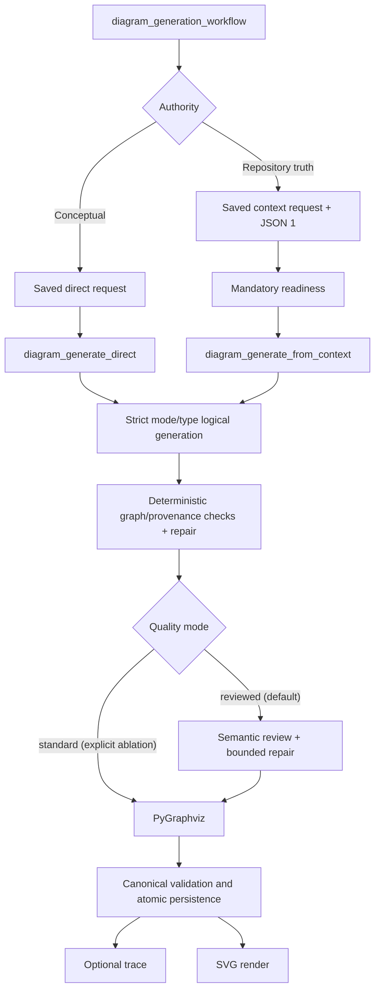
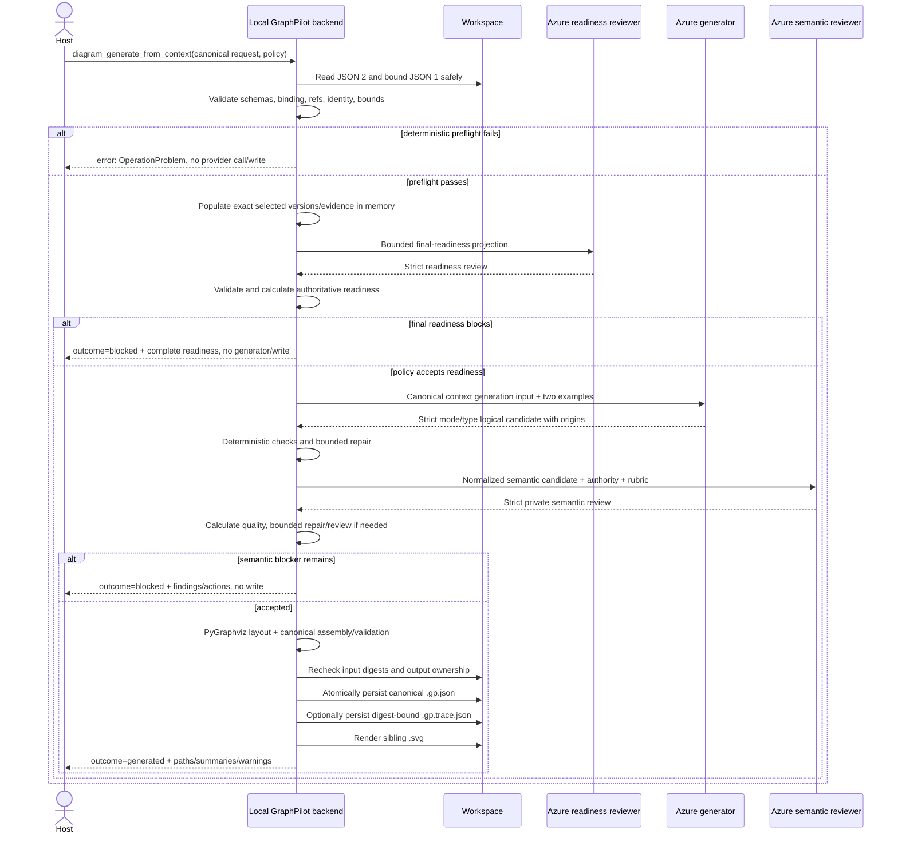

# Context Generation, Provenance, Results, and Trace

## Purpose and boundary

This document turns a reviewed reference-based [context request](04-diagram-request-context.md) into a grounded GraphPilot diagram without asking the host or provider to join local files, copying [JSON 1](03-evidence-manifest.md) into JSON 2, or persisting a resolved-context snapshot.

```text
JSON 1                         reusable repository facts and evidence
JSON 2                         finalized intent and exact selections for one diagram
resolved context               transient populated backend read model
logical candidates             transient generation/repair/review state
canonical .gp.json             durable diagram, minimal ownership, element origins
optional .gp.trace.json        digest-bound generation observability
SVG                            derived sibling rendering
```

[Readiness](01-readiness/README.md) owns context sufficiency, facets, status, score, actions, warning policy, and override constraints. The canonical schema owns the final diagram field shape. This document owns context population, generation-time provenance, reviewed candidate acceptance, result semantics, minimal canonical ownership, optional trace/debug behavior, identity-aware publication, and render-after-save behavior.

## Generation architecture

The single public `diagram_generation_workflow` routes exactly one authority branch. Its bounded tools retain separate contracts:

| Mode | Persisted authority | Generation tool | Meaning |
| --- | --- | --- | --- |
| Direct | `graphpilot.direct.diagram-request.v1` | `diagram_generate_direct` | Conceptual, proposed, educational, or user-specified design |
| Context | JSON 1 + `graphpilot.context.diagram-request.v1` | `diagram_generate_from_context` | Current repository/managed-source truth with readiness and origins |

Both request schemas persist under `.graphpilot/requests/` through `diagram_request_save`. The branches share deterministic conformance, repair machinery, semantic review, PyGraphviz layout, canonical persistence, and rendering only where authority permits. Direct never fabricates claims/origins; context never falls back to direct when blocked.



## Managed artifact layout

```text
.graphpilot/
├── context/
│   └── evidence/
│       └── repository.gp-evidence.json
├── requests/
│   ├── order-processing.gp-request.json
│   └── proposed-platform.gp-request.json
├── diagrams/
│   ├── order-processing.gp.json
│   ├── order-processing.gp.trace.json   # optional
│   └── order-processing.svg
└── diagnostics/
    └── generation/                     # optional debug runs
```

Rules:

1. JSON 1 remains at `.graphpilot/context/evidence/repository.gp-evidence.json`.
2. Direct and context requests use `.graphpilot/requests/<diagramName>.gp-request.json` but retain separate schemas.
3. Canonical diagrams and rendered/trace siblings live under `.graphpilot/diagrams/`.
4. Request, diagram, SVG, PNG, and trace stems derive only from validated host-owned `diagramName`.
5. Root-level generated artifacts and the retired request subdirectory under `context/` are not managed layouts.
6. There is no dual write, legacy fallback, silent artifact migration, or silent deletion.
7. Resolved context, provider packets/responses, logical candidates, and readiness/semantic-review internals are transient unless the caller explicitly enables diagnostics.
8. `.graphpilot/` remains excluded from the JSON 1 source fingerprint.

## Context generation sequence



### Ordered phases

GraphPilot performs these phases in order:

1. resolve workspace and canonical JSON 2 path safely;
2. read and validate JSON 2 once;
3. read and validate JSON 1 once through `manifestRef.path`;
4. verify schema/kind, manifest ID/digest, request mode, and references;
5. validate immutable `requestId`/`diagramName` and output ownership;
6. build immutable request-scoped indexes and populate exact selected context;
7. enforce local packet/response byte ceilings and provider-owned context capacity without truncation;
8. run the complete final readiness service and enforce the exact digest-bound generation policy;
9. build `graphpilot.context.generation-input.v1` with exactly two ordered context-native examples;
10. call the strict context logical generator;
11. run deterministic graph/provenance checks and bounded repair;
12. in default reviewed mode, run semantic review and bounded semantic repair;
13. lay out the accepted logical candidate through PyGraphviz;
14. assemble and validate canonical JSON and origins;
15. recheck JSON 1/JSON 2 digests and output identity;
16. atomically create the canonical target, finalizing the V1 request;
17. write the optional digest-bound trace sidecar;
18. render the sibling SVG; and
19. return generated/blocked/error transport with stage-correct warnings.

Every deterministic failure discoverable before a provider call is checked before that call. No failure authorizes an unchanged blind reroll.

## Request-scoped in-memory lifecycle

GraphPilot treats loaded JSON 1/JSON 2 as immutable for one attempt. Local state contains:

- canonical manifest and request documents/digests;
- claim, evidence, uncertainty, and request indexes;
- selected accepted generation policy;
- output ownership state; and
- exact prompt/schema/profile/example/rubric/layout identities.

Population creates a separate transient `graphpilot.context.resolved-request.v1` / `resolvedDiagramRequest` with request/scope, exact selected claim versions, deduplicated direct evidence, uncertainty dispositions, assumptions, and decisions. It is never persisted or sent wholesale to Azure and is discarded after the attempt. A manifest-digest cache may optimize loading but cannot change these semantics.

## Deterministic preflight

Before any provider call, GraphPilot verifies:

- workspace/path containment and regular-file requirements;
- JSON 2 `graphpilot.context.diagram-request.v1` / `contextDiagramRequest`;
- JSON 1 `graphpilot.context.evidence-manifest.v1` / `evidenceManifest`;
- exact `manifestRef.path`, stable ID, and digest;
- exact selected claim versions and assumption/uncertainty invariants;
- request mode, ID, name, expected digest, generation policy shape, and finalized state;
- output request path/digest ownership plus foreign/corrupt/sibling-only collisions;
- strict packet byte ceiling and provider configuration; and
- complete final readiness projection feasibility.

A mismatch writes nothing. The host reloads, reconciles, saves, and reassesses. GraphPilot never silently rebinds intent, changes names, migrates an artifact, or relaxes quality.

### Diagram identity

Targets are:

```text
.graphpilot/diagrams/<diagramName>.gp.json
.graphpilot/diagrams/<diagramName>.gp.trace.json   # optional
.graphpilot/diagrams/<diagramName>.svg
```

The generation LLM never returns identity. A new request may create an absent target. An existing canonical target may be replaced only where a separately authorized workflow permits it and stored request ownership matches; V1 successful generation finalizes the request, so post-generation regeneration/editing is deferred. Orphan or foreign-owned siblings are conflicts, not overwrite permission.

## Exact deterministic population

For every `selectedClaims[]` entry, GraphPilot:

1. finds the claim by stable ID;
2. selects the exact immutable requested version, never latest by convenience;
3. deep-copies its complete statement, viewpoint, payload, and support;
4. preserves claim lifecycle data needed for interpretation;
5. resolves every direct `support.evidenceRefs[]` to its exact evidence record;
6. deduplicates evidence by ID; and
7. preserves references unchanged.

It never copies unselected/historical claims, recursively follows claim references, retrieves source during generation, rewrites or re-summarizes evidence, or copies the complete manifest. A payload dependency needed for meaning must be explicitly selected; readiness recommends missing closure.

## Mandatory final readiness

Context generation invokes the same complete service as standalone readiness. In the normal host workflow this is the first assessment and mandatory final gate in one generation call; standalone readiness is optional preview, not a required duplicate or reusable bypass:

```text
Layer 1      deterministic preflight
Layers 2–3   one strict structured Azure readiness call
Layer 4      deterministic response validation, findings/actions, score, status
```

The final contract is `graphpilot.context.readiness-result.v1` / `contextReadinessResult`:

- `ready` proceeds under `require_ready` or another compatible policy;
- `ready_with_warnings` proceeds only when `allow_warnings` acknowledges exact finding IDs for the exact input digests;
- `needs_context` proceeds only under permitted user-authorized `force_with_gaps` when every blocker is overrideable;
- `invalid`, unaccepted warnings, or any non-overrideable blocker returns `outcome: blocked` without a generator call/write; and
- provider/contract failure is an `OperationProblem`, not a readiness status.

There is no persisted readiness token. A request/manifest digest change invalidates policy acceptance. Readiness status remains authoritative; its 0–100 score never overrides a blocker. Existing evidence/readiness facets, actions, calibration, and stability remain owned by [`01-readiness/`](01-readiness/README.md).

## Context generation input

The generator receives one canonical JSON user message under `graphpilot.context.generation-input.v1` / `contextGenerationInput`, one concise context system prompt, and one strict out-of-band mode/type response schema. It contains:

1. contract, request, output, and diagram-type identity;
2. request framing and scope;
3. finalized uncertainty dispositions;
4. exact selected claim meaning, role/reason, support basis/derivation—but no evidence records or summaries;
5. accepted assumptions and decisions with authority fields;
6. exact diagram vocabulary, semantic guidance, and structural rules;
7. claim/assumption/schema-rule allowlists;
8. exactly two context-native examples in manifest order; and
9. prompt, logical schema, semantic profile, and example-set versions/digests.

It excludes complete JSON 1, resolved evidence, raw source, source locators, unselected claims, the active-claim index, discovery output, credentials, absolute paths, and readiness raw responses/reasoning.

All chat roles use `AZURE_OPENAI_DEPLOYMENT`. Strict Azure `json_schema` is mandatory. Unsupported structured output returns `structured_output_unsupported`; there is no `json_object` fallback or hidden second call.

## Strict logical output and origins

Context uses one strict schema per type:

```text
graphpilot.context.logical-diagram.activity.v1
graphpilot.context.logical-diagram.use-case.v1
graphpilot.context.logical-diagram.bdd.v1
```

Each returns only `schemaVersion`, `kind: contextLogicalDiagram`, `nodes`, and `edges`. It omits diagram name/type, coordinates, dimensions, styles, metadata, and rendered markers. Every node and edge requires:

```text
origin.claimRefs:       0..16 unique exact {id, version}
origin.assumptionRefs:  0..8 unique assumption IDs
origin.schemaRules:     0..8 unique rule IDs
origin.rationale:       nonblank 1..2,000 characters
```

At least one grounding array is nonempty. Rules:

1. `claimRefs` are the smallest sufficient exact selected claim versions.
2. `assumptionRefs` are the smallest sufficient accepted JSON 2 assumptions.
3. `schemaRules` authorize only non-factual notation scaffolding.
4. Presentation decisions guide representation but never authorize facts.
5. Evidence refs are not copied to elements; they remain reachable through claim support.
6. Rationale is concise user-facing mapping explanation, never hidden reasoning.
7. Direct logical schemas reject `origin` entirely.

The only V1 schema rule is `activity.initial-node`. It permits a neutral `initialNode` with empty, `Initial`, or `Start` label and no domain-bearing fields. Domain-bearing nodes, every edge, and all other semantic types require claim/assumption grounding.

### Provenance validation

After every generation/repair and before persistence, deterministic checks enforce:

- origin presence on every context node/edge;
- exact selected/accepted/allowlisted refs;
- unique refs and positive claim versions;
- at least one permitted grounding source;
- schema-rule applicability and absence of schema-only domain meaning;
- bounded nonblank rationale; and
- no evidence, decision, discovery, or invented identifier masquerading as authority.

The normalized evidence chain remains:

```text
canonical element.origin.claimRefs
  -> JSON 1 exact claim version
  -> claimVersion.support.evidenceRefs
  -> JSON 1 exact evidence record
  -> workspace-relative source locator
```

Deterministic checks prove reference mechanics. Runtime semantic review judges whether origins genuinely and minimally support meaning.

## Deterministic generation repair

Strict schemas prevent wrong shape/vocabulary. Deterministic graph/provenance checks own unique IDs, endpoints, containment, relationship direction, topology, multiplicity, reachability, and origin allowlists. They never silently reverse, coerce, or drop semantic content.

A context repair packet uses `graphpilot.context.generation-repair-input.v1` / `contextGenerationRepairInput` and contains original input digest, unchanged authority, previous logical candidate, ordered bounded validation/structural/provenance issues, repair round, and exact versions. It contains no examples. Default repair budget is one round; allowed range is `0..2`. Unresolved graph defects return `generation_validation_failed`; unresolved origin defects return `generation_provenance_failed`; neither writes canonical output.

## Semantic candidate review

Readiness asks whether context is sufficient before generation. Deterministic checks ask whether a candidate is structurally and referentially valid. Semantic review asks whether the valid candidate faithfully and completely represents its authority.

Configuration is:

```text
GRAPHPILOT_GENERATION_QUALITY_MODE=reviewed   # default
GRAPHPILOT_GENERATION_QUALITY_MODE=standard   # explicit environment-only ablation
GRAPHPILOT_GENERATION_SEMANTIC_REPAIR_MAX_ROUNDS=1
allowed semantic repair range: 0..2
```

`reviewed` sends the normalized pre-layout semantic projection—not coordinates/styles/runtime metadata—through `graphpilot.context.semantic-review-input.v1` / `contextSemanticReviewInput` to a separate strict context semantic-review call using `AZURE_OPENAI_DEPLOYMENT`. The adapter supplies selected exact claim meaning, accepted assumptions, decisions, candidate origins, allowlists, and the composed Common + Context + Diagram-Type rubric. It sends no raw source or evidence records.

The private `graphpilot.context.semantic-review-response.v1` / `contextSemanticReviewResponse` contains facet applicability/rating/rationale/refs and proposed typed findings/actions. It never chooses severity, score, acceptance, or status. The backend validates it and emits `graphpilot.context.semantic-review-result.v1` / `contextSemanticReviewResult` with deterministic facet outcomes, severity, 0–100 reporting score, `clean|warnings|blocked`, final finding IDs, and validated repair/host actions. One `graphpilot.context.semantic-review-repair-input.v1` / `contextSemanticReviewRepairInput` response-contract repair may correct invalid shape/refs without changing an unfavorable judgment; a second invalid response returns `semantic_review_invalid`.

Only `repair_candidate` findings enter `graphpilot.context.semantic-repair-input.v1`. The packet contains unchanged authority, previous normalized candidate, validated repair findings, round, and versions; it contains no examples or host-owned actions. Warnings may remain after budget and are returned. A blocker may not persist: the tool returns `outcome: blocked`, no canonical write, and exact host next actions. Reviewed-provider failure is an operation error; there is no silent fallback to standard.

## Generation result contracts

Mode-specific successful-domain results are:

```text
graphpilot.direct.generation-result.v1  / directGenerationResult
graphpilot.context.generation-result.v1 / contextGenerationResult
```

Both discriminate `outcome: generated|blocked`.

### `outcome: generated`

A generated result includes:

- canonical diagram path, nullable SVG path, and edit URL;
- exact request ID/path/digest;
- bounded goal/material-assumption/material-decision summary;
- compact generation summary and `quality` object;
- for context, compact final readiness and exact accepted-warning/override receipt;
- nullable trace path and nullable diagnostics descriptor; and
- ordered `operationWarnings`.

Quality contains `mode: standard|reviewed`, `reviewStatus: not_run|clean|warnings`, semantic repair rounds used, score/rubric identity where reviewed, and bounded findings. Semantic findings stay under `quality.findings`; render/trace/diagnostics warnings stay under `operationWarnings`.

Canonical persistence defines generated success. SVG failure keeps `outcome: generated`, sets `svgPath: null`, and adds `render_failed`. Trace/debug write failure likewise adds `trace_write_failed` or `diagnostics_write_failed` without undoing the diagram.

### `outcome: blocked`

A blocked result contains no diagram, SVG, edit, or trace path. It includes exact request reference, complete bounded blocking quality findings, typed `nextActions`, and nullable diagnostics. When final readiness blocks, context result includes the complete actionable `graphpilot.context.readiness-result.v1`; when semantic review blocks, it includes compact accepted readiness plus complete semantic findings/actions. Every block returns to the unified host workflow and has MCP `isError: false`.

### Operation errors

Failed execution returns shared `OperationProblem` under top-level `error` with MCP `isError: true`. Diagnostics, if enabled and successfully written, appears as a nullable sibling. Operation errors never masquerade as `blocked`. Retryability never authorizes an unchanged automatic reroll.

## Minimal canonical ownership and element provenance

Canonical `.gp.json` remains `graphpilot.diagram.v1`. It retains ordinary diagram metadata plus only the minimal generation ownership needed to interpret the artifact:

```json
{
  "metadata": {
    "source": "mcp",
    "authoring": "generated",
    "generationMode": "context",
    "generationContext": {
      "request": {
        "id": "request-order-processing",
        "path": ".graphpilot/requests/order-processing.gp-request.json",
        "digest": "sha256:exact-request-digest"
      },
      "manifest": {
        "id": "evidence-order-service",
        "path": ".graphpilot/context/evidence/repository.gp-evidence.json",
        "digest": "sha256:exact-manifest-digest"
      }
    }
  }
}
```

Context elements carry their typed `origin`. Canonical metadata does not copy selected claims, evidence, assumptions, decisions, readiness coverage/findings, semantic-review facets/score, model/deployment, prompt/schema/example/rubric/layout versions, repairs, usage, diagnostics, or raw packets. Those details belong to the request/manifest, result, optional trace, or opt-in diagnostics. Direct canonical metadata uses `generationMode: "direct"` and a direct request ref, with no manifest or origins.

The canonical origin field is optional generally for manual/imported/direct/pre-provenance diagrams but mandatory on every context-generated node/edge. Conformance preserves origins while remapping IDs/endpoints. Rendering ignores origin visually; editors preserve it round-trip. Grounded/manual edit provenance evolution remains a separate edit-workflow concern.

## Optional compact generation trace

When `persistGenerationTrace: true` and canonical persistence succeeds, GraphPilot atomically writes:

```text
.graphpilot/diagrams/<diagramName>.gp.trace.json
graphpilot.generation.trace.v1 / generationTrace
```

The trace is bound to exact canonical diagram path/digest and records:

- generation mode and request/manifest refs;
- chat deployment/model identity;
- prompt, input/logical schema, semantic-profile, and ordered example-set identities/digests;
- generation and semantic repair counts;
- semantic-review/rubric/status/score summary;
- PyGraphviz layout identity/version;
- provider call/usage summary; and
- creation timestamp.

It excludes prompts, complete input packets, full rubrics, candidates, source/evidence bodies, findings/rationales, hidden reasoning, credentials, and secrets. A later diagram edit causes digest mismatch and makes the sidecar historical; it is never updated to pretend it describes the edit. It is not runtime input or canonical authority. `trace_write_failed` never undoes canonical persistence. Blocked/error attempts have no compact trace.

## Optional numbered diagnostics

`persistGenerationDebug: true` creates one safe run under:

```text
.graphpilot/diagnostics/generation/<request-id>/<run-id>/
```

Stable stages are numbered `00` through `08`; absent optional stages do not renumber later stages. `graphpilot.generation.debug-run.v1` and `graphpilot.generation.debug-result.v1` wrap exact stage payloads. Diagnostics can contain bounded packets/candidates/reviews needed for local debugging but never credentials or raw source. Write failure does not change generated/blocked/error semantics and diagnostics never become authority or future model input.

## Context stability and publication

At load, GraphPilot records canonical JSON 1/JSON 2 digests and target ownership. Immediately before persistence it recomputes all three:

- unchanged context and target ownership: publication may continue;
- JSON 1 or JSON 2 changed: `generation_context_changed`, write nothing; or
- target ownership changed: conflict, write nothing.

This is optimistic consistency, not a long-lived lock. The host reloads/reconciles/reassesses; GraphPilot never automatically repeats provider calls.

Publication is JSON-first:

```text
accepted normalized logical candidate
  -> PyGraphviz layout
  -> canonical assembly + validation + provenance validation
  -> atomic .graphpilot/diagrams/<name>.gp.json
  -> optional atomic <name>.gp.trace.json
  -> sibling <name>.svg render
```

A canonical validation or atomic-write failure writes no new canonical result. Once canonical JSON is committed, render or optional observability failure cannot remove it. Stale rendered siblings are removed only after all deterministic/context/target preconditions pass and immediately before replacement; cleanup failure aborts before the canonical write. The host may call `diagram_render` on saved JSON without repeating readiness/generation.

## Failure semantics

| Phase | Provider use | Result/persistence |
| --- | --- | --- |
| Unsafe path, malformed artifacts, binding/ref/identity/bounds/config preflight | none | `error`; no write |
| Final readiness validly blocks | readiness at most | `outcome: blocked`; complete readiness; no generator/write |
| Readiness provider/contract failure | readiness at most | `error`; no write |
| Generator/strict response/deterministic repair failure | generator/repair as applicable | `error`; no write |
| Provenance remains invalid | generator/repair | `error`; no write |
| Semantic result validly blocks | generator + semantic review/repair | `outcome: blocked`; no write |
| Semantic reviewer/contract failure | generator + reviewer as applicable | `error`; no write |
| Context/target changes before commit | providers may have run | `error`; no write |
| Canonical persistence succeeds; trace or SVG fails | providers ran | `outcome: generated`; canonical remains; ordered warning; nullable failed path |
| Complete success | providers ran | `outcome: generated`; canonical + optional trace + SVG |

## Validation invariants

1. Context generation receives a safe canonical request reference, not inline JSON 1/JSON 2 bodies.
2. Namespace-first IDs/kinds are exact; old IDs are unsupported without aliases or migration.
3. JSON 2 binds exact JSON 1 path/ID/digest and both remain immutable during an attempt.
4. Shared request persistence does not merge direct/context authority.
5. All deterministic preflight failures occur before provider calls where discoverable.
6. Population selects exact immutable claim versions and directly referenced evidence without recursive expansion.
7. Reviewer and generator receive distinct bounded projections; generator receives no evidence/source.
8. Exactly two fixed context-native examples are present only in initial generation.
9. Strict structured output is mandatory; no JSON-object fallback exists.
10. Graph/provenance defects use explicit bounded repair with no examples or silent semantic mutation.
11. Final readiness is mandatory and status-first; digest-bound policy cannot bypass non-overrideable findings.
12. Reviewed mode is default and fail-closed; standard is explicit diagnostic/ablation only.
13. Every context element has a valid smallest-sufficient origin and concise rationale.
14. Deterministic provenance checks and semantic origin relevance/minimality remain separate trust boundaries.
15. Semantic blockers never persist; warnings and operation warnings remain distinct.
16. Generated/blocked/operation-error outcomes are not conflated.
17. Canonical output stores minimal ownership and origins, not full trace/evaluation data.
18. Optional trace is diagram-digest bound; optional diagnostics are run-bound; neither is authority.
19. Context and target identity are rechecked before atomic canonical persistence.
20. Canonical JSON is authoritative and saved before derived rendering.
21. Successful generation finalizes the V1 request; post-generation edits/regeneration use a future owned workflow.
22. Direct and context modes cannot masquerade as one another.
23. Runtime readiness, semantic review, canonical validation, persistence validation, and offline evaluation remain separate boundaries.

## Deliberate non-goals

- persisted resolved-context or generation snapshots;
- copying source/evidence/claims into requests or canonical metadata;
- recursive claim population or automatic context trimming;
- generator chunking or independent multi-call topology merge;
- backend mutation of JSON 1/JSON 2 or silent manifest rebinding;
- a raw prompt-only direct generation contract;
- silent fallback between authority modes, quality modes, structured-output modes, or layout engines;
- blocker force-save;
- compact trace for blocked/error attempts;
- grounded/manual edit provenance evolution;
- browser context authoring/readiness/provenance UI; and
- legacy artifact migration or dual write.
