# Evaluation Design

**There is one evaluation path and one operator command. A second one must not be built.**

> **Source:** `backend/services/workflow_audit/` · **Command:** `manage.py run_evaluation`

## Purpose

GraphPilot provides a rerunnable, versioned evaluation of the complete repository-backed generation workflow, from a host
receiving the request through a visible editor result or an actionable blocked, failed, or interrupted outcome. It makes
reliability, latency, duplication, cache state, recovery, and missing evidence explicit before architecture, readiness,
optimization, validation, or promotion work changes behavior.

It measures **behavior**: stage boundaries, timings, provider calls, completion outcome, browser proof, and
compatibility. It does not score output quality.

One command covers both provider modes. Scripted runs answer *does the workflow behave, and what does local compute
cost*; an explicitly authorized `live` run against one approved fixture answers *what does Azure actually cost, by role*.
A single fixture is never a representative sample, so a live run measures latency and behavior — it never establishes
representative semantic quality, release readiness, or certification. See [Operator Interface](#operator-interface).

### Naming

The command is `run_evaluation`. The name is deliberately broader than *workflow audit* because scoring and design of
experiments are later modes of the same command, not a second subsystem.

Several surfaces still say *workflow audit* and are left alone on purpose:

| Surface | Value | Why unchanged |
| --- | --- | --- |
| Services package | `services/workflow_audit/` | renaming is mechanical but has no consumer until a scoring mode exists |
| Schema `$id`s | `graphpilot.evaluation.workflow-audit-*.v1` | already namespaced `evaluation`; renaming invalidates recorded baselines |
| Run identities | `run-workflow-audit-<name>` | identities of recorded runs and ledger entries; renaming orphans them |
| Evidence root | `.graphpilot/evaluation/workflow-audit/` | holds those runs and the ledger |
| Boundaries | `W01`–`W22` | 190 references; a measurement taxonomy, not a work item — **never renumbered** |

Renaming any of these buys tidiness and costs recorded evidence. The command is the surface an operator types, so it is
the one worth changing.

## Workflow Boundary

### What making one diagram actually involves

Read this table first; everything else in the document refers back to it. **Who** matters more than it looks — the three
`LLM` rows are the only places money is spent, and the four `host` rows are the only places this command cannot execute.

| # | Phase | Who | What happens | W |
| ---: | --- | --- | --- | --- |
| 1 | Route | host | choose the direct or context branch | W01 |
| 2 | Discover sources | host | find the repository files that matter | W02 |
| 3 | Author JSON 1 | host | write the **evidence manifest** — claims extracted from those files | W03 |
| 4 | Save JSON 1 | backend | validate, digest, persist the manifest | W04 |
| 5 | Author + save JSON 2 | host → backend | write and persist the **diagram request** — goal, scope, selected claims | W05 |
| 6 | Transport | MCP | stdio call into the server | W06 |
| 7 | Preflight | backend | load the request, bind its manifest, check the target name is free | W07 |
| 8 | **Readiness** | **LLM** | is this context sufficient to draw the diagram? proceed or block | W08–W09 |
| 9 | Example loading | backend | load the two few-shot fixtures for this mode and type | W10 |
| 10 | Packet construction | backend | assemble the prompt payload | W10 |
| 11 | **Generation** | **LLM** | produce the logical diagram | W11–W12 |
| 12 | **Semantic review** | **LLM** | critique the candidate, repair it if needed | W13–W15 |
| 13 | Layout | backend | pygraphviz positions | W16 |
| 14 | Assembly | backend | canonical `.gp.json`, provenance, validation, stability | W17 |
| 15 | Persist | backend | write the diagram | W18 |
| 16 | Render | backend | write the SVG | W19 |
| 17 | Return | backend | result payload and editor link | W20–W21 |
| 18 | Visible | browser | the editor actually renders it | W22 |

Evaluation begins at phase 1 and ends at phase 18 — visible editor completion, or a complete actionable
blocked/failed/interrupted result. A backend file write or a returned path alone is **not** completion.

The three labelled edges are where `--until` cuts the run:

```mermaid
graph LR
  P1["1-3 author JSON 1<br/>host"] --> P4["4 save JSON 1<br/>backend"]
  P4 --> P5["5 author and save JSON 2<br/>host, then backend"]
  P5 --> P7["6-7 transport and preflight<br/>backend"]
  P7 --> P8["8 readiness<br/>LLM, call 1"]
  P8 -->|"stop for until readiness"| P9["9-10 examples and packet<br/>backend"]
  P9 --> P11["11 generation<br/>LLM, call 2"]
  P11 --> P12["12 semantic review<br/>LLM, call 3"]
  P12 --> P13["13-17 layout, assemble,<br/>persist, render<br/>backend"]
  P13 -->|"stop for until diagram"| P18["18 visible in editor<br/>browser, stop for until browser"]
```



### Which part of evaluation covers which phase

| Phases | Evaluation stage | How it is exercised |
| --- | --- | --- |
| 1–5 | `author-evidence`, `author-request` | **not executed here.** Host work, imported through the external-evidence contract. A scripted run substitutes the fixture's frozen JSON 1 and JSON 2 |
| 6–9 | `readiness` | real stdio call to `context_readiness_assess` |
| 10–17 | `diagram` | real stdio call to `diagram_generate_from_context` |
| 18 | `browser` | built-preview proof against the persisted diagram |

## Stages

`W01`–`W22` is the fine-grained measurement taxonomy. **Stages** are the coarse, named points a run may start from or
stop at, and each maps onto a real tool boundary rather than an internal hook.

| Stage | Phases | `--from` | `--until` | Azure calls |
| --- | --- | :-: | :-: | ---: |
| `author-evidence` | 1–4 | ✓ | — | 0 |
| `author-request` | 5 | ✓ | — | 0 |
| `readiness` | 6–9 | ✓ | ✓ | **1** |
| `diagram` | 10–17 | — | ✓ *(default)* | 3 |
| `browser` | 18 | — | ✓ | 3 |

**`--until` stops only where a tool stops.** `diagram_generate_from_context` runs phases 10–17 as a single call, so
there is no stop point between generation and render. Adding one would mean an evaluation-only hook inside
`DiagramGenerationService`, which would pollute production for the harness's benefit and is refused.

A run selects a window over this table. Because the three provider phases sit inside two tool calls, the stop point is
also the cost control: `--until readiness` spends one Azure call, anything further spends three.

**Direct mode has no JSON 1 and no readiness phase.** A direct request carries its own scope and requirements, so
phases 3, 4, and 8 do not exist and its stages are `author-request` → `diagram` → `browser`.

### Fixture pools, and which may be the subject of a run

**A training fixture is prompt content.** `TrainingFixtureService` loads both training examples for a mode and diagram
type into every generation prompt, so a live run against one asks the model to reproduce something already in its own
context: clean output, no repair path, optimistic timings. Scoring one would be measuring the prompt.

The separation is structural rather than conventional. `fixture_path()` resolves only
`<mode>-examples/training/<id>`, so the eval pool is unreachable from prompt assembly. A held-out fixture may therefore
carry an `expected.logical.json` for the scripted reply and, later, as a scoring key without ever entering a prompt.

| Pool | Count | In prompts | Valid subject for |
| --- | ---: | :-: | --- |
| `blueprints/*/{context,direct}-examples/training` | 12 | **yes** | scripted `baseline` and `diagnostic` only |
| `blueprints/*/examples/eval`, designated subjects | 6 | no | `live`, and scoring when it exists |
| `blueprints/*/examples/eval`, remainder | 30 | no | not a run subject — layout, render, and gallery fixtures |
| `evaluation/live-anchor/*` | 1 | no | `live` |

Scripted runs stay on the training pool: nothing is scored, the reply is a replay, and moving them would break ledger
comparability for no gain in accuracy.

The eval pool serves two unrelated purposes and only the first is evaluation. All 36 are layout, render,
structural-constraint, and gallery fixtures proven against the React Flow round trip; six of them are additionally
designated **run subjects** and carry the inputs a run needs. Promoting a further example means adding those inputs,
never moving or deleting the diagram.

### What each pool can start from

A stage is only reachable if the fixture holds the input that stage consumes.

| Pool | Holds | Can `--from` |
| --- | --- | --- |
| training, context | JSON 1, JSON 2, expected logical, canonical output | `author-request`, `readiness` |
| training, direct | JSON 2, expected logical, canonical output | `author-request` |
| eval | prompt, canonical output | *(none yet — no JSON 1 or JSON 2)* |
| live anchor | JSON 1, JSON 2 | `author-request`, `readiness` |

The held-out pool is therefore one usable fixture, which is a smoke test rather than a pool. **Six eval examples — one
context and one direct per diagram type — become run subjects.**

Existing eval examples are direct-shaped: a `prompt.md` and a canonical output with no `origin`, no `claimRefs`, and no
provenance. That makes the two halves cost very different amounts.

| Subject | Gains | Effort |
| --- | --- | --- |
| 3 direct | `request.gp-request.json`, `expected.logical.json` | largely derivable — request from the prompt, logical from the output minus layout |
| 3 context | `evidence.gp-evidence.json`, `request.gp-request.json`, `expected.logical.json` | authored: every node and edge needs an `origin` citing claims in a real manifest |

Both modes are covered deliberately. Direct has no JSON 1 and no readiness phase, so a context-only held-out set would
never exercise the direct path live. Subjects are chosen for domain distance from the training fixtures, so that a live
run is not a near neighbour of a prompt example. The remaining 30 are promoted only when a consumer appears, and are
expected to be authored by the host workflow rather than by hand.

No fixture can start at `author-evidence`, because none stores real source files — the harness fabricates placeholder
text sized to the manifest's line ranges. Evaluating evidence authoring therefore needs real source material, not just
a host.

## Contracts

Artifacts use namespace-first evaluation identities:

| Artifact | Schema identity | Kind |
| --- | --- | --- |
| Scenario set | `graphpilot.evaluation.workflow-audit-scenario-set.v1` | `workflowAuditScenarioSet` |
| Run manifest | `graphpilot.evaluation.workflow-audit-run-manifest.v1` | `workflowAuditRunManifest` |
| Observation | `graphpilot.evaluation.workflow-audit-observation.v1` | `workflowAuditObservation` |
| External evidence | `graphpilot.evaluation.workflow-audit-external-evidence.v1` | `workflowAuditExternalEvidence` |
| Browser evidence | `graphpilot.evaluation.workflow-audit-browser-evidence.v1` | `workflowAuditBrowserEvidence` |
| Report | `graphpilot.evaluation.workflow-audit-report.v1` | `workflowAuditReport` |
| Baseline ledger | `graphpilot.evaluation.workflow-audit-baseline-ledger.v1` | `workflowAuditBaselineLedger` |

B03 **adds no contract and deletes six**. Live mode extends the existing manifest, observation, and report rather than
introducing a family beside them. Any contract added later takes the clean `graphpilot.evaluation.<name>.v1` form; the
existing ones keep their `workflow-audit-` segment, for the reasons in [Naming](#naming). All evaluation contracts move
into `assets/schemas/evaluation/` when the retired live-anchor set is deleted, so each file moves at most once.

Every contract is bounded, rejects unknown fields, carries exactly one valid schema example, and is registered through
`SchemaRegistry`. Identity, digest, path, count, duration, token, and text bounds are enforced before evidence enters a
run or report.

The manifest, observation, and report contracts carry the `live` mode fields — provider mode, recorded authorization,
role ceilings, spent-call count, and terminal state — rather than a parallel contract family. Because the compatibility key
binds schema digests, extending them makes runs on the new key **explicitly incomparable** to earlier ones; the first
run after such a change is a new reference point, not a regression result.

## Approved Scenarios

The default provider-free scenario set references approved context training fixtures rather than embedding duplicate
authority or expected logical diagrams. It contains:

- one basic and one complex anchor for Activity, Use Case, and BDD;
- cold and warm execution for each anchor;
- focused guard scenarios for readiness blocking, readiness response repair, generation repair, semantic-review response
  repair, semantic candidate repair/final review, and provider failure/interruption;
- finalized-output recovery and no-rerun expectations;
- exactly one browser representative shared by the common editor boundary.

A scenario records its type/class, fixture reference, thermal schedule, provider plan, expected outcome, browser
eligibility, recovery requirement, and terminal-provider-work policy. Runtime loading validates the referenced fixture
metadata, JSON 1, JSON 2, expected logical diagram, and all digest/type bindings.

The corpus has new identities and no runtime dependency on S15's `full_effort_*` cases, factories, manifests,
conditions, checkpoints, stopped identities, budgets, or schemas. Historical S13–S15 measurements remain prior evidence
only.

## Evidence Model

### Status and confidence

Every material value records evidence status, source, confidence, and a reason where the value is unavailable or
partial. Supported status values are:

```text
measured
derived
simulated
imported
not_measured
not_reached
not_applicable
```

`derived` values identify their measured inputs. `simulated` fixture-host evidence never becomes real host evidence.
Imported host/browser evidence is accepted only through its strict identity/digest/clock contract. A missing value is
null with a reason; it is never estimated silently. Zero is valid only when directly observed or when a domain was
deliberately not called.

### Accounting domains

Complete-wall accounting keeps these domains non-overlapping:

- **Host:** routing, discovery, reads, authoring/reconciliation, bytes, elapsed time, and exposed host tokens/credits.
- **Azure:** provider calls, role/state, bytes, elapsed time, tokens/cache, model/tier/controls, validation, and repairs.
- **MCP:** process startup, initialization/discovery, transport, dispatch, serialization, response bytes, timeout, and recovery.
- **Local:** validation, digests, persistence, packet/assets, candidate checks, layout, assembly, rendering, and fake-client
  harness work.
- **Browser:** API load, navigation-to-visible completion, rendered identity, and console/page/network health.
- **Residual:** complete-wall time not safely attributable to another domain.

Nested stage/role details explain a domain but are not summed again. Fake-provider duration is local harness cost, and
Azure is explicitly not called in provider-free runs. Copilot credits remain host evidence and are never converted into
Azure usage.

## Capture and Isolation

Generation keeps its neutral observer contract. Evaluation composes a failure-isolated downstream observer for stage,
candidate, repair, quality, and result evidence with an evaluation-only client wrapper for provider role/state, bytes,
duration, token/cache, provider identity/tier, controls, and safe validation `{code,path}` detail.

Instrumentation is observational. Instrumented and uninstrumented execution must retain identical provider-call order,
result, canonical JSON, SVG, and persistence behavior. Capture/storage callback failure cannot change production
acceptance, retries, provider inputs, output candidates, or writes.

## Run and Observation Lifecycle

A run freezes one exact manifest before execution. The manifest binds the run identity, commit, scenario set/schedule,
version, relevant assets and dependencies, platform/browser mode, workspaces/output root, and provider policy.

Each declared observation has one scenario/thermal/artifact/process identity. Checkpoints record definitely started
provider work without raw payloads. Completed, failed, or uncertain provider work makes that identity terminal; resume
skips it rather than reissuing a call. A new attempt requires a new run/observation identity and, for provider-backed
evidence, budget that has not been spent.

Anchors execute through real MCP stdio and production JSON 1/JSON 2/readiness/generation/layout/persistence/render
services. Recovery checks exact finalized ownership and reuses the canonical output/editor link without regeneration or
another provider call.

## Browser Completion

The browser proof uses a built frontend preview and isolated Django/API ports. It binds the run/observation/diagram
identity, then records cold/warm navigation-to-visible duration, API timing/status, expected node/edge identity/counts,
browser/runtime identity, and console/page/failed-network evidence.

Diagnostic reports may mark W22 `not_measured` with a reason. A baseline is ineligible unless the exact required browser
proof passes and is merged into the matching immutable observation.

## Storage and Security

Non-canonical artifacts live under:

```text
.graphpilot/
  evaluation/workflow-audit/
    runs/<run-id>/
      manifest.json                       frozen inputs, always an output
      observations/
      browser-evidence/<observation-id>.json
      terminal.json                       live mode: outcome, calls spent, no-rerun
      report.json
      report.md
    baseline-ledger.json
```

Run and observation identities are short by construction. The longest tracked path is already 214 characters, so a long
identity pushes evidence writes past the 260-character Windows limit and terminalizes a run before dispatch.

Writes are workspace-contained, bounded, exclusive or atomic with expected-digest concurrency, and secret-scanned.
Persisted evidence contains safe metrics, identities, versions, digests, counts, states, and validation `{code,path}`
entries. It never contains raw provider responses, prompts, hidden reasoning, source dumps, credentials, private paths
outside declared refs, or hidden gold.

## Reports and Ranked Findings

`report.json` is machine authority; `report.md` presents the same identities, completeness, coverage, accounting,
quality, recovery, browser evidence, and ranked findings.

A live run additionally reports **Azure by role** — elapsed time and tokens for `readiness`, `generation`, and
`semantic_review` separately, beside the local total. Aggregate provider time cannot answer whether a round trip is
worth removing; the per-role split can, and it is the reason live mode exists.

Ranking order is:

1. failure, interruption, retry/no-rerun, and quality/security risk;
2. measured contribution to a valid complete-wall denominator;
3. material unknown coverage that prevents attribution.

Every finding records evidence refs, owner/confidence, the smallest proven behavioral fix or otherwise the smallest
diagnostic proof, strongest alternative, trade-off, bounded expected-benefit ceiling, offline proof, required live
proof, and disposition. No model output changes code, prompts, schemas, labels, settings, schedules, architecture, or
promotion state.

## Baseline Ledger and Comparison

The ledger has append-only semantics with bounded entries and atomic expected-digest updates. Each entry stores
baseline/run identity, report path/digest, summary, and compatibility key rather than full observations.

The compatibility key binds version and digest of the schedule, scenarios, report and schema contracts, together with
relevant prompts/rubrics/examples/layout, dependencies/platform, and browser mode. Before/after percentages are
calculated only for exact compatible keys; different keys are explicitly incomparable. Historical S13–S15 versions are
not imported as ledger baselines.

## External Host Evidence

`graphpilot.evaluation.workflow-audit-external-evidence.v1` and its adapter carry W01–W03 host-boundary measurements
into a run. The host boundary is currently fixture-`simulated`; per the provenance rule above, simulated evidence never
becomes real host evidence, so replacing it requires separately bound external observations rather than a GraphPilot
change.

**This is the seam for host-side evaluation, and it is owned by the host and authoring lane.** Phases 1–5 — routing,
source discovery, and authoring JSON 1 and JSON 2 — are performed by an agent in the IDE and cannot be executed by this
command. A host evaluation workflow measures them on its side and submits the result through this contract; the backend
side treats the outcome as imported evidence and never simulates it into something stronger. That workflow is also the
natural producer of held-out run subjects, since authoring JSON 1 and JSON 2 is exactly what it does.

Extensions describing that workflow belong in this section. Everything from phase 6 onward — transport, readiness,
generation, review, assembly, render, and the operator interface — is backend-owned and specified above.

## Operator Interface

`run_evaluation` is the **only** evaluation command. There is one execution path; a mode selects what runs, and two
axes select how much of it runs. Evaluation is not exposed through public MCP or REST surfaces.

```bash
manage.py run_evaluation <mode> [--fixture F] [--from S] [--until S] [--live] …
```

### Modes — what runs

| Mode | Subject | Provider | Ledger |
| --- | --- | --- | --- |
| `diagnostic` | any scenario subset | scripted | no |
| `baseline` | the fixed 19-observation schedule | scripted | **yes** |
| `live` | one named fixture | scripted, or Azure with `--live` | no |

`baseline` is the comparable regression number and therefore **rejects** `--fixture`, `--from`, `--until`, and
`--workspace`: it is always the complete schedule from `author-evidence` through `browser`. A partial baseline is not a
baseline, so passing those flags is an argument error rather than a silent override.

### `--fixture` — what a run is pointed at

A fixture is a named, immutable, digest-sealed input set. It is the only input concept; there is no separate anchor.

| Source | Location | Provenance |
| --- | --- | --- |
| Repository fixtures | `backend/assets/evaluation/live-anchor/<id>/`, `backend/assets/blueprints/**` | reviewed, version-controlled |
| Host-generated *(later)* | `.graphpilot/evaluation/inputs/<id>/` | authored by the host, sealed by digest on arrival |

Both resolve through the same `--fixture <id>`. What makes a fixture trustworthy is immutability and its digest, not
version control, so host-generated inputs are equally comparable once sealed.

**A live run may only target a fixture.** Scripted runs may additionally target a workspace via `--workspace`, which is
seeded as a copy and never written back to. The reason is measurement validity rather than safety: if the input can
change between runs, a timing difference cannot be attributed to the code, which defeats the purpose of the tool.

### `--from` and `--until` — the window over the stages

Both take a [stage](#stages) name. `--from` defaults to the earliest stage the fixture supports; `--until` defaults to
`diagram`. `--browser` / `--no-browser` controls the built-preview proof independently — `baseline` forces it on, `live`
defaults it on, `diagnostic` defaults it off.

Skipped stages are recorded `not_measured` with a reason, never silently zeroed, so a partial run's accounting is
visibly incomparable to a full one. Digests are re-verified at every join point; `--allow-stale` downgrades that to a
warning for the deliberate case of hand-editing an input to probe one behavior.

Because the three provider phases sit inside two tool calls, `--until` is also the cost dial:

| `--until` | Tool called | Azure calls under `--live` |
| --- | --- | ---: |
| `readiness` | `context_readiness_assess` | **1** |
| `diagram` *(default)* | `diagram_generate_from_context` | 3 |
| `browser` | the same, plus the browser proof | 3 |

`--until readiness --live` is therefore a **one-call** proof of the entire chain that can break — gate, credential
passing, stdio child, provider client, role guard, capture, checkpoint, terminal record. It is the intended first live
run against any fixture: a broken path costs one call rather than three.

### Provider safety

Provider credentials come from `backend/.env`. They are **not** passed into the evaluation child process unless
`--live` is present, so a scripted run cannot reach Azure rather than merely being asked not to. Every gate below
precedes client construction:

1. `--live` present, with a human [authorization](#authorization) recorded in the manifest
2. tracked-clean HEAD
3. fixture source, evidence, and request digests resolved and verified
4. cumulative budget plus this run's ceiling below the standing limit
5. unused short run and observation identities
6. frozen manifest written, pre-dispatch report emitted

During dispatch a role guard authorizes every call *before* it leaves: fixed order, per-role ceilings 1/1/1/1/2/2/1,
hard maximum nine. A checkpoint precedes the first call. Every outcome writes a terminal record, and a terminal identity
is never rerun.

Without `--live` the identical code path executes with scripted responses, so a passing scripted run leaves only the
provider itself untested.

### Authorization

Authorization is a **human decision, stated to the operator agent** — either for one run or as a standing grant
covering a body of work. There is no approval file and no approval contract. An authorization artifact would only be
written by the same agent that acts on it, which makes it a self-check rather than a human one; the ceremony would
imply a guarantee it cannot provide.

What is kept is the **record**. A live manifest carries an `authorization` block naming the kind (`per_run` or
`standing`), who granted it, when, and an optional note. Sealed evidence therefore always states under what authority
a paid run was allowed, and whether a human approved that specific run or a programme of work. The retired
`authorization/` tree is closed and is never written to.

The enforcement that remains is structural rather than clerical:

| Mechanism | Guarantees |
| --- | --- |
| `--live` absent | credentials are never passed to the child, so Azure is unreachable |
| `azureCallsAllowed` | cannot appear without live mode, a live provider, and a recorded authorization |
| Role guard | fixed order, ceilings 1/1/1/1/2/2/1, hard maximum nine, checked before each call |
| Checkpoint and terminal record | every outcome is recorded; a terminal identity is never rerun |

A failure *before* dispatch spends nothing, so it bars only its own run identity, not the work. Fix the defect and run
again under a new identity. This matters because a real attempt was lost to a seven-character path overrun that never
reached Azure, and was then treated as non-retryable; a plumbing defect is not an authorization event.

### Inputs are named, not authored

A live run names a fixture; it does not supply a manifest. The command derives and freezes the manifest from the fixture
directory, the recorded authorization, the current commit, and current asset digests. Run manifests are outputs of
every mode.

### Retired commands

`run_live_workflow_anchor`, its `live_anchor_*` services, artifact store, browser service, and stdio adapter are
retired; their capability is `live` mode above. Their six `graphpilot.evaluation.live-workflow-anchor-*` contracts are
**deleted** rather than carried: git preserves them, and keeping six contracts nothing can produce in the live inventory
is the apparatus accumulation this design exists to prevent. Completed live runs from those contracts remain readable
JSON and their findings are recorded in history; machine-revalidating one requires recovering its schema from git.

Retirement requires a liveness proof first: nothing imports it, nothing validates against it, and the product suite
passes without it.

`run_host_benchmark`, its `host_benchmark_proxy`, and `run_full_effort_evaluation` were retired with their programs and
no longer exist.

## If quality scoring is needed

Nothing here compares actual output against expected. A run answers *did it complete, how long did each part take, how
many provider calls* — never *was the diagram right*. Representative validation will eventually need that judgement.

A previous scoring subsystem — judge, oracle, deterministic matcher, gates, adjudication, leakage, calibration — was
retired for having no consumer, and because it duplicated an entire runner and report layer so that only its scoring
half was distinct. Its design is preserved at
[`retired-evaluation-and-doe-design.md`](../07-history/retired-evaluation-and-doe-design.md). When scoring returns:

- add it **on top of** this runner and its observation format;
- do not add a second runner, artifact store, report service, or a parallel set of run-manifest / observation / report
  schemas;
- the scoring logic is the new part; the plumbing already exists.

This is the apparatus-lifecycle rule in `.devin/rules/graphpilot.md`: extend or replace the existing path, never add a
parallel one.

Two constraints already hold and should shape whatever is built:

**Score only held-out subjects.** Training fixtures are prompt content, so scoring one measures the prompt. The six
designated subjects and the live anchor are the valid corpus.

**Structural equality is the wrong test.** Generation is legitimately non-deterministic: a different node ordering, an
extra merge node, or renamed identifiers can all be correct. A judgement must compare meaning — same actors, same
flows, same claim coverage — rather than the same JSON. Because subjects carry `expected.logical.json`, comparison can
be per stage rather than only on the final diagram, which localizes a failure to readiness, generation, or review
instead of reporting one verdict at the end.

## Authority

This document owns final intended evaluation scenarios, evidence/accounting, lifecycle, storage, report, operator
interface, and baseline semantics. Backend architecture owns canonical service/dependency names; testing strategy owns
verification commands; the current-state board alone owns live progress.

Within this document, the backend lane owns phases 6–18 and everything the command executes. The host and authoring
lane owns phases 1–5 and [External Host Evidence](#external-host-evidence). Both halves share one command, one contract
family, one report, and one W01–W22 taxonomy — a second evaluation path is not created for either.
